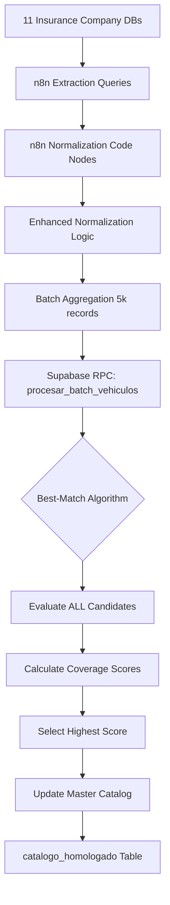
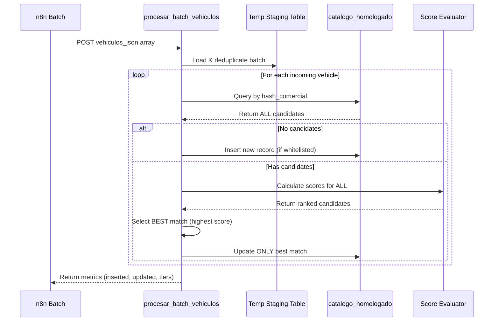

# Design Document - Sistema de Homologación: Correcciones

## Overview

This design addresses critical data quality and algorithmic issues in the vehicle homologation system. The system currently uses n8n workflows for ETL processing and Supabase PostgreSQL for intelligent matching via token-overlap algorithms. This design maintains architectural compatibility while implementing comprehensive corrections across 11 insurer data sources.

**Primary Design Goals:**
1. Fix the best-match selection algorithm to prevent incorrect trim-level matches (A-SPEC vs TECH)
2. Implement systematic data cleanup across ~232,300 records (95.7% of database)
3. Maintain backward compatibility with existing workflows and database schema
4. Preserve idempotency and deterministic processing

## Steering Document Alignment

### Technical Standards (CLAUDE.md)
- **Hash-based deduplication**: Design maintains existing `hash_comercial` (SHA-256 of marca|modelo|anio|transmision) and adds intelligent best-match selection
- **Token overlap strategy**: Leverages existing `version_tokens_array` and `calculate_weighted_coverage_with_trim_penalty` function
- **Idempotent processing**: All normalization changes remain deterministic and repeatable
- **Canonical data model**: Preserves `version_original` and `id_original` for audit trails

### Project Structure (CLAUDE.md)
- **N8N normalization scripts**: `/src/insurers/[name]/[name]-codigo-de-normalizacion.js`
- **Supabase functions**: `/src/supabase/funciones-homologacion-actuales.sql`
- **Shared patterns**: Centralized dictionaries, protected token handling, transmission inference

## Code Reuse Analysis

### Existing Components to Leverage

**1. N8N Normalization Framework (Qualitas/Zurich as templates)**
- **File**: `src/insurers/qualitas/qualitas-codigo-de-normalizacion-n8n.js`
- **Reusable Patterns**:
  - `PROTECTED_HYPHEN_TOKENS` array for trim preservation (A-SPEC, TYPE-S, S-LINE)
  - `cleanVersionString()` function structure
  - `normalizeTransmission()` and `inferTransmissionFromVersion()` functions
  - `deduplicateTokens()` intelligent deduplication logic
  - `normalizeModelo()` contamination cleanup pattern
  - Batch processing with error isolation (BATCH_SIZE = 5000)

**2. Supabase Token Matching Functions**
- **File**: `src/supabase/funciones-homologacion-actuales.sql`
- **Reusable Components**:
  - `clean_and_tokenize_version(p_version TEXT)` - Line 148-180
  - `normalize_token(token TEXT)` - Line 29-108
  - `calculate_weighted_coverage_with_trim_penalty()` - Line 324-414
  - `detect_conflicts()` - Line 224-293
  - `has_different_trims()` - Line 298-319

**3. Validation Patterns (Existing in all normalizers)**
- **Pattern**: `validateRecord()` function with structured error objects
- **Fields validated**: marca, modelo, anio, version_original, transmision
- **Error categorization**: `categorizeError()` for systematic logging

### Integration Points

**1. N8N to Supabase Flow**
- n8n normalization → batch aggregation → HTTP POST to `/rest/v1/rpc/procesar_batch_vehiculos`
- JSON schema: `{vehiculos_json: [{hash_comercial, version_limpia, marca, modelo, ...}]}`
- Response metrics: insertados, actualizados, skipped, tier1/2/3_matches

**2. Existing Database Schema**
- **Table**: `catalogo_homologado`
- **Key Fields**: hash_comercial, version, version_tokens_array, disponibilidad (JSONB)
- **Indexes**: GIN on version_tokens_array, B-tree on hash_comercial

## Architecture

### System Overview



### Enhanced Matching Algorithm Flow



## Components and Interfaces

### Component 1: Best-Match Selection Algorithm (CRITICAL FIX)

**Purpose:** Replace multi-update logic with single best-match selection to prevent incorrect homologations like A-SPEC being matched with TECH

**Location:** `src/supabase/funciones-homologacion-actuales.sql` - Modify `procesar_batch_vehiculos` function (Lines 437-455 signature, 553-583 update logic)

**Current Implementation (BUGGY):**
```sql
-- Lines 487-551: Collect ALL candidates (✅ This part works correctly)
FOR existing_record IN
    SELECT id, version, version_tokens_array, (disponibilidad ? v_origen) AS same_insurer
    FROM catalogo_homologado
    WHERE hash_comercial = v_hash
LOOP
    -- Calculate coverage for each candidate
    coverage_result := calculate_weighted_coverage_with_trim_penalty(...);

    -- Add qualifying candidates to matches array
    IF coverage_result.final_score >= TIER2_SAME_INSURER_THRESHOLD THEN
        matches := matches || jsonb_build_object(...);
        CONTINUE;  -- ✅ Continues loop, collects all matches
    END IF;
END LOOP;

-- Lines 553-583: Update ALL matches (⚠️ BUG IS HERE)
IF jsonb_array_length(matches) > 0 THEN
    -- Detects multi-match but doesn't act on it
    IF jsonb_array_length(matches) > 1 THEN
        multi_match_count := multi_match_count + 1;
    END IF;

    -- ⚠️ BUG: Updates ALL candidates instead of selecting best
    FOR match_record IN SELECT * FROM jsonb_to_recordset(matches) AS (...)
    LOOP
        UPDATE catalogo_homologado... WHERE id = match_record.id;
        update_count := update_count + 1;
    END LOOP;
END IF;
```

**Corrected Implementation:**
```sql
-- Lines 487-551: Keep existing collection logic (already correct)
FOR existing_record IN
    SELECT id, version, version_tokens_array, (disponibilidad ? v_origen) AS same_insurer
    FROM catalogo_homologado
    WHERE hash_comercial = v_hash
LOOP
    -- Keep all existing match collection logic unchanged
    ...
END LOOP;

-- Lines 553-583: REPLACE multi-update with best-match selection
IF jsonb_array_length(matches) > 0 THEN
    IF jsonb_array_length(matches) > 1 THEN
        multi_match_count := multi_match_count + 1;
    END IF;

    -- NEW: Select BEST match instead of updating all
    SELECT * INTO best_match
    FROM jsonb_to_recordset(matches) AS m(id BIGINT, score NUMERIC, tier INT, method TEXT)
    ORDER BY
        score DESC,                           -- Primary: Highest score
        (method LIKE '%same_batch%') DESC,    -- Tiebreaker 1: Same insurer preference
        tier ASC                               -- Tiebreaker 2: Better tier
    LIMIT 1;

    -- Update ONLY the best match
    UPDATE catalogo_homologado
    SET disponibilidad = jsonb_set(
            COALESCE(disponibilidad, '{}'::jsonb),
            ARRAY[v_origen],
            jsonb_build_object(
                'origen', COALESCE((disponibilidad->v_origen->>'origen')::boolean, FALSE),
                'disponible', TRUE,
                'aseguradora', v_origen,
                'id_original', v_record->>'id_original',
                'version_original', v_record->>'version_original',
                'confianza_score', best_match.score,
                'metodo_match', best_match.method,
                'tier', best_match.tier,
                'fecha_actualizacion', NOW()
            ), TRUE
        ),
        fecha_actualizacion = NOW()
    WHERE id = best_match.id;

    update_count := update_count + 1;
    CASE best_match.tier
        WHEN 1 THEN tier1_count := tier1_count + 1;
        WHEN 2 THEN tier2_count := tier2_count + 1;
        WHEN 3 THEN tier3_count := tier3_count + 1;
    END CASE;
END IF;
```

**Interfaces:**
- **Input**: `v_tokens TEXT[]`, `v_hash TEXT`, `v_origen TEXT`
- **Output**: `best_match RECORD` with fields (id, score, tier, method)
- **Side Effects**: Updates only the single best matching record

**Dependencies:**
- Existing `calculate_weighted_coverage_with_trim_penalty()` function
- Existing tier threshold constants

**Required Variable Declaration:**
Add to DECLARE section (after line 453):
```sql
best_match RECORD;
```

**Backward Compatibility Impact:**
- **Breaking Change**: Existing records with multiple insurer entries in `disponibilidad` will now only receive ONE new insurer match per processing run (the best one)
- **Data Migration**: No schema changes required; existing `disponibilidad` JSONB structures remain valid
- **Behavior Change**: `multi_match_count` will still increment, but only ONE record will be updated (not all)
- **Audit Trail**: All previous multi-match entries in `disponibilidad` will be preserved

### Component 2: Centralized Brand Consolidation Map (NEW)

**Purpose:** Single source of truth for brand name standardization across all 11 insurers

**Location:** Create new shared constant in each insurer's normalization file

**Implementation:**
```javascript
// Add to each insurer's normalization file
const BRAND_CONSOLIDATION_MAP = {
  // Suffix removal
  'BMW BW': 'BMW',
  'VOLKSWAGEN VW': 'VOLKSWAGEN',
  'CHEVROLET GM': 'CHEVROLET',
  'FORD FR': 'FORD',
  'AUDI II': 'AUDI',

  // Variant consolidation
  'KIA MOTORS': 'KIA',
  'TESLA MOTORS': 'TESLA',
  'MERCEDES BENZ II': 'MERCEDES BENZ',
  'NISSAN II': 'NISSAN',
  'GREAT WALL MOTORS': 'GREAT WALL',

  // Typo correction
  'BERCEDES': 'MERCEDES BENZ',
  'BUIK': 'BUICK',

  // Invalid brands (flag for deletion)
  'AUTOS': 'INVALID_BRAND',
  'MOTOCICLETAS': 'INVALID_BRAND',
  'MULTIMARCA': 'INVALID_BRAND',
  'LEGALIZADO': 'INVALID_BRAND'
};

function consolidateBrand(marca) {
  const normalized = marca.toUpperCase().trim();
  return BRAND_CONSOLIDATION_MAP[normalized] || normalized;
}
```

**Interfaces:**
- **Input**: `marca: string` (raw brand from database)
- **Output**: `string` (canonical brand name or 'INVALID_BRAND')
- **Reuses**: Existing `normalizeText()` pattern

### Component 3: Enhanced Transmission Recovery (EXTEND)

**Purpose:** Extract valid transmission from contaminated fields, with fallback to version inference

**Location:** Extend existing functions in each insurer normalization file

**Implementation:**
```javascript
function recoverTransmission(record) {
  const transmisionField = record.transmision?.toUpperCase().trim();

  // Step 1: Try to extract from contaminated transmision field
  const validPatterns = ['AUTO', 'AUTOMATIC', 'MANUAL', 'STD', 'CVT', 'DSG', 'TIPTRONIC'];
  for (const pattern of validPatterns) {
    if (transmisionField?.includes(pattern)) {
      return normalizeTransmission(pattern);
    }
  }

  // Step 2: Infer from version_original
  const inferred = inferTransmissionFromVersion(record.version_original);
  if (inferred) {
    return inferred;
  }

  // Step 3: Cannot recover - return null (record will be discarded)
  return null;
}

// Usage in processRecord():
const recoveredTransmission = recoverTransmission(record);
if (!recoveredTransmission) {
  throw new Error('TRANSMISSION_INFERENCE_FAILED: Cannot recover transmission');
}
record.transmision = recoveredTransmission;
```

**Interfaces:**
- **Input**: `record: {transmision, version_original}`
- **Output**: `'AUTO' | 'MANUAL' | null`
- **Reuses**: Existing `normalizeTransmission()` and `inferTransmissionFromVersion()`

### Component 4: Enhanced Model Normalization (EXTEND)

**Purpose:** Remove contamination patterns from modelo field for consistent hash generation

**Location:** Extend existing `normalizeModelo()` in each insurer file

**Current Implementation:** Already exists in Qualitas/Zurich (Lines 731-800 in qualitas-codigo-de-normalizacion-n8n.js)

**Enhancements Needed:**
```javascript
function normalizeModelo(marca, modelo) {
  if (!modelo || typeof modelo !== 'string') return '';

  let normalized = modelo.toUpperCase().trim();
  const marcaUpper = (marca || '').toUpperCase().trim();

  // 1. Remove NUEVO/NUEVA/NEW prefix (NEW FIX)
  normalized = normalized.replace(/^(NUEVO|NUEVA|NEW)\s+/gi, '');

  // 2. Mazda-specific: Remove MAZDA/MA prefix (NEW FIX)
  if (marcaUpper === 'MAZDA') {
    normalized = normalized.replace(/^(MAZDA|MA)\s+/gi, '');
  }

  // 3. Mercedes-specific: Remove MERCEDES prefix and fix KLASSE (NEW FIX)
  if (marcaUpper === 'MERCEDES BENZ') {
    normalized = normalized.replace(/^MERCEDES\s+(BENZ\s+)?/gi, '');
    normalized = normalized.replace(/\bKLASSE\b/gi, 'CLASE');
  }

  // 4. BMW-specific: Fix SERIE X5 (NEW FIX)
  if (marcaUpper === 'BMW' && normalized === 'SERIE X5') {
    return 'X5';
  }

  // 5-10. Existing cleanup (body types, prefixes, cab types, etc.)
  // ... keep existing logic from Lines 731-800

  return normalized;
}
```

**Interfaces:**
- **Input**: `marca: string`, `modelo: string`
- **Output**: `string` (cleaned modelo)
- **Reuses**: Existing normalization patterns from Qualitas/Zurich

### Component 5: Enhanced Version Cleaning (EXTEND)

**Purpose:** Remove escape characters, fix HP+AUT patterns, handle invalid door counts

**Location:** Extend `cleanVersionString()` in each insurer file

**Enhancements:**
```javascript
function cleanVersionString(versionString, model = '') {
  if (!versionString || typeof versionString !== 'string') return '';

  let cleaned = versionString.toUpperCase().trim();

  // NEW FIX 1: Remove escape characters
  cleaned = cleaned.replace(/\\"/g, '');  // Remove escaped quotes
  cleaned = cleaned.replace(/\\\\/g, ''); // Remove backslashes
  cleaned = cleaned.replace(/[""''\"'\u201C\u201D\u2018\u2019]/g, ' '); // All quote types

  // NEW FIX 2: Separate HP from AUT
  cleaned = cleaned.replace(/(\d+)HPAUT/gi, '$1HP AUT');
  cleaned = cleaned.replace(/(\d+)HP([A-Z])/gi, '$1HP $2');

  // Apply existing protected tokens logic
  cleaned = applyProtectedTokens(cleaned);

  // ... existing normalization (drivetrain, turbo, cylinders, etc.)

  // NEW FIX 3: Remove invalid door counts
  cleaned = fixInvalidDoorCounts(cleaned);

  // ... rest of existing cleanup

  return cleaned;
}

function fixInvalidDoorCounts(text) {
  // BMW model numbers incorrectly parsed as doors
  const bmwModelNumbers = ['300', '320', '328', '335'];
  bmwModelNumbers.forEach(num => {
    text = text.replace(new RegExp(`\\b${num}PUERTAS\\b`, 'g'), '');
  });

  // Salvageable truck notation
  text = text.replace(/\b3500PUERTAS\b/g, '4PUERTAS');

  // Invalid values
  text = text.replace(/\b[016-9]PUERTAS\b/g, '');
  text = text.replace(/\b\d{3,}PUERTAS\b/g, '');

  return text;
}
```

**Interfaces:**
- **Input**: `versionString: string`, `model: string`
- **Output**: `string` (cleaned version)
- **Reuses**: Existing `applyProtectedTokens()`, `normalizeDrivetrain()`, etc.

### Component 6: Intelligent Token Deduplication (REUSE & ENHANCE)

**Purpose:** Remove duplicate specs while preserving different spec types

**Location:** Reuse existing `deduplicateTokens()` from Qualitas (Lines 569-609)

**Current Implementation:** Already excellent in Qualitas normalization
- Handles numeric specs by type (5PUERTAS vs 5OCUP)
- Preserves pure numbers (2.0L and 2PUERTAS can coexist)
- First occurrence wins for duplicates

**Enhancement:** Add to other insurers that lack this function

**Interfaces:**
- **Input**: `tokens: string[]`
- **Output**: `string[]` (deduplicated)
- **Reuses**: Existing `isNumericSpecification()` helper

## Data Models

### Enhanced Candidate Match Structure (NEW)

```typescript
interface CandidateMatch {
  id: bigint;                    // Record ID in catalogo_homologado
  score: numeric;                // Coverage score (0.0 to 1.0)
  tier: integer;                 // 1=exact, 2=high-confidence, 3=medium
  method: string;                // Match method identifier
  is_same_insurer: boolean;      // Same-insurer bonus flag
  created_at: timestamp;         // For recency tiebreaker
}
```

### Normalized Vehicle Record (EXISTING - No changes)

```typescript
interface NormalizedVehicle {
  origen_aseguradora: string;
  id_original: string;
  marca: string;                 // After consolidation
  modelo: string;                // After cleanup
  anio: integer;
  transmision: 'AUTO' | 'MANUAL';
  version_original: string;      // Preserved
  version_limpia: string;        // After cleanup
  hash_comercial: string;        // SHA-256
  fecha_procesamiento: string;   // ISO timestamp
}
```

### Error Log Structure (EXTEND)

```typescript
interface ErrorRecord {
  error: true;
  mensaje: string;
  id_original: string;
  codigo_error: 'VALIDATION_ERROR' | 'TRANSMISSION_INFERENCE_FAILED' | 'HASH_GENERATION_ERROR' | 'NORMALIZATION_ERROR';
  registro_original: object;
  fecha_error: string;
  insurer: string;               // NEW: Track which insurer
}
```

## Error Handling

### Error Scenarios

**1. Transmission Inference Failure**
- **Trigger**: Cannot extract transmission from either `transmision` field or `version_original`
- **Handling**: Discard record, log with `TRANSMISSION_INFERENCE_FAILED`
- **User Impact**: Record not added to catalog, logged for manual review
- **Recovery**: Manual data correction in source system

**2. Invalid Brand Category**
- **Trigger**: Brand is AUTOS, MOTOCICLETAS, MULTIMARCA, or LEGALIZADO
- **Handling**: Flag with `INVALID_BRAND`, skip processing
- **User Impact**: Record not added to catalog
- **Recovery**: Data cleanup in source database

**3. No Best Match Found**
- **Trigger**: All candidates have scores below threshold
- **Handling**:
  - If insurer is whitelisted (ZURICH, HDI): Create new record
  - Otherwise: Skip and log
- **User Impact**: May create duplicate entries if normalization needs improvement
- **Recovery**: Adjust normalization rules or thresholds

**4. Multiple Best Matches (Tie)**
- **Trigger**: Two or more candidates have identical highest scores
- **Handling**: Apply tiebreaker rules:
  1. Same insurer preference
  2. Most recent record (`created_at` DESC)
- **User Impact**: Deterministic selection prevents randomness
- **Recovery**: N/A (working as designed)

**5. Batch Processing Timeout**
- **Trigger**: Batch exceeds 2-minute Supabase RPC timeout
- **Handling**: Reduce batch size from 5000 to 2500
- **User Impact**: Slower overall processing, but no data loss
- **Recovery**: Split batch and retry

## Testing Strategy

### Unit Testing

**N8N Normalization Functions:**
```javascript
// Test template for each insurer
describe('Brand Consolidation', () => {
  test('removes BMW BW suffix', () => {
    expect(consolidateBrand('BMW BW')).toBe('BMW');
  });

  test('consolidates KIA MOTORS', () => {
    expect(consolidateBrand('KIA MOTORS')).toBe('KIA');
  });

  test('flags invalid brands', () => {
    expect(consolidateBrand('AUTOS')).toBe('INVALID_BRAND');
  });
});

describe('Transmission Recovery', () => {
  test('extracts from contaminated field', () => {
    const record = {transmision: 'GLI DSG', version_original: 'SPORT'};
    expect(recoverTransmission(record)).toBe('AUTO');
  });

  test('infers from version_original', () => {
    const record = {transmision: 'LATITUDE', version_original: 'SPORT TIPTRONIC'};
    expect(recoverTransmission(record)).toBe('AUTO');
  });

  test('returns null when unrecoverable', () => {
    const record = {transmision: 'PEPPER', version_original: 'SPORT'};
    expect(recoverTransmission(record)).toBe(null);
  });
});

describe('Model Normalization', () => {
  test('removes MAZDA prefix from Mazda models', () => {
    expect(normalizeModelo('MAZDA', 'MAZDA 3')).toBe('3');
  });

  test('fixes BMW SERIE X5', () => {
    expect(normalizeModelo('BMW', 'SERIE X5')).toBe('X5');
  });

  test('replaces KLASSE with CLASE', () => {
    expect(normalizeModelo('MERCEDES BENZ', 'KLASSE C')).toBe('CLASE C');
  });
});
```

**Supabase RPC Functions:**
```sql
-- Test best-match selection
SELECT * FROM test_best_match_selection(
  'TEST',
  'e7f3a1...',  -- hash_comercial
  ARRAY['A-SPEC', '200HP', '2.0L', '4CIL', '4PUERTAS', '5OCUP']
);
-- Expected: Returns candidate with highest score, not first candidate

-- Test transmission inference
SELECT recover_transmission_value('GLI DSG', 'SPORT TIPTRONIC');
-- Expected: 'AUTO'

-- Test brand consolidation
SELECT consolidate_brand_name('BMW BW');
-- Expected: 'BMW'
```

### Integration Testing

**End-to-End Flow Tests:**

1. **A-SPEC vs TECH Mismatch Prevention:**
   - Input: Zurich A-SPEC 201HP 2.0L 4CIL 4PUERTAS 5OCUP
   - Existing Catalog:
     - Record 1: TECH 4P L4 2.4L AUTO 5OCUP (score: 0.45)
     - Record 2: A-SPEC 200HP 2.0L 4CIL 4PUERTAS 5OCUP (score: 0.95)
   - Current Bug: Updates BOTH records (Record 1 and Record 2)
   - Expected Fix: Updates ONLY Record 2 (highest score, A-SPEC)
   - Verification: Query `disponibilidad` for both records; only Record 2 should have Zurich entry
   - Actual Result: [To be validated]

2. **Transmission Recovery:**
   - Input: MAPFRE record with `transmision: "GLI DSG"`
   - Expected: Extracted as "AUTO"
   - Actual Result: [To be validated]

3. **Brand Consolidation:**
   - Input: Record with `marca: "KIA MOTORS"`
   - Expected: Normalized to "KIA"
   - Actual Result: [To be validated]

4. **Idempotency:**
   - Run: Process batch of 1000 records
   - Re-run: Process same batch again
   - Expected: Identical results, no duplicates
   - Actual Result: [To be validated]

### Performance Testing

**Benchmark Tests:**
- Batch of 5,000 records: Should complete in < 2 minutes
- Best-match evaluation with 10 candidates: Should add < 100ms per vehicle
- Token deduplication: Should add < 5ms per version string

---

**Document Version:** 1.0
**Last Updated:** 2025-10-17
**Status:** Draft - Awaiting Validation
