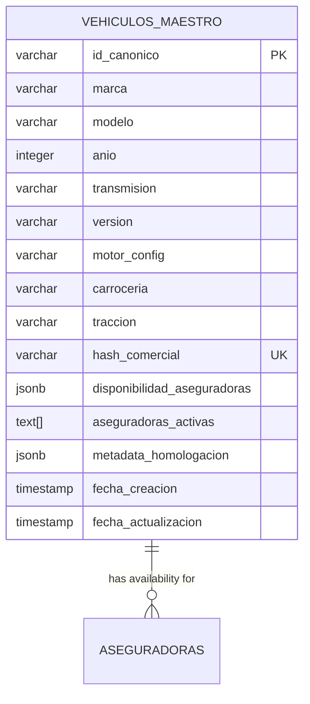
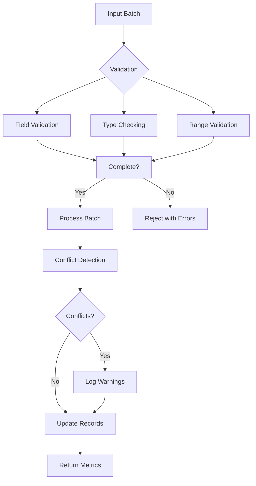
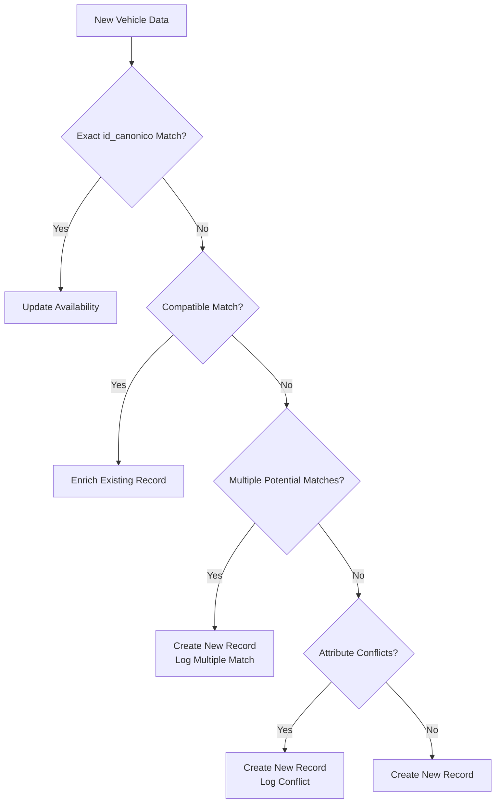

# Active/Inactive Status Management

<cite>
**Referenced Files in This Document**   
- [Tabla maestra.sql](file://src/supabase/Tabla maestra.sql)
- [Funcion RPC Nueva.sql](file://src/supabase/Funcion RPC Nueva.sql)
- [Validacion y metricas.sql](file://src/supabase/Validacion y metricas.sql)
- [WARP.md](file://WARP.md)
- [Replanteamiento homologacion.md](file://src/supabase/Replanteamiento homologacion.md)
</cite>

## Table of Contents
1. [Introduction](#introduction)
2. [Vehicle Availability Data Structure](#vehicle-availability-data-structure)
3. [Global Validity Determination](#global-validity-determination)
4. [Status Change Tracking and Auditability](#status-change-tracking-and-auditability)
5. [Data Validation and Quality Checks](#data-validation-and-quality-checks)
6. [Conflict Detection and Resolution](#conflict-detection-and-resolution)
7. [Downstream Application Usage](#downstream-application-usage)
8. [Persistence Policy](#persistence-policy)

## Introduction
This document details the system for managing vehicle availability status across multiple insurers within the homologation platform. The system tracks per-insurer active/inactive status with timestamps, determines global validity based on insurer-specific data, and maintains historical status information for auditability. The implementation uses a JSONB field to store insurer-specific availability data, enabling flexible querying and analysis of vehicle availability patterns across different insurance providers.

**Section sources**
- [WARP.md](file://WARP.md#L152-L203)

## Vehicle Availability Data Structure
The vehicle availability status is stored in the `disponibilidad_aseguradoras` JSONB column of the `vehiculos_maestro` table. This field contains insurer-specific availability data with timestamps and metadata. Each insurer entry includes:

- **activo**: Boolean flag indicating active/inactive status
- **id_original**: Original insurer-specific vehicle identifier
- **hash_original**: Original hash from insurer system
- **version_original**: Original version string from insurer
- **datos_originales**: Additional original data fields
- **fecha_actualizacion**: Timestamp of last status update

The JSONB structure allows for flexible schema evolution and efficient querying of insurer-specific availability data. A generated column `aseguradoras_activas` provides an array of insurers currently reporting the vehicle as active, enabling fast filtering and indexing.

**Diagram sources**
- [Tabla maestra.sql](file://src/supabase/Tabla maestra.sql#L0-L99)

**Section sources**
- [Tabla maestra.sql](file://src/supabase/Tabla maestra.sql#L0-L99)

## Global Validity Determination
A vehicle's global validity is determined by the presence of at least one insurer reporting it as active. The system uses the `aseguradoras_activas` generated column to efficiently determine global validity. This array contains the names of all insurers that currently report the vehicle as active (where `activo = true` in their availability record).

The global validity rule ensures that a vehicle remains available in the system as long as at least one insurer offers coverage for it. This approach prevents premature removal of vehicles that may still be insurable through other providers. The system does not require consensus among insurers; a single active status is sufficient for global validity.

When processing new data batches, the system updates the availability status for the specific insurer while preserving the status of other insurers. This incremental update approach ensures that temporary data issues with one insurer do not affect the global validity determination.

**Section sources**
- [WARP.md](file://WARP.md#L152-L203)
- [Funcion RPC Nueva.sql](file://src/supabase/Funcion RPC Nueva.sql#L291-L327)

## Status Change Tracking and Auditability
The system tracks status changes over time through timestamped records in the `disponibilidad_aseguradoras` JSONB field. Each insurer's availability record includes a `fecha_actualizacion` field that captures when the status was last updated. This timestamp enables temporal analysis of availability patterns and provides an audit trail for status changes.

The system maintains complete history of status changes without overwriting previous data. When a new status update is received, the system updates the `activo` flag and refreshes the `fecha_actualizacion` timestamp for the specific insurer, while preserving the historical record of previous states. This approach supports auditability by maintaining a complete record of when each insurer reported a vehicle as available or unavailable.

The `fecha_actualizacion` field uses UTC timezone to ensure consistent timestamp comparison across different data sources and processing times. This standardized time representation enables accurate sequencing of status changes across insurers.

**Section sources**
- [Tabla maestra.sql](file://src/supabase/Tabla maestra.sql#L36-L80)
- [Funcion RPC Nueva.sql](file://src/supabase/Funcion RPC Nueva.sql#L291-L327)

## Data Validation and Quality Checks
The system includes comprehensive data validation and quality checks to ensure consistency and reliability of availability data. The `Validacion y metricas.sql` script provides key metrics for assessing homologation quality and availability consistency.

The validation query calculates several important metrics:
- Total canonical vehicles
- Vehicles with 2+ active insurers (percentage of homologation at level 2)
- Vehicles with 3+ active insurers (percentage of homologation at level 3)
- Average number of insurers per vehicle
- Maximum number of insurers covering a single vehicle

These metrics help monitor the health of the homologation process and identify potential data quality issues. The system also performs real-time validation during batch processing, detecting conflicts and multiple matches that could indicate data inconsistencies.

The RPC function returns detailed processing metrics including counts of new, enriched, updated, and conflicting records, providing immediate feedback on data quality for each batch.

**Diagram sources**
- [Validacion y metricas.sql](file://src/supabase/Validacion y metricas.sql#L0-L18)
- [Funcion RPC Nueva.sql](file://src/supabase/Funcion RPC Nueva.sql#L410-L428)

**Section sources**
- [Validacion y metricas.sql](file://src/supabase/Validacion y metricas.sql#L0-L18)
- [Funcion RPC Nueva.sql](file://src/supabase/Funcion RPC Nueva.sql#L410-L428)

## Conflict Detection and Resolution
During homologation, the system detects and resolves conflicts between insurer data and existing records. Conflicts are identified when a vehicle from an insurer matches an existing vehicle by marca, modelo, and año, but has conflicting values for key attributes such as transmisión, versión, carrocería, motor_config, or tracción.

The conflict detection process occurs during batch processing in the `procesar_batch_homologacion` function. When a vehicle fails to match an existing record due to conflicting attributes, the system logs the specific differences in the warning messages. The conflict detection considers both non-null values that differ and cases where one source has a value and the other has null.

For resolution, the system creates new canonical records when conflicts cannot be automatically resolved. This approach preserves data from all insurers while maintaining data integrity. The system prioritizes exact matches and only creates new records when necessary to avoid data loss.

The conflict detection logic is designed to be conservative, erring on the side of creating new records rather than overwriting potentially valid data. This ensures that discrepancies between insurer data are preserved for further analysis and resolution.

**Diagram sources**
- [Funcion RPC Nueva.sql](file://src/supabase/Funcion RPC Nueva.sql#L349-L377)
- [Replanteamiento homologacion.md](file://src/supabase/Replanteamiento homologacion.md#L174-L193)

**Section sources**
- [Funcion RPC Nueva.sql](file://src/supabase/Funcion RPC Nueva.sql#L349-L377)
- [Replanteamiento homologacion.md](file://src/supabase/Replanteamiento homologacion.md#L174-L193)

## Downstream Application Usage
The availability status data is used by downstream applications for various purposes including multicotizador integration, reporting, and analytics. The `aseguradoras_activas` array enables efficient filtering of vehicles currently available through specific insurers.

Applications query the data using the GIN index on `aseguradoras_activas` for fast lookups of vehicles available through particular insurers. The JSONB structure allows for flexible querying of specific insurer status without requiring schema changes.

The system supports both real-time queries for individual vehicles and batch analytics for portfolio analysis. The timestamped availability data enables temporal analysis of market trends and insurer coverage patterns over time.

The idempotent nature of the RPC function ensures consistent results when reprocessing data, supporting reliable integration with downstream systems that may need to reprocess batches for various reasons.

**Section sources**
- [WARP.md](file://WARP.md#L152-L203)
- [Tabla maestra.sql](file://src/supabase/Tabla maestra.sql#L82-L99)

## Persistence Policy
The system follows a strict persistence policy that never deletes vehicle records. Instead, it only updates availability status and metadata. This approach ensures complete auditability and prevents loss of historical data.

When an insurer stops offering a vehicle, the system updates the `activo` flag to false and records the timestamp in `fecha_actualizacion`, rather than removing the insurer's entry from the `disponibilidad_aseguradoras` JSONB field. This preserves the complete history of which insurers have offered coverage for each vehicle.

The persistence policy supports several important use cases:
- Historical analysis of insurer coverage patterns
- Audit trails for compliance purposes
- Recovery from data ingestion errors
- Analysis of market trends over time

The system's design ensures that all data transformations are reversible and that the complete history of vehicle availability is maintained indefinitely.

**Section sources**
- [WARP.md](file://WARP.md#L152-L203)
- [Tabla maestra.sql](file://src/supabase/Tabla maestra.sql#L0-L99)