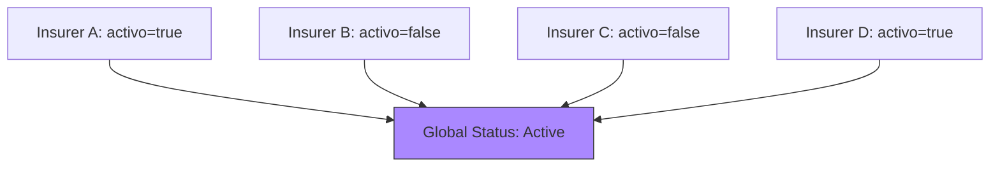
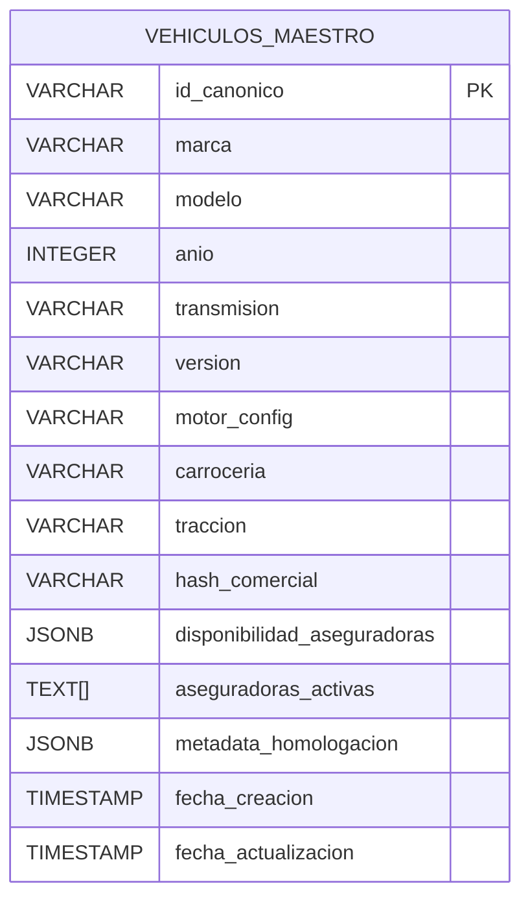
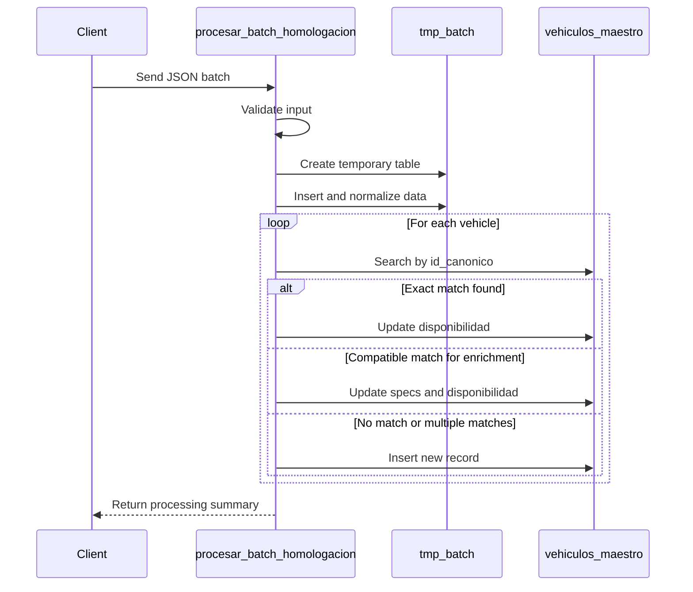

# Global Validity Rules

<cite>
**Referenced Files in This Document**   
- [Funcion RPC Nueva.sql](file://src/supabase/Funcion RPC Nueva.sql)
- [Tabla maestra.sql](file://src/supabase/Tabla maestra.sql)
- [Validacion y metricas.sql](file://src/supabase/Validacion y metricas.sql)
- [qualitas-codigo-de-normalizacion-n8n.js](file://src/insurers/qualitas/qualitas-codigo-de-normalizacion-n8n.js)
- [elpotosi-codigo-de-normalizacion.js](file://src/insurers/elpotosi/elpotosi-codigo-de-normalizacion.js)
- [WARP.md](file://WARP.md)
</cite>

## Table of Contents
1. [Introduction](#introduction)
2. [Global Validity Determination Logic](#global-validity-determination-logic)
3. [Data Model and Storage Structure](#data-model-and-storage-structure)
4. [RPC Processing Workflow](#rpc-processing-workflow)
5. [Conflict Resolution Strategy](#conflict-resolution-strategy)
6. [Validation and Anomaly Detection](#validation-and-anomaly-detection)
7. [Real-World Scenarios and Edge Cases](#real-world-scenarios-and-edge-cases)
8. [Conclusion](#conclusion)

## Introduction

This document details the business logic governing global validity determination for homologated vehicle records within the Ukuvi vehicle catalog system. The system consolidates vehicle availability data from multiple Mexican insurance providers into a unified canonical model. A vehicle is considered globally valid (active) if at least one insurer reports it as active. This principle ensures broad market coverage while maintaining accurate availability status. The document explains the underlying data model, the RPC function's processing workflow, conflict resolution mechanisms, and validation rules that prevent data anomalies.

**Section sources**
- [WARP.md](file://WARP.md#L152-L203)

## Global Validity Determination Logic

The core business rule for global validity is defined as: a vehicle is globally active if it is reported as active by at least one insurer. This logic is implemented through the `aseguradoras_activas` array in the `vehiculos_maestro` table, which is a generated column populated from the `disponibilidad_aseguradoras` JSONB field. The system does not require unanimous agreement among insurers; a single active status is sufficient for global validity. This approach maximizes the available vehicle pool for insurance quoting while accurately reflecting market availability. The `activo` flag from each insurer's data is normalized during the ETL process and stored within the insurer-specific object in the `disponibilidad_aseguradoras` JSONB structure.



**Diagram sources**
- [Tabla maestra.sql](file://src/supabase/Tabla maestra.sql#L50-L79)

**Section sources**
- [Tabla maestra.sql](file://src/supabase/Tabla maestra.sql#L50-L79)
- [WARP.md](file://WARP.md#L152-L203)

## Data Model and Storage Structure

The system's data model is centered on the `vehiculos_maestro` table, which serves as the master catalog. Each vehicle is uniquely identified by an `id_canonico`, a SHA-256 hash of its complete technical specification. The key fields for availability management are `disponibilidad_aseguradoras` (a JSONB field) and `aseguradoras_activas` (a generated array). The `disponibilidad_aseguradoras` field stores a JSON object where each key is an insurer's name, and the value contains the insurer-specific availability status (`activo`), original identifiers, and metadata. The `aseguradoras_activas` array is automatically generated to contain the names of all insurers that report the vehicle as active, enabling efficient SQL queries using the `ANY` operator for fast lookups.



**Diagram sources**
- [Tabla maestra.sql](file://src/supabase/Tabla maestra.sql#L1-L99)

**Section sources**
- [Tabla maestra.sql](file://src/supabase/Tabla maestra.sql#L1-L99)

## RPC Processing Workflow

The `procesar_batch_homologacion` function is the primary RPC responsible for processing batches of vehicle data. The workflow begins with input validation and staging of data into a temporary table. The function then performs a three-step matching process: first, it looks for an exact match by `id_canonico`; second, it searches for compatible vehicles to enrich missing technical specifications; and third, it creates new records for vehicles with no match or multiple potential matches. For each vehicle, the function updates the `disponibilidad_aseguradoras` JSONB field by merging the new insurer's data. If the insurer already exists in the JSON, its data is updated; otherwise, a new entry is added. The `aseguradoras_activas` array is automatically recalculated by the database due to its generated nature.



**Diagram sources**
- [Funcion RPC Nueva.sql](file://src/supabase/Funcion RPC Nueva.sql#L1-L428)

**Section sources**
- [Funcion RPC Nueva.sql](file://src/supabase/Funcion RPC Nueva.sql#L1-L428)

## Conflict Resolution Strategy

The system handles conflicting availability statuses through a non-destructive, additive approach. When insurers report different statuses for the same vehicle (e.g., one reports `activo=true`, another reports `activo=false`), both statuses are preserved in the `disponibilidad_aseguradoras` JSONB field. The system does not attempt to resolve the conflict by majority vote or source reliability; instead, it relies on the global validity rule. The presence of at least one `activo=true` entry results in the vehicle being globally active. The system detects potential data conflicts (e.g., differing transmission or version values) during the matching phase and logs them as warnings, but these do not prevent the update of availability status. Timestamp precedence is used to ensure the most recent data from each insurer is stored, but it does not override the fundamental availability logic.

**Section sources**
- [Funcion RPC Nueva.sql](file://src/supabase/Funcion RPC Nueva.sql#L300-L399)

## Validation and Anomaly Detection

The `Validacion y metricas.sql` script provides critical validation by calculating homologation metrics and detecting anomalies. It queries the `vehiculos_maestro` table to count vehicles with availability from multiple insurers, calculate homologation percentages, and compute averages. A key validation rule is the implicit check for data integrity: if a vehicle has no insurers in its `aseguradoras_activas` array, it is effectively inactive. The script does not explicitly flag vehicles that are marked as globally active with no active insurers because the `aseguradoras_activas` array is a generated column and cannot be manually set, preventing such an inconsistency. The system's design, where the active status is derived directly from the source JSON, inherently prevents this specific anomaly. The metrics provided by this script are essential for monitoring the health and coverage of the homologated catalog.

```mermaid
flowchart TD
A[Run Validacion y metricas.sql] --> B[Query vehiculos_maestro]
B --> C[Count total vehicles]
B --> D[Filter by array_length(aseguradoras_activas) >= 2]
B --> E[Filter by array_length(aseguradoras_activas) >= 3]
B --> F[Calculate average insurers]
C --> G[Calculate homologation percentages]
D --> G
E --> G
F --> G
G --> H[Output validation metrics]
```

**Diagram sources**
- [Validacion y metricas.sql](file://src/supabase/Validacion y metricas.sql#L1-L18)

**Section sources**
- [Validacion y metricas.sql](file://src/supabase/Validacion y metricas.sql#L1-L18)

## Real-World Scenarios and Edge Cases

Several real-world scenarios illustrate the system's behavior. In the case where all insurers mark a vehicle as inactive, the `aseguradoras_activas` array will be empty, and the vehicle will be globally inactive. This accurately reflects that the vehicle is no longer available in the market. A more complex scenario involves conflicting statuses: if Qualitas reports a Toyota Corolla 2023 as active, but HDI and AXA report it as inactive, the vehicle remains globally active due to Qualitas's positive status. This ensures the vehicle remains quotable. An edge case occurs when a new insurer is onboarded; their data is added to the `disponibilidad_aseguradoras` JSON, and if they report a vehicle as active, it immediately becomes globally active, even if no other insurer previously covered it. The system's design prevents the anomaly of a vehicle being marked as globally active with no active insurers because the `aseguradoras_activas` array is automatically generated from the source JSON data, making manual or erroneous flag setting impossible.

**Section sources**
- [WARP.md](file://WARP.md#L152-L203)
- [qualitas-codigo-de-normalizacion-n8n.js](file://src/insurers/qualitas/qualitas-codigo-de-normalizacion-n8n.js#L928-L964)
- [elpotosi-codigo-de-normalizacion.js](file://src/insurers/elpotosi/elpotosi-codigo-de-normalizacion.js#L536-L597)

## Conclusion

The global validity rules for homologated vehicle records are robustly implemented through a combination of a well-designed data model, a sophisticated RPC processing function, and automated validation. The principle that a vehicle is globally active if at least one insurer reports it as active ensures maximum market coverage. The use of JSONB for per-insurer data and a generated array for active insurers provides both flexibility and query performance. The system's non-destructive conflict resolution and inherent data integrity checks prevent common anomalies, making it a reliable foundation for insurance quoting systems.