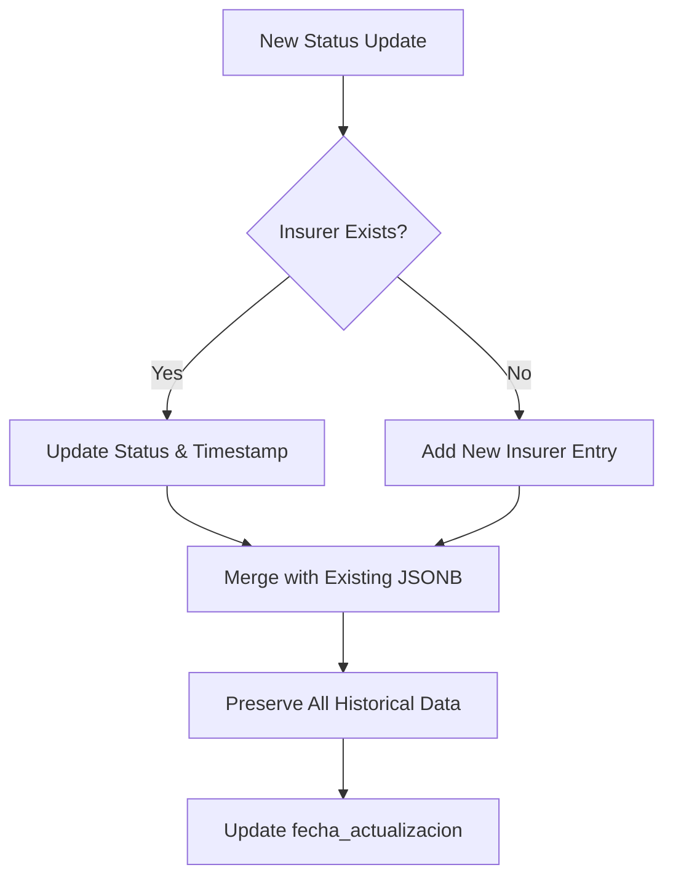

# Persistence & Audit Policies

<cite>
**Referenced Files in This Document**   
- [Funcion RPC Nueva.sql](file://src/supabase/Funcion RPC Nueva.sql)
- [Tabla maestra.sql](file://src/supabase/Tabla maestra.sql)
- [Validacion y metricas.sql](file://src/supabase/Validacion y metricas.sql)
- [WARP.md](file://WARP.md)
- [PLAN-HOMOLOGACION.md](file://PLAN-HOMOLOGACION.md)
</cite>

## Table of Contents
1. [Introduction](#introduction)
2. [Historical Status Retention Strategy](#historical-status-retention-strategy)
3. [Data Lifecycle and Retention Policy](#data-lifecycle-and-retention-policy)
4. [RPC Function Logic for Status Merging](#rpc-function-logic-for-status-merging)
5. [Compliance and Troubleshooting Support](#compliance-and-troubleshooting-support)
6. [Data Quality Validation](#data-quality-validation)
7. [Indexing and Query Patterns](#indexing-and-query-patterns)

## Introduction
The system implements a robust persistence strategy for tracking historical availability status of vehicle models across multiple insurers. This document details how the `disponibilidad_aseguradoras` JSONB field in the `vehiculos_maestro` table maintains a complete audit trail of status changes over time, enabling full traceability, compliance reporting, and discrepancy resolution. The design ensures that historical entries are never overwritten or deleted, supporting long-term data integrity and analytical capabilities.

**Section sources**
- [WARP.md](file://WARP.md#L152-L203)
- [PLAN-HOMOLOGACION.md](file://PLAN-HOMOLOGACION.md#L60-L94)

## Historical Status Retention Strategy
The system retains historical status entries by design, ensuring that updates to insurer availability do not overwrite existing records but instead append new status snapshots. Each insurer's availability status is stored as a JSONB object within the `disponibilidad_aseguradoras` field, preserving the complete history of changes.

When a new status update is received, the system performs a merge operation using PostgreSQL's JSONB concatenation operator (`||`). This operation adds or updates the insurer-specific entry while maintaining all previous entries. The structure includes:
- `activo`: Current active/inactive status
- `id_original`: Original insurer identifier
- `version_original`: Original version string from insurer
- `fecha_actualizacion`: Timestamp of last update

This append-only approach ensures full auditability of availability changes over time, allowing reconstruction of the system state at any point in history.

**Section sources**
- [Tabla maestra.sql](file://src/supabase/Tabla maestra.sql#L36-L80)
- [WARP.md](file://WARP.md#L152-L203)

## Data Lifecycle and Retention Policy
The system follows an append-only data lifecycle policy with no automatic purging of historical records. All status changes are permanently retained to support compliance requirements and long-term analytics. The retention strategy includes:

- **No Data Deletion**: Records are never physically deleted; inactive statuses are preserved with `activo=false`
- **Unbounded Retention**: No time-based archival or expiration policy is implemented
- **Performance Considerations**: Growing JSONB objects are mitigated through indexing and query optimization
- **Storage Growth**: Linear growth pattern expected, with each insurer update adding minimal overhead

The design prioritizes data integrity and auditability over storage optimization, recognizing that historical availability data has ongoing value for reconciliation and compliance purposes.

**Section sources**
- [WARP.md](file://WARP.md#L152-L203)
- [PLAN-HOMOLOGACION.md](file://PLAN-HOMOLOGACION.md#L60-L94)

## RPC Function Logic for Status Merging
The `procesar_batch_homologacion` function implements the core logic for merging new status updates while preserving historical records. The function uses JSONB concatenation to merge new insurer data into the existing `disponibilidad_aseguradoras` field.

For both "enrich" and "update availability" actions, the function executes:
```sql
disponibilidad = ch.disponibilidad || jsonb_build_object(
    t.origen_aseguradora, jsonb_build_object(
        'activo', t.activo,
        'id_original', t.id_original,
        'version_original', t.version_original,
        'fecha_actualizacion', NOW()
    )
)
```

This operation performs a deep merge that:
- Adds new insurer entries when they don't exist
- Updates existing insurer entries with new status and timestamp
- Preserves all previous fields and historical values
- Maintains the complete change history within the JSONB structure

The deduplication logic is handled by the JSONB object structure itself, where each insurer key is unique, ensuring that only the latest status per insurer is active while historical states remain accessible.

**Section sources**
- [Funcion RPC Nueva.sql](file://src/supabase/Funcion RPC Nueva.sql#L263-L294)
- [Funcion RPC Nueva.sql](file://src/supabase/Funcion RPC Nueva.sql#L291-L327)

## Compliance and Troubleshooting Support
The historical retention design directly supports compliance requirements and troubleshooting of data discrepancies. By maintaining a complete audit trail of availability changes, the system enables:

- **Regulatory Compliance**: Full documentation of insurer coverage changes over time
- **Discrepancy Resolution**: Ability to trace when and why availability status changed
- **Reconciliation**: Verification of data consistency across insurer feeds
- **Accountability**: Attribution of changes to specific insurer sources and timestamps

The `fecha_actualizacion` field provides precise timing for each status change, while the `id_original` and `version_original` fields preserve the source context. This comprehensive audit capability ensures the system meets data governance standards and supports regulatory audits.

**Section sources**
- [Tabla maestra.sql](file://src/supabase/Tabla maestra.sql#L36-L80)
- [WARP.md](file://WARP.md#L152-L203)

## Data Quality Validation
The `Validacion y metricas.sql` script implements data quality checks that verify historical entries are preserved during updates. The validation queries confirm that:

- The system maintains multiple insurer records per vehicle
- Availability status changes are properly recorded
- Historical data integrity is preserved across updates

Key validation metrics include:
- Total number of canonical vehicles
- Count of vehicles with multiple insurers (indicating successful merging)
- Average and maximum number of insurers per vehicle
- Percentage of vehicles with 2+ or 3+ insurer records

These metrics confirm that the system successfully retains historical entries and prevents data loss during update operations. The presence of vehicles with multiple insurers in the validation results demonstrates the effectiveness of the JSONB merging strategy.



**Diagram sources**
- [Validacion y metricas.sql](file://src/supabase/Validacion y metricas.sql#L1-L18)

**Section sources**
- [Validacion y metricas.sql](file://src/supabase/Validacion y metricas.sql#L1-L18)
- [casos de prueba función rpc.sql](file://src/supabase/casos de prueba función rpc.sql#L233-L255)

## Indexing and Query Patterns
The system implements optimized indexing strategies to support efficient querying of status change history. The primary index on the `disponibilidad_aseguradoras` field uses PostgreSQL's GIN (Generalized Inverted Index) to enable fast JSONB queries:

```sql
CREATE INDEX idx_disponibilidad ON vehiculos_maestro USING GIN (disponibilidad_aseguradoras);
```

This index supports efficient query patterns for auditing status history, including:

- Finding all vehicles currently available through a specific insurer
- Retrieving historical status changes for a particular vehicle-insurer combination
- Identifying vehicles with conflicting availability statuses across insurers
- Aggregating availability trends over time

Query patterns leverage the JSONB operators to extract specific insurer status information while maintaining performance even as the JSONB objects grow in size. The generated column `aseguradoras_activas` provides an array-based index for rapid filtering of currently active insurers.

**Section sources**
- [Tabla maestra.sql](file://src/supabase/Tabla maestra.sql#L82-L99)
- [Funcion RPC Nueva.sql](file://src/supabase/Funcion RPC Nueva.sql#L278)
- [Funcion RPC Nueva.sql](file://src/supabase/Funcion RPC Nueva.sql#L303)