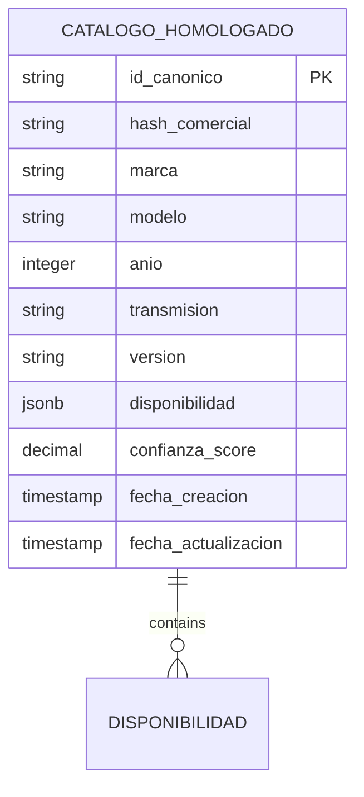
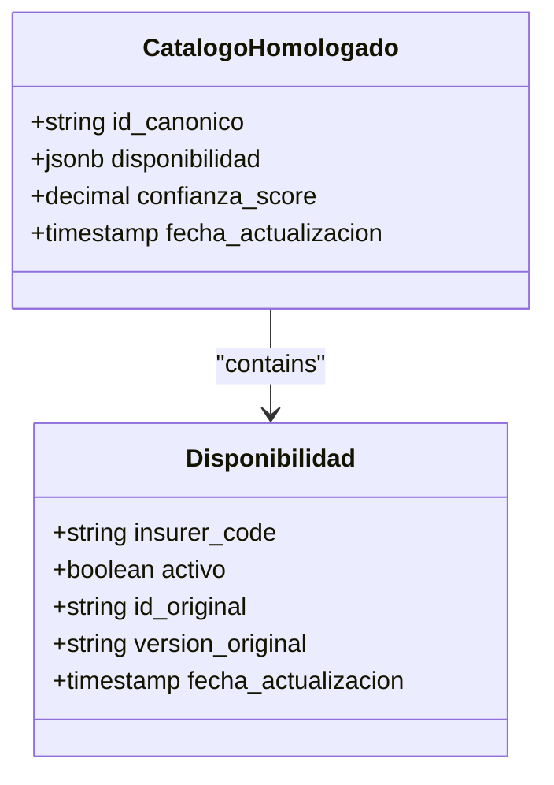
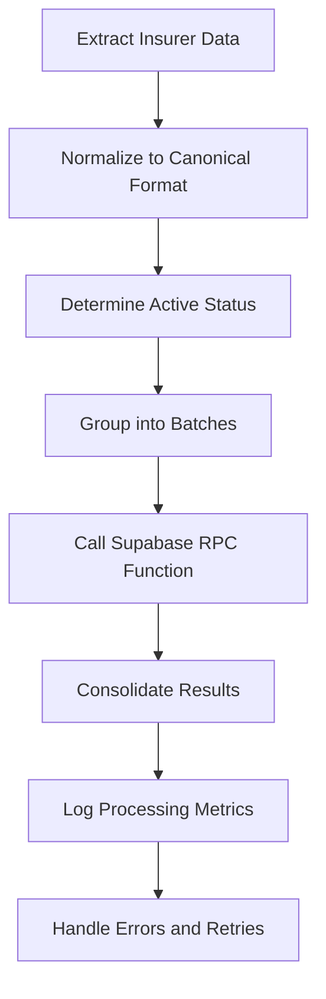
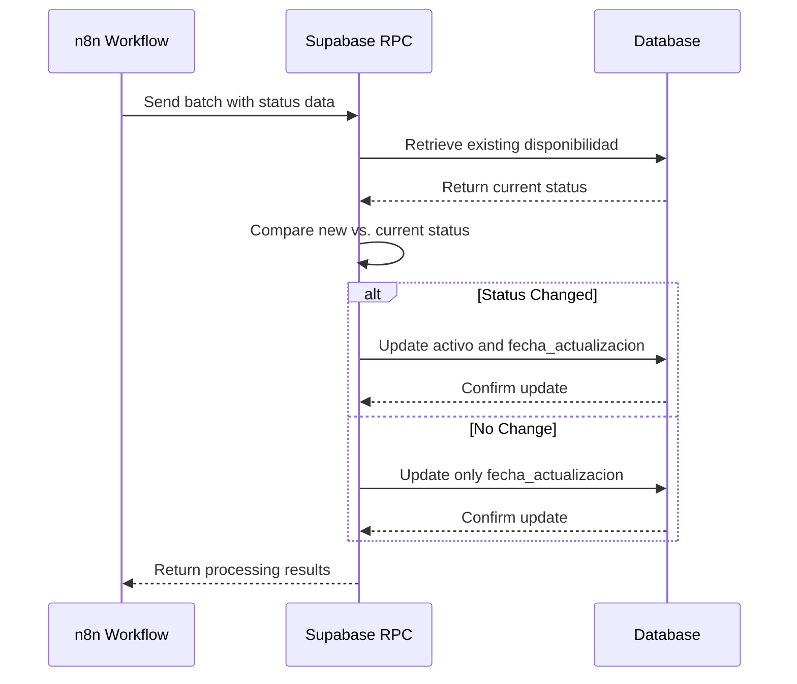

# Status Tracking Mechanism

<cite>
**Referenced Files in This Document**   
- [Replanteamiento homologacion.md](file://src/supabase/Replanteamiento%20homologacion.md)
- [Funcion RPC Nueva.sql](file://src/supabase/Funcion%20RPC%20Nueva.sql)
- [Validacion y metricas.sql](file://src/supabase/Validacion%20y%20metricas.sql)
- [qualitas-codigo-de-normalizacion-n8n.js](file://src/insurers/qualitas/qualitas-codigo-de-normalizacion-n8n.js)
- [ETL - Insertar y Actualizar.json](file://src/utils/ETL%20-%20Insertar%20y%20Actualizar.json)
</cite>

## Table of Contents
1. [Introduction](#introduction)
2. [Status Tracking in disponibilidad JSONB Field](#status-tracking-in-disponibilidad-jsonb-field)
3. [Schema of disponibilidad Field](#schema-of-disponibilidad-field)
4. [n8n Workflow Integration](#n8n-workflow-integration)
5. [Change Detection and Traceability](#change-detection-and-traceability)
6. [RPC Function for Data Merging](#rpc-function-for-data-merging)
7. [Validation Queries](#validation-queries)
8. [Conclusion](#conclusion)

## Introduction
This document details the status tracking mechanism implemented in the `catalogo_homologado` table using the `disponibilidad` JSONB field. The system tracks the active/inactive status of vehicle models across multiple insurers, maintaining historical records of status changes with timestamps. The mechanism integrates n8n workflows for batch processing, Supabase RPC functions for data merging, and validation queries to ensure data consistency across insurers.

**Section sources**
- [Replanteamiento homologacion.md](file://src/supabase/Replanteamiento%20homologacion.md#L1-L279)

## Status Tracking in disponibilidad JSONB Field
The `disponibilidad` JSONB field in the `catalogo_homologado` table stores the active/inactive status of vehicle models for each insurer. Each insurer's status is stored as a key-value pair within the JSONB structure, with the insurer code as the key and an object containing status information as the value.

The system maintains a complete history of status changes by preserving previous entries when updates occur. When an insurer's status changes from active to inactive (or vice versa), the system updates the `activo` flag and sets a new `fecha_actualizacion` timestamp, while retaining the `id_original` and `version_original` values. This approach ensures that historical status information is never lost, providing full traceability of status changes over time.

The `disponibilidad` field is indexed using a GIN index (`idx_disponibilidad_gin_hom`) to optimize query performance for status-based searches. This indexing strategy enables efficient retrieval of vehicles based on their availability status across different insurers.

**Diagram sources**
- [Replanteamiento homologacion.md](file://src/supabase/Replanteamiento%20homologacion.md#L50-L101)

**Section sources**
- [Replanteamiento homologacion.md](file://src/supabase/Replanteamiento%20homologacion.md#L50-L101)
- [Replanteamiento homologacion.md](file://src/supabase/Replanteamiento%20homologacion.md#L103-L134)

## Schema of disponibilidad Field
The `disponibilidad` JSONB field follows a standardized schema that captures essential information for each insurer's vehicle availability status. The schema includes the following keys:

- **`activo`**: Boolean flag indicating whether the vehicle model is currently active (true) or inactive (false) for the insurer
- **`id_original`**: Original identifier from the insurer's catalog, preserving the source reference
- **`version_original`**: Original version description from the insurer's catalog, maintaining contextual information
- **`fecha_actualizacion`**: Timestamp of the last status update, providing temporal context for the status

The field structure is hierarchical, with insurer codes (e.g., "QUALITAS", "HDI", "ZURICH") serving as top-level keys. Each insurer's entry contains the status information object with the keys mentioned above. This structure allows for efficient querying and updating of specific insurer statuses without affecting other entries.

The schema supports multiple insurers within the same record, enabling comparison of availability across different insurance providers. The system considers a vehicle model as globally active if at least one insurer reports it as active, providing a comprehensive view of market availability.

**Diagram sources**
- [Replanteamiento homologacion.md](file://src/supabase/Replanteamiento%20homologacion.md#L65-L87)

**Section sources**
- [Replanteamiento homologacion.md](file://src/supabase/Replanteamiento%20homologacion.md#L65-L87)

## n8n Workflow Integration
The n8n workflow orchestrates the batch processing of insurer data and updates the `disponibilidad` field in the `catalogo_homologado` table. The workflow follows a standardized process for each insurer, ensuring consistent data handling and status tracking.

The workflow begins by extracting data from each insurer's source system, then normalizes the data to the canonical format. During normalization, the system determines the active status of each vehicle model based on the insurer's catalog. The normalized data is then grouped into batches (typically 10,000-50,000 records) and sent to the Supabase RPC function for processing.

The workflow uses the "ETL - Insertar y Actualizar" sub-workflow to handle the batch processing. This sub-workflow chunks the data, calls the Supabase RPC function, and consolidates the results. The workflow is designed to be idempotent, meaning that reprocessing the same batch will not create duplicate records or alter existing data unnecessarily.

**Diagram sources**
- [ETL - Insertar y Actualizar.json](file://src/utils/ETL%20-%20Insertar%20y%20Actualizar.json)
- [qualitas-codigo-de-normalizacion-n8n.js](file://src/insurers/qualitas/qualitas-codigo-de-normalizacion-n8n.js)

**Section sources**
- [ETL - Insertar y Actualizar.json](file://src/utils/ETL%20-%20Insertar%20y%20Actualizar.json)
- [qualitas-codigo-de-normalizacion-n8n.js](file://src/insurers/qualitas/qualitas-codigo-de-normalizacion-n8n.js)

## Change Detection and Traceability
The system detects status changes between batches by comparing the incoming status with the existing status in the `disponibilidad` field. When the RPC function processes a batch, it checks whether the `activo` flag for an insurer has changed from its previous value. If a change is detected, the system updates the `fecha_actualizacion` timestamp to reflect when the status change occurred.

This change detection mechanism provides complete traceability of status transitions, allowing users to track when a vehicle model was added to or removed from an insurer's catalog. The system preserves historical status information by not overwriting previous entries, but rather by updating the relevant fields while maintaining the record of past states.

The traceability feature is enhanced by the inclusion of the `id_original` and `version_original` fields, which preserve the original identifiers and descriptions from the insurer's catalog. This information provides context for status changes and enables reconciliation with source systems.

**Diagram sources**
- [Funcion RPC Nueva.sql](file://src/supabase/Funcion%20RPC%20Nueva.sql#L291-L327)

**Section sources**
- [Funcion RPC Nueva.sql](file://src/supabase/Funcion%20RPC%20Nueva.sql#L291-L327)

## RPC Function for Data Merging
The Supabase RPC function `procesar_batch_homologacion` handles the merging of new status data into the `disponibilidad` field without overwriting historical records. The function uses PostgreSQL's JSONB concatenation operator (`||`) to merge new insurer status data with existing data, ensuring that previous entries are preserved.

When processing a batch, the function follows these steps:
1. Validates the input data structure
2. Stages the incoming data in a temporary table
3. Searches for existing records by `id_canonico`
4. Updates the `disponibilidad` field using JSONB merge operations
5. Returns processing metrics and any warnings

The function is designed to be idempotent, meaning that reprocessing the same batch will not create duplicate records or alter existing data unnecessarily. This property is essential for reliable batch processing and error recovery.

The RPC function also updates the `confianza_score` field based on the processing outcome, incrementing it slightly for updates and setting it to a lower value for new records with potential conflicts. This scoring mechanism helps identify records that may require manual review.

**Section sources**
- [Funcion RPC Nueva.sql](file://src/supabase/Funcion%20RPC%20Nueva.sql#L0-L428)

## Validation Queries
The validation queries in "Validacion y metricas.sql" check for missing or inconsistent status updates across insurers. These queries ensure data quality and completeness by identifying potential issues in the homologation process.

The primary validation query calculates key metrics for the homologation process, including:
- Total number of canonical vehicles
- Number of vehicles with two or more insurers
- Number of vehicles with three or more insurers
- Average number of insurers per vehicle
- Maximum number of insurers for a single vehicle

These metrics provide insight into the level of homologation achieved and help identify areas where data may be missing or inconsistent. The query uses array operations on the `aseguradoras_activas` field to calculate these metrics efficiently.

Additional validation queries could be developed to specifically check for missing status updates by comparing the number of expected insurers against the actual number of insurers with status data for each vehicle. This would help identify insurers that may not be properly integrated into the homologation process.

**Section sources**
- [Validacion y metricas.sql](file://src/supabase/Validacion%20y%20metricas.sql#L0-L18)

## Conclusion
The status tracking mechanism using the `disponibilidad` JSONB field provides a robust solution for managing vehicle availability across multiple insurers. By storing timestamped entries for each insurer's active/inactive status, the system maintains a complete history of status changes while enabling efficient querying and analysis.

The integration of n8n workflows for batch processing, Supabase RPC functions for data merging, and validation queries for data quality ensures a reliable and scalable solution. The system's design prioritizes data integrity and traceability, making it suitable for regulatory compliance and business intelligence applications.

Future enhancements could include more sophisticated change detection algorithms, automated alerts for significant status changes, and enhanced visualization tools for tracking availability trends over time.