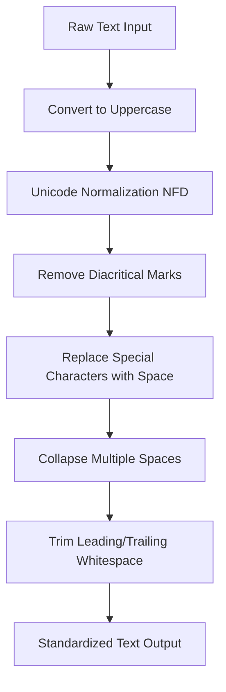
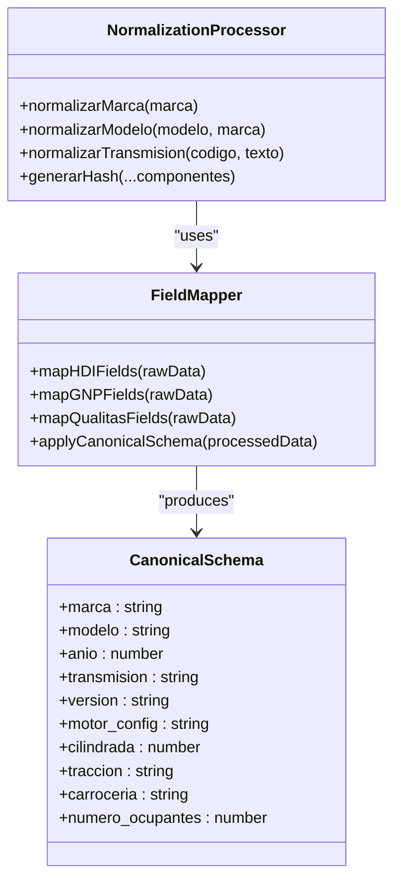
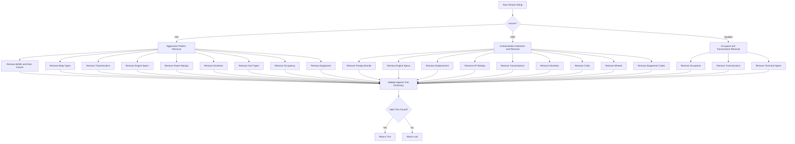
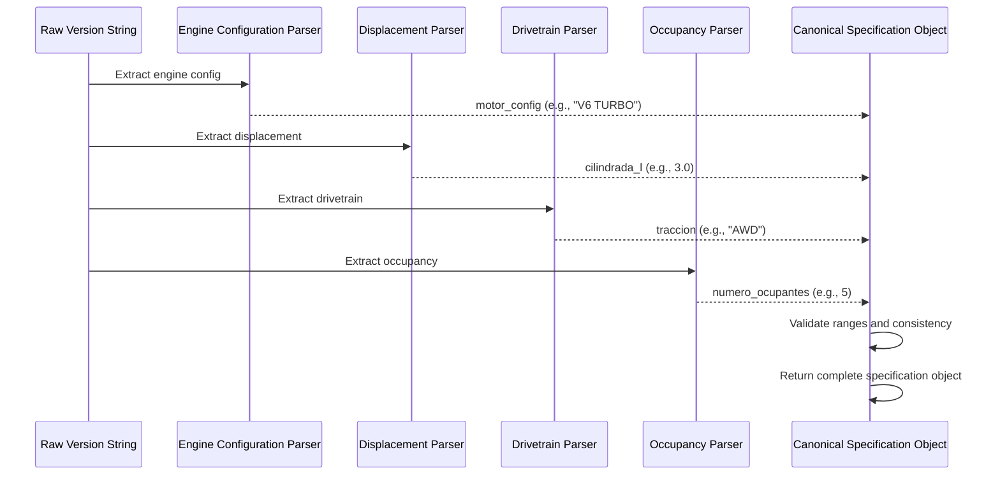
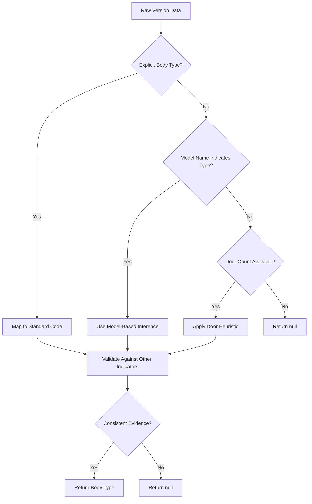
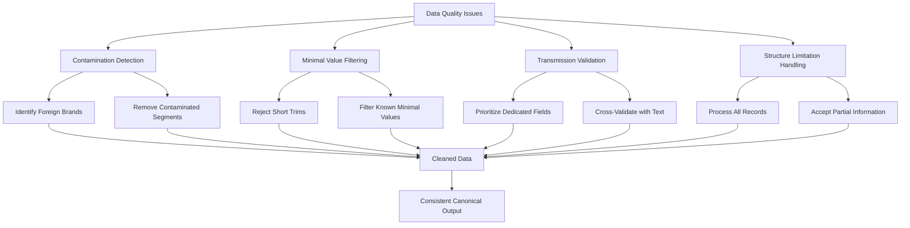
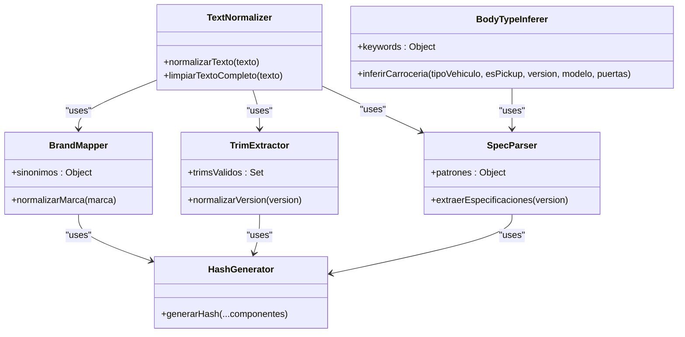
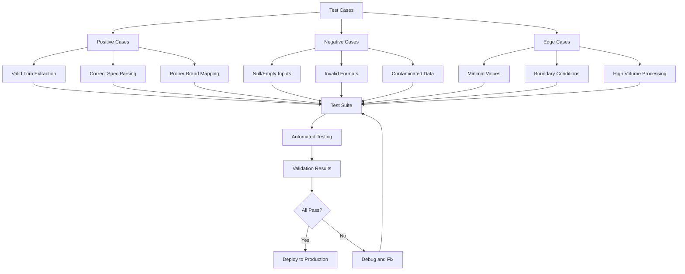

# Data Normalization

<cite>
**Referenced Files in This Document**   
- [hdi-codigo-de-normalizacion.js](file://src/insurers/hdi/hdi-codigo-de-normalizacion.js)
- [gnp-codigo-de-normalizacion.js](file://src/insurers/gnp/gnp-codigo-de-normalizacion.js)
- [qualitas-codigo-de-normalizacion-n8n.js](file://src/insurers/qualitas/qualitas-codigo-de-normalizacion-n8n.js)
- [hdi-analisis.md](file://src/insurers/hdi/hdi-analisis.md)
- [gnp-analisis.md](file://src/insurers/gnp/gnp-analisis.md)
- [qualitas-analisis.md](file://src/insurers/qualitas/qualitas-analisis.md)
</cite>

## Table of Contents
1. [Introduction](#introduction)
2. [Text Standardization](#text-standardization)
3. [Field Mapping and Canonical Transformation](#field-mapping-and-canonical-transformation)
4. [Trim and Version Extraction](#trim-and-version-extraction)
5. [Technical Specifications Parsing](#technical-specifications-parsing)
6. [Carrocería Inference from Model Names](#carroceria-inference-from-model-names)
7. [Common Challenges and Resolution Strategies](#common-challenges-and-resolution-strategies)
8. [Best Practices for Maintainable Normalization Code](#best-practices-for-maintainable-normalization-code)
9. [Testing and Edge Case Handling](#testing-and-edge-case-handling)

## Introduction

The data normalization phase is a critical component in transforming raw insurer data into a unified canonical format. This process ensures consistency, accuracy, and interoperability across diverse data sources from multiple insurance providers such as HDI, GNP, and Qualitas. The normalization workflow leverages JavaScript functions within n8n automation pipelines to systematically process vehicle data, including brand, model, year, transmission, version (trim), and technical specifications.

Each insurer provides data with unique structural characteristics and quality levels. For instance, HDI offers a relatively clean structure with comma-separated fields in its `VersionCorta` field, enabling reliable extraction of trims and specifications. In contrast, GNP's data suffers from significant contamination, with approximately 8% of records containing incorrect brand or model information embedded in the version string. Qualitas presents a highly unstructured `cVersion` field that mixes trim, engine specs, equipment codes, and occupancy information without consistent delimiters.

This document details the normalization strategies employed to handle these variations, focusing on text standardization, field mapping, trim extraction, technical specification parsing, and body type inference. The implementation uses robust JavaScript functions that incorporate regex patterns, string manipulation, and validation logic to produce high-quality canonical outputs. Special attention is given to edge cases, data quality issues, and maintainability best practices to ensure long-term reliability of the homologation system.

**Section sources**
- [hdi-analisis.md](file://src/insurers/hdi/hdi-analisis.md#L1-L524)
- [gnp-analisis.md](file://src/insurers/gnp/gnp-analisis.md#L1-L280)
- [qualitas-analisis.md](file://src/insurers/qualitas/qualitas-analisis.md#L1-L332)

## Text Standardization

Text standardization is the foundational step in the normalization pipeline, ensuring uniformity across all textual data before further processing. This phase involves several key operations: case normalization, accent removal, special character handling, and whitespace management.

The primary function used for text normalization across all insurers is `normalizarTexto`, which performs a sequence of transformations to produce clean, consistent output. First, the input text is converted to uppercase using `.toUpperCase()` to eliminate case sensitivity. Then, Unicode normalization via `.normalize("NFD")` decomposes characters with diacritical marks into their base characters and combining marks. This allows for systematic removal of accents using a regular expression `/[\u0300-\u036f]/g`, which targets all combining diacritical marks in the Unicode range.

Special characters and punctuation are replaced with spaces using `/[^A-Z0-9\s-]/g`, preserving only alphanumeric characters, spaces, and hyphens. Multiple consecutive spaces are collapsed into single spaces with `/\s+/g`, and leading/trailing whitespace is removed with `.trim()`. This approach ensures that variations like "Volkswagen", "VOLKSWAGEN", and "VölksWagen" are all standardized to "VOLKSWAGEN".

Additional cleaning functions such as `limpiarTextoCompleto` handle specific edge cases like smart quotes, curly apostrophes, and backslashes, replacing them with standard equivalents. These preprocessing steps are crucial for reliable pattern matching in subsequent stages, particularly when dealing with inconsistent data entry practices across different insurers.

**Diagram sources**
- [hdi-codigo-de-normalizacion.js](file://src/insurers/hdi/hdi-codigo-de-normalizacion.js#L30-L45)
- [gnp-codigo-de-normalizacion.js](file://src/insurers/gnp/gnp-codigo-de-normalizacion.js#L35-L50)
- [qualitas-codigo-de-normalizacion-n8n.js](file://src/insurers/qualitas/qualitas-codigo-de-normalizacion-n8n.js#L15-L25)

**Section sources**
- [hdi-codigo-de-normalizacion.js](file://src/insurers/hdi/hdi-codigo-de-normalizacion.js#L30-L45)
- [gnp-codigo-de-normalizacion.js](file://src/insurers/gnp/gnp-codigo-de-normalizacion.js#L35-L50)

## Field Mapping and Canonical Transformation

Field mapping involves transforming insurer-specific data fields into a standardized canonical schema that supports cross-provider comparison and integration. This process requires both direct field mapping and complex transformation logic to reconcile differences in data representation across insurers.

The canonical schema defines key attributes such as `marca` (brand), `modelo` (model), `anio` (year), `transmision` (transmission), `version` (trim), and technical specifications including engine configuration, displacement, traction, and body type. Each insurer's data structure is mapped to this common format through a series of normalization functions.

For brand normalization, a comprehensive synonym dictionary is used to consolidate variations into standard names. For example, "VW", "VOLKSWAGEN", and "VOLKS WAGEN" are all mapped to "VOLKSWAGEN", while "MERCEDES", "MERCEDES-BENZ", and "MB" become "MERCEDES BENZ". This mapping is implemented through lookup tables that iterate through known variants and return the standardized form.

Model names are cleaned by removing the brand prefix when present and eliminating technical specifications that should not be part of the model designation. Transmission codes are normalized from various formats—such as numeric codes (1=Manual, 2=Automatic in GNP) or single letters (A=Automatic, S=Manual in Qualitas)—into the canonical values "AUTO" or "MANUAL".

The transformation process also handles structural differences between insurers. HDI's comma-separated `ClaveVersion` field allows for positional extraction, where the first segment typically contains the trim. In contrast, GNP and Qualitas require pattern-based extraction due to unstructured text fields. The resulting canonical fields are then combined into composite strings used for generating unique identifiers via SHA-256 hashing.

**Diagram sources**
- [hdi-codigo-de-normalizacion.js](file://src/insurers/hdi/hdi-codigo-de-normalizacion.js#L100-L200)
- [gnp-codigo-de-normalizacion.js](file://src/insurers/gnp/gnp-codigo-de-normalizacion.js#L70-L150)
- [qualitas-codigo-de-normalizacion-n8n.js](file://src/insurers/qualitas/qualitas-codigo-de-normalizacion-n8n.js#L50-L100)

**Section sources**
- [hdi-codigo-de-normalizacion.js](file://src/insurers/hdi/hdi-codigo-de-normalizacion.js#L100-L200)
- [gnp-codigo-de-normalizacion.js](file://src/insurers/gnp/gnp-codigo-de-normalizacion.js#L70-L150)

## Trim and Version Extraction

Trim and version extraction is a critical phase in data normalization, responsible for identifying the vehicle's trim level or edition from unstructured text fields. This process varies significantly between insurers due to differences in data structure and quality, requiring tailored approaches for HDI, GNP, and Qualitas.

For HDI, the `normalizarVersion` function employs an aggressive cleaning strategy that removes problematic patterns in a specific order. The process begins by eliminating "BASE" designations and door count specifications (e.g., "CP PUERTAS"), followed by body types, transmissions, engine specifications, power ratings, drivetrain information, fuel types, occupancy counts, and equipment codes. After extensive cleaning, the remaining text is validated against a comprehensive list of known valid trims such as "EXCLUSIVE", "ADVANCE", "LIMITED", and "PREMIUM". The function prioritizes multi-word trims (up to three words) before falling back to single-word matches, ensuring accurate identification of compound trims like "SPORT LINE" or "LIMITED PLUS".

GNP's approach, implemented in `extraerTrim`, faces greater challenges due to data contamination. The process first detects and removes instances where other brands' names appear in the version string (e.g., "BMW 325iA" in a Honda Civic record). It then strips technical specifications including engine configuration, displacement, transmission types, drivetrain, turbo indicators, wheel sizes, and equipment codes. The cleaned text is compared against a prioritized list of valid GNP trims, with exact matches returned upon first occurrence. Due to the poor data quality, only about 10% of GNP records yield identifiable trims.

Qualitas uses a similar but more sophisticated approach in `extraerVersion`, which first removes occupant counts and transmission indicators before applying extensive cleaning rules. The function maintains separate sets for multi-word and single-word trims, with additional brand-specific trim dictionaries to improve accuracy. Unlike other insurers, Qualitas explicitly avoids returning "BASE" as a trim when no valid trim is found, instead returning null to indicate absence of meaningful trim information.

**Diagram sources**
- [hdi-codigo-de-normalizacion.js](file://src/insurers/hdi/hdi-codigo-de-normalizacion.js#L300-L500)
- [gnp-codigo-de-normalizacion.js](file://src/insurers/gnp/gnp-codigo-de-normalizacion.js#L300-L400)
- [qualitas-codigo-de-normalizacion-n8n.js](file://src/insurers/qualitas/qualitas-codigo-de-normalizacion-n8n.js#L300-L400)

**Section sources**
- [hdi-codigo-de-normalizacion.js](file://src/insurers/hdi/hdi-codigo-de-normalizacion.js#L300-L500)
- [gnp-codigo-de-normalizacion.js](file://src/insurers/gnp/gnp-codigo-de-normalizacion.js#L300-L400)

## Technical Specifications Parsing

Technical specifications parsing involves extracting detailed vehicle attributes such as engine configuration, displacement, drivetrain, body type, and occupancy from unstructured text fields. This process requires precise regular expressions and contextual validation to ensure accurate data capture across different insurers' data formats.

For engine configuration extraction, the system identifies patterns like "L4", "V6", "V8", or "H4" using the regex pattern `/[VLIH]\d+/`. This captures inline, V-type, and horizontally opposed engine configurations with their cylinder counts. In cases where turbocharging is indicated, additional detection logic identifies terms like "TURBO", "BITURBO", "TSI", "TDI", or "TFSI" to append "TURBO" to the engine configuration or mark it separately.

Cilindrada (displacement) is extracted using the pattern `/(\d+\.?\d*)[LT]/`, which captures decimal numbers followed by "L" or "T" (indicating turbocharged engines). The extracted value is validated to ensure it falls within reasonable automotive ranges (0.5L to 8.0L), with special handling for high-performance engines like the 8.0L W16.

Drivetrain (tracción) detection uses multiple patterns to identify "AWD", "4X4", "4WD", "FWD", "RWD", and proprietary systems like "QUATTRO", "XDRIVE", "4MATIC", and "4MOTION". These are normalized to standard values, with "QUATTRO", "XDRIVE", and "4MATIC" mapped to "AWD" due to their functional equivalence.

Occupancy (numero_ocupantes) is parsed from phrases like "5 PASAJEROS", "7 OCUPANTES", or "05 OCUP." using the pattern `/(\d+)\s*(PASAJEROS?|OCUPANTES?|PLAZAS?|ASIENTOS?|PAX|PAS)/i`. The extracted number is validated to ensure it falls within reasonable limits (2-23 occupants), with commercial vehicles like vans potentially having higher occupancy.

The parsing process follows a strict order of operations to prevent interference between different specification types. For example, transmission-related terms are removed before attempting trim extraction, and engine specifications are identified before displacement parsing. This sequential approach ensures that each specification is captured accurately without cross-contamination.

**Diagram sources**
- [hdi-codigo-de-normalizacion.js](file://src/insurers/hdi/hdi-codigo-de-normalizacion.js#L500-L600)
- [gnp-codigo-de-normalizacion.js](file://src/insurers/gnp/gnp-codigo-de-normalizacion.js#L200-L300)
- [qualitas-codigo-de-normalizacion-n8n.js](file://src/insurers/qualitas/qualitas-codigo-de-normalizacion-n8n.js#L200-L300)

**Section sources**
- [hdi-codigo-de-normalizacion.js](file://src/insurers/hdi/hdi-codigo-de-normalizacion.js#L500-L600)
- [gnp-codigo-de-normalizacion.js](file://src/insurers/gnp/gnp-codigo-de-normalizacion.js#L200-L300)

## Carrocería Inference from Model Names

Carrocería (body type) inference is a multi-layered process that combines explicit detection, pattern matching, and heuristic rules to determine a vehicle's body style when not explicitly stated in the data. This inference is critical for accurate vehicle classification and pricing, as body type significantly impacts insurance risk profiles.

The primary method of inference involves direct pattern matching against known body type keywords in the version string. Terms like "SEDAN", "COUPE", "SUV", "HATCHBACK", "CONVERTIBLE", "PICKUP", "VAN", and "WAGON" are detected using case-insensitive regular expressions and mapped to standardized body type codes. Special cases are handled for proprietary names like "SPORTBACK" (mapped to "SPORTBACK") or "CABRIO" (mapped to "CONVERTIBLE").

When explicit indicators are absent, the system infers body type from the number of doors. A two-door configuration typically indicates a "COUPE", three doors suggest a "HATCHBACK", four doors point to a "SEDAN", and five doors commonly indicate an "SUV". This heuristic is particularly useful for HDI data, where door count is frequently specified.

For cases where neither explicit nor door-based indicators are available, model name analysis provides a fallback. The system maintains dictionaries of known model patterns associated with specific body types. For example, models containing "CR-V", "RAV4", "TUCSON", or "TIGUAN" are classified as "SUV", while "F-150", "RAM", "TACOMA", or "HILUX" indicate "PICKUP". Van models like "TRANSIT", "SPRINTER", "ODYSSEY", or "SIENNA" are similarly identified.

GNP's implementation includes additional logic for pickup trucks, where the `TipoVehiculo` field value "CA1" or `es_pickup` flag takes precedence over other indicators. Qualitas prioritizes "WAGON" or "SPORTWAGEN" detection over door-based heuristics, recognizing that station wagons often have five doors like SUVs but represent a distinct body type.

The inference process follows a strict priority order: explicit detection first, followed by model-based identification, then door count heuristics, with null returned if no conclusive evidence is found. This conservative approach prevents incorrect assumptions while maximizing data completeness.

**Diagram sources**
- [hdi-codigo-de-normalizacion.js](file://src/insurers/hdi/hdi-codigo-de-normalizacion.js#L550-L600)
- [gnp-codigo-de-normalizacion.js](file://src/insurers/gnp/gnp-codigo-de-normalizacion.js#L400-L500)
- [qualitas-codigo-de-normalizacion-n8n.js](file://src/insurers/qualitas/qualitas-codigo-de-normalizacion-n8n.js#L400-L500)

**Section sources**
- [hdi-codigo-de-normalizacion.js](file://src/insurers/hdi/hdi-codigo-de-normalizacion.js#L550-L600)
- [gnp-codigo-de-normalizacion.js](file://src/insurers/gnp/gnp-codigo-de-normalizacion.js#L400-L500)

## Common Challenges and Resolution Strategies

The data normalization process encounters several recurring challenges across different insurers, requiring specialized resolution strategies to maintain data quality and processing reliability. These challenges stem from inconsistent data entry practices, structural limitations in source systems, and varying data quality standards.

One major challenge is inconsistent trim naming conventions, particularly evident in GNP's data where approximately 8% of records contain contamination from other brands (e.g., "MERCEDES BENZ ML 500" in a Honda Civic record). This is resolved through aggressive contamination detection using a predefined list of competing brands, with regex patterns removing foreign brand names and associated model specifications before processing.

Another significant issue is the presence of minimal or non-descriptive trim values such as single letters ("A", "B", "C") or generic terms ("S/D" for Sin Definir). The system addresses this by implementing strict validation rules that return null for trims shorter than three characters or matching known minimal values, preventing meaningless data from entering the canonical dataset.

Transmission coding inconsistencies are handled through multi-source validation. When available, dedicated transmission fields (like GNP's numeric codes or Qualitas' single-letter codes) are prioritized over text-based detection in version strings. For HDI, where transmission appears in the version text, pattern matching with fallback validation ensures accurate classification.

Data structure limitations pose additional challenges. GNP lacks an active/inactive flag, requiring all records to be processed without the ability to filter obsolete entries. Similarly, Qualitas' highly unstructured `cVersion` field necessitates complex parsing logic to separate trim, specifications, and equipment codes that are mixed without delimiters.

The system employs conservative defaulting strategies, preferring null values over guessed defaults when information is ambiguous or missing. This prevents the propagation of potentially incorrect data while maintaining transparency about data gaps. Comprehensive logging captures edge cases and anomalies for ongoing refinement of normalization rules.

**Diagram sources**
- [gnp-analisis.md](file://src/insurers/gnp/gnp-analisis.md#L50-L100)
- [qualitas-analisis.md](file://src/insurers/qualitas/qualitas-analisis.md#L50-L100)
- [hdi-analisis.md](file://src/insurers/hdi/hdi-analisis.md#L50-L100)

**Section sources**
- [gnp-analisis.md](file://src/insurers/gnp/gnp-analisis.md#L50-L100)
- [qualitas-analisis.md](file://src/insurers/qualitas/qualitas-analisis.md#L50-L100)

## Best Practices for Maintainable Normalization Code

Developing maintainable normalization code requires adherence to several best practices that ensure long-term reliability, readability, and adaptability of the data processing pipeline. These practices are evident in the implementation across HDI, GNP, and Qualitas normalization scripts.

Modular design is a fundamental principle, with distinct functions handling specific responsibilities: text normalization, brand mapping, trim extraction, specification parsing, and body type inference. This separation of concerns allows for independent testing and modification of each component without affecting others. For example, the `normalizarTexto` function is reused across all insurers, ensuring consistent text processing.

Comprehensive documentation is embedded within the code through detailed comments that explain the purpose, logic, and evolution of each function. Version history comments track changes and improvements, such as HDI's v2.5 update that introduced aggressive cleaning of "CP PUERTAS" and "BASE" designations. This historical context aids future developers in understanding design decisions.

Validation and error handling are implemented at multiple levels. Input validation prevents null or undefined values from causing runtime errors, while output validation ensures generated trims meet quality criteria before inclusion in the canonical dataset. Try-catch blocks wrap processing logic to prevent single record failures from halting the entire batch.

Configuration-driven design uses dictionaries and sets for maintainable rule management. Brand synonyms, valid trims, and body type keywords are defined as data structures rather than hard-coded logic, allowing easy updates without code changes. This approach enables quick adaptation to new market entries or changing trim nomenclature.

Performance considerations include efficient regex patterns and optimized processing order. For instance, HDI's version cleaning removes the most problematic patterns first to minimize interference with subsequent operations. The use of `Set` objects for trim validation provides O(1) lookup performance even with large dictionaries.

**Diagram sources**
- [hdi-codigo-de-normalizacion.js](file://src/insurers/hdi/hdi-codigo-de-normalizacion.js#L1-L100)
- [gnp-codigo-de-normalizacion.js](file://src/insurers/gnp/gnp-codigo-de-normalizacion.js#L1-L100)
- [qualitas-codigo-de-normalizacion-n8n.js](file://src/insurers/qualitas/qualitas-codigo-de-normalizacion-n8n.js#L1-L100)

**Section sources**
- [hdi-codigo-de-normalizacion.js](file://src/insurers/hdi/hdi-codigo-de-normalizacion.js#L1-L100)
- [gnp-codigo-de-normalizacion.js](file://src/insurers/gnp/gnp-codigo-de-normalizacion.js#L1-L100)

## Testing and Edge Case Handling

Robust testing and edge case handling are essential for ensuring the reliability of the normalization system across diverse and unpredictable input data. The implementation incorporates multiple layers of validation and error management to handle anomalous cases gracefully.

Comprehensive test coverage includes both positive and negative cases, validating that known patterns are correctly identified while malformed or ambiguous inputs are properly handled. For example, the system tests that "GLS PREMIUM, L4, 1.5L, 113 CP, 5 PUERTAS, AUT" correctly extracts "GLS PREMIUM" as the trim, while "S/D" or single letters like "A" return null rather than being treated as valid trims.

Edge case handling is implemented through defensive programming practices. Input validation checks for null, undefined, or empty values at function entry points, preventing runtime errors. Try-catch blocks wrap record processing to ensure that failures in individual records do not terminate the entire batch operation. Error logging captures detailed information about processing failures for diagnostic purposes.

The system handles data quality extremes by accepting partial information rather than rejecting entire records. For instance, a vehicle record missing transmission information but containing valid trim and specifications will still be processed, with the transmission field set to null. This approach maximizes data utilization while maintaining transparency about information gaps.

Statistical monitoring tracks key metrics such as the percentage of records with identifiable trims, contamination detection rates, and specification extraction success rates. For GNP, where only about 10% of records have identifiable trims, this monitoring helps assess data quality trends over time and identify potential improvements in the normalization logic.

The processing pipeline is designed to be idempotent, allowing reprocessing of data without creating duplicates or inconsistencies. Unique identifiers generated through SHA-256 hashing of canonical attributes enable deduplication and change detection, supporting incremental updates and reconciliation processes.

**Diagram sources**
- [gnp-codigo-de-normalizacion.js](file://src/insurers/gnp/gnp-codigo-de-normalizacion.js#L500-L600)
- [hdi-codigo-de-normalizacion.js](file://src/insurers/hdi/hdi-codigo-de-normalizacion.js#L600-L700)
- [qualitas-codigo-de-normalizacion-n8n.js](file://src/insurers/qualitas/qualitas-codigo-de-normalizacion-n8n.js#L800-L900)

**Section sources**
- [gnp-codigo-de-normalizacion.js](file://src/insurers/gnp/gnp-codigo-de-normalizacion.js#L500-L600)
- [hdi-codigo-de-normalizacion.js](file://src/insurers/hdi/hdi-codigo-de-normalizacion.js#L600-L700)