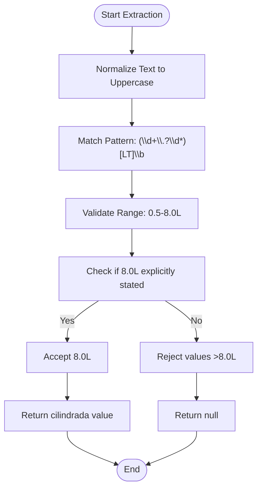
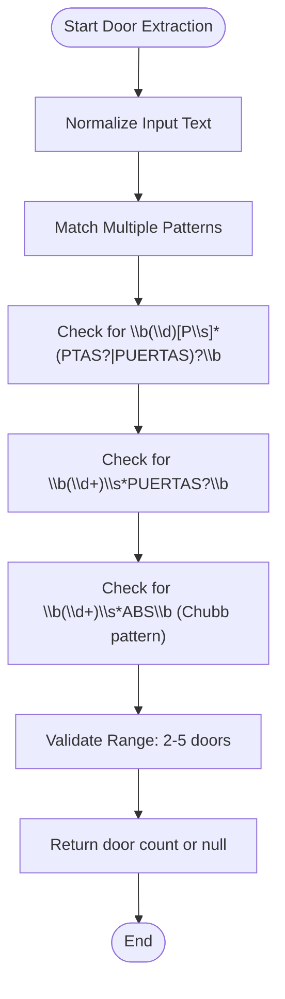
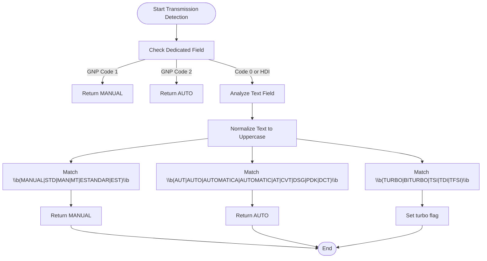
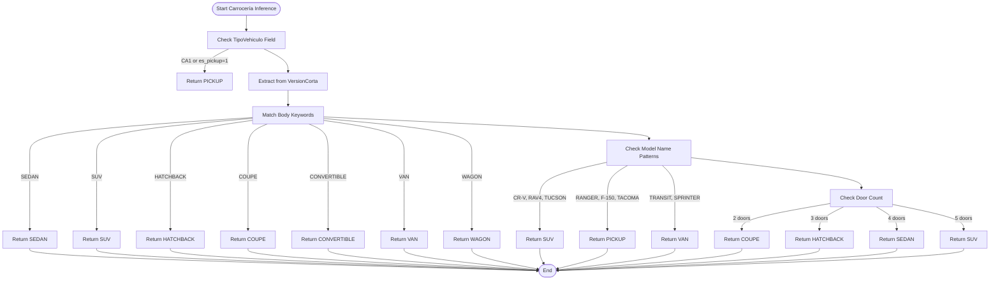
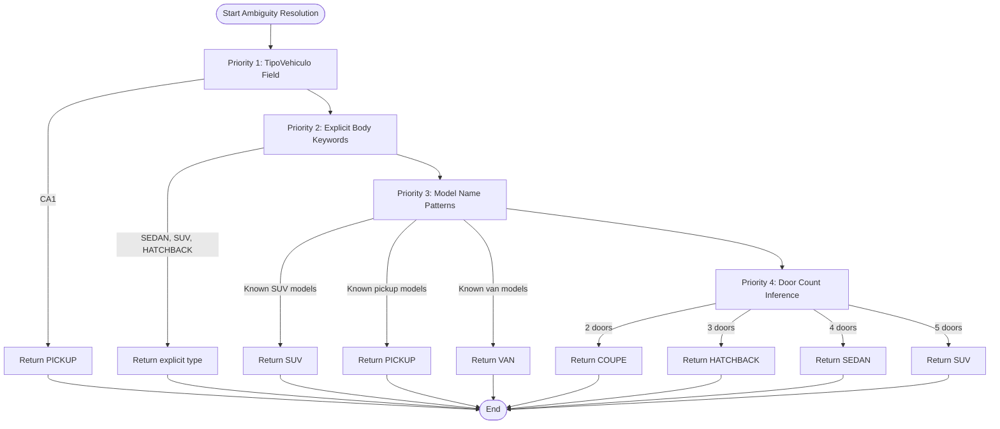

# Technical Specification Parsing

<cite>
**Referenced Files in This Document**   
- [gnp-codigo-de-normalizacion.js](file://src/insurers/gnp/gnp-codigo-de-normalizacion.js)
- [hdi-codigo-de-normalizacion.js](file://src/insurers/hdi/hdi-codigo-de-normalizacion.js)
- [gnp-analisis.md](file://src/insurers/gnp/gnp-analisis.md)
- [hdi-analisis.md](file://src/insurers/hdi/hdi-analisis.md)
</cite>

## Table of Contents
1. [Introduction](#introduction)
2. [Engine Size Extraction](#engine-size-extraction)
3. [Door Count Parsing](#door-count-parsing)
4. [Fuel Type and Transmission Detection](#fuel-type-and-transmission-detection)
5. [Body Type Inference Logic](#body-type-inference-logic)
6. [Ambiguity Resolution and Business Rules](#ambiguity-resolution-and-business-rules)
7. [Best Practices for Parsing Logic](#best-practices-for-parsing-logic)
8. [Conclusion](#conclusion)

## Introduction
This document details the methodology for parsing technical specifications from vehicle model names and description fields across multiple insurance providers. The system extracts and standardizes key attributes including engine size, number of doors, fuel type, and transmission into canonical fields. The analysis focuses on GNP and HDI normalization code, demonstrating how string patterns and regular expressions identify specifications like '2.0 TURBO' or '5 PUERTAS'. The document also covers inference logic for carrocería (body type) based on keywords in model names such as 'HATCHBACK', 'SEDAN', and 'CAMIONETA', addressing ambiguities in overlapping body styles and how business rules resolve them.

## Engine Size Extraction
The system extracts engine displacement (cilindrada) from text fields using regular expressions that match common patterns in both numeric and textual formats. The parsing logic identifies engine sizes in liters (L) or with turbo indicators (T) from unstructured text.

**Diagram sources**
- [gnp-codigo-de-normalizacion.js](file://src/insurers/gnp/gnp-codigo-de-normalizacion.js#L272-L280)
- [hdi-codigo-de-normalizacion.js](file://src/insurers/hdi/hdi-codigo-de-normalizacion.js#L549-L560)

**Section sources**
- [gnp-codigo-de-normalizacion.js](file://src/insurers/gnp/gnp-codigo-de-normalizacion.js#L255-L302)
- [hdi-codigo-de-normalizacion.js](file://src/insurers/hdi/hdi-codigo-de-normalizacion.js#L537-L573)

## Door Count Parsing
The system extracts the number of doors from various textual representations using pattern matching that accounts for multiple formats and abbreviations in both English and Spanish.

**Diagram sources**
- [gnp-codigo-de-normalizacion.js](file://src/insurers/gnp/gnp-codigo-de-normalizacion.js#L294-L300)
- [hdi-codigo-de-normalizacion.js](file://src/insurers/hdi/hdi-codigo-de-normalizacion.js#L585-L591)
- [zurich-codigo-de-normalizacion.js](file://src/insurers/zurich/zurich-codigo-de-normalizacion.js#L347-L351)

**Section sources**
- [gnp-codigo-de-normalizacion.js](file://src/insurers/gnp/gnp-codigo-de-normalizacion.js#L255-L302)
- [hdi-codigo-de-normalizacion.js](file://src/insurers/hdi/hdi-codigo-de-normalizacion.js#L575-L612)

## Fuel Type and Transmission Detection
The system detects transmission type and fuel-related specifications through pattern matching on normalized text, handling both dedicated fields and textual descriptions.

**Diagram sources**
- [gnp-codigo-de-normalizacion.js](file://src/insurers/gnp/gnp-codigo-de-normalizacion.js#L181-L205)
- [hdi-codigo-de-normalizacion.js](file://src/insurers/hdi/hdi-codigo-de-normalizacion.js#L405-L448)

**Section sources**
- [gnp-codigo-de-normalizacion.js](file://src/insurers/gnp/gnp-codigo-de-normalizacion.js#L181-L205)
- [hdi-codigo-de-normalizacion.js](file://src/insurers/hdi/hdi-codigo-de-normalizacion.js#L405-L448)

## Body Type Inference Logic
The system infers vehicle body type (carrocería) through a hierarchical inference process that prioritizes explicit indicators, extracted specifications, model name patterns, and door count.

**Diagram sources**
- [gnp-codigo-de-normalizacion.js](file://src/insurers/gnp/gnp-codigo-de-normalizacion.js#L453-L507)
- [hdi-codigo-de-normalizacion.js](file://src/insurers/hdi/hdi-codigo-de-normalizacion.js#L575-L612)

**Section sources**
- [gnp-codigo-de-normalizacion.js](file://src/insurers/gnp/gnp-codigo-de-normalizacion.js#L453-L507)
- [hdi-codigo-de-normalizacion.js](file://src/insurers/hdi/hdi-codigo-de-normalizacion.js#L575-L612)

## Ambiguity Resolution and Business Rules
The system resolves ambiguities in body type classification through a prioritized business rule hierarchy that addresses overlapping body styles and conflicting indicators.

**Diagram sources**
- [gnp-codigo-de-normalizacion.js](file://src/insurers/gnp/gnp-codigo-de-normalizacion.js#L453-L507)
- [hdi-codigo-de-normalizacion.js](file://src/insurers/hdi/hdi-codigo-de-normalizacion.js#L575-L612)

**Section sources**
- [gnp-analisis.md](file://src/insurers/gnp/gnp-analisis.md#L134-L145)
- [hdi-analisis.md](file://src/insurers/hdi/hdi-analisis.md#L270-L312)

## Best Practices for Parsing Logic
The system implements several best practices for modularizing parsing logic, handling exceptions, and ensuring consistency across different insurer data formats.

```mermaid
flowchart TD
Start([Best Practices]) --> Modularity["Modular Function Design"]
Modularity --> |Separate functions for| NormalizeText["Text Normalization"]
Modularity --> |Separate functions for| ExtractEngine["Engine Extraction"]
Modularity --> |Separate functions for| ExtractDoors["Door Extraction"]
Modularity --> |Separate functions for| InferBody["Body Inference"]
Start --> Validation["Strict Validation"]
Validation --> |Validate ranges for| EngineRange["Engine size (0.5-8.0L)"]
Validation --> |Validate ranges for| DoorRange["Door count (2-5)"]
Validation --> |Validate ranges for| OccupantRange["Occupants (2-23)"]
Start --> ErrorHandling["Error Handling"]
ErrorHandling --> |Return null for| UncertainValues["Uncertain values"]
ErrorHandling --> |Log anomalies for| Contamination["Data contamination"]
ErrorHandling --> |Continue processing| FailedRecords["Failed records"]
Start --> Consistency["Consistency Across Insurers"]
Consistency --> |Standardized output| CanonicalFields["Canonical fields"]
Consistency --> |Common normalization| TextProcessing["Text processing"]
Consistency --> |Shared validation| RangeChecks["Range checks"]
```

**Diagram sources**
- [gnp-codigo-de-normalizacion.js](file://src/insurers/gnp/gnp-codigo-de-normalizacion.js#L31-L45)
- [hdi-codigo-de-normalizacion.js](file://src/insurers/hdi/hdi-codigo-de-normalizacion.js#L31-L45)

**Section sources**
- [gnp-codigo-de-normalizacion.js](file://src/insurers/gnp/gnp-codigo-de-normalizacion.js#L31-L45)
- [hdi-codigo-de-normalizacion.js](file://src/insurers/hdi/hdi-codigo-de-normalizacion.js#L31-L45)

## Conclusion
The technical specification parsing system effectively extracts and standardizes vehicle attributes from unstructured text across multiple insurance providers. By leveraging regular expressions and hierarchical inference logic, the system can accurately parse engine size, door count, transmission type, and body style from diverse data formats. The implementation demonstrates robust handling of data contamination, particularly in GNP data where ~8% of records contain cross-brand contamination. The modular design with separate functions for normalization, extraction, and inference allows for maintainable code that can be adapted to new insurers. Strict validation rules ensure data quality by rejecting values outside reasonable ranges rather than making assumptions. The hierarchical approach to body type inference, prioritizing explicit indicators over derived values, provides a reliable method for resolving ambiguities in vehicle classification.