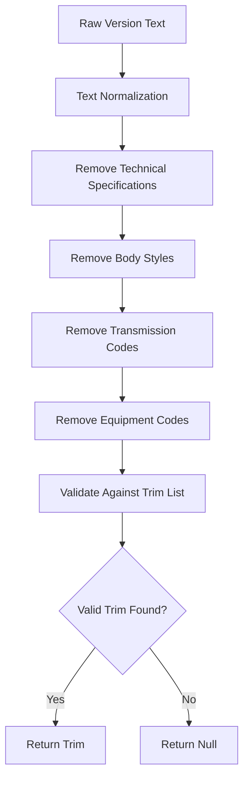
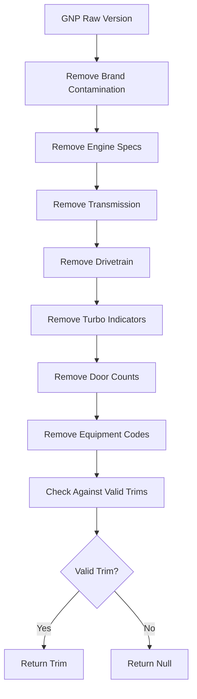
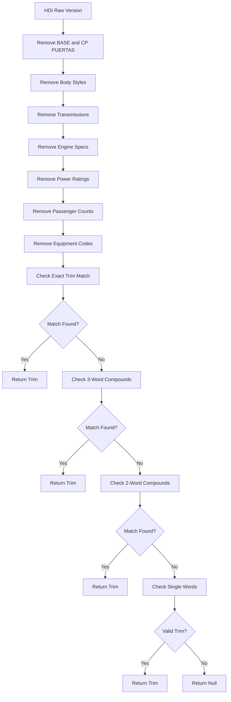

# Trim/Version Extraction

<cite>
**Referenced Files in This Document**   
- [gnp-codigo-de-normalizacion.js](file://src/insurers/gnp/gnp-codigo-de-normalizacion.js)
- [hdi-codigo-de-normalizacion.js](file://src/insurers/hdi/hdi-codigo-de-normalizacion.js)
- [gnp-analisis.md](file://src/insurers/gnp/gnp-analisis.md)
- [hdi-analisis.md](file://src/insurers/hdi/hdi-analisis.md)
</cite>

## Table of Contents
1. [Introduction](#introduction)
2. [Core Extraction Strategies](#core-extraction-strategies)
3. [GNP Normalization Approach](#gnp-normalization-approach)
4. [HDI Normalization Approach](#hdi-normalization-approach)
5. [Common Challenges Across Insurers](#common-challenges-across-insurers)
6. [Regex Pattern Libraries](#regex-pattern-libraries)
7. [Edge Case Handling](#edge-case-handling)
8. [Testing and Validation](#testing-and-validation)
9. [Conclusion](#conclusion)

## Introduction

This document details the methodology for extracting trim and version information from unstructured model names across multiple insurance providers. The primary focus is on analyzing and comparing the normalization strategies used by GNP and HDI, two insurers with significantly different data quality and structure. The extraction process involves parsing free-text model fields (e.g., 'CIVIC SEDAN 2.0 SI MT') using regular expressions and string manipulation techniques to isolate trim levels (e.g., 'SI') and transmission/engine details. The document examines the challenges of inconsistent naming conventions, overlapping trim names, and regional variants, providing strategies for building maintainable regex libraries and handling edge cases such as missing trims or compound descriptors.

**Section sources**
- [gnp-analisis.md](file://src/insurers/gnp/gnp-analisis.md#L1-L280)
- [hdi-analisis.md](file://src/insurers/hdi/hdi-analisis.md#L1-L524)

## Core Extraction Strategies

The extraction of trim and version information follows a systematic approach that combines string cleaning, pattern matching, and validation against known trim lists. The process begins with text normalization, removing accents and special characters to create a consistent base for analysis. This is followed by the elimination of technical specifications such as engine configuration, transmission type, and body style, which are not part of the trim designation. The remaining text is then compared against a curated list of valid trims, with priority given to compound trims (e.g., "SPORT LINE") before single-word trims.

The extraction process is designed to be conservative, returning null when a valid trim cannot be confidently identified rather than making assumptions that could introduce errors. This approach prioritizes data quality over completeness, recognizing that missing trim information is preferable to incorrect trim assignments. The strategy also accounts for insurer-specific patterns, such as HDI's use of comma-separated fields where the trim is consistently positioned before the first comma.

**Diagram sources**
- [gnp-codigo-de-normalizacion.js](file://src/insurers/gnp/gnp-codigo-de-normalizacion.js#L400-L550)
- [hdi-codigo-de-normalizacion.js](file://src/insurers/hdi/hdi-codigo-de-normalizacion.js#L200-L500)

**Section sources**
- [gnp-analisis.md](file://src/insurers/gnp/gnp-analisis.md#L103-L178)
- [hdi-analisis.md](file://src/insurers/hdi/hdi-analisis.md#L66-L101)

## GNP Normalization Approach

GNP presents significant challenges for trim extraction due to poor data quality and structural inconsistencies. The normalization process for GNP must address several critical issues: the absence of an active/vigent field, severe data contamination with other brand names appearing in version fields, and a lack of consistent structure in the VersionCorta field. Only approximately 10% of GNP records have identifiable trims, making this insurer one of the most difficult to normalize.

The GNP normalization strategy begins with aggressive contamination cleaning, removing instances where other brand names (e.g., BMW, Mercedes-Benz, Alfa Romeo) appear in the version field. This is followed by the removal of technical specifications including engine configuration (L4, V6), displacement (2.0T), horsepower (255HP), transmission codes (STD, AUT, CVT), drivetrain (4X4, AWD), turbo indicators, door counts, wheel sizes, and equipment codes (C/A, AC, V.E, Q.C, V.P). After cleaning, the remaining text is checked against a comprehensive list of valid GNP trims, with priority given to compound trims like "SPORT LINE" and "LIMITED PLUS" before simpler trims like "SPORT" or "LIMITED".

A critical aspect of the GNP normalization is the handling of minimal values such as "S/D" (Sin Definir) or single letters ("A", "B", "C"), which are treated as invalid and return null. The process also addresses the issue of models containing names from other brands (e.g., "LINCOLN CONTINENTAL" under Ford) through specific pattern replacements. The normalization is designed to be conservative, accepting that many records will not have a valid trim rather than risking incorrect assignments.

**Diagram sources**
- [gnp-codigo-de-normalizacion.js](file://src/insurers/gnp/gnp-codigo-de-normalizacion.js#L400-L550)
- [gnp-analisis.md](file://src/insurers/gnp/gnp-analisis.md#L103-L178)

**Section sources**
- [gnp-codigo-de-normalizacion.js](file://src/insurers/gnp/gnp-codigo-de-normalizacion.js#L1-L680)
- [gnp-analisis.md](file://src/insurers/gnp/gnp-analisis.md#L1-L280)

## HDI Normalization Approach

HDI presents a significantly cleaner data structure compared to GNP, with a standardized format that facilitates more reliable trim extraction. The HDI normalization approach leverages the consistent comma-separated structure of the ClaveVersion field, where the trim is typically positioned before the first comma. This structural consistency allows for a more straightforward extraction process compared to the pattern-based cleaning required for GNP.

The HDI normalization process begins with aggressive cleaning of problematic patterns, particularly the removal of "BASE" and "CP PUERTAS" variants, which are common contaminants in the version field. This is followed by the systematic removal of body styles (SEDAN, SUV, HATCHBACK), transmissions (AUT, STD, CVT), drivetrain indicators, engine specifications, power ratings, passenger counts, and equipment codes. The cleaning process is optimized with a specific order to eliminate the most problematic patterns first.

After cleaning, the text is validated against a comprehensive set of valid trims, with a hierarchical search strategy that first checks for exact matches, then three-word compounds, two-word compounds, and finally single-word trims. The process includes special handling for AMG trims and reasonable single words that are not technical specifications. HDI's data quality is significantly better than GNP's, with approximately 85% of records having identifiable trims, making it a higher-priority insurer for normalization.

**Diagram sources**
- [hdi-codigo-de-normalizacion.js](file://src/insurers/hdi/hdi-codigo-de-normalizacion.js#L200-L500)
- [hdi-analisis.md](file://src/insurers/hdi/hdi-analisis.md#L66-L101)

**Section sources**
- [hdi-codigo-de-normalizacion.js](file://src/insurers/hdi/hdi-codigo-de-normalizacion.js#L1-L717)
- [hdi-analisis.md](file://src/insurers/hdi/hdi-analisis.md#L1-L524)

## Common Challenges Across Insurers

Despite differences in data quality and structure, several common challenges emerge across insurers when extracting trim and version information. Data contamination is a pervasive issue, with GNP experiencing approximately 8% contamination from other brands appearing in version fields, while other insurers show varying degrees of similar problems. This contamination often results from data entry errors or system integration issues, where information from one vehicle model is incorrectly associated with another.

Inconsistent naming conventions present another significant challenge, with overlapping trim names across different manufacturers and regional variants that may use different terminology for the same trim level. For example, "SPORT" may be used by multiple manufacturers with different meanings, while regional variants might use "SE" in one market and "SE PLUS" in another. This requires careful curation of trim lists that account for manufacturer-specific contexts.

Missing trim information is a widespread problem, with GNP having only about 10% of records with identifiable trims, while even higher-quality sources like Qualitas have only 58% identifiable trims. This necessitates a conservative approach that returns null rather than attempting to infer missing information, as incorrect trim assignments can have significant downstream impacts on vehicle valuation and insurance pricing.

Another challenge is the presence of compound descriptors that combine trim information with technical specifications, requiring sophisticated parsing to separate the trim from engine, transmission, and drivetrain details. Equipment codes and feature abbreviations (e.g., BA for airbags, AC for air conditioning) further complicate the extraction process, as these must be identified and removed without affecting legitimate trim names.

**Section sources**
- [gnp-analisis.md](file://src/insurers/gnp/gnp-analisis.md#L1-L280)
- [hdi-analisis.md](file://src/insurers/hdi/hdi-analisis.md#L1-L524)

## Regex Pattern Libraries

The normalization scripts for GNP and HDI employ comprehensive regex pattern libraries to identify and extract relevant information from unstructured text. These patterns are organized by category and applied in a specific order to ensure consistent results. For engine configuration, patterns match common designations such as L4, V6, V8, and H4 using the pattern `\b([VLIH])(\d+)\b`. Displacement is identified using patterns like `(\d+\.?\d*)[LT]\b` to match values such as 1.5L, 2.0T, or 3.5.

Transmission patterns cover a wide range of indicators, including `MANUAL`, `STD`, `AUT`, `AUTO`, `AUTOMATICA`, `CVT`, `TIPTRONIC`, `XTRONIC`, `MULTITRONIC`, `DSG`, `PDK`, and `DCT`. Drivetrain patterns identify `4X4`, `4X2`, `AWD`, `4WD`, `FWD`, `RWD`, and `QUATTRO`. Turbo indicators are matched with patterns for `TURBO`, `BITURBO`, `TWIN TURBO`, `TSI`, `TDI`, and `TFSI`.

Body style patterns identify `SEDAN`, `COUPE`, `CONVERTIBLE`, `CABRIO`, `HATCHBACK`, `WAGON`, `VAN`, and `SUV`. Door counts are matched with patterns like `\b(\d)[P\s]*(PTAS?|PUERTAS)?\b`. Equipment codes such as `BA`, `AC`, `A/C`, `AA`, `EE`, `E/E`, `CD`, `DVD`, `GPS`, `NAV`, `BT`, `BLUETOOTH`, `VDC`, `ABS`, `EBD`, `ESP`, `TCS`, `VSC`, `DSC`, `DH`, `TA`, `QC`, and `R\d{2}` are specifically targeted for removal.

The pattern libraries are designed to be comprehensive yet precise, avoiding overly broad matches that could inadvertently remove legitimate trim information. They are applied in a specific order, with more specific patterns processed before general ones to prevent conflicts. The libraries are also designed to be maintainable, with patterns grouped by category and clearly documented for future updates.

**Section sources**
- [gnp-codigo-de-normalizacion.js](file://src/insurers/gnp/gnp-codigo-de-normalizacion.js#L1-L680)
- [hdi-codigo-de-normalizacion.js](file://src/insurers/hdi/hdi-codigo-de-normalizacion.js#L1-L717)

## Edge Case Handling

The normalization process includes specific strategies for handling various edge cases that commonly occur in vehicle data. Minimal values such as "S/D" (Sin Definir), empty strings, or single characters ("A", "B", "C") are treated as invalid and return null rather than being interpreted as trims. This prevents the assignment of meaningless trim values that could compromise data quality.

Contaminated data is handled through aggressive cleaning patterns that remove instances of other brand names appearing in version fields. For GNP, this includes patterns to remove `BMW`, `MERCEDES BENZ`, `ALFA ROMEO`, `AUDI`, `TOYOTA`, `HONDA`, `NISSAN`, and other major brands when they appear inappropriately in the version text. The process also removes specific model references like `325iA`, `500CGI`, and `ML 500` that may indicate contamination.

Compound descriptors are handled by prioritizing longer, more specific trim names before shorter ones. For example, "SPORT LINE" is checked before "SPORT" to ensure the more precise designation is captured when present. This hierarchical approach prevents the misidentification of compound trims as their component parts.

The process also handles cases where the entire version field is contaminated and becomes empty after cleaning, logging these instances for further analysis. When a single reasonable word remains after cleaning (2-15 characters, not purely numeric or special characters), it may be accepted as a trim, with special handling for common single-letter trims like "S" when they appear in valid contexts.

**Section sources**
- [gnp-codigo-de-normalizacion.js](file://src/insurers/gnp/gnp-codigo-de-normalizacion.js#L400-L550)
- [hdi-codigo-de-normalizacion.js](file://src/insurers/hdi/hdi-codigo-de-normalizacion.js#L200-L500)

## Testing and Validation

Testing and validation are critical components of the trim extraction process, ensuring the accuracy and reliability of the normalization scripts. The validation strategy includes comprehensive logging of statistics such as the number of contaminated records detected, the percentage of records without identifiable trims, and the overall processing statistics. For GNP, this includes logging the approximately 8% of records with brand contamination and the 90% without identifiable trims.

Sample datasets are used to validate extraction accuracy, with test cases designed to cover the full range of expected patterns and edge cases. These include minimal values, contaminated data, compound descriptors, and various technical specification combinations. The testing process verifies that the normalization scripts correctly identify valid trims while rejecting invalid or contaminated data.

The validation also includes comparison with other insurers to benchmark data quality. For example, GNP's 10% trim identification rate is compared with Qualitas's 58% and HDI's 85%, providing context for the challenges specific to each insurer. This comparative analysis helps prioritize normalization efforts and set realistic expectations for data quality.

The process includes extensive error handling, with try-catch blocks around the processing of each record to prevent a single problematic record from halting the entire normalization process. Errors are logged with the original record ID for traceability and further analysis. The validation also checks for consistency in the generated hash values, ensuring that identical vehicle specifications produce the same canonical identifiers.

**Section sources**
- [gnp-codigo-de-normalizacion.js](file://src/insurers/gnp/gnp-codigo-de-normalizacion.js#L600-L680)
- [hdi-codigo-de-normalizacion.js](file://src/insurers/hdi/hdi-codigo-de-normalizacion.js#L650-L717)

## Conclusion

The extraction of trim and version information from unstructured model names requires a sophisticated approach that combines text normalization, pattern matching, and validation against curated trim lists. The analysis of GNP and HDI demonstrates the significant variation in data quality across insurers, with GNP presenting substantial challenges due to data contamination and inconsistent structure, while HDI benefits from a more standardized format that facilitates reliable extraction.

The normalization strategies for both insurers prioritize data quality over completeness, returning null when a valid trim cannot be confidently identified rather than risking incorrect assignments. This conservative approach is essential for maintaining the integrity of the master vehicle catalog. The use of comprehensive regex pattern libraries allows for the systematic removal of technical specifications, body styles, transmission codes, and equipment indicators, isolating the trim information for accurate extraction.

The challenges of inconsistent naming conventions, overlapping trim names, and regional variants require ongoing maintenance of the trim lists and pattern libraries. Testing and validation are critical to ensure the accuracy of the extraction process, with sample datasets and comparative analysis providing valuable insights into data quality and normalization effectiveness. As the system evolves, machine learning techniques may be considered to detect anomalies and improve the identification of valid trims in contaminated data.

**Section sources**
- [gnp-analisis.md](file://src/insurers/gnp/gnp-analisis.md#L1-L280)
- [hdi-analisis.md](file://src/insurers/hdi/hdi-analisis.md#L1-L524)