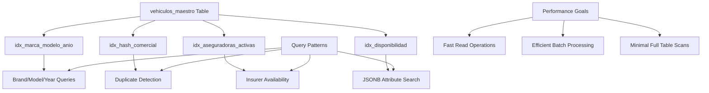
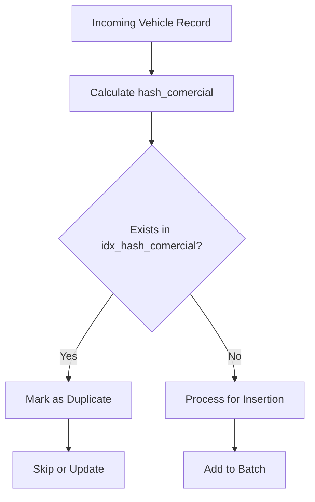
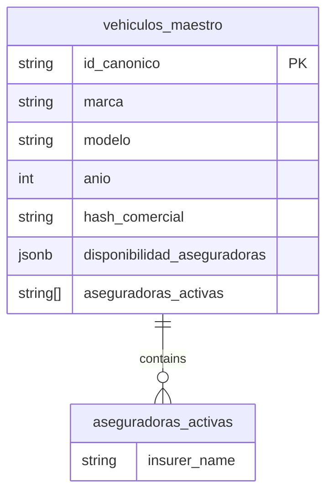
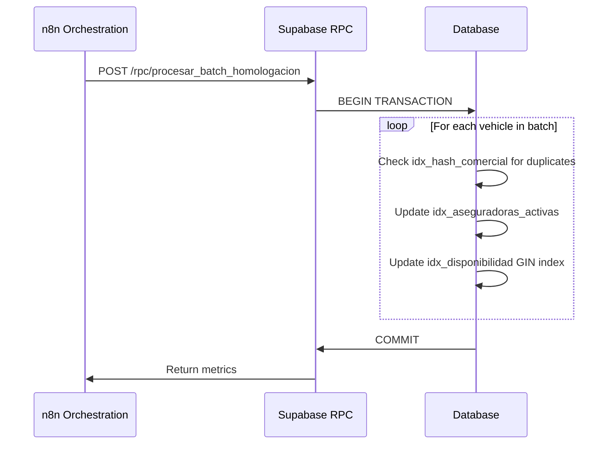

# Indexing & Performance

<cite>
**Referenced Files in This Document**   
- [Tabla maestra.sql](file://src/supabase/Tabla maestra.sql)
- [Replanteamiento homologacion.md](file://src/supabase/Replanteamiento homologacion.md)
</cite>

## Table of Contents
1. [Introduction](#introduction)
2. [Indexing Strategy Overview](#indexing-strategy-overview)
3. [Index-Specific Performance Analysis](#index-specific-performance-analysis)
4. [Query Optimization Guidelines](#query-optimization-guidelines)
5. [Write Performance Trade-offs](#write-performance-trade-offs)
6. [Batch Processing Performance](#batch-processing-performance)
7. [Best Practices](#best-practices)

## Introduction
This document details the database indexing strategy for the `vehiculos_maestro` table, which serves as the canonical vehicle catalog for insurance homologation. The indexing strategy is designed to optimize performance for critical query patterns including brand/model/year lookups, duplicate detection, insurer availability checks, and batch upsert operations. The analysis covers the four primary indexes: composite B-tree index for commercial queries, hash index for deduplication, and two GIN indexes for array and JSONB searches.

## Indexing Strategy Overview
The `vehiculos_maestro` table employs a multi-faceted indexing strategy to support diverse query patterns across the homologation system. The indexing approach balances read performance optimization with write overhead considerations, particularly during batch upsert operations from insurance data sources.



**Diagram sources**
- [Tabla maestra.sql](file://src/supabase/Tabla maestra.sql#L82-L99)

**Section sources**
- [Tabla maestra.sql](file://src/supabase/Tabla maestra.sql#L0-L99)
- [Replanteamiento homologacion.md](file://src/supabase/Replanteamiento homologacion.md#L88-L101)

## Index-Specific Performance Analysis
### idx_marca_modelo_anio for Brand/Model/Year Queries
The composite B-tree index on (marca, modelo, anio) is optimized for the most common lookup pattern in the homologation system. This index enables efficient range scans and equality queries for vehicle identification based on fundamental commercial attributes.

The index structure follows a leftmost prefix principle, allowing it to support queries that specify:
- All three fields (marca, modelo, anio)
- marca and modelo only
- marca only

Queries that skip leading columns in the index (e.g., searching by modelo and anio without marca) cannot utilize this index effectively and may result in full table scans.

**Section sources**
- [Tabla maestra.sql](file://src/supabase/Tabla maestra.sql#L82)

### idx_hash_comercial for Deduplication
The hash index on `hash_comercial` provides O(1) lookup performance for duplicate detection during the homologation process. The `hash_comercial` field is calculated as a SHA-256 hash of the normalized concatenation of marca, modelo, anio, and transmision, ensuring consistent identification of equivalent vehicle configurations across different insurance providers.

This index is critical for the deduplication phase in the n8n orchestration workflow, where incoming vehicle records are checked against existing entries before batch insertion. The hash index enables rapid existence checks, preventing duplicate entries while maintaining data integrity.



**Diagram sources**
- [Tabla maestra.sql](file://src/supabase/Tabla maestra.sql#L83)
- [Replanteamiento homologacion.md](file://src/supabase/Replanteamiento homologacion.md#L99)

**Section sources**
- [Tabla maestra.sql](file://src/supabase/Tabla maestra.sql#L83)
- [Replanteamiento homologacion.md](file://src/supabase/Replanteamiento homologacion.md#L99)

### idx_aseguradoras_activas GIN Index for Array Searches
The GIN (Generalized Inverted Index) on the `aseguradoras_activas` array column is optimized for fast membership queries, enabling efficient identification of vehicles available through specific insurers. The `aseguradoras_activas` column is a generated stored array that contains the keys of all active insurers from the `disponibilidad_aseguradoras` JSONB field.

This index supports queries such as "find all vehicles available from HDI" with high performance, even as the dataset grows to hundreds of thousands of records. The GIN index structure is particularly efficient for array containment operations, making it ideal for the insurance availability use case.



**Diagram sources**
- [Tabla maestra.sql](file://src/supabase/Tabla maestra.sql#L84)

**Section sources**
- [Tabla maestra.sql](file://src/supabase/Tabla maestra.sql#L84)

### idx_disponibilidad GIN Index for JSONB Querying
The GIN index on `disponibilidad_aseguradoras` enables efficient querying of JSONB attributes within the insurance availability data. This index supports various JSONB operators, including containment (@>), existence (?), and path extraction, allowing complex queries on insurer-specific vehicle data.

The index is particularly valuable for queries that need to:
- Find vehicles with specific insurer attributes
- Check availability status across multiple insurers
- Search for vehicles with particular original version strings
- Filter by update timestamps within the JSONB structure

This index complements the `idx_aseguradoras_activas` by providing deeper access to the structured data within the JSONB field, supporting more complex analytical queries while maintaining performance.

**Section sources**
- [Tabla maestra.sql](file://src/supabase/Tabla maestra.sql#L85)

## Query Optimization Guidelines
To maximize performance and leverage the existing indexing strategy, queries should be formulated according to the following guidelines:

### Best Practices for Index Utilization
1. **Always include leading index columns**: When querying by marca, modelo, and anio, ensure the query conditions follow the index column order to enable index usage.

2. **Use array operators for insurer checks**: Utilize the `= ANY()` operator or `@>` containment operator with the `aseguradoras_activas` array for optimal performance.

3. **Leverage hash comparisons**: For duplicate detection, compare `hash_comercial` values directly rather than reconstructing the hash from component fields.

4. **Avoid functions on indexed columns**: Do not apply functions or expressions to indexed columns in WHERE clauses, as this prevents index usage.

### Example Query Patterns
```sql
-- ✅ Efficient: Uses idx_marca_modelo_anio (leading columns)
SELECT * FROM vehiculos_maestro 
WHERE marca = 'TOYOTA' AND modelo = 'YARIS' AND anio = 2020;

-- ✅ Efficient: Uses idx_hash_comercial
SELECT * FROM vehiculos_maestro 
WHERE hash_comercial = '7cc9374cee0e1c1bc8638521b2690cb010dae9729134790042f19c05346f8d45';

-- ✅ Efficient: Uses idx_aseguradoras_activas GIN index
SELECT * FROM vehiculos_maestro 
WHERE 'HDI' = ANY(aseguradoras_activas);

-- ✅ Efficient: Uses idx_disponibilidad GIN index
SELECT * FROM vehiculos_maestro 
WHERE disponibilidad_aseguradoras ? 'QUALITAS';

-- ❌ Inefficient: Skips leading index column
SELECT * FROM vehiculos_maestro 
WHERE modelo = 'YARIS' AND anio = 2020;
```

**Section sources**
- [Tabla maestra.sql](file://src/supabase/Tabla maestra.sql#L82-L85)
- [Replanteamiento homologacion.md](file://src/supabase/Replanteamiento homologacion.md#L99)

## Write Performance Trade-offs
The indexing strategy involves important trade-offs between read performance and write overhead, particularly during upsert operations in the batch processing workflow.

### Write Overhead Analysis
Each index adds overhead to INSERT and UPDATE operations, as the database must maintain the index structure in addition to the table data. The impact is particularly noticeable during large batch operations from the n8n orchestration system.

The current indexing strategy balances these concerns by:
- Using hash indexes for O(1) lookup performance with moderate write overhead
- Employing GIN indexes for complex data types with acceptable performance characteristics
- Avoiding over-indexing by focusing on the most critical query patterns

### Batch Processing Considerations
The system processes batches of 10,000-50,000 records from insurance sources, making write performance a critical factor. The upsert operations (INSERT ... ON CONFLICT) must update both table data and all indexes, creating a performance bottleneck if not properly managed.

To mitigate this:
- Batches are limited to 10,000-50,000 records to prevent transaction timeouts
- The id_canonico primary key enables efficient conflict detection
- Index maintenance is optimized through PostgreSQL's write-ahead logging and background writer processes



**Diagram sources**
- [Replanteamiento homologacion.md](file://src/supabase/Replanteamiento homologacion.md#L106)
- [Tabla maestra.sql](file://src/supabase/Tabla maestra.sql#L82-L85)

**Section sources**
- [Replanteamiento homologacion.md](file://src/supabase/Replanteamiento homologacion.md#L106)
- [Tabla maestra.sql](file://src/supabase/Tabla maestra.sql#L82-L85)

## Batch Processing Performance
The indexing strategy directly impacts the performance of batch processing operations, which are central to the homologation workflow. The current implementation balances the need for fast duplicate detection with acceptable write throughput.

### Performance Metrics
Based on the system design documented in Replanteamiento homologacion.md, key performance considerations include:

- **Duplicate detection**: The idx_hash_comercial index enables O(1) duplicate checks, critical for the deduplication phase in n8n
- **Upsert efficiency**: The id_canonico primary key allows efficient conflict resolution during batch inserts
- **Index maintenance**: All indexes are updated during upsert operations, creating cumulative write overhead

### Optimization Opportunities
Potential improvements to the current indexing strategy include:
- **Partial indexes**: Creating partial indexes on active records only, since inactive vehicles are rarely queried
- **Index-only scans**: Ensuring frequently accessed columns are included in indexes to enable index-only scans
- **Batch size tuning**: Adjusting batch sizes based on observed performance to balance transaction duration and memory usage

The system's idempotent design ensures that reprocessing batches does not create additional overhead, providing resilience against processing failures.

**Section sources**
- [Replanteamiento homologacion.md](file://src/supabase/Replanteamiento homologacion.md#L106)
- [Tabla maestra.sql](file://src/supabase/Tabla maestra.sql#L82-L85)

## Best Practices
### Query Formulation
1. **Always use parameterized queries** to prevent SQL injection and enable query plan caching
2. **Include leading index columns** in WHERE clauses to ensure index usage
3. **Use EXPLAIN ANALYZE** to verify query plans and index usage for critical operations
4. **Avoid SELECT *** in production queries; specify only needed columns to reduce I/O

### Index Maintenance
1. **Monitor index bloat** regularly using pg_stat_user_indexes and pgstattuple
2. **Consider REINDEX operations** during maintenance windows if index bloat exceeds 20%
3. **Update table statistics** after large batch operations using ANALYZE
4. **Review query patterns** periodically to ensure indexes align with actual usage

### Performance Monitoring
Implement monitoring for:
- Query execution times, particularly for batch operations
- Index usage statistics to identify unused indexes
- Table and index size growth rates
- Lock contention during batch processing

These practices ensure the indexing strategy continues to meet performance requirements as data volumes grow and query patterns evolve.

**Section sources**
- [Tabla maestra.sql](file://src/supabase/Tabla maestra.sql#L82-L85)
- [Replanteamiento homologacion.md](file://src/supabase/Replanteamiento homologacion.md#L88-L101)