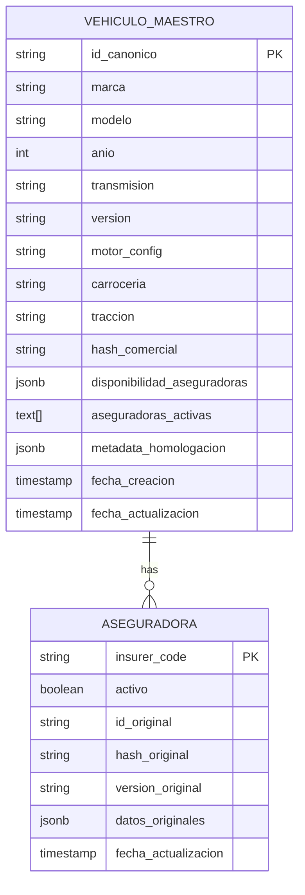
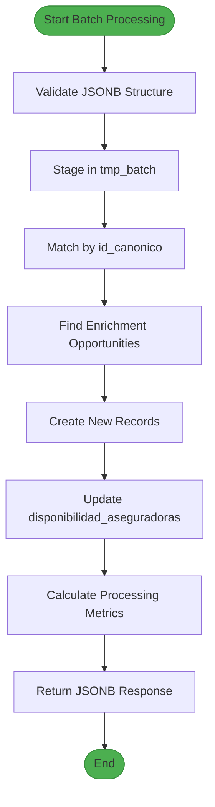
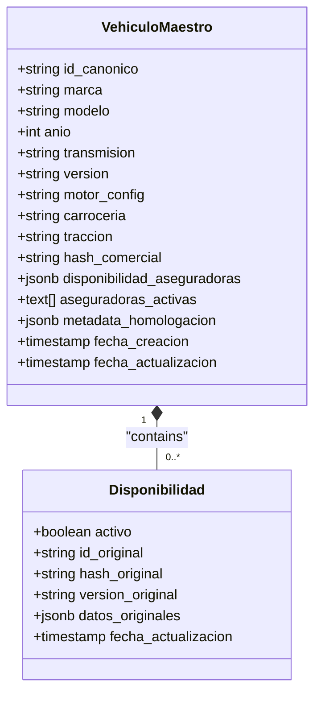

# JSONB Availability Model

<cite>
**Referenced Files in This Document**   
- [Tabla maestra.sql](file://src/supabase/Tabla maestra.sql)
- [Funcion RPC Nueva.sql](file://src/supabase/Funcion RPC Nueva.sql)
- [casos de prueba función rpc.sql](file://src/supabase/casos de prueba función rpc.sql)
- [Replanteamiento homologacion.md](file://src/supabase/Replanteamiento homologacion.md)
- [hdi-analisis.md](file://src/insurers/hdi/hdi-analisis.md)
- [qualitas-analisis.md](file://src/insurers/qualitas/qualitas-analisis.md)
</cite>

## Table of Contents
1. [Introduction](#introduction)
2. [Core Structure of disponibilidad_aseguradoras](#core-structure-of-disponibilidad_aseguradoras)
3. [Field Semantics and Data Provenance](#field-semantics-and-data-provenance)
4. [RPC Processing Logic](#rpc-processing-logic)
5. [Practical Examples from Tabla maestra.sql](#practical-examples-from-tabla-maestra.sql)
6. [Status Management and Auditability](#status-management-and-auditability)
7. [Conflict Detection and Resolution](#conflict-detection-and-resolution)
8. [Common Issues and Normalization Strategies](#common-issues-and-normalization-strategies)
9. [Conclusion](#conclusion)

## Introduction
The `disponibilidad_aseguradoras` JSONB field is a critical component in the vehicle homologation system, designed to track insurer-specific availability status and preserve data provenance across multiple sources. This document provides a comprehensive analysis of its structure, semantics, and operational behavior within the Supabase database environment. The model enables granular tracking of per-insurer vehicle availability, supports historical auditing, and facilitates conflict resolution during data merging operations. By leveraging JSONB's flexibility, the system maintains rich metadata while enabling efficient querying through generated columns and GIN indexes. The design supports an idempotent, batch-oriented ingestion pipeline orchestrated via n8n and processed through a robust RPC function that ensures data integrity and traceability.

**Section sources**
- [Replanteamiento homologacion.md](file://src/supabase/Replanteamiento homologacion.md#L1-L20)
- [Tabla maestra.sql](file://src/supabase/Tabla maestra.sql#L1-L20)

## Core Structure of disponibilidad_aseguradoras
The `disponibilidad_aseguradoras` field uses a hierarchical JSONB structure where each top-level key represents an insurer identifier (e.g., "HDI", "QUALITAS"). Each insurer entry contains a standardized set of metadata fields that capture both current status and original source information. The structure is designed to be extensible while maintaining consistency across different data providers. At the root level, the JSONB object maps insurer codes to their respective availability records, enabling O(1) lookups by insurer name. Each nested record contains status flags, original identifiers, version strings, and technical specifications extracted from the source system. This design allows the system to maintain a complete history of availability changes without requiring additional audit tables or temporal databases.

**Diagram sources**
- [Tabla maestra.sql](file://src/supabase/Tabla maestra.sql#L30-L80)

## Field Semantics and Data Provenance
Each field within the `disponibilidad_aseguradoras` structure serves a specific purpose in maintaining data integrity and provenance. The `activo` boolean flag indicates whether the insurer currently offers coverage for the vehicle, enabling dynamic activation/deactivation without data deletion. The `id_original` field preserves the source system's unique identifier, allowing reverse lookups and reconciliation with upstream systems. The `hash_original` provides a cryptographic fingerprint of the original record, facilitating change detection and deduplication. The `version_original` stores the raw version string as it appears in the insurer's catalog, preserving formatting and terminology specific to that provider. The `datos_originales` object contains normalized technical specifications extracted from the source, including motor configuration, displacement, body type, door count, and occupancy. This nested structure enables the system to track schema evolution over time and support backward compatibility during normalization process updates.

**Section sources**
- [Tabla maestra.sql](file://src/supabase/Tabla maestra.sql#L40-L75)
- [Replanteamiento homologacion.md](file://src/supabase/Replanteamiento homologacion.md#L40-L60)

## RPC Processing Logic
The `procesar_batch_homologacion` RPC function implements a sophisticated merge strategy that preserves existing insurer records while incorporating new availability data. When processing a batch, the function first validates input structure and normalizes data types before staging records in a temporary table. It then performs a three-phase matching process: exact matches by `id_canonico`, enrichment opportunities based on compatible specifications, and new record creation for unmatched entries. For existing records, the function merges new insurer data using JSONB concatenation (`||`), which automatically handles key conflicts by overwriting values while preserving other insurer entries. The merge operation updates the `activo` status, `id_original`, `version_original`, and `fecha_actualizacion` fields while maintaining historical values through the immutable nature of the JSONB structure. The function also implements idempotency checks to prevent duplicate processing and includes comprehensive error handling for constraint violations and data type mismatches.

**Diagram sources**
- [Funcion RPC Nueva.sql](file://src/supabase/Funcion RPC Nueva.sql#L1-L50)
- [casos de prueba función rpc.sql](file://src/supabase/casos de prueba función rpc.sql#L1-L20)

## Practical Examples from Tabla maestra.sql
The `Tabla maestra.sql` file provides concrete examples of the `disponibilidad_aseguradoras` structure with HDI and QUALITAS entries. For HDI, the example shows a YARIS CORE L4 5.0 SUV with `activo: true`, `id_original: "HDI_3787"`, and technical specifications including motor configuration (L4), displacement (5.0), and body type (SUV). The QUALITAS entry for the same vehicle model shows different specifications: `motor_config: null`, `cilindrada: "1.5"`, `carroceria: "SEDAN"`, with 4 doors and 5 occupants. These examples demonstrate how the same canonical vehicle can have different representations across insurers, with the system preserving both views simultaneously. The examples also show identical `fecha_actualizacion` timestamps, indicating synchronized updates across providers. The presence of null values in certain fields reflects incomplete data from source systems, which the system handles gracefully through optional field semantics.

**Section sources**
- [Tabla maestra.sql](file://src/supabase/Tabla maestra.sql#L50-L75)

## Status Management and Auditability
The model supports comprehensive active/inactive status management through the `activo` boolean flag and the generated `aseguradoras_activas` array column. When an insurer marks a vehicle as inactive, the system retains the complete record while setting `activo: false`, preserving historical data for audit purposes. The `aseguradoras_activas` column uses a generated expression to extract all insurer keys where `activo` is true, providing a denormalized array for efficient querying. This design enables fast filtering of currently available vehicles without requiring JSONB path queries. The `fecha_actualizacion` field captures the timestamp of the last status change, supporting time-based analysis of availability patterns. The system also maintains a `metadata_homologacion` field that records the homologation method, confidence score, and enrichment sources, providing additional context for data quality assessment and troubleshooting.

**Diagram sources**
- [Tabla maestra.sql](file://src/supabase/Tabla maestra.sql#L70-L90)

## Conflict Detection and Resolution
The system implements robust conflict detection through its matching algorithm and provides clear resolution strategies. When processing new data, the RPC function identifies potential conflicts by comparing technical specifications across insurers. If conflicting values are detected (e.g., different transmission types or body styles), the system creates separate canonical records rather than forcing a merge. The function also detects multiple potential matches and flags them as warnings, preventing ambiguous resolutions. During the enrichment phase, the system only updates null fields in the canonical record, avoiding overwrites of existing data. The `confianza_score` field is incremented when successful enrichment occurs, providing a quantitative measure of data completeness. The system's design prioritizes data preservation over automatic conflict resolution, ensuring that discrepancies between insurers are visible rather than hidden.

**Section sources**
- [Funcion RPC Nueva.sql](file://src/supabase/Funcion RPC Nueva.sql#L200-L250)
- [casos de prueba función rpc.sql](file://src/supabase/casos de prueba función rpc.sql#L100-L150)

## Common Issues and Normalization Strategies
Schema drift in nested objects is addressed through flexible JSONB handling and defensive programming in the normalization code. The system expects variation in field presence and handles missing values gracefully using `NULLIF` and `COALESCE` functions. Normalization strategies differ by insurer, with HDI using comma-separated values that can be parsed positionally, while Qualitas requires pattern matching due to unstructured text. The system implements insurer-specific parsing rules while maintaining a consistent output schema. For missing fields during normalization, the system preserves null values rather than inferring defaults, maintaining data fidelity. The `datos_originales` field serves as a safety net, storing raw extracted values even when they don't map cleanly to canonical fields. Regular validation checks ensure that critical fields like `marca`, `modelo`, and `anio` are always present, while technical specifications are treated as optional enhancements.

**Section sources**
- [hdi-analisis.md](file://src/insurers/hdi/hdi-analisis.md#L1-L50)
- [qualitas-analisis.md](file://src/insurers/qualitas/qualitas-analisis.md#L1-L50)

## Conclusion
The `disponibilidad_aseguradoras` JSONB model represents a sophisticated solution for managing multi-source vehicle availability data with full provenance tracking. Its design balances flexibility with structure, enabling the system to accommodate diverse insurer formats while maintaining a consistent canonical representation. The integration of generated columns, GIN indexing, and a robust RPC processing function creates a scalable architecture capable of handling large volumes of heterogeneous data. The model's emphasis on data preservation, conflict transparency, and auditability makes it well-suited for regulated environments where data integrity is paramount. Future enhancements could include versioned JSONB storage for complete change tracking and enhanced conflict visualization tools to support manual resolution of complex discrepancies.