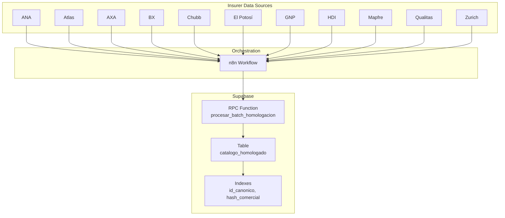
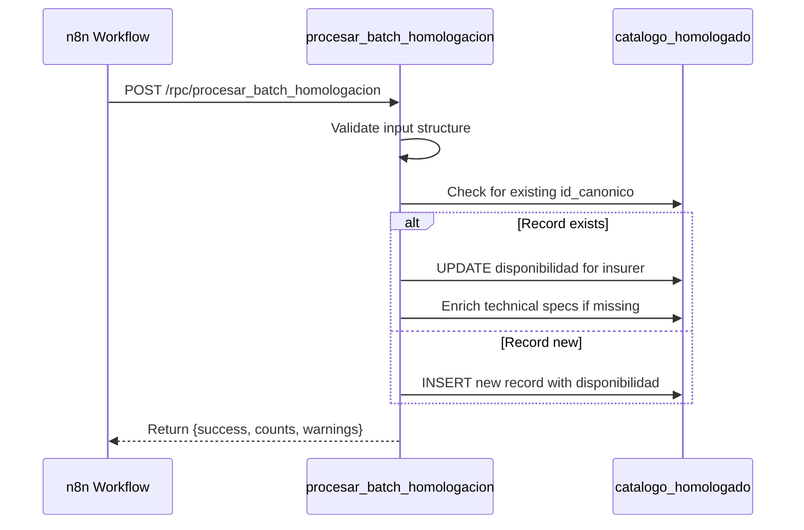

# Deployment Process

<cite>
**Referenced Files in This Document**   
- [Replanteamiento homologacion.md](file://src/supabase/Replanteamiento%20homologacion.md)
- [Tabla maestra.sql](file://src/supabase/Tabla%20maestra.sql)
- [Funcion RPC Nueva.sql](file://src/supabase/Funcion%20RPC%20Nueva.sql)
- [Funcion RPC.sql](file://src/supabase/Funcion%20RPC.sql)
- [ana-analisis.md](file://src/insurers/ana/ana-analisis.md)
- [atlas-analisis.md](file://src/insurers/atlas/atlas-analisis.md)
- [axa-analisis.md](file://src/insurers/axa/axa-analisis.md)
- [bx-analisis.md](file://src/insurers/bx/bx-analisis.md)
- [chubb-analisis.md](file://src/insurers/chubb/chubb-analisis.md)
- [elpotosi-analisis.md](file://src/insurers/elpotosi/elpotosi-analisis.md)
- [gnp-analisis.md](file://src/insurers/gnp/gnp-analisis.md)
- [hdi-analisis.md](file://src/insurers/hdi/hdi-analisis.md)
- [mapfre-analisis.md](file://src/insurers/mapfre/mapfre-analisis.md)
- [qualitas-analisis.md](file://src/insurers/qualitas/qualitas-analisis.md)
- [zurich-analisis.md](file://src/insurers/zurich/zurich-analisis.md)
- [ana-query-de-extraccion.sql](file://src/insurers/ana/ana-query-de-extraccion.sql)
- [atlas-query-de-extraccion.sql](file://src/insurers/atlas/atlas-query-de-extraccion.sql)
- [axa-query-de-extraccion.sql](file://src/insurers/axa/axa-query-de-extraccion.sql)
- [bx-query-de-extraccion.sql](file://src/insurers/bx/bx-query-de-extraccion.sql)
- [chubb-query-de-extraccion.sql](file://src/insurers/chubb/chubb-query-de-extraccion.sql)
- [elpotosi-query-de-extraccion.sql](file://src/insurers/elpotosi/elpotosi-query-de-extraccion.sql)
- [gnp-query-de-extraccion.sql](file://src/insurers/gnp/gnp-query-de-extraccion.sql)
- [hdi-query-de-extraccion.sql](file://src/insurers/hdi/hdi-query-de-extraccion.sql)
- [mapfre-query-de-extraccion.sql](file://src/insurers/mapfre/mapfre-query-de-extraccion.sql)
- [qualitas-query-de-extracción.sql](file://src/insurers/qualitas/qualitas-query-de-extracción.sql)
- [zurich-query-de-extraccion.sql](file://src/insurers/zurich/zurich-query-de-extraccion.sql)
</cite>

## Table of Contents
1. [Introduction](#introduction)
2. [Core Components Overview](#core-components-overview)
3. [Versioning and Backward Compatibility Strategy](#versioning-and-backward-compatibility-strategy)
4. [Database Schema Changes Deployment](#database-schema-changes-deployment)
5. [Business Logic Updates in Replanteamiento homologacion.md](#business-logic-updates-in-replanteamiento-homologacionmd)
6. [Migration Planning and Impact Assessment](#migration-planning-and-impact-assessment)
7. [Rollback Strategies](#rollback-strategies)
8. [Coordination with n8n Workflows and Insurer Schedules](#coordination-with-n8n-workflows-and-insurer-schedules)
9. [Database Security and Permissions Management](#database-security-and-permissions-management)
10. [Pre-Deployment Validation Checklist](#pre-deployment-validation-checklist)
11. [Post-Deployment Monitoring Procedures](#post-deployment-monitoring-procedures)
12. [Conclusion](#conclusion)

## Introduction

This document outlines the comprehensive deployment process for updates to the homologation system, focusing on the safe and coordinated rollout of changes to the Supabase RPC function `procesar_batch_homologacion`, database schema modifications, and business logic updates. The deployment strategy ensures backward compatibility, minimizes disruption to active processing pipelines, and maintains data integrity across insurer integrations. The process includes versioning strategies, rollback plans, and coordination with external systems such as n8n workflows and insurer data extraction schedules.

**Section sources**
- [Replanteamiento homologacion.md](file://src/supabase/Replanteamiento%20homologacion.md#L1-L20)

## Core Components Overview

The homologation system consists of three main components: Supabase as the persistence and API layer, n8n for orchestration and normalization, and insurer-specific data sources. The core Supabase components include the `catalogo_homologado` table (canonical vehicle catalog), the `procesar_batch_homologacion` RPC function for batch processing, and supporting SQL scripts for schema and validation. The n8n workflows extract data from insurer databases, normalize it into a canonical format, and send it to Supabase via the RPC endpoint.

**Diagram sources**
- [Replanteamiento homologacion.md](file://src/supabase/Replanteamiento%20homologacion.md#L1-L279)
- [Tabla maestra.sql](file://src/supabase/Tabla%20maestra.sql#L1-L99)
- [Funcion RPC Nueva.sql](file://src/supabase/Funcion%20RPC%20Nueva.sql#L1-L428)

**Section sources**
- [Replanteamiento homologacion.md](file://src/supabase/Replanteamiento%20homologacion.md#L1-L279)
- [Tabla maestra.sql](file://src/supabase/Tabla%20maestra.sql#L1-L99)
- [Funcion RPC Nueva.sql](file://src/supabase/Funcion%20RPC%20Nueva.sql#L1-L428)

## Versioning and Backward Compatibility Strategy

The `procesar_batch_homologacion` RPC function is designed with backward compatibility in mind. The function signature accepts a JSONB parameter `p_vehiculos_json` containing an array of vehicle objects, each with standardized fields such as `id_canonico`, `hash_comercial`, and `origen_aseguradora`. The function supports both direct array input and wrapped input with a `vehiculos_json` key, ensuring compatibility with existing and future n8n workflows.

Versioning is managed through function name suffixes and controlled deployment windows. When introducing breaking changes, a new function (e.g., `procesar_batch_homologacion_v2`) is created alongside the existing one. The n8n workflows are updated to use the new function only after thorough testing and validation. The old function remains available for a minimum of 30 days to allow for rollback if needed.

The function's idempotent design ensures that reprocessing the same batch does not create duplicate records or alter existing data beyond the intended update. This property is critical for maintaining consistency during deployment and recovery scenarios.

**Diagram sources**
- [Funcion RPC Nueva.sql](file://src/supabase/Funcion%20RPC%20Nueva.sql#L1-L428)
- [Replanteamiento homologacion.md](file://src/supabase/Replanteamiento%20homologacion.md#L1-L279)

**Section sources**
- [Funcion RPC Nueva.sql](file://src/supabase/Funcion%20RPC%20Nueva.sql#L1-L428)
- [Replanteamiento homologacion.md](file://src/supabase/Replanteamiento%20homologacion.md#L1-L279)

## Database Schema Changes Deployment

Schema changes to the `catalogo_homologado` table are deployed using a controlled migration process. The `Tabla maestra.sql` script defines the current schema, including the primary key `id_canonico`, indexes on `hash_comercial` and `aseguradoras_activas`, and a trigger to automatically update `fecha_actualizacion` on modifications.

Before deploying schema changes:
1. A backup of the current table structure and data is taken.
2. Changes are tested in a staging environment with a representative dataset.
3. Index creation is performed during low-traffic periods to minimize performance impact.

The deployment process uses `CREATE OR REPLACE` for functions and `ALTER TABLE` for structural changes. When adding new columns, they are initially created as nullable to maintain backward compatibility. Default values and constraints are added in a subsequent step after data population.

The `aseguradoras_activas` column is a generated stored array that provides fast lookup of active insurers for each vehicle. This column is automatically maintained by the database and should not be modified directly.

**Section sources**
- [Tabla maestra.sql](file://src/supabase/Tabla%20maestra.sql#L1-L99)
- [Replanteamiento homologacion.md](file://src/supabase/Replanteamiento%20homologacion.md#L1-L279)

## Business Logic Updates in Replanteamiento homologacion.md

The `Replanteamiento homologacion.md` document serves as the authoritative source for business logic governing the homologation process. Updates to this document must be synchronized with code changes to ensure consistency. Key business rules include:

- **Active/Inactive Status**: A vehicle is considered active per insurer based on the `activo` flag in the `disponibilidad` JSONB field. Global availability is derived when at least one insurer reports the vehicle as active.
- **Identifier Generation**: `hash_comercial` is derived from normalized `(marca|modelo|anio|transmision)`, while `id_canonico` includes additional technical specifications.
- **Data Enrichment**: The RPC function can enrich existing records with missing technical specifications (motor_config, carroceria, traccion) from new submissions, but will not overwrite existing values.

When updating business logic in the document, corresponding changes to the RPC function and n8n workflows must be planned and executed together. The document must be version-controlled and changes must be reviewed by stakeholders from data engineering, QA, and business teams.

**Section sources**
- [Replanteamiento homologacion.md](file://src/supabase/Replanteamiento%20homologacion.md#L1-L279)

## Migration Planning and Impact Assessment

Migration planning involves assessing the impact of changes on active processing pipelines. The homologation system processes data from 11 insurers, each with their own extraction schedules and data characteristics. Before deployment:

1. **Pipeline Impact Analysis**: Review the current processing queue and scheduled extractions. Avoid deploying during peak processing windows.
2. **Data Volume Estimation**: Estimate the number of records affected by the changes based on recent batch sizes.
3. **Performance Testing**: Test the updated RPC function with representative batch sizes (10k–50k records) to ensure acceptable processing times.
4. **Error Handling Review**: Verify that the function's error and warning mechanisms are adequate for the new logic.

The migration is performed in phases:
- Phase 1: Deploy to staging and run validation tests
- Phase 2: Deploy to production with monitoring enabled
- Phase 3: Gradually redirect n8n workflows to the new function
- Phase 4: Monitor for 72 hours before decommissioning old components

**Section sources**
- [Replanteamiento homologacion.md](file://src/supabase/Replanteamiento%20homologacion.md#L1-L279)
- [Funcion RPC Nueva.sql](file://src/supabase/Funcion%20RPC%20Nueva.sql#L1-L428)

## Rollback Strategies

Rollback procedures are designed to restore system functionality within 15 minutes of detecting a critical issue. The strategy depends on the type of change:

- **RPC Function Issues**: Revert to the previous version using `CREATE OR REPLACE FUNCTION` with the prior implementation. The old function code is maintained in version control.
- **Schema Changes**: If structural changes cause issues, the table can be restored from backup or reverted using `ALTER TABLE` commands. Indexes can be dropped without data loss.
- **Business Logic Errors**: If incorrect logic is deployed, the `Replanteamiento homologacion.md` document is updated and a corrected RPC function is deployed immediately.

All rollback operations are logged, and stakeholders are notified. After rollback, a root cause analysis is conducted before attempting redeployment.

**Section sources**
- [Funcion RPC Nueva.sql](file://src/supabase/Funcion%20RPC%20Nueva.sql#L1-L428)
- [Tabla maestra.sql](file://src/supabase/Tabla%20maestra.sql#L1-L99)

## Coordination with n8n Workflows and Insurer Schedules

Deployment coordination with n8n workflows requires careful timing to avoid data loss or duplication. The process involves:

1. **Schedule Alignment**: Review insurer data extraction schedules documented in the `*-query-de-extraccion.sql` files. Deployments are scheduled during maintenance windows when no extractions are running.
2. **Workflow Pausing**: Temporarily pause n8n workflows before deployment and resume after validation.
3. **Sequential Updates**: Update one insurer's workflow at a time, monitoring for issues before proceeding.
4. **Idempotency Verification**: Confirm that the RPC function's idempotent behavior prevents issues from reprocessing paused batches.

The `Prefer: return=minimal` header is used in n8n HTTP requests to reduce response size and improve performance during high-volume processing.

**Section sources**
- [Replanteamiento homologacion.md](file://src/supabase/Replanteamiento%20homologacion.md#L1-L279)
- [ana-query-de-extraccion.sql](file://src/insurers/ana/ana-query-de-extraccion.sql)
- [atlas-query-de-extraccion.sql](file://src/insurers/atlas/atlas-query-de-extraccion.sql)
- [axa-query-de-extraccion.sql](file://src/insurers/axa/axa-query-de-extraccion.sql)
- [bx-query-de-extraccion.sql](file://src/insurers/bx/bx-query-de-extraccion.sql)
- [chubb-query-de-extraccion.sql](file://src/insurers/chubb/chubb-query-de-extraccion.sql)
- [elpotosi-query-de-extraccion.sql](file://src/insurers/elpotosi/elpotosi-query-de-extraccion.sql)
- [gnp-query-de-extraccion.sql](file://src/insurers/gnp/gnp-query-de-extraccion.sql)
- [hdi-query-de-extraccion.sql](file://src/insurers/hdi/hdi-query-de-extraccion.sql)
- [mapfre-query-de-extraccion.sql](file://src/insurers/mapfre/mapfre-query-de-extraccion.sql)
- [qualitas-query-de-extracción.sql](file://src/insurers/qualitas/qualitas-query-de-extracción.sql)
- [zurich-query-de-extraccion.sql](file://src/insurers/zurich/zurich-query-de-extraccion.sql)

## Database Security and Permissions Management

Database security is maintained through Supabase's Row Level Security (RLS) policies and role-based access control. The `procesar_batch_homologacion` function runs with `SECURITY DEFINER` privileges, allowing it to perform operations that the calling role may not have direct access to.

Key security practices:
- The function is accessible only to the `service_role` JWT, which is used by n8n workflows.
- Direct table modifications are restricted; all writes must go through the RPC function.
- The `disponibilidad` JSONB field is updated using the `||` operator to merge new insurer data without affecting existing entries.
- Function ownership is assigned to the `supabase_admin` role to prevent unauthorized modifications.

Regular security audits verify that no direct INSERT/UPDATE/DELETE permissions are granted on the `catalogo_homologado` table outside of the RPC function.

**Section sources**
- [Funcion RPC Nueva.sql](file://src/supabase/Funcion%20RPC%20Nueva.sql#L1-L428)
- [Replanteamiento homologacion.md](file://src/supabase/Replanteamiento%20homologacion.md#L1-L279)

## Pre-Deployment Validation Checklist

Before deploying updates to the homologation system, complete the following validation steps:

- [ ] Verify that all changes are documented in `Replanteamiento homologacion.md`
- [ ] Confirm that the RPC function passes all test cases in `casos de prueba función rpc.sql`
- [ ] Test schema changes in staging environment with production-like data volume
- [ ] Validate that n8n workflows successfully call the new RPC function
- [ ] Check that indexes are properly created and used in query plans
- [ ] Review error handling and logging mechanisms
- [ ] Confirm backup availability and restore procedure
- [ ] Schedule deployment during approved maintenance window
- [ ] Notify stakeholders of planned downtime
- [ ] Prepare rollback scripts and verify they work in staging

**Section sources**
- [Replanteamiento homologacion.md](file://src/supabase/Replanteamiento%20homologacion.md#L1-L279)
- [Funcion RPC Nueva.sql](file://src/supabase/Funcion%20RPC%20Nueva.sql#L1-L428)
- [Tabla maestra.sql](file://src/supabase/Tabla%20maestra.sql#L1-L99)
- [casos de prueba función rpc.sql](file://src/supabase/casos%20de%20prueba%20función%20rpc.sql)

## Post-Deployment Monitoring Procedures

After deployment, monitor the system using the following procedures:

1. **Real-time Metrics**: Track the `received`, `nuevos`, `actualizados`, and `enriquecidos` counts returned by the RPC function.
2. **Error and Warning Logs**: Monitor the `warnings` array for potential data conflicts or multiple matches.
3. **Performance Monitoring**: Measure batch processing time and database load.
4. **Data Consistency Checks**: Verify that insurer-specific data is correctly reflected in the `disponibilidad` field.
5. **Active Record Validation**: Confirm that the `aseguradoras_activas` array accurately reflects current availability.

Set up alerts for:
- High warning rates (>5% of records)
- Processing time increases >20%
- Failed RPC calls
- Index bloat or query plan changes

Conduct a post-mortem review after 72 hours of stable operation to document lessons learned.

**Section sources**
- [Funcion RPC Nueva.sql](file://src/supabase/Funcion%20RPC%20Nueva.sql#L1-L428)
- [Replanteamiento homologacion.md](file://src/supabase/Replanteamiento%20homologacion.md#L1-L279)

## Conclusion

The deployment process for the homologation system is designed to ensure safe, reliable, and backward-compatible updates to the Supabase RPC function, database schema, and business logic. By following the versioning strategy, conducting thorough impact assessment, coordinating with n8n workflows, and maintaining strict security controls, the team can confidently deploy changes while minimizing risk to production operations. The pre-deployment checklist and post-deployment monitoring procedures provide a structured approach to quality assurance and operational excellence.