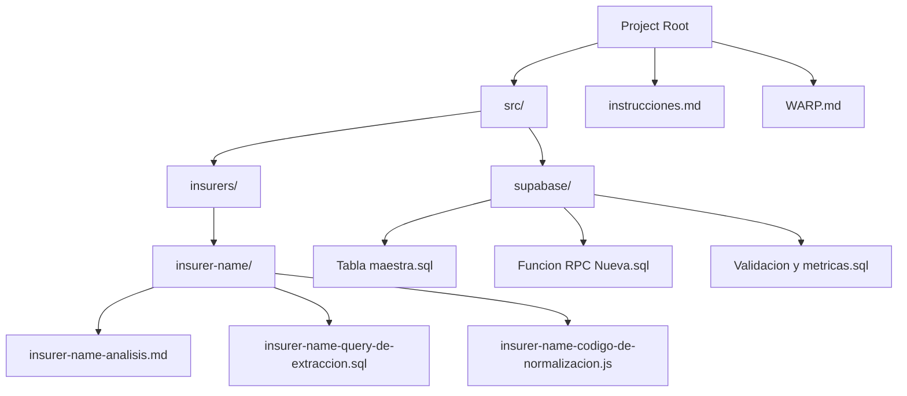
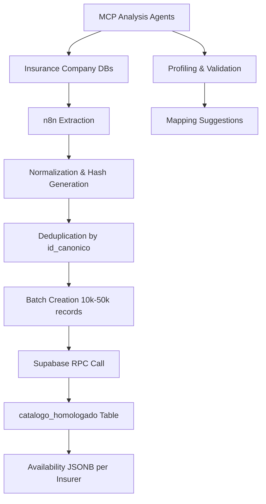
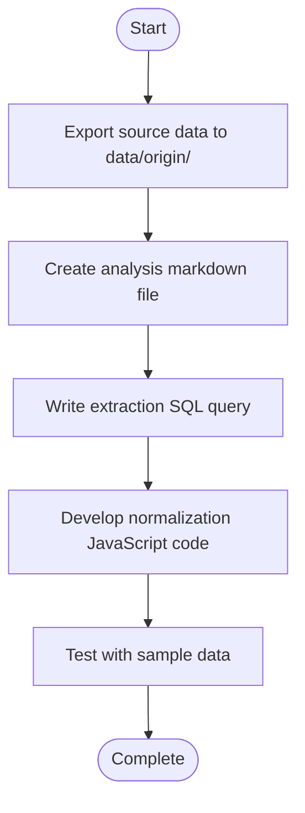
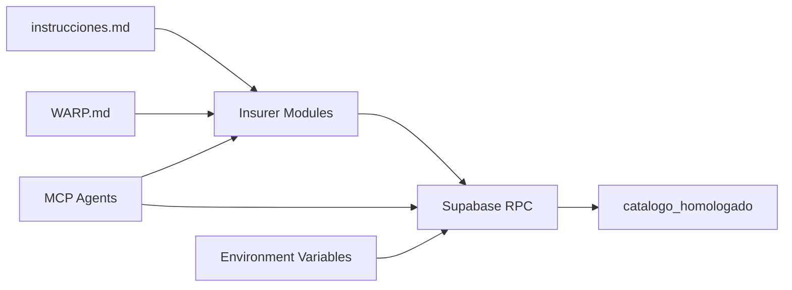

# Development Workflow

<cite>
**Referenced Files in This Document**   
- [instrucciones.md](file://instrucciones.md)
- [WARP.md](file://WARP.md)
- [src/insurers/ana/ana-analisis.md](file://src/insurers/ana/ana-analisis.md)
- [src/insurers/ana/ana-query-de-extraccion.sql](file://src/insurers/ana/ana-query-de-extraccion.sql)
- [src/insurers/hdi/hdi-analisis.md](file://src/insurers/hdi/hdi-analisis.md)
- [src/insurers/hdi/hdi-query-de-extraccion.sql](file://src/insurers/hdi/hdi-query-de-extraccion.sql)
- [src/insurers/hdi/hdi-codigo-de-normalizacion.js](file://src/insurers/hdi/hdi-codigo-de-normalizacion.js)
- [src/insurers/gnp/gnp-analisis.md](file://src/insurers/gnp/gnp-analisis.md)
- [src/insurers/gnp/gnp-query-de-extraccion.sql](file://src/insurers/gnp/gnp-query-de-extraccion.sql)
- [src/insurers/gnp/gnp-codigo-de-normalizacion.js](file://src/insurers/gnp/gnp-codigo-de-normalizacion.js)
- [src/insurers/zurich/zurich-analisis.md](file://src/insurers/zurich/zurich-analisis.md)
- [src/insurers/zurich/zurich-query-de-extraccion.sql](file://src/insurers/zurich/zurich-query-de-extraccion.sql)
- [src/insurers/zurich/zurich-codigo-de-normalizacion.js](file://src/insurers/zurich/zurich-codigo-de-normalizacion.js)
- [src/insurers/qualitas/qualitas-analisis.md](file://src/insurers/qualitas/qualitas-analisis.md)
- [src/insurers/qualitas/qualitas-query-de-extracción.sql](file://src/insurers/qualitas/qualitas-query-de-extracción.sql)
- [src/insurers/qualitas/qualitas-codigo-de-normalizacion-n8n.js](file://src/insurers/qualitas/qualitas-codigo-de-normalizacion-n8n.js)
- [src/insurers/elpotosi/elpotosi-analisis.md](file://src/insurers/elpotosi/elpotosi-analisis.md)
- [src/insurers/elpotosi/elpotosi-query-de-extraccion.sql](file://src/insurers/elpotosi/elpotosi-query-de-extraccion.sql)
- [src/insurers/elpotosi/elpotosi-codigo-de-normalizacion.js](file://src/insurers/elpotosi/elpotosi-codigo-de-normalizacion.js)
- [src/supabase/Tabla maestra.sql](file://src/supabase/Tabla maestra.sql)
- [src/supabase/Funcion RPC.sql](file://src/supabase/Funcion RPC.sql)
- [src/supabase/Funcion RPC Nueva.sql](file://src/supabase/Funcion RPC Nueva.sql)
- [src/supabase/Validacion y metricas.sql](file://src/supabase/Validacion y metricas.sql)
- [src/supabase/casos de prueba función rpc.sql](file://src/supabase/casos de prueba función rpc.sql)
</cite>

## Table of Contents
1. [Introduction](#introduction)
2. [Project Structure](#project-structure)
3. [Core Components](#core-components)
4. [Architecture Overview](#architecture-overview)
5. [Detailed Component Analysis](#detailed-component-analysis)
6. [Dependency Analysis](#dependency-analysis)
7. [Performance Considerations](#performance-considerations)
8. [Troubleshooting Guide](#troubleshooting-guide)
9. [Conclusion](#conclusion)

## Introduction
This document outlines the standard development workflow for extending or maintaining the vehicle catalog homologation system. The system unifies vehicle catalogs from multiple Mexican insurance companies into a single canonical model with complete traceability, active/inactive status control, and a reproducible ingestion flow. The workflow covers the complete lifecycle of adding a new insurer, from directory creation to deployment, following established conventions and best practices documented in instrucciones.md and WARP.md.

## Project Structure

The project follows a modular structure organized by insurer and system component. The `src/insurers/` directory contains individual subdirectories for each insurance company, each with standardized files for analysis, data extraction, and normalization. The `src/supabase/` directory houses database schema definitions, RPC functions, and validation scripts. Supporting documentation and workflow guidance are provided in instrucciones.md and WARP.md.



**Diagram sources**
- [WARP.md](file://WARP.md)
- [instrucciones.md](file://instrucciones.md)

**Section sources**
- [WARP.md](file://WARP.md)
- [instrucciones.md](file://instrucciones.md)

## Core Components

The system consists of four main components: source data from insurance company databases, normalization and orchestration via n8n workflows, persistence and API through Supabase (PostgreSQL + PostgREST), and analysis assistance from MCP agents. The canonical model is defined in `catalogo_homologado` with key identifiers including `id_canonico` and `hash_comercial`. The RPC function `procesar_batch_homologacion` handles batch processing of vehicle data with idempotent upsert behavior and JSONB merging of availability information per insurer.

**Section sources**
- [instrucciones.md](file://instrucciones.md)
- [src/supabase/Tabla maestra.sql](file://src/supabase/Tabla maestra.sql)
- [src/supabase/Funcion RPC Nueva.sql](file://src/supabase/Funcion RPC Nueva.sql)

## Architecture Overview

The system architecture follows a data pipeline pattern where source data from multiple insurance companies is extracted, normalized, and loaded into a canonical model through a reproducible workflow. The process begins with data extraction from source databases, followed by normalization in n8n which includes text cleaning, hash generation, and deduplication. Data is then batched and sent via HTTP to a Supabase RPC function that performs upsert operations on the canonical table. MCP agents provide analysis and validation throughout the process.



**Diagram sources**
- [WARP.md](file://WARP.md)

## Detailed Component Analysis

### Adding a New Insurer

The process for adding a new insurer follows a standardized workflow with specific file naming and organizational conventions. Each insurer has a dedicated directory under `src/insurers/` containing three core files: an analysis markdown file, an SQL extraction query, and a JavaScript normalization script.

```bash
mkdir src/insurers/nueva-aseguradora/
touch src/insurers/nueva-aseguradora/nueva-aseguradora-analisis.md
touch src/insurers/nueva-aseguradora/nueva-aseguradora-query-de-extraccion.sql
touch src/insurers/nueva-aseguradora/nueva-aseguradora-codigo-de-normalizacion.js
```

#### Analysis Process
The analysis phase involves exporting source data, documenting patterns in the analysis markdown file, writing extraction SQL queries, developing normalization JavaScript code, and testing with sample data. MCP agents assist by providing data profiling, cardinality analysis, and mapping suggestions.



**Diagram sources**
- [WARP.md](file://WARP.md)
- [instrucciones.md](file://instrucciones.md)

**Section sources**
- [WARP.md](file://WARP.md#L100-L150)
- [instrucciones.md](file://instrucciones.md#L200-L250)

### Data Extraction and Normalization

Each insurer's data extraction is defined in a SQL query file following the naming convention `{insurer}-query-de-extraccion.sql`. The normalization process transforms source data into the canonical model using JavaScript functions that handle text cleaning, hash generation, and field mapping. The normalization code is responsible for calculating `string_comercial`, `hash_comercial`, `string_tecnico`, and `id_canonico` based on normalized source data.

#### Normalization Code Structure
The normalization code follows a consistent pattern across insurers, with functions for text normalization and hash generation. The `normalizarTexto` function standardizes text by converting to uppercase, removing accents, and normalizing whitespace. The `generarHash` function creates SHA-256 hashes from component strings.

```javascript
function normalizarTexto(texto) {
  return texto.toUpperCase()
    .normalize("NFD")
    .replace(/[\u0300-\u036f]/g, "")
    .replace(/[^A-Z0-9\s\-\/]/g, " ")
    .replace(/\s+/g, " ")
    .trim();
}

function generarHash(...componentes) {
  const texto = componentes
    .filter(c => c !== undefined && c !== null)
    .join("|").toUpperCase();
  return crypto.createHash("sha256").update(texto).digest("hex");
}
```

**Section sources**
- [src/insurers/hdi/hdi-codigo-de-normalizacion.js](file://src/insurers/hdi/hdi-codigo-de-normalizacion.js)
- [src/insurers/gnp/gnp-codigo-de-normalizacion.js](file://src/insurers/gnp/gnp-codigo-de-normalizacion.js)
- [src/insurers/qualitas/qualitas-codigo-de-normalizacion-n8n.js](file://src/insurers/qualitas/qualitas-codigo-de-normalizacion-n8n.js)

### Testing Procedures

Testing involves using sample data batches to validate the complete workflow from extraction to normalization to RPC processing. The system includes validation scripts to check for hash consistency, duplicate detection, and data completeness. MCP agents provide automated analysis queries for cardinality checks and value sampling.

#### Validation Queries
The validation process includes checking for suspicious duplicates, validating hash consistency, and monitoring key metrics such as coverage, deduplication effectiveness, and field completeness.

```sql
-- Check for suspicious duplicates
SELECT id_canonico, COUNT(*) as count
FROM catalogo_homologado
GROUP BY id_canonico
HAVING COUNT(*) > 1;

-- Validate hash consistency  
SELECT *
FROM catalogo_homologado
WHERE id_canonico != encode(sha256((hash_comercial || '|' || 
  COALESCE(version, '') || '|' || 
  COALESCE(motor_config, '') || '|' || 
  COALESCE(carroceria, '') || '|' || 
  COALESCE(traccion, ''))::bytea), 'hex');
```

**Section sources**
- [src/supabase/Validacion y metricas.sql](file://src/supabase/Validacion y metricas.sql)
- [WARP.md](file://WARP.md#L300-L350)

### Deployment Considerations

Deployment involves updating the RPC function and managing schema changes through Supabase. The RPC function `procesar_batch_homologacion` must be updated with the latest logic, and any schema changes should be applied through controlled migrations. The system uses environment variables for Supabase connection and requires proper service role credentials for RPC calls.

#### RPC Function Update
The RPC function update process involves replacing the existing function with the new version, ensuring backward compatibility and idempotent behavior. The function handles batch processing with comprehensive error handling and returns detailed metrics about the processing results.

```sql
-- Primary batch processing function
SELECT procesar_batch_homologacion(vehiculos_json::jsonb)
FROM (VALUES ('{"vehiculos_json": [...]}')) AS t(vehiculos_json);
```

**Section sources**
- [src/supabase/Funcion RPC Nueva.sql](file://src/supabase/Funcion RPC Nueva.sql)
- [src/supabase/Funcion RPC.sql](file://src/supabase/Funcion RPC.sql)

## Dependency Analysis

The system has a clear dependency structure with minimal coupling between components. The insurers' modules are independent of each other, with dependencies only on the core system components. The Supabase database components depend on PostgreSQL features including JSONB, GIN indexes, and PL/pgSQL functions. The n8n workflows depend on the Supabase RPC endpoint and authentication credentials.



**Diagram sources**
- [WARP.md](file://WARP.md)
- [instrucciones.md](file://instrucciones.md)

**Section sources**
- [WARP.md](file://WARP.md)
- [instrucciones.md](file://instrucciones.md)

## Performance Considerations

The system is designed for efficient processing of large vehicle catalogs through batching and indexing strategies. The recommended batch size is 10k-50k records to balance network overhead with transaction performance. The database schema includes optimized indexes on key fields including `id_canonico`, `hash_comercial`, and `disponibilidad` (using GIN index for JSONB). The RPC function uses temporary tables for staging and processing to minimize lock contention.

## Troubleshooting Guide

Common issues include hash collisions, RPC timeouts, encoding issues, and missing source data. Hash collisions can be resolved by reviewing normalization logic and adding distinguishing fields. RPC timeouts require reducing batch size from 50k to 10k records. Encoding issues with special characters are addressed by applying proper UTF-8 normalization in the `normalizarTexto()` function. Missing source data due to API changes requires updating extraction queries and validating field mappings.

**Section sources**
- [WARP.md](file://WARP.md#L350-L400)
- [instrucciones.md](file://instrucciones.md#L150-L200)

## Conclusion

The development workflow for the vehicle catalog homologation system provides a standardized, reproducible process for adding new insurers and maintaining the canonical model. By following the documented conventions for directory structure, file naming, data extraction, normalization, testing, and deployment, developers can ensure consistency and reliability across all insurer integrations. The system's design emphasizes traceability, active/inactive status control, and idempotent processing to maintain data integrity throughout the ingestion lifecycle.