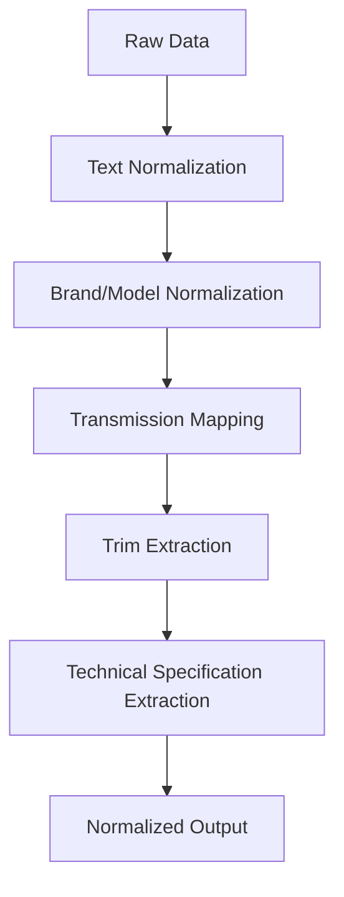
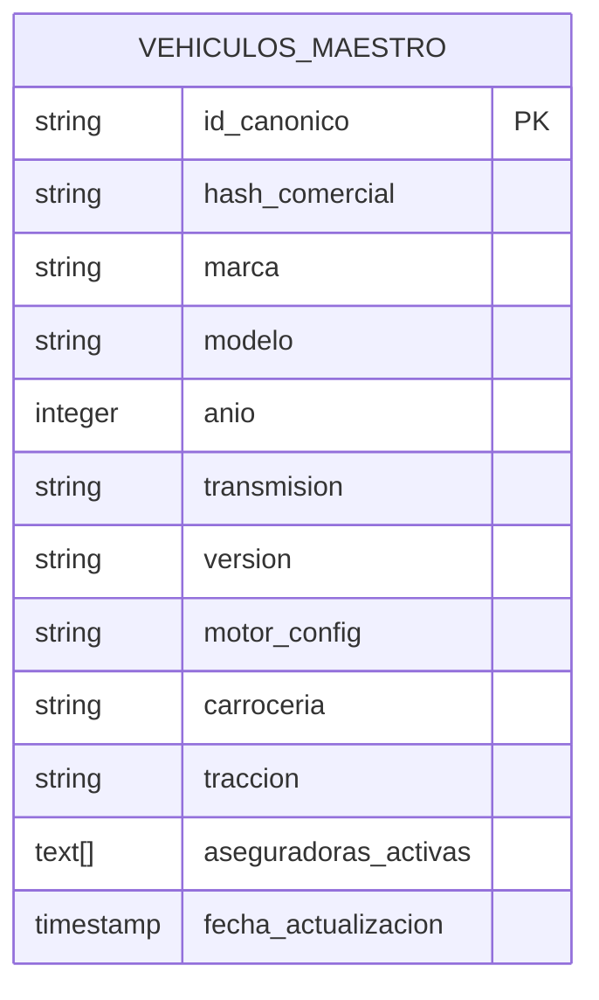
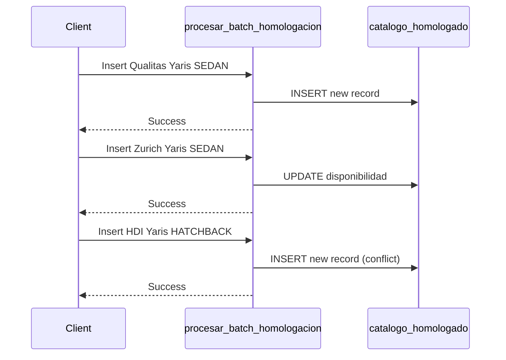
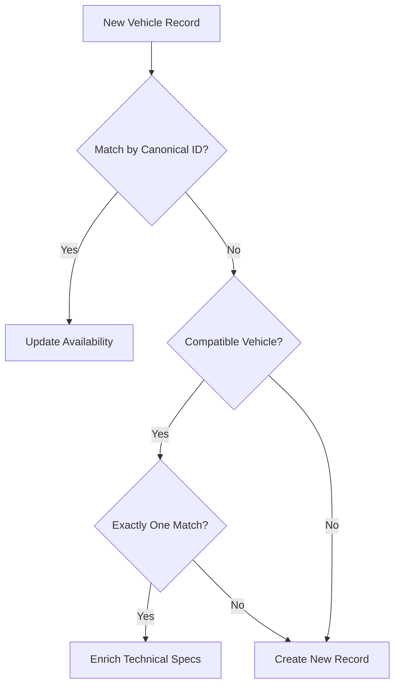
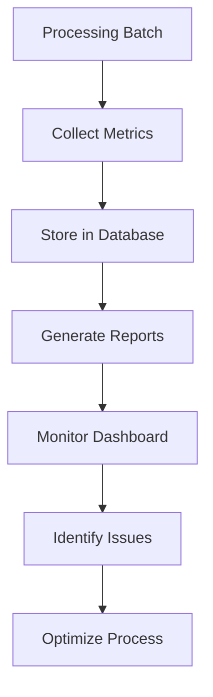

# Testing Procedures

<cite>
**Referenced Files in This Document**   
- [Validacion y metricas.sql](file://src/supabase/Validacion y metricas.sql)
- [casos de prueba función rpc.sql](file://src/supabase/casos de prueba función rpc.sql)
- [Funcion RPC Nueva.sql](file://src/supabase/Funcion RPC Nueva.sql)
- [elpotosi-codigo-de-normalizacion.js](file://src/insurers/elpotosi/elpotosi-codigo-de-normalizacion.js)
- [gnp-codigo-de-normalizacion.js](file://src/insurers/gnp/gnp-codigo-de-normalizacion.js)
- [qualitas-codigo-de-normalizacion-n8n.js](file://src/insurers/qualitas/qualitas-codigo-de-normalizacion-n8n.js)
- [hdi-codigo-de-normalizacion.js](file://src/insurers/hdi/hdi-codigo-de-normalizacion.js)
- [zurich-codigo-de-normalizacion.js](file://src/insurers/zurich/zurich-codigo-de-normalizacion.js)
</cite>

## Table of Contents
1. [Introduction](#introduction)
2. [Insurer-Specific Extraction and Normalization Testing](#insurer-specific-extraction-and-normalization-testing)
3. [Supabase Validation Scripts for Data Quality](#supabase-validation-scripts-for-data-quality)
4. [RPC Function Test Cases](#rpc-function-test-cases)
5. [Hash Generation and Deduplication Verification](#hash-generation-and-deduplication-verification)
6. [Expected Outputs and Error Conditions](#expected-outputs-and-error-conditions)
7. [Metrics Collection and Monitoring](#metrics-collection-and-monitoring)
8. [Iterative Testing Workflow](#iterative-testing-workflow)

## Introduction
This document outlines comprehensive testing procedures for the homologation pipeline, focusing on validating insurer-specific data extraction and normalization logic. It details the use of Supabase validation scripts to ensure data quality, completeness, and consistency. The document also covers testing the RPC function for correct upsert behavior, JSONB merging, and conflict resolution. Procedures for verifying hash generation accuracy and deduplication effectiveness are included, along with examples of expected outputs and error conditions. Metrics collection for monitoring success rates, warning counts, and processing performance is described, and an iterative testing workflow using small batches before full deployment is recommended.

## Insurer-Specific Extraction and Normalization Testing
Testing insurer-specific extraction and normalization logic involves validating the JavaScript normalization scripts for each insurer. These scripts are responsible for cleaning and standardizing vehicle data from various insurers into a unified format.

The normalization process includes:
- **Text Normalization**: Removing accents, special characters, and converting text to uppercase.
- **Brand and Model Normalization**: Applying synonyms and corrections to standardize brand and model names.
- **Transmission Mapping**: Converting transmission codes to standardized values.
- **Trim Extraction**: Identifying and extracting the trim level from version descriptions.
- **Technical Specification Extraction**: Detecting engine configuration, body type, and traction from version text.

Each insurer's normalization script must be tested with sample datasets to ensure accurate extraction and normalization. The test datasets should include edge cases such as missing values, inconsistent formatting, and known data quality issues.



**Diagram sources**
- [elpotosi-codigo-de-normalizacion.js](file://src/insurers/elpotosi/elpotosi-codigo-de-normalizacion.js)
- [gnp-codigo-de-normalizacion.js](file://src/insurers/gnp/gnp-codigo-de-normalizacion.js)
- [qualitas-codigo-de-normalizacion-n8n.js](file://src/insurers/qualitas/qualitas-codigo-de-normalizacion-n8n.js)
- [hdi-codigo-de-normalizacion.js](file://src/insurers/hdi/hdi-codigo-de-normalizacion.js)
- [zurich-codigo-de-normalizacion.js](file://src/insurers/zurich/zurich-codigo-de-normalizacion.js)

**Section sources**
- [elpotosi-codigo-de-normalizacion.js](file://src/insurers/elpotosi/elpotosi-codigo-de-normalizacion.js)
- [gnp-codigo-de-normalizacion.js](file://src/insurers/gnp/gnp-codigo-de-normalizacion.js)
- [qualitas-codigo-de-normalizacion-n8n.js](file://src/insurers/qualitas/qualitas-codigo-de-normalizacion-n8n.js)
- [hdi-codigo-de-normalizacion.js](file://src/insurers/hdi/hdi-codigo-de-normalizacion.js)
- [zurich-codigo-de-normalizacion.js](file://src/insurers/zurich/zurich-codigo-de-normalizacion.js)

## Supabase Validation Scripts for Data Quality
The Supabase validation script `Validacion y metricas.sql` is used to verify data quality, completeness, and consistency in the homologated vehicle catalog. This script calculates key metrics that indicate the level of homologation achieved.

The validation metrics include:
- **Total Canonical Vehicles**: The total number of unique vehicles in the master catalog.
- **Vehicles with 2+ Insurers**: The count and percentage of vehicles covered by two or more insurers.
- **Vehicles with 3+ Insurers**: The count and percentage of vehicles covered by three or more insurers.
- **Average Insurers per Vehicle**: The average number of insurers covering each vehicle.
- **Maximum Insurers per Vehicle**: The highest number of insurers covering a single vehicle.

These metrics provide insight into the effectiveness of the homologation process and the degree of data integration across insurers.



**Diagram sources**
- [Validacion y metricas.sql](file://src/supabase/Validacion y metricas.sql)

**Section sources**
- [Validacion y metricas.sql](file://src/supabase/Validacion y metricas.sql)

## RPC Function Test Cases
The RPC function `procesar_batch_homologacion` is tested using the script `casos de prueba función rpc.sql`. This script verifies correct upsert behavior, JSONB merging, and conflict resolution through a series of test cases.

### Test Case 1: Initial Insertion
A Toyota Yaris SEDAN record from Qualitas is inserted into the homologated catalog. This establishes the baseline record with its canonical ID and commercial hash.

### Test Case 2: Same Vehicle from Another Insurer
Zurich adds the same Toyota Yaris SEDAN (same canonical ID). The system should enrich the existing record by adding Zurich to the availability JSONB field without creating a duplicate.

### Test Case 3: Conflicting Body Type
HDI adds a Toyota Yaris with HATCHBACK body type (different canonical ID due to body type difference). The system should create a new record because the body type conflicts with the existing SEDAN record.

### Test Case 4: Enrichment with Engine Configuration
HDI enriches the SEDAN record by adding engine configuration (L4). The system should update the existing record with the new engine information and increase the confidence score.

### Test Case 5: Different Trim Level
HDI adds a Toyota Yaris with CORE trim (different from PREMIUM). The system should create a new record because the trim level is different.

### Test Case 6: Progressive Enrichment
A VW GOL is first added by Qualitas without version or body type. Zurich later adds the HATCHBACK body type. The system should enrich the existing record with the body type information.



**Diagram sources**
- [casos de prueba función rpc.sql](file://src/supabase/casos de prueba función rpc.sql)
- [Funcion RPC Nueva.sql](file://src/supabase/Funcion RPC Nueva.sql)

**Section sources**
- [casos de prueba función rpc.sql](file://src/supabase/casos de prueba función rpc.sql)
- [Funcion RPC Nueva.sql](file://src/supabase/Funcion RPC Nueva.sql)

## Hash Generation and Deduplication Verification
Hash generation accuracy and deduplication effectiveness are critical for maintaining data integrity in the homologation pipeline. The system uses two types of hashes:

- **Commercial Hash**: Generated from brand, model, year, and transmission. Used for basic deduplication.
- **Canonical ID**: Generated from all technical specifications (including trim, engine, body type, traction). Used for precise identification.

The deduplication process follows these rules:
1. If a record with the same canonical ID exists, update the availability with the new insurer.
2. If no canonical match exists, search for compatible vehicles to enrich (same brand, model, year, transmission, and version, with null or matching technical specs).
3. If exactly one compatible vehicle is found, enrich it with new technical specifications.
4. If multiple compatible vehicles are found, create a new record to avoid ambiguity.
5. If no matches are found, create a new record.

This hierarchical matching ensures that vehicles are correctly grouped while preserving technical differences.



**Diagram sources**
- [Funcion RPC Nueva.sql](file://src/supabase/Funcion RPC Nueva.sql)

**Section sources**
- [Funcion RPC Nueva.sql](file://src/supabase/Funcion RPC Nueva.sql)

## Expected Outputs and Error Conditions
The RPC function `procesar_batch_homologacion` returns a JSONB object with detailed processing results. Understanding the expected outputs and error conditions is essential for debugging and monitoring.

### Successful Response
```json
{
  "success": true,
  "received": 5,
  "staged": 5,
  "procesados": {
    "nuevos": 3,
    "enriquecidos": 1,
    "actualizados": 1,
    "conflictos": 0,
    "multiples_matches": 0
  },
  "warnings": [],
  "errors": []
}
```

### Warning Conditions
- **Multiple Matches**: When a vehicle could match multiple existing records, a warning is generated, and a new record is created.
- **Data Conflicts**: When technical specifications conflict with existing records (e.g., different transmission or version), a warning is generated.

### Error Conditions
- **Invalid Input**: If the input is not a valid JSONB array, the function returns an error.
- **Database Errors**: Any database constraint violations or other SQL errors trigger an error response.

The system is designed to be resilient, processing valid records even when some records in a batch fail.

**Section sources**
- [Funcion RPC Nueva.sql](file://src/supabase/Funcion RPC Nueva.sql)

## Metrics Collection and Monitoring
Metrics collection is essential for monitoring the health and performance of the homologation pipeline. The system collects and reports on several key metrics:

### Processing Metrics
- **Success Rate**: Percentage of successfully processed records.
- **Warning Count**: Number of records that generated warnings.
- **Error Count**: Number of records that failed processing.
- **Processing Time**: Duration of batch processing.

### Data Quality Metrics
- **Homologation Level**: Percentage of vehicles covered by multiple insurers.
- **Data Completeness**: Average number of technical specifications per vehicle.
- **Confidence Score**: Average confidence score of records.

### Performance Metrics
- **Batch Size**: Number of records processed per batch.
- **Throughput**: Records processed per minute.
- **Database Performance**: Query execution times and index usage.

These metrics are collected for each processing batch and can be used to identify trends, performance bottlenecks, and data quality issues over time.



**Diagram sources**
- [Validacion y metricas.sql](file://src/supabase/Validacion y metricas.sql)
- [Funcion RPC Nueva.sql](file://src/supabase/Funcion RPC Nueva.sql)

**Section sources**
- [Validacion y metricas.sql](file://src/supabase/Validacion y metricas.sql)
- [Funcion RPC Nueva.sql](file://src/supabase/Funcion RPC Nueva.sql)

## Iterative Testing Workflow
An iterative testing workflow is recommended to ensure the reliability of the homologation pipeline before full deployment. This approach minimizes risk and allows for gradual validation of the system.

### Step 1: Small Batch Testing
Start with a small batch of 5-10 records from a single insurer. Verify that:
- Normalization logic produces expected outputs.
- Hashes are generated correctly.
- Records are inserted or updated as expected.

### Step 2: Multi-Insurer Testing
Expand to include records from multiple insurers for the same vehicle models. Verify that:
- Deduplication works correctly.
- Enrichment of technical specifications functions properly.
- Conflict resolution handles incompatible specifications.

### Step 3: Edge Case Testing
Test with known edge cases and problematic data, such as:
- Missing or null values.
- Inconsistent formatting.
- Conflicting specifications.
- Special characters and accents.

### Step 4: Performance Testing
Gradually increase batch sizes to measure performance and identify bottlenecks. Monitor:
- Processing time per record.
- Database resource usage.
- Memory consumption.

### Step 5: Full Deployment
After successful testing at each stage, proceed with full deployment. Continue monitoring metrics to ensure ongoing system health.

This iterative approach allows for early detection of issues and provides confidence in the system's reliability before processing large volumes of data.

**Section sources**
- [casos de prueba función rpc.sql](file://src/supabase/casos de prueba función rpc.sql)