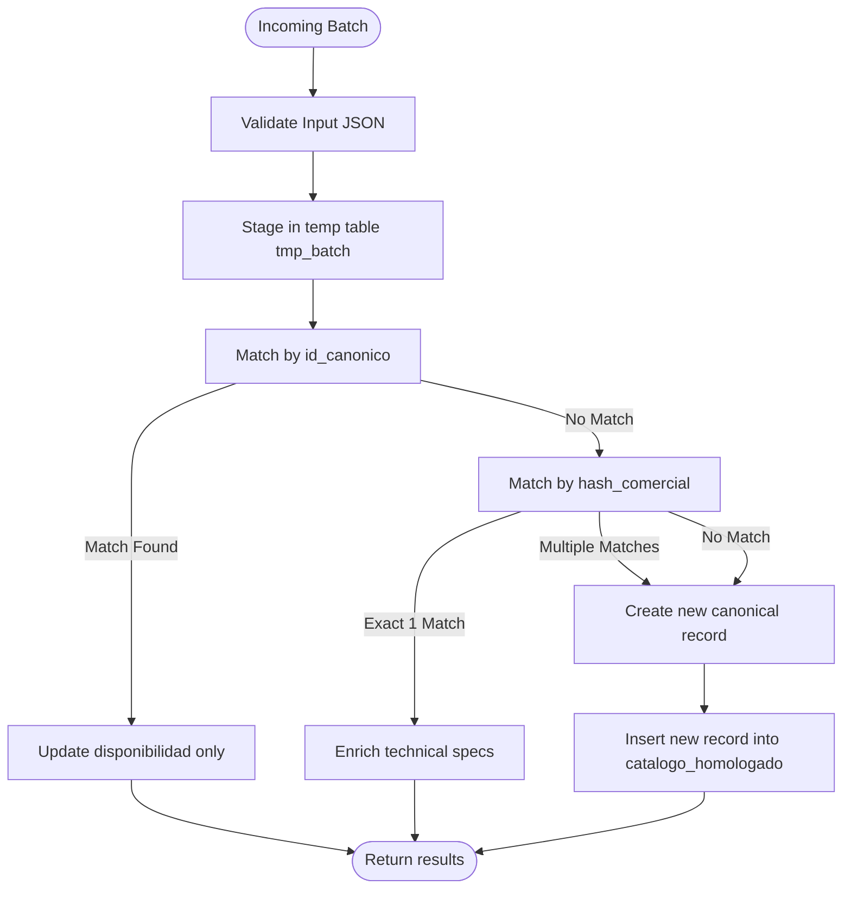
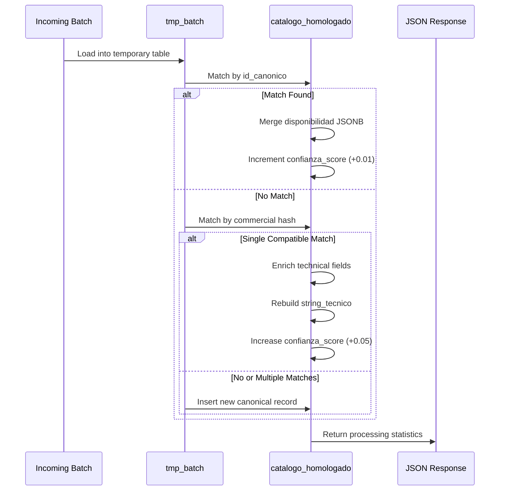
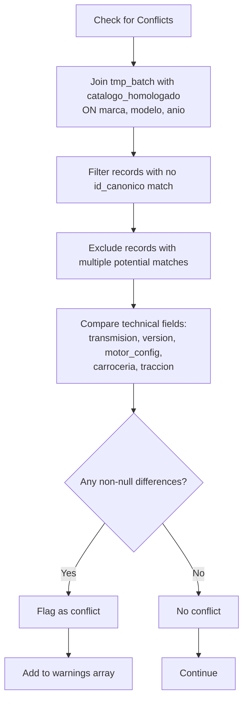
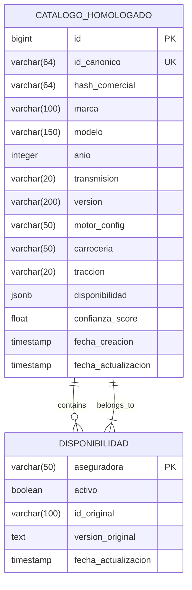

# Deduplication & Conflict Resolution

<cite>
**Referenced Files in This Document**   
- [Funcion RPC Nueva.sql](file://src/supabase/Funcion RPC Nueva.sql)
- [Validacion y metricas.sql](file://src/supabase/Validacion y metricas.sql)
- [casos de prueba función rpc.sql](file://src/supabase/casos de prueba función rpc.sql)
- [Tabla maestra.sql](file://src/supabase/Tabla maestra.sql)
- [Replanteamiento homologacion.md](file://src/supabase/Replanteamiento homologacion.md)
- [instrucciones.md](file://instrucciones.md)
</cite>

## Table of Contents
1. [Introduction](#introduction)
2. [Deduplication Strategy](#deduplication-strategy)
3. [Upsert Logic and Availability Merging](#upsert-logic-and-availability-merging)
4. [Conflict Detection Mechanism](#conflict-detection-mechanism)
5. [Conflict Resolution Workflow](#conflict-resolution-workflow)
6. [Data Quality Metrics and Validation](#data-quality-metrics-and-validation)
7. [Best Practices for Edge Cases](#best-practices-for-edge-cases)
8. [Conclusion](#conclusion)

## Introduction
The homologation system processes vehicle data from multiple insurers to create a unified canonical catalog. A critical component of this process is the ability to detect duplicates and resolve conflicts during batch ingestion. This document details the deduplication and conflict resolution strategy implemented in the `procesar_batch_homologacion` RPC function. It explains how incoming records are matched against existing entries using `id_canonico` and `hash_comercial`, how availability data is merged, and how technical specification conflicts are detected and flagged for review.

**Section sources**
- [Funcion RPC Nueva.sql](file://src/supabase/Funcion RPC Nueva.sql#L1-L50)

## Deduplication Strategy
The deduplication process uses a two-tiered matching strategy based on cryptographic hashes to identify both exact and near-duplicate records.

### Primary Matching via id_canonico
The first matching phase uses `id_canonico`, a SHA-256 hash derived from normalized values of `hash_comercial`, `version`, `motor_config`, `carroceria`, and `traccion`. When an incoming record's `id_canonico` matches an existing entry, it is considered an exact duplicate, and the system proceeds to update only the availability information.

### Secondary Matching via hash_comercial
When no `id_canonico` match is found, the system performs a secondary match using `hash_comercial`, which is a SHA-256 hash of normalized `marca`, `modelo`, `anio`, and `transmision`. This enables detection of near-duplicates—vehicles that are commercially equivalent but may have different technical specifications.

The matching logic requires exact alignment of mandatory fields (`marca`, `modelo`, `anio`, `transmision`, `version`) while allowing enrichment of technical fields (`motor_config`, `carroceria`, `traccion`) when they are missing in the canonical record but present in the incoming data.

**Diagram sources**
- [Funcion RPC Nueva.sql](file://src/supabase/Funcion RPC Nueva.sql#L100-L200)

**Section sources**
- [Funcion RPC Nueva.sql](file://src/supabase/Funcion RPC Nueva.sql#L100-L200)
- [Replanteamiento homologacion.md](file://src/supabase/Replanteamiento homologacion.md#L88-L101)
- [instrucciones.md](file://instrucciones.md#L88-L101)

## Upsert Logic and Availability Merging
The upsert logic in the `procesar_batch_homologacion` function follows a three-path strategy: insert new records, enrich existing compatible records, or update availability for exact matches.

### Availability Field Merging
When a match is found (either by `id_canonico` or `hash_comercial`), the `disponibilidad` JSONB field is merged using the PostgreSQL `||` operator. This preserves insurer-specific status and metadata without overwriting existing entries. Each insurer's data is stored as a key in the JSONB object with fields including `activo`, `id_original`, `version_original`, and `fecha_actualizacion`.

For exact `id_canonico` matches, only the `disponibilidad` field is updated, and the confidence score is slightly increased. For enrichment matches, technical specifications are updated using `COALESCE`, and the confidence score is increased more significantly.

**Diagram sources**
- [Funcion RPC Nueva.sql](file://src/supabase/Funcion RPC Nueva.sql#L250-L350)

**Section sources**
- [Funcion RPC Nueva.sql](file://src/supabase/Funcion RPC Nueva.sql#L250-L350)

## Conflict Detection Mechanism
The system detects conflicts when an incoming record shares the same commercial identity (`marca`, `modelo`, `anio`) but has divergent technical specifications compared to an existing canonical record.

### Technical Specification Conflicts
Conflicts are identified when non-null values for `transmision`, `version`, `motor_config`, `carroceria`, or `traccion` differ between the incoming record and any existing record with the same commercial identity. The detection occurs after failed matching attempts and specifically excludes cases where multiple potential matches exist (which are handled separately).

The conflict detection logic joins the temporary batch table with the canonical catalog on `marca`, `modelo`, and `anio`, then checks for discrepancies in technical fields. Detected conflicts are counted and included in the response as warnings.

**Diagram sources**
- [Funcion RPC Nueva.sql](file://src/supabase/Funcion RPC Nueva.sql#L350-L400)

**Section sources**
- [Funcion RPC Nueva.sql](file://src/supabase/Funcion RPC Nueva.sql#L350-L400)

## Conflict Resolution Workflow
When conflicts are detected, the system follows a resolution workflow designed to preserve data integrity while flagging issues for manual review.

### Automatic Handling
Records with conflicting technical specifications are treated as distinct vehicles and inserted as new canonical entries. This prevents incorrect merging of divergent specifications. The system generates warnings that include details of the conflicting fields, which are returned in the RPC response.

### Manual Review Requirements
Detected conflicts are included in the response's `warnings` array, providing insurers and data stewards with the information needed to investigate and resolve discrepancies. The warning message includes the vehicle description and specific fields that conflict (e.g., "transmision(AUTO≠MANUAL)").

The confidence score for records with conflicts is set to 0.8 (compared to 1.0 for clean matches), providing a quantitative measure of data quality that can be used for prioritization of review tasks.

**Section sources**
- [Funcion RPC Nueva.sql](file://src/supabase/Funcion RPC Nueva.sql#L350-L400)
- [casos de prueba función rpc.sql](file://src/supabase/casos de prueba función rpc.sql#L100-L150)

## Data Quality Metrics and Validation
The system includes validation scripts to track data quality metrics, including conflict rates and homologation coverage.

### Homologation Metrics
The validation query in `Validacion y metricas.sql` calculates key metrics such as:
- Total canonical vehicles
- Vehicles covered by 2+ insurers
- Vehicles covered by 3+ insurers
- Average number of insurers per vehicle
- Maximum insurers covering a single vehicle

These metrics provide insight into the effectiveness of the homologation process and help identify areas needing improvement.

### Test Cases and Validation
The `casos de prueba función rpc.sql` file contains comprehensive test cases that validate the deduplication and conflict resolution logic. These include:
- Exact `id_canonico` matches (availability merge)
- `hash_comercial` matches with technical enrichment
- Conflicting `carroceria` values (SEDAN vs HATCHBACK)
- Different `version` values (PREMIUM vs CORE)
- Progressive enrichment of missing technical specifications

These test cases verify that the system correctly handles various scenarios and produces expected outcomes.

**Diagram sources**
- [Tabla maestra.sql](file://src/supabase/Tabla maestra.sql#L1-L100)
- [Funcion RPC Nueva.sql](file://src/supabase/Funcion RPC Nueva.sql#L1-L50)

**Section sources**
- [Validacion y metricas.sql](file://src/supabase/Validacion y metricas.sql#L1-L20)
- [casos de prueba función rpc.sql](file://src/supabase/casos de prueba función rpc.sql#L1-L256)

## Best Practices for Edge Cases
The system handles several edge cases through specific rules and best practices.

### Conflicting Model-Year Combinations
When the same `id_canonico` receives different technical specifications from multiple insurers, the system treats them as separate vehicles if the differences are in mandatory fields. For optional technical fields, the system enriches the canonical record when possible.

### Handling Null Values
The matching logic distinguishes between NULL and non-NULL values. Two records with NULL in a field are considered compatible, while a NULL and a non-NULL value are not considered conflicting but may enable enrichment.

### Multiple Potential Matches
When multiple existing records could potentially match an incoming vehicle (based on commercial hash), the system creates a new canonical record and generates a warning. This conservative approach prevents incorrect merging when the correct match cannot be determined with certainty.

**Section sources**
- [Funcion RPC Nueva.sql](file://src/supabase/Funcion RPC Nueva.sql#L200-L300)
- [casos de prueba función rpc.sql](file://src/supabase/casos de prueba función rpc.sql#L200-L250)

## Conclusion
The deduplication and conflict resolution strategy in the homologation system effectively balances automated processing with data integrity safeguards. By using cryptographic hashes for matching, implementing careful upsert logic, and providing clear conflict detection and reporting, the system ensures high-quality canonical data while flagging issues for manual review. The comprehensive test suite and validation metrics further support ongoing quality assurance and process improvement.