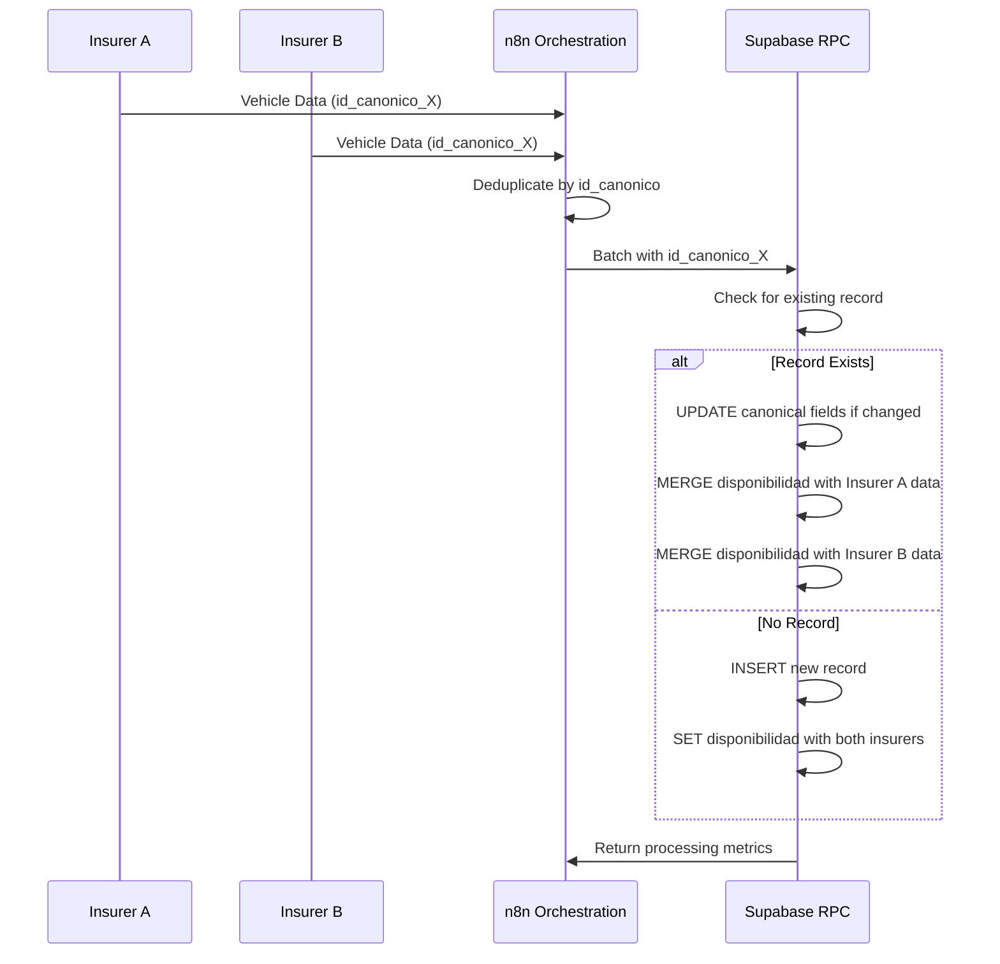

# Hash Generation and Deduplication

<cite>
**Referenced Files in This Document**   
- [instrucciones.md](file://instrucciones.md)
- [src/supabase/Replanteamiento homologacion.md](file://src/supabase/Replanteamiento homologacion.md)
- [src/insurers/hdi/hdi-codigo-de-normalizacion.js](file://src/insurers/hdi/hdi-codigo-de-normalizacion.js)
- [src/insurers/elpotosi/elpotosi-codigo-de-normalizacion.js](file://src/insurers/elpotosi/elpotosi-codigo-de-normalizacion.js)
- [src/insurers/gnp/gnp-codigo-de-normalizacion.js](file://src/insurers/gnp/gnp-codigo-de-normalizacion.js)
- [src/insurers/zurich/zurich-codigo-de-normalizacion.js](file://src/insurers/zurich/zurich-codigo-de-normalizacion.js)
- [src/insurers/qualitas/qualitas-codigo-de-normalizacion-n8n.js](file://src/insurers/qualitas/qualitas-codigo-de-normalizacion-n8n.js)
- [WARP.md](file://WARP.md)
</cite>

## Table of Contents
1. [Introduction](#introduction)
2. [Hash Generation Process](#hash-generation-process)
3. [Deduplication Strategy](#deduplication-strategy)
4. [Conflict Resolution](#conflict-resolution)
5. [Hash Sensitivity Analysis](#hash-sensitivity-analysis)
6. [Performance Considerations](#performance-considerations)
7. [Troubleshooting Guide](#troubleshooting-guide)

## Introduction

The hash-based deduplication system is a critical component of the vehicle catalog homogenization process, designed to unify vehicle data from multiple insurance providers into a single canonical representation. This system leverages SHA-256 cryptographic hashing to create unique identifiers that enable precise deduplication and conflict resolution across diverse data sources. The architecture employs two primary hash types: `id_canonico` for canonical grouping of vehicles based on core specifications, and `hash_comercial` for tracking commercial variants. This approach ensures data integrity while maintaining traceability across insurance providers, allowing the system to detect both exact and near-duplicate entries during batch processing. The implementation is designed to be idempotent, ensuring consistent results regardless of processing frequency.

**Section sources**
- [instrucciones.md](file://instrucciones.md#L1-L280)
- [src/supabase/Replanteamiento homologacion.md](file://src/supabase/Replanteamiento homologacion.md#L1-L280)

## Hash Generation Process

The system generates two distinct SHA-256 hashes for each vehicle record: `hash_comercial` and `id_canonico`. The `hash_comercial` is calculated from normalized values of brand, model, year, and transmission, serving as a commercial identifier that groups vehicles with identical core specifications. The `id_canonico` builds upon this foundation by incorporating additional normalized attributes including version/trim, motor configuration, body type, and traction system. Before hash computation, all input data undergoes rigorous normalization including conversion to uppercase, removal of accents and special characters, collapsing of multiple spaces, and mapping of common abbreviations (e.g., "AUT." to "AUTO"). This normalization process ensures consistency across data sources with varying formatting conventions. The hash generation function, implemented across multiple insurer-specific normalization scripts, follows a standardized pattern of filtering null/undefined values, joining components with a pipe delimiter, and computing the SHA-256 digest.

```mermaid
flowchart TD
A[Raw Vehicle Data] --> B[Normalization Process]
B --> C[Brand: Uppercase, No Accents]
B --> D[Model: Uppercase, No Special Chars]
B --> E[Year: Integer Validation]
B --> F[Transmission: Standardized Codes]
B --> G[Version/Trim: Cleaned of Specs]
B --> H[Motor Config: Standard Format]
B --> I[Body Type: Canonical Names]
B --> J[Traction: Standardized Terms]
C --> K[Create Commercial String]
D --> K
E --> K
F --> K
K --> L[Generate hash_comercial<br/>SHA-256(marca|modelo|anio|transmision)]
K --> M[Create Technical String]
G --> M
H --> M
I --> M
J --> M
M --> N[Generate id_canonico<br/>SHA-256(hash_comercial|version|motor_config|carroceria|traccion)]
L --> O[Store hash_comercial]
N --> P[Store id_canonico]
```

**Diagram sources **
- [instrucciones.md](file://instrucciones.md#L99-L106)
- [src/insurers/hdi/hdi-codigo-de-normalizacion.js#L43-L81)
- [src/insurers/elpotosi/elpotosi-codigo-de-normalizacion.js#L31-L71)

## Deduplication Strategy

The deduplication process occurs during batch processing in the n8n orchestration layer before data is sent to the Supabase RPC endpoint. The system eliminates duplicates by identifying records with identical `id_canonico` values, which represent vehicles with the same combination of brand, model, year, transmission, version, motor configuration, body type, and traction. For records sharing the same `id_canonico`, the system applies a conflict resolution strategy that preserves the most recent data based on the source system's update timestamp. The `hash_comercial` enables tracking of commercial variants while allowing different trims of the same vehicle model to be grouped under a common commercial identifier. This dual-hash approach creates a hierarchical deduplication system where `hash_comercial` identifies vehicles with identical core specifications, while `id_canonico` provides granular differentiation based on technical specifications. The deduplication process is designed to be idempotent, ensuring that reprocessing the same batch does not alter the outcome.

**Section sources**
- [instrucciones.md](file://instrucciones.md#L200-L250)
- [src/supabase/Replanteamiento homologacion.md](file://src/supabase/Replanteamiento homologacion.md#L200-L250)

## Conflict Resolution

When different insurers provide conflicting data for the same vehicle (identified by matching `id_canonico`), the system implements a conflict resolution strategy that preserves data from all sources while establishing a canonical representation. The primary record in the `catalogo_homologado` table contains the normalized canonical data, while each insurer's specific information is stored in the JSONB `disponibilidad` field. This field maintains insurer-specific attributes including the original version description, original ID, active status, and last update timestamp. The system does not overwrite or delete records when an insurer marks a vehicle as inactive; instead, it updates the `activo` flag to false while preserving the historical data. A vehicle is considered globally active if at least one insurer reports it as active. This approach enables comprehensive conflict resolution by maintaining complete provenance while providing a unified view of vehicle availability across insurers. The RPC function handles conflicts through an upsert operation that updates canonical fields only when they have changed, minimizing unnecessary updates.



**Diagram sources **
- [instrucciones.md](file://instrucciones.md#L250-L300)
- [src/supabase/Replanteamiento homologacion.md](file://src/supabase/Replanteamiento homologacion.md#L250-L300)

## Hash Sensitivity Analysis

The hash-based system demonstrates high sensitivity to even minor data differences, which is essential for accurate vehicle identification and deduplication. Small variations in input data, such as different trim level descriptions, transmission coding, or motor configuration specifications, result in completely different hash values due to the avalanche effect inherent in SHA-256 cryptography. For example, two records for a "Toyota Corolla 2020" with identical brand, model, year, and transmission but different trim levels ("LE" vs "SE") will have different `id_canonico` values, while sharing the same `hash_comercial`. Similarly, variations in normalization outcomes—such as "AUT" vs "AUTO" for transmission—will produce different hashes despite representing the same vehicle. This sensitivity ensures precise differentiation between vehicle variants but requires consistent normalization across all data sources. The system's normalization functions are designed to minimize false positives by standardizing common variations, but edge cases may still produce hash collisions or unnecessary differentiation.

**Section sources**
- [src/insurers/hdi/hdi-codigo-de-normalizacion.js](file://src/insurers/hdi/hdi-codigo-de-normalizacion.js#L43-L81)
- [src/insurers/elpotosi/elpotosi-codigo-de-normalizacion.js](file://src/insurers/elpotosi/elpotosi-codigo-de-normalizacion.js#L31-L71)
- [src/insurers/gnp/gnp-codigo-de-normalizacion.js](file://src/insurers/gnp/gnp-codigo-de-normalizacion.js#L43-L81)

## Performance Considerations

The hash computation process is designed for scalability and performance in large-scale batch processing scenarios. SHA-256 hash generation is computationally efficient and can be parallelized across thousands of records, making it suitable for processing batches of 10,000 to 50,000 vehicles. The system's performance is optimized through several strategies: normalization operations are implemented as efficient string transformations, hash computation is performed in-memory before database operations, and batch processing minimizes database round-trips. However, potential performance bottlenecks include the complexity of normalization rules for certain insurers (notably HDI and GNP, which require extensive text parsing), and the overhead of JSONB merging in the `disponibilidad` field during upsert operations. The system is designed to handle hash collisions gracefully, with database constraints ensuring that duplicate `id_canonico` values are properly managed through the upsert mechanism. For extremely large batches, the system may encounter RPC timeouts, which are mitigated by reducing batch sizes and implementing retry logic with exponential backoff.

**Section sources**
- [WARP.md](file://WARP.md#L318-L374)
- [instrucciones.md](file://instrucciones.md#L200-L250)

## Troubleshooting Guide

Common issues in the hash-based deduplication system typically relate to data quality, normalization inconsistencies, or processing errors. Hash collisions, where different vehicles produce the same `id_canonico`, can occur due to insufficient normalization or missing differentiating fields, and should be investigated by reviewing the normalization logic and considering the addition of distinguishing attributes. RPC timeouts during large batch processing can be resolved by reducing batch sizes from 50,000 to 10,000 records. Encoding issues with special characters in vehicle names can be addressed by ensuring proper UTF-8 normalization in the `normalizarTexto()` function. Missing source data due to insurance company API changes requires updating extraction queries and validating field mappings. Suspicious duplicates can be identified by querying the `catalogo_homologado` table for `id_canonico` values with counts greater than one. Hash consistency can be validated by comparing computed hashes against database-stored values using the provided validation SQL. Regular monitoring of processing metrics and error logs is essential for maintaining system reliability.

**Section sources**
- [WARP.md](file://WARP.md#L318-L374)
- [src/insurers/hdi/hdi-codigo-de-normalizacion.js](file://src/insurers/hdi/hdi-codigo-de-normalizacion.js#L43-L81)