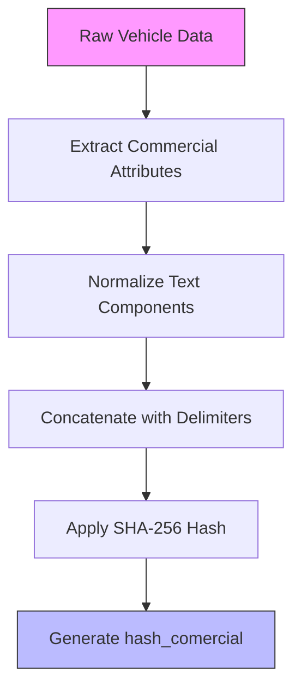
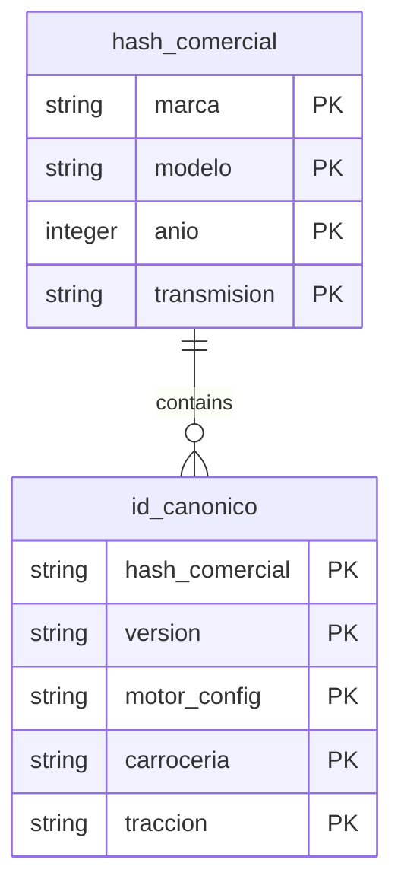

# hash_comercial Calculation

<cite>
**Referenced Files in This Document**   
- [instrucciones.md](file://instrucciones.md)
- [src/supabase/Replanteamiento homologacion.md](file://src/supabase/Replanteamiento homologacion.md)
- [src/insurers/hdi/hdi-analisis.md](file://src/insurers/hdi/hdi-analisis.md)
- [WARP.md](file://WARP.md)
</cite>

## Table of Contents
1. [Introduction](#introduction)
2. [hash_comercial Definition and Purpose](#hash_comercial-definition-and-purpose)
3. [Calculation Methodology](#calculation-methodology)
4. [Differentiation of Commercial Variants](#differentiation-of-commercial-variants)
5. [Real-World Examples from Insurer Data](#real-world-examples-from-insurer-data)
6. [Integration with Canonical Identification](#integration-with-canonical-identification)
7. [Role in Data Integrity and Upsert Operations](#role-in-data-integrity-and-upsert-operations)
8. [Normalization Process](#normalization-process)
9. [Conclusion](#conclusion)

## Introduction
The `hash_comercial` mechanism serves as a critical component in the vehicle catalog homologation system, enabling precise identification and tracking of commercial vehicle variants across multiple insurance providers. This document details the technical implementation and business value of the `hash_comercial` generation process, focusing on its role in differentiating commercial variants while maintaining linkage to canonical vehicle records through `id_canonico`. The system processes data from 11 Mexican insurance companies including Qualitas, HDI, AXA, GNP, Mapfre, Chubb, Zurich, Atlas, BX, El Potosí, and ANA, unifying their disparate catalog formats into a single canonical model.

**Section sources**
- [instrucciones.md](file://instrucciones.md#L0-L279)

## hash_comercial Definition and Purpose
The `hash_comercial` is a SHA-256 cryptographic hash that uniquely identifies the commercial aspects of a vehicle, serving as a fine-grained identifier that captures brand, model, year, and transmission specifications. Unlike the canonical identifier `id_canonico`, which includes technical specifications, `hash_comercial` focuses specifically on the commercial attributes that insurers use to categorize and price vehicles. This separation allows the system to track commercial variants of the same canonical vehicle while maintaining data integrity across different insurance providers. The hash serves as a primary key for commercial variant identification and enables efficient indexing and querying of vehicle data in the homologated catalog.

**Section sources**
- [instrucciones.md](file://instrucciones.md#L99-L106)
- [src/supabase/Replanteamiento homologacion.md](file://src/supabase/Replanteamiento homologacion.md#L99-L106)

## Calculation Methodology
The `hash_comercial` is calculated using a SHA-256 hash function applied to a concatenated string of normalized commercial attributes: brand, model, year, and transmission. The calculation follows a systematic process where these four components are joined with pipe (|) delimiters and then subjected to cryptographic hashing. Before hashing, each component undergoes a standard normalization process that converts text to uppercase, trims whitespace, eliminates double spaces, and maps common abbreviations to their canonical forms (e.g., "AUT." becomes "AUTO"). This ensures consistency across different data sources and prevents hash collisions due to formatting differences. The resulting 64-character hexadecimal string serves as a unique commercial identifier that can be efficiently stored and indexed in the database.

**Diagram sources**
- [instrucciones.md](file://instrucciones.md#L99-L106)
- [src/supabase/Replanteamiento homologacion.md](file://src/supabase/Replanteamiento homologacion.md#L99-L106)

**Section sources**
- [instrucciones.md](file://instrucciones.md#L99-L106)
- [src/supabase/Replanteamiento homologacion.md](file://src/supabase/Replanteamiento homologacion.md#L99-L106)

## Differentiation of Commercial Variants
The `hash_comercial` mechanism enables precise differentiation between commercial variants of the same canonical vehicle by focusing on the core commercial attributes that insurers use for pricing and availability. For example, two vehicles with identical technical specifications but different trim levels (such as 'Limited' vs 'Sport') will share the same `id_canonico` but may have different `hash_comercial` values if their transmission or other commercial attributes differ. This distinction is critical for accurate tracking of insurer-specific offerings, as it allows the system to maintain separate commercial records for variants that may have different pricing, availability, or coverage terms. The hash effectively creates a commercial fingerprint that captures the essential market-facing characteristics of a vehicle while remaining independent of technical specifications like engine configuration or drivetrain.

**Section sources**
- [instrucciones.md](file://instrucciones.md#L99-L106)
- [src/supabase/Replanteamiento homologacion.md](file://src/supabase/Replanteamiento homologacion.md#L99-L106)

## Real-World Examples from Insurer Data
Analysis of HDI insurer data demonstrates how minor differences in trim descriptions produce distinct `hash_comercial` values. For instance, the trim "GLS PREMIUM" and "LIMITED" for the same brand, model, year, and transmission combination generate different commercial hashes due to their distinct trim designations. Similarly, the trims "BASE" and "ADVANCE" create unique commercial identifiers despite sharing identical technical specifications. These differences are critical for accurate tracking, as insurers often price these variants differently based on market positioning. The system's ability to generate distinct hashes for these commercial variants ensures that each insurer's specific pricing and availability data is accurately maintained in the homologated catalog, preventing conflation of different commercial offerings that share the same underlying vehicle platform.

**Section sources**
- [src/insurers/hdi/hdi-analisis.md](file://src/insurers/hdi/hdi-analisis.md#L356-L486)
- [WARP.md](file://WARP.md#L95-L150)

## Integration with Canonical Identification
The `hash_comercial` works in conjunction with the `id_canonico` to create a hierarchical identification system that links commercial variants to their canonical vehicle records. While `hash_comercial` captures the commercial attributes (brand, model, year, transmission), the `id_canonico` extends this by incorporating technical specifications (version, motor configuration, body style, drivetrain) into a comprehensive vehicle fingerprint. This relationship enables the system to maintain insurer-specific commercial data while preserving the connection to the canonical vehicle record. When a new commercial variant is processed, its `hash_comercial` is used to identify the appropriate commercial category, while its `id_canonico` ensures it is correctly associated with the underlying vehicle platform. This dual-identifier system supports both granular commercial tracking and holistic vehicle management across multiple insurance providers.

**Diagram sources**
- [instrucciones.md](file://instrucciones.md#L99-L106)
- [src/supabase/Replanteamiento homologacion.md](file://src/supabase/Replanteamiento homologacion.md#L99-L106)

**Section sources**
- [instrucciones.md](file://instrucciones.md#L99-L106)
- [src/supabase/Replanteamiento homologacion.md](file://src/supabase/Replanteamiento homologacion.md#L99-L106)

## Role in Data Integrity and Upsert Operations
The `hash_comercial` plays a crucial role in preventing accidental overwrites of insurer-specific commercial data during upsert operations by serving as a stable reference point for commercial variant identification. When processing batches of vehicle data, the system uses the `id_canonico` as the primary upsert key, ensuring that updates to technical specifications are properly merged. However, the `hash_comercial` provides an additional layer of protection by enabling the system to track commercial variants independently. During the merge process, the RPC function updates the JSONB `disponibilidad` field for the specific insurer without affecting other insurers' data, using the `hash_comercial` to verify that the commercial context remains consistent. This prevents scenarios where updates from one insurer could inadvertently overwrite commercial data from another insurer, maintaining data integrity across the homologated catalog.

**Section sources**
- [instrucciones.md](file://instrucciones.md#L99-L106)
- [src/supabase/Replanteamiento homologacion.md](file://src/supabase/Replanteamiento homologacion.md#L99-L106)

## Normalization Process
The normalization process for `hash_comercial` generation follows a standardized sequence of text transformations designed to ensure consistency across disparate data sources. Each commercial attribute undergoes several processing steps: conversion to uppercase, Unicode normalization to remove diacritical marks, replacement of special characters with spaces, consolidation of multiple spaces into single spaces, and trimming of leading and trailing whitespace. Additionally, common abbreviations are mapped to their canonical forms according to predefined rules (e.g., "AUT." becomes "AUTO", "STD" becomes "MANUAL"). This comprehensive normalization ensures that variations in formatting, capitalization, and abbreviation usage across different insurance providers do not result in different `hash_comercial` values for identical commercial offerings. The process is implemented consistently across all insurer data processing workflows, guaranteeing uniformity in the homologated catalog.

**Section sources**
- [instrucciones.md](file://instrucciones.md#L99-L106)
- [src/supabase/Replanteamiento homologacion.md](file://src/supabase/Replanteamiento homologacion.md#L99-L106)

## Conclusion
The `hash_comercial` mechanism represents a sophisticated solution for managing commercial vehicle variants in a multi-insurer catalog homologation system. By leveraging SHA-256 hashing of normalized commercial attributes, the system creates unique identifiers that enable precise tracking of insurer-specific offerings while maintaining linkage to canonical vehicle records through `id_canonico`. This approach successfully addresses the challenge of differentiating commercial variants like 'Limited' vs 'Sport' trims, ensuring accurate representation of pricing and availability data across different insurance providers. The integration of `hash_comercial` into the upsert process prevents accidental data overwrites and maintains data integrity, making it a critical component of the overall homologation architecture. As the system continues to process data from multiple insurers, the `hash_comercial` will remain essential for maintaining accurate, granular, and insurer-specific commercial vehicle information.