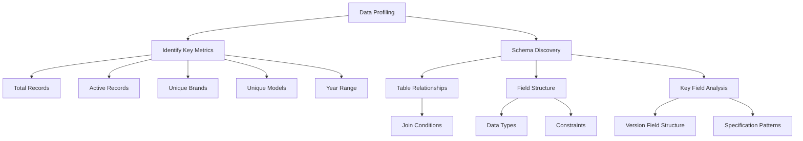
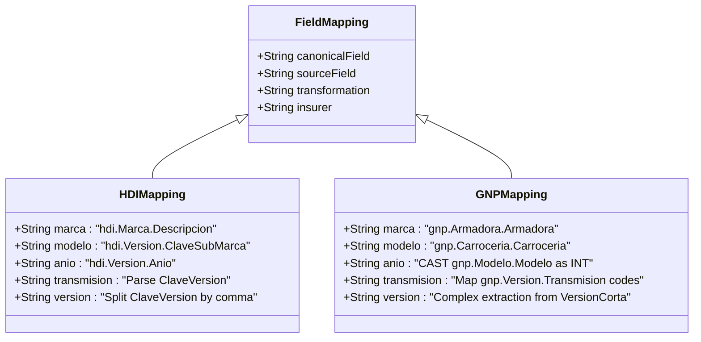
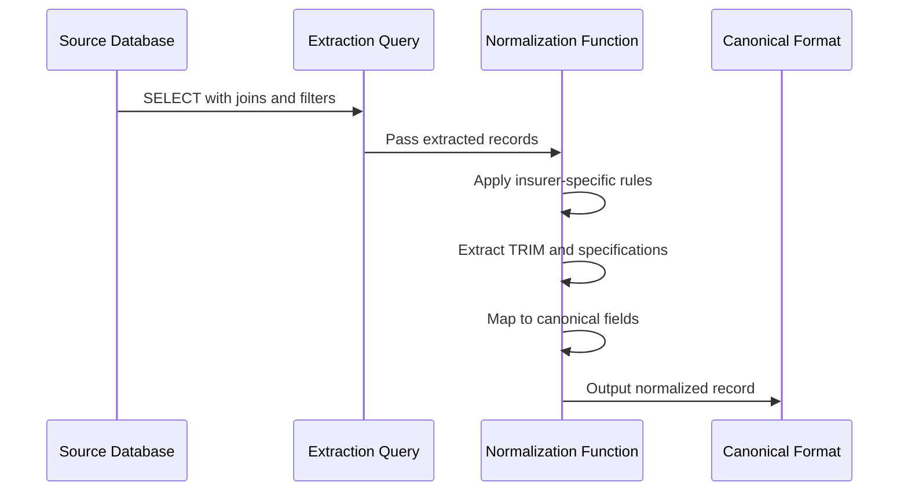
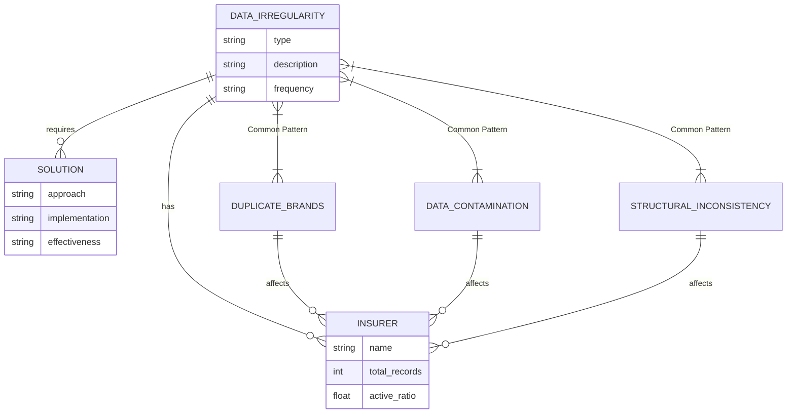
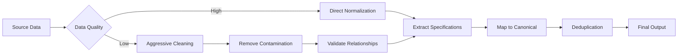

# Analysis Methodology

<cite>
**Referenced Files in This Document**   
- [hdi/hdi-analisis.md](file://src/insurers/hdi/hdi-analisis.md)
- [gnp/gnp-analisis.md](file://src/insurers/gnp/gnp-analisis.md)
- [qualitas/qualitas-analisis.md](file://src/insurers/qualitas/qualitas-analisis.md)
- [ana/ana-analisis.md](file://src/insurers/ana/ana-analisis.md)
- [atlas/atlas-analisis.md](file://src/insurers/atlas/atlas-analisis.md)
- [axa/axa-analisis.md](file://src/insurers/axa/axa-analisis.md)
- [bx/bx-analisis.md](file://src/insurers/bx/bx-analisis.md)
- [chubb/chubb-analisis.md](file://src/insurers/chubb/chubb-analisis.md)
- [elpotosi/elpotosi-analisis.md](file://src/insurers/elpotosi/elpotosi-analisis.md)
</cite>

## Table of Contents
1. [Introduction](#introduction)
2. [Core Analysis Framework](#core-analysis-framework)
3. [Data Profiling and Schema Discovery](#data-profiling-and-schema-discovery)
4. [Field Mapping Challenges](#field-mapping-challenges)
5. [Data Quality Observations](#data-quality-observations)
6. [Normalization Rules and Query Design](#normalization-rules-and-query-design)
7. [Common Patterns in Data Irregularities](#common-patterns-in-data-irregularities)
8. [Systematic Resolution in Downstream Processing](#systematic-resolution-in-downstream-processing)
9. [Guidance for New Insurer Onboarding](#guidance-for-new-insurer-onboarding)
10. [Conclusion](#conclusion)

## Introduction

The analysis methodology across all insurers follows a standardized approach to document source data profiling, schema discovery, field mapping challenges, and data quality observations. Each insurer's `analisis.md` file serves as a comprehensive technical document that captures the unique characteristics of their data structure while identifying common patterns of data irregularities. This methodology enables the creation of consistent normalization rules and extraction queries that transform heterogeneous data into a unified canonical format. The analysis process is critical for ensuring data quality and consistency across the homologation system, particularly when dealing with inconsistent naming conventions, missing fields, and varying technical specification formats.

**Section sources**
- [hdi/hdi-analisis.md](file://src/insurers/hdi/hdi-analisis.md#L1-L50)
- [gnp/gnp-analisis.md](file://src/insurers/gnp/gnp-analisis.md#L1-L50)

## Core Analysis Framework

The core analysis framework employed across all insurers consists of a systematic approach to evaluating and normalizing vehicle catalog data. Each `analisis.md` file follows a consistent structure that begins with an executive summary of key metrics, followed by critical findings, field mapping, normalization rules, and quality metrics. The framework emphasizes data profiling to understand the structure and quality of source data, schema discovery to identify relationships between tables and fields, and detailed documentation of field mapping challenges. This standardized approach ensures that despite the variations in data quality and structure across insurers, the analysis process remains consistent and produces comparable results.

The framework also includes specific sections for documenting data quality observations, which are crucial for identifying patterns of data irregularities. These observations inform the development of normalization rules and extraction queries that address the specific challenges presented by each insurer's data. The analysis documents serve as a bridge between the raw source data and the normalized canonical format, providing a clear rationale for the decisions made during the homologation process.

**Section sources**
- [hdi/hdi-analisis.md](file://src/insurers/hdi/hdi-analisis.md#L1-L100)
- [gnp/gnp-analisis.md](file://src/insurers/gnp/gnp-analisis.md#L1-L100)
- [qualitas/qualitas-analisis.md](file://src/insurers/qualitas/qualitas-analisis.md#L1-L100)

## Data Profiling and Schema Discovery

Data profiling and schema discovery are the foundational steps in the analysis methodology. Each `analisis.md` file begins with a comprehensive profiling of the source data, including metrics such as total records, active records, unique brands, unique models, and year range. This profiling provides a high-level understanding of the data landscape and helps identify potential issues such as low ratios of active records or inconsistent data distribution.

For example, the HDI analysis reveals a 45.15% ratio of active records, while GNP lacks an active/vigent field entirely, requiring all records to be processed. The schema discovery process involves identifying the relationships between tables and fields, such as the join between version and brand tables, and understanding the structure of key fields like version descriptions. This process often uncovers critical findings, such as HDI's highly standardized structure with comma-separated components or GNP's problematic VersionCorta field with cross-contamination of data from other brands.

The analysis documents also include detailed statistics on the presence of specific elements within key fields. For instance, HDI's analysis shows that 67.6% of active records specify doors, 69.0% specify displacement, and 63.2% specify engine configuration. These statistics are crucial for understanding the completeness of the data and informing the normalization strategy.



**Diagram sources**
- [hdi/hdi-analisis.md](file://src/insurers/hdi/hdi-analisis.md#L1-L50)
- [gnp/gnp-analisis.md](file://src/insurers/gnp/gnp-analisis.md#L1-L50)

**Section sources**
- [hdi/hdi-analisis.md](file://src/insurers/hdi/hdi-analisis.md#L1-L100)
- [gnp/gnp-analisis.md](file://src/insurers/gnp/gnp-analisis.md#L1-L100)

## Field Mapping Challenges

Field mapping challenges are a critical component of the analysis methodology, documented in detail within each insurer's `analisis.md` file. These challenges arise from inconsistent naming conventions, missing fields, and varying technical specification formats across different insurers. The analysis documents systematically identify these challenges and propose solutions for mapping source fields to the canonical schema.

For example, the HDI analysis identifies the challenge of extracting the TRIM from the ClaveVersion field, which requires parsing the text before the first comma. The solution involves a JavaScript function that splits the field by commas and takes the first part as the TRIM. In contrast, GNP faces the challenge of a highly problematic VersionCorta field with cross-contamination of data from other brands, requiring aggressive cleaning and validation to remove incorrect brand and model information.

The field mapping section typically includes a table that maps canonical fields to their source fields and specifies the required transformations. For HDI, this includes mapping the canonical "marca" field to "hdi.Marca.Descripcion" with a join on IdMarca, and the "modelo" field to "hdi.Version.ClaveSubMarca" directly. For GNP, the mapping includes consolidating duplicate brands like "GENERAL MOTORS" and "GENERAL MOTORS 2" into "GMC" during normalization.

These mapping challenges highlight the need for insurer-specific normalization rules that address the unique characteristics of each data source. The analysis documents provide a clear rationale for these rules, ensuring that the mapping process is transparent and reproducible.



**Diagram sources**
- [hdi/hdi-analisis.md](file://src/insurers/hdi/hdi-analisis.md#L1-L50)
- [gnp/gnp-analisis.md](file://src/insurers/gnp/gnp-analisis.md#L1-L50)

**Section sources**
- [hdi/hdi-analisis.md](file://src/insurers/hdi/hdi-analisis.md#L1-L100)
- [gnp/gnp-analisis.md](file://src/insurers/gnp/gnp-analisis.md#L1-L100)

## Data Quality Observations

Data quality observations are a crucial component of the analysis methodology, providing insights into the reliability and completeness of source data. Each `analisis.md` file documents specific data quality issues encountered during the analysis, ranging from missing fields and inconsistent naming conventions to data contamination and structural problems.

For HDI, the data quality is relatively high, with a clean structure and consistent separation of components by commas. However, challenges include low presence of traction specifications (5.5% of records) and the need to ignore the confusing Transmision table in favor of extracting transmission directly from the ClaveVersion field. In contrast, GNP presents significant data quality issues, including the absence of an active/vigent field, severe cross-contamination in the VersionCorta field (8% of records have incorrect brand/model information), and massive data duplication.

The analysis documents also include metrics on the presence of specific elements within key fields. For example, the HDI analysis shows that only 3.7% of records specify 4X4 traction, while GNP's analysis reveals that only 10% of records have identifiable TRIMs in the VersionCorta field. These observations are critical for understanding the limitations of the data and informing the normalization strategy.

The data quality section often includes recommendations for addressing these issues, such as implementing aggressive validation to remove contaminated data, creating dictionaries to map duplicate brands, or using fallback strategies when primary fields are missing. These recommendations ensure that the normalization process can handle the specific quality challenges of each insurer's data.

```mermaid
flowchart TD
A[Data Quality Issues] --> B[Missing Fields]
A --> C[Inconsistent Naming]
A --> D[Data Contamination]
A --> E[Structural Problems]
A --> F[Duplication]
B --> G[No Active/Vigent Field (GNP)]
C --> H[Duplicate Brands (ANA)]
D --> I[Cross-Brand Contamination (GNP)]
E --> J[Inconsistent Version Formats (BX+)]
F --> K[Massive Duplicates (BX+)]
G --> L[Process All Records]
H --> M[Consolidate Duplicates]
I --> N[Aggressive Cleaning]
J --> O[Format Detection]
K --> P[Deduplication]
```

**Diagram sources**
- [hdi/hdi-analisis.md](file://src/insurers/hdi/hdi-analisis.md#L1-L50)
- [gnp/gnp-analisis.md](file://src/insurers/gnp/gnp-analisis.md#L1-L50)

**Section sources**
- [hdi/hdi-analisis.md](file://src/insurers/hdi/hdi-analisis.md#L1-L100)
- [gnp/gnp-analisis.md](file://src/insurers/gnp/gnp-analisis.md#L1-L100)

## Normalization Rules and Query Design

Normalization rules and query design are directly informed by the analysis documents, translating the insights gained from data profiling, schema discovery, and quality observations into actionable code and SQL queries. Each `analisis.md` file includes specific JavaScript functions for normalization and SQL queries for data extraction, ensuring that the homologation process is both systematic and reproducible.

For HDI, the normalization rules leverage the clean structure of the ClaveVersion field, with a JavaScript function that extracts the TRIM as the text before the first comma and parses other specifications using regular expressions. The extraction query includes a critical WHERE clause to filter only active records (Activo = 1), ensuring that only relevant data is processed.

In contrast, GNP requires more complex normalization rules due to the poor quality of the VersionCorta field. The JavaScript function includes aggressive cleaning to remove contaminated brand and model information, followed by a multi-step process to extract the TRIM by removing technical specifications and searching for valid TRIMs in a predefined list. The extraction query processes all records due to the absence of an active/vigent field, with additional validation to handle the data quality issues.

The analysis documents also include comprehensive checklists for validation, ensuring that the normalization process meets specific quality criteria. For HDI, this includes verifying that only active records are processed, transmission is normalized correctly, and TRIMs are extracted from the first part before the comma. For GNP, the checklist emphasizes not trusting the VersionCorta field for critical information and using the dedicated Transmision field as the primary source.



**Diagram sources**
- [hdi/hdi-analisis.md](file://src/insurers/hdi/hdi-analisis.md#L1-L50)
- [gnp/gnp-analisis.md](file://src/insurers/gnp/gnp-analisis.md#L1-L50)

**Section sources**
- [hdi/hdi-analisis.md](file://src/insurers/hdi/hdi-analisis.md#L1-L100)
- [gnp/gnp-analisis.md](file://src/insurers/gnp/gnp-analisis.md#L1-L100)

## Common Patterns in Data Irregularities

The analysis of multiple insurers reveals common patterns in data irregularities that can be systematically addressed in the homologation process. These patterns include inconsistent naming conventions, missing fields, data contamination, and structural inconsistencies in key fields like version descriptions.

One common pattern is the presence of duplicate or inconsistent brand names, such as "GENERAL MOTORS" and "GENERAL MOTORS 2" in GNP, or "ISUZU" and "IZSUZU" in ANA. These duplicates require consolidation during normalization to ensure consistent brand representation in the canonical format.

Another common pattern is data contamination in version fields, where information from other brands or models appears in the version description. This is particularly severe in GNP, where approximately 8% of records contain incorrect brand/model information in the VersionCorta field. This contamination requires aggressive cleaning and validation to remove incorrect data before processing.

Structural inconsistencies in version fields are also common, with different insurers using different formats and separators. HDI uses a clean comma-separated structure, while GNP has a chaotic mix of specifications without consistent separation. BX+ has three distinct formats in its descVersion field, requiring format detection before processing.

These common patterns highlight the need for flexible normalization rules that can handle a variety of data structures and quality issues. The analysis documents provide a foundation for developing these rules by documenting the specific challenges encountered with each insurer's data.



**Diagram sources**
- [hdi/hdi-analisis.md](file://src/insurers/hdi/hdi-analisis.md#L1-L50)
- [gnp/gnp-analisis.md](file://src/insurers/gnp/gnp-analisis.md#L1-L50)

**Section sources**
- [hdi/hdi-analisis.md](file://src/insurers/hdi/hdi-analisis.md#L1-L100)
- [gnp/gnp-analisis.md](file://src/insurers/gnp/gnp-analisis.md#L1-L100)

## Systematic Resolution in Downstream Processing

The analysis methodology enables systematic resolution of data irregularities in downstream processing through the development of insurer-specific normalization rules and extraction queries. These rules and queries are designed to address the specific challenges identified in the analysis documents, ensuring that heterogeneous data is transformed into a consistent canonical format.

For example, the HDI analysis identifies the clean structure of the ClaveVersion field, leading to a straightforward normalization process that extracts the TRIM as the text before the first comma and parses other specifications using regular expressions. This systematic approach ensures high-quality output with minimal data loss.

In contrast, the GNP analysis reveals severe data quality issues, requiring a more complex resolution strategy. The normalization process includes aggressive cleaning to remove contaminated brand and model information, validation of brand-model relationships against a master catalog, and conservative handling of missing or uncertain data. This systematic approach prioritizes data accuracy over completeness, accepting null values rather than inventing incorrect data.

The downstream processing also includes deduplication steps to address the massive duplication issues identified in insurers like BX+. This involves generating unique hashes for each record and removing duplicates before final processing. The analysis documents provide the foundation for these deduplication rules by identifying the specific patterns of duplication in each insurer's data.

These systematic resolution strategies ensure that the homologation process produces high-quality, consistent data despite the varying quality and structure of the source data. The analysis documents serve as a critical reference point throughout this process, providing the rationale for the decisions made in the normalization rules and extraction queries.



**Diagram sources**
- [hdi/hdi-analisis.md](file://src/insurers/hdi/hdi-analisis.md#L1-L50)
- [gnp/gnp-analisis.md](file://src/insurers/gnp/gnp-analisis.md#L1-L50)

**Section sources**
- [hdi/hdi-analisis.md](file://src/insurers/hdi/hdi-analisis.md#L1-L100)
- [gnp/gnp-analisis.md](file://src/insurers/gnp/gnp-analisis.md#L1-L100)

## Guidance for New Insurer Onboarding

The analysis methodology provides clear guidance for onboarding new insurers, based on the patterns and challenges identified across existing insurers. When onboarding a new insurer, the first step is to conduct a comprehensive data profiling and schema discovery process, similar to the executive summary in existing `analisis.md` files. This includes identifying key metrics such as total records, active records, unique brands, unique models, and year range.

The next step is to analyze the structure of key fields, particularly the version description field, to identify patterns and inconsistencies. This analysis should document the presence of specific elements like transmission, displacement, and TRIM, similar to the statistics provided in existing analysis documents. The goal is to understand the completeness and quality of the data and identify any major issues such as data contamination or structural inconsistencies.

Based on this analysis, the field mapping process can begin, creating a table that maps canonical fields to their source fields and specifying the required transformations. This should include handling of duplicate or inconsistent brand names, extraction of specifications from the version field, and normalization of transmission codes.

The data quality observations should inform the development of normalization rules and extraction queries. For insurers with high-quality data like HDI, the rules can be straightforward and focused on parsing the clean structure. For insurers with poor-quality data like GNP, the rules should include aggressive cleaning, validation, and conservative handling of missing or uncertain data.

Finally, the onboarding process should include comprehensive validation and testing, using the checklists and metrics from existing analysis documents as a guide. This ensures that the new insurer's data is processed consistently with existing insurers and meets the quality standards of the homologation system.

**Section sources**
- [hdi/hdi-analisis.md](file://src/insurers/hdi/hdi-analisis.md#L1-L100)
- [gnp/gnp-analisis.md](file://src/insurers/gnp/gnp-analisis.md#L1-L100)

## Conclusion

The analysis methodology across all insurers provides a comprehensive framework for documenting source data profiling, schema discovery, field mapping challenges, and data quality observations. Each insurer's `analisis.md` file serves as a detailed technical document that captures the unique characteristics of their data structure while identifying common patterns of data irregularities. This methodology enables the creation of consistent normalization rules and extraction queries that transform heterogeneous data into a unified canonical format.

The examples from HDI and GNP illustrate the range of data quality and structure encountered in the homologation process. HDI's clean, standardized structure allows for straightforward parsing and high-quality output, while GNP's problematic data requires aggressive cleaning and validation to ensure accuracy. These contrasting examples highlight the flexibility and adaptability of the analysis methodology, which can handle both high-quality and low-quality data sources.

The analysis documents directly inform the normalization rules and extraction query design, providing a clear rationale for the decisions made in the homologation process. By systematically addressing inconsistent naming conventions, missing fields, and technical specification formats, the methodology ensures that the final output is consistent, reliable, and suitable for downstream processing.

The common patterns in data irregularities identified across insurers provide valuable insights for improving the homologation system and onboarding new insurers. By understanding these patterns, the team can develop more robust normalization rules and extraction queries that handle a variety of data structures and quality issues. This systematic approach ensures that the homologation process produces high-quality, consistent data despite the challenges presented by heterogeneous source data.