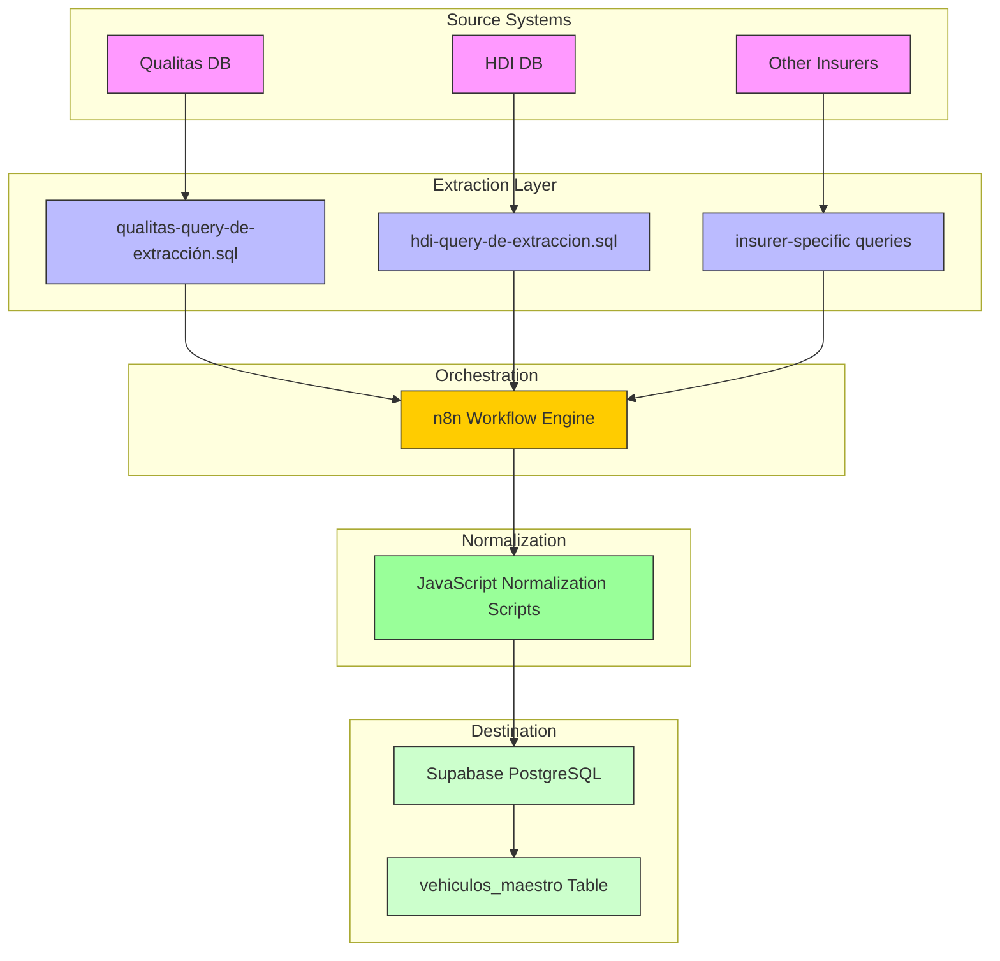
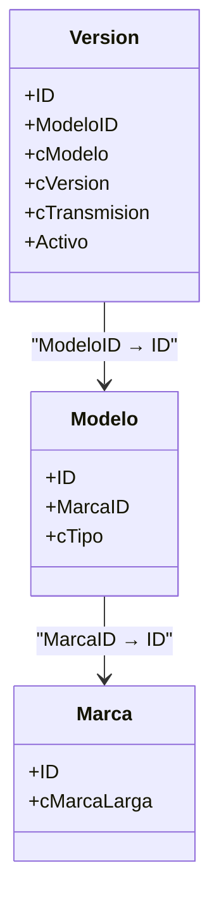
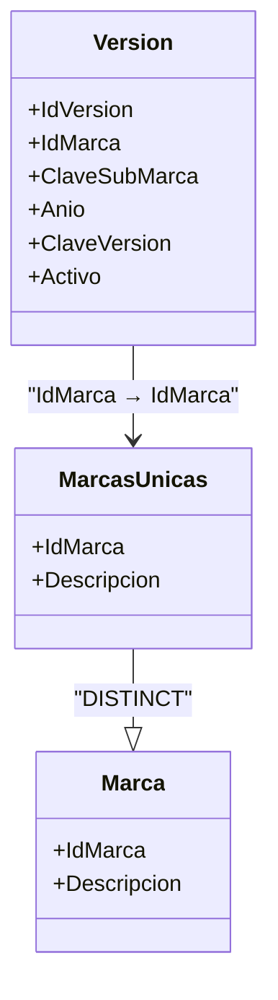

# Extraction Queries

<cite>
**Referenced Files in This Document**   
- [qualitas-query-de-extracción.sql](file://src/insurers/qualitas/qualitas-query-de-extracción.sql)
- [hdi-query-de-extraccion.sql](file://src/insurers/hdi/hdi-query-de-extraccion.sql)
- [instrucciones.md](file://instrucciones.md)
- [Tabla maestra.sql](file://src/supabase/Tabla maestra.sql)
</cite>

## Table of Contents
1. [Introduction](#introduction)
2. [Project Structure and Data Flow](#project-structure-and-data-flow)
3. [Core Principles of Insurer-Specific Extraction Queries](#core-principles-of-insurer-specific-extraction-queries)
4. [Query Design Patterns and Optimization Techniques](#query-design-patterns-and-optimization-techniques)
5. [Case Study: Qualitas Query Analysis](#case-study-qualitas-query-analysis)
6. [Case Study: HDI Query Analysis](#case-study-hdi-query-analysis)
7. [Comparison of JOIN and Filtering Strategies](#comparison-of-join-and-filtering-strategies)
8. [Best Practices for Writing and Testing New Extraction Queries](#best-practices-for-writing-and-testing-new-extraction-queries)
9. [Conclusion](#conclusion)

## Introduction

This document provides a comprehensive analysis of insurer-specific SQL queries used to extract raw vehicle catalog data from heterogeneous database systems. The primary objective is to understand how these queries are designed to retrieve maximum relevant data while minimizing load on source systems, ensuring compatibility with downstream normalization and homogenization processes. Special focus is placed on two representative insurers—Qualitas and HDI—to illustrate differences in schema structure, JOIN strategies, filtering logic, and handling of proprietary data formats.

The extracted data feeds into a canonical vehicle catalog model stored in Supabase, enabling unified access across multiple insurance providers. Each query must balance completeness, performance, and system impact, adhering to strict guidelines for active record filtering, column projection, and idempotency.

**Section sources**
- [instrucciones.md](file://instrucciones.md#L1-L279)

## Project Structure and Data Flow

The repository follows a modular structure where each insurer has its own directory containing three key artifacts: an analysis document, a data extraction SQL query, and optionally, a normalization script (typically in JavaScript for use in n8n workflows). These components work together within a larger ETL pipeline orchestrated via n8n, which extracts data using the insurer-specific queries, normalizes it into a canonical format, and loads it into Supabase through a remote procedure call (RPC).

The Supabase backend hosts the canonical table `vehiculos_maestro`, which stores homogenized vehicle data with full traceability back to original insurer records via JSONB fields. This architecture ensures data integrity, supports historical tracking of active/inactive statuses, and enables efficient querying through indexed fields such as `hash_comercial` and `id_canonico`.

**Diagram sources**
- [instrucciones.md](file://instrucciones.md#L1-L279)
- [Tabla maestra.sql](file://src/supabase/Tabla maestra.sql#L1-L100)

**Section sources**
- [instrucciones.md](file://instrucciones.md#L1-L279)
- [Tabla maestra.sql](file://src/supabase/Tabla maestra.sql#L1-L100)

## Core Principles of Insurer-Specific Extraction Queries

Each extraction query is tailored to the unique schema and naming conventions of the respective insurer’s database. Despite structural differences, all queries adhere to a common set of principles:

- **Selective Projection**: Only necessary columns are retrieved to reduce memory footprint and network transfer.
- **Active Record Filtering**: A critical `WHERE` clause filters only active records (`Activo = 1`), significantly reducing volume and ensuring relevance.
- **Temporal Constraints**: All queries restrict results to vehicles between model years 2000 and 2030, avoiding outdated or speculative entries.
- **Deterministic Ordering**: Results are ordered consistently (typically by brand, model, year) to support batching and change detection.
- **Source Identification**: A static field `origen_aseguradora` identifies the insurer, enabling traceability in the canonical model.

These principles ensure that each query delivers clean, relevant, and manageable datasets suitable for downstream processing without overloading source databases.

**Section sources**
- [instrucciones.md](file://instrucciones.md#L1-L279)
- [qualitas-query-de-extracción.sql](file://src/insurers/qualitas/qualitas-query-de-extracción.sql#L1-L26)
- [hdi-query-de-extraccion.sql](file://src/insurers/hdi/hdi-query-de-extraccion.sql#L1-L27)

## Query Design Patterns and Optimization Techniques

Insurer-specific queries employ several optimization techniques to enhance performance and minimize system load:

- **Index Utilization**: Queries are structured to leverage existing indexes on primary keys, active flags, and model years.
- **Column Projection**: Only required fields are selected, avoiding `SELECT *` patterns that increase I/O.
- **Avoidance of N+1 Patterns**: All necessary data is retrieved in a single query using JOINs rather than multiple round-trips.
- **Use of CTEs for Deduplication**: When source tables contain duplicates (e.g., HDI’s `Marca` table), Common Table Expressions (CTEs) are used to deduplicate before joining.
- **Computed Field Handling**: Where direct fields are missing (e.g., transmission type), logic is simplified and deferred to the normalization layer (n8n) when complex parsing is required.

These techniques collectively ensure that queries remain efficient even when dealing with large datasets, while also maintaining clarity and maintainability.

**Section sources**
- [hdi-query-de-extraccion.sql](file://src/insurers/hdi/hdi-query-de-extraccion.sql#L1-L27)
- [qualitas-query-de-extracción.sql](file://src/insurers/qualitas/qualitas-query-de-extracción.sql#L1-L26)

## Case Study: Qualitas Query Analysis

The Qualitas extraction query demonstrates a straightforward relational JOIN pattern across three tables: `Version`, `Modelo`, and `Marca`. It retrieves active vehicle versions with full brand and model context, projecting only essential attributes.

Key features include:
- **Direct JOINs** on foreign keys (`ModeloID`, `MarcaID`) to resolve hierarchical relationships.
- **Year Extraction** from the `cModelo` string using `LEFT()` and `CAST()` functions, assuming the first four characters represent the year.
- **Transmission Mapping** via a `CASE` statement that converts single-letter codes (`A` → `AUTO`, `S` → `MANUAL`).
- **Critical Filtering** on `v.Activo = 1` to include only active records, reducing the dataset from ~257,000 to ~39,715 entries (15.47%).

The query is optimized for execution in n8n without timeout issues, indicating careful attention to performance constraints in the orchestration environment.

**Diagram sources**
- [qualitas-query-de-extracción.sql](file://src/insurers/qualitas/qualitas-query-de-extracción.sql#L1-L26)

**Section sources**
- [qualitas-query-de-extracción.sql](file://src/insurers/qualitas/qualitas-query-de-extracción.sql#L1-L26)

## Case Study: HDI Query Analysis

The HDI extraction query addresses a more complex data quality issue: duplicate entries in the `Marca` table. To ensure accurate joins, it uses a CTE named `MarcasUnicas` to deduplicate brands before joining with the `Version` table.

Notable aspects:
- **CTE for Deduplication**: `DISTINCT` is applied to `IdMarca` and `Descripcion` to eliminate redundant brand entries.
- **LEFT JOIN Usage**: Ensures all versions are retained even if a matching brand is missing, preserving data completeness.
- **Missing Transmission Data**: The `transmision` field is set to `NULL`, with a comment indicating it will be processed later in n8n, reflecting a deliberate separation of concerns.
- **Efficient Filtering**: Applies `Activo = 1` and `Anio BETWEEN 2000 AND 2030` to limit result size, retrieving ~38,186 active records (45.15% of total).

This design prioritizes data integrity and robustness over completeness at the SQL level, delegating complex parsing to the more flexible JavaScript environment in n8n.

**Diagram sources**
- [hdi-query-de-extraccion.sql](file://src/insurers/hdi/hdi-query-de-extraccion.sql#L1-L27)

**Section sources**
- [hdi-query-de-extraccion.sql](file://src/insurers/hdi/hdi-query-de-extraccion.sql#L1-L27)

## Comparison of JOIN and Filtering Strategies

| Feature | Qualitas | HDI |
|-------|--------|-----|
| **JOIN Type** | INNER JOIN | LEFT JOIN |
| **Deduplication** | Not required | CTE with DISTINCT |
| **Transmission Source** | Direct field with CASE mapping | NULL (deferred to n8n) |
| **Year Source** | Extracted from string (LEFT + CAST) | Direct integer field |
| **Active Filter** | `Activo = 1` | `Activo = 1` |
| **Data Volume Reduction** | 84.53% filtered out | 54.85% filtered out |
| **Schema Complexity** | Low (clean relational model) | Medium (duplicates in reference data) |

This comparison highlights how schema quality directly influences query complexity. Qualitas benefits from a clean, normalized schema allowing simple INNER JOINs, while HDI requires additional logic to handle data inconsistencies. Both, however, apply consistent filtering and projection strategies to optimize performance.

**Section sources**
- [qualitas-query-de-extracción.sql](file://src/insurers/qualitas/qualitas-query-de-extracción.sql#L1-L26)
- [hdi-query-de-extraccion.sql](file://src/insurers/hdi/hdi-query-de-extraccion.sql#L1-L27)

## Best Practices for Writing and Testing New Extraction Queries

When integrating additional insurers, follow these best practices to ensure consistency, performance, and reliability:

1. **Profile the Source Schema First**: Use analytical queries to assess cardinality, null rates, duplicates, and data types before writing the extraction logic.
2. **Filter Early and Often**: Always apply `Activo = 1` and `anio BETWEEN 2000 AND 2030` in the `WHERE` clause to minimize result size.
3. **Use CTEs for Data Cleaning**: If source tables contain duplicates or inconsistencies, resolve them in a CTE before joining.
4. **Prefer LEFT JOINs for Optional Relationships**: Avoid losing data due to missing parents; handle missing values downstream.
5. **Defer Complex Parsing to n8n**: If field extraction requires regex or complex string manipulation, return raw text and process it in JavaScript.
6. **Test with Realistic Volumes**: Validate query performance with full or sampled datasets to avoid timeouts in n8n.
7. **Ensure Deterministic Output**: Use `ORDER BY` on stable keys (e.g., brand, model, year) to support batching and change detection.
8. **Document Assumptions Clearly**: Include comments explaining any data assumptions (e.g., "first 4 chars of cModelo = year").
9. **Validate Against Canonical Model**: Confirm that all required canonical fields (`marca`, `modelo`, `anio`, etc.) can be derived from the extracted data.
10. **Monitor and Iterate**: After deployment, monitor ingestion metrics and refine queries based on actual performance and data quality.

Following these practices ensures that new insurer integrations are robust, maintainable, and aligned with the overall homogenization pipeline.

**Section sources**
- [instrucciones.md](file://instrucciones.md#L1-L279)
- [qualitas-query-de-extracción.sql](file://src/insurers/qualitas/qualitas-query-de-extracción.sql#L1-L26)
- [hdi-query-de-extraccion.sql](file://src/insurers/hdi/hdi-query-de-extraccion.sql#L1-L27)

## Conclusion

Insurer-specific data extraction queries play a critical role in building a unified vehicle catalog from diverse and heterogeneous sources. By analyzing the implementations for Qualitas and HDI, we observe how different schema designs necessitate tailored JOIN strategies, filtering approaches, and data handling techniques. Despite these differences, both queries adhere to core principles of efficiency, traceability, and minimal system impact.

The use of CTEs, selective projection, and strategic deferral of complex logic to the normalization layer exemplifies a pragmatic approach to ETL design. As new insurers are integrated, adherence to established best practices will ensure consistency, scalability, and long-term maintainability of the homogenization pipeline.