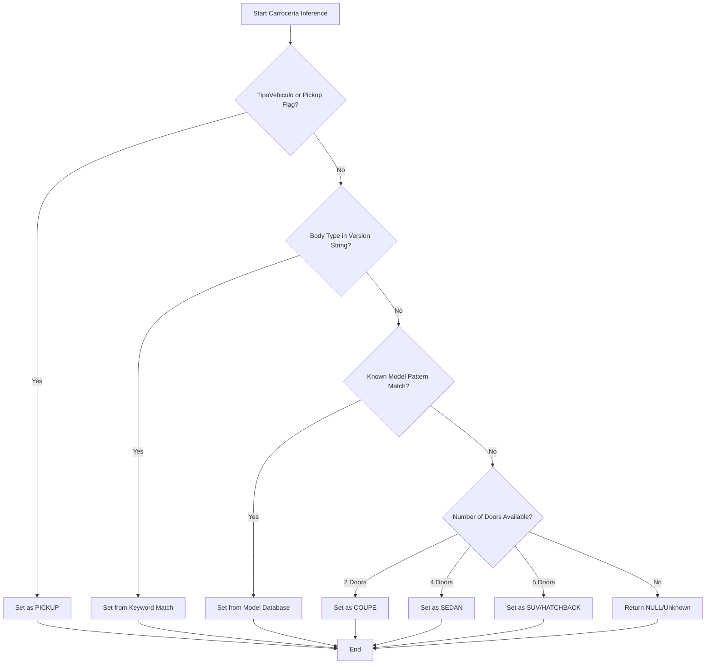

# Standard Normalization Scripts

<cite>
**Referenced Files in This Document**   
- [gnp-codigo-de-normalizacion.js](file://src/insurers/gnp/gnp-codigo-de-normalizacion.js)
- [hdi-codigo-de-normalizacion.js](file://src/insurers/hdi/hdi-codigo-de-normalizacion.js)
- [gnp-analisis.md](file://src/insurers/gnp/gnp-analisis.md)
- [hdi-analisis.md](file://src/insurers/hdi/hdi-analisis.md)
</cite>

## Table of Contents
1. [Introduction](#introduction)
2. [Core Transformation Patterns](#core-transformation-patterns)
3. [Text Normalization Techniques](#text-normalization-techniques)
4. [Field Mapping Strategies](#field-mapping-strategies)
5. [Carrocería Inference Logic](#carroceria-inference-logic)
6. [Error Handling and Logging](#error-handling-and-logging)
7. [Performance Optimizations](#performance-optimizations)
8. [Normalization Template](#normalization-template)
9. [Implementation Guidelines](#implementation-guidelines)

## Introduction

This document details the standard JavaScript normalization scripts used across multiple insurance providers, with a primary focus on GNP and HDI as representative examples. These Node.js-compatible scripts transform raw vehicle data into a unified master catalog format, addressing common challenges in automotive data standardization. The normalization process involves several key components: brand/model/year standardization, displacement parsing, trim and version extraction, and technical specification cleanup. These scripts are designed to handle significant data quality issues including missing values, inconsistent casing, special characters, and cross-contamination between brands. The implementation follows a consistent pattern across insurers while incorporating provider-specific rules to address unique data characteristics and quality issues.

**Section sources**
- [gnp-codigo-de-normalizacion.js](file://src/insurers/gnp/gnp-codigo-de-normalizacion.js#L1-L50)
- [hdi-codigo-de-normalizacion.js](file://src/insurers/hdi/hdi-codigo-de-normalizacion.js#L1-L50)

## Core Transformation Patterns

The normalization scripts implement several shared transformation patterns that are critical for creating a consistent vehicle catalog. Brand standardization follows a two-tier approach: first applying insurer-specific consolidations (such as mapping "GENERAL MOTORS" to "GMC" for GNP), then applying general synonym dictionaries for common brand variations (like "VW" to "VOLKSWAGEN" or "MERCEDES-BENZ" to "MERCEDES BENZ"). Model normalization removes redundant brand information from model names and handles special cases where models contain names of other brands due to data contamination. Year processing ensures consistent integer formatting and validates against reasonable ranges (typically 2000-2030). Displacement parsing extracts engine size information from version strings using regular expressions that identify patterns like "1.5L" or "2.0T", with validation to ensure values fall within plausible ranges (0.5-8.0 liters). Trim extraction follows a systematic approach of first removing technical specifications and then matching against known trim levels, with different insurers having distinct approaches to handling common problematic terms like "BASE" or "CP PUERTAS".

**Section sources**
- [gnp-codigo-de-normalizacion.js](file://src/insurers/gnp/gnp-codigo-de-normalizacion.js#L100-L250)
- [hdi-codigo-de-normalizacion.js](file://src/insurers/hdi/hdi-codigo-de-normalizacion.js#L100-L250)

## Text Normalization Techniques

Text normalization is a foundational component of the standard scripts, ensuring consistent processing of vehicle data regardless of input formatting. The `normalizarTexto` function serves as the primary utility, converting text to uppercase, removing accents via Unicode normalization (NFD decomposition), and replacing special characters with spaces. This function follows a specific sequence: first converting to string format, then applying Unicode normalization to separate base characters from diacritical marks, removing the diacritical marks, replacing non-alphanumeric characters (except spaces and hyphens) with spaces, collapsing multiple spaces into single spaces, and finally trimming whitespace. HDI's implementation includes an additional `limpiarTextoCompleto` function that specifically targets problematic quotation marks and backslashes before applying the standard normalization. Both GNP and HDI scripts handle inconsistent casing by standardizing to uppercase, ensuring case-insensitive matching during subsequent processing steps. Special character handling is particularly important for dealing with various quotation mark types (straight, curly, and Unicode variants) that may appear in the source data.

**Section sources**
- [gnp-codigo-de-normalizacion.js](file://src/insurers/gnp/gnp-codigo-de-normalizacion.js#L60-L90)
- [hdi-codigo-de-normalizacion.js](file://src/insurers/hdi/hdi-codigo-de-normalizacion.js#L60-L90)

## Field Mapping Strategies

Field mapping strategies vary between insurers based on their data structure and quality, but follow consistent principles. GNP's approach prioritizes the transmission code field (0=null, 1=manual, 2=automatic) but supplements it with text-based detection when the code is null, searching for keywords like "MANUAL", "STD", "AUT", or "AUTO" in the version string. HDI uses a more comprehensive approach, checking both a dedicated transmission text field and the version string, with an extensive dictionary mapping various transmission codes (like "CVT", "DSG", "PDK") to the standardized "AUTO" or "MANUAL" values. For technical specifications, GNP extracts data directly from the VersionCorta field using regular expressions for motor configuration (V6, L4), displacement, turbo indicators, traction type, and body style. HDI follows a similar pattern but with more aggressive cleaning, systematically removing transmission information, body styles, and other specifications from the version string before extracting the trim. Both insurers use hash generation (SHA-256) to create unique identifiers for vehicles based on key attributes, enabling reliable deduplication and cross-referencing.

**Section sources**
- [gnp-codigo-de-normalizacion.js](file://src/insurers/gnp/gnp-codigo-de-normalizacion.js#L250-L400)
- [hdi-codigo-de-normalizacion.js](file://src/insurers/hdi/hdi-codigo-de-normalizacion.js#L250-L400)

## Carrocería Inference Logic

The inference of carrocería (body type) employs a multi-source, priority-based approach to maximize accuracy despite incomplete or inconsistent data. The logic follows a hierarchy of sources, with higher-priority sources taking precedence. First, the scripts check for explicit indicators in the vehicle type field or pickup flag, where a TipoVehiculo of "CA1" or es_pickup flag of 1 immediately identifies the vehicle as a pickup. Second, the system examines technical specifications extracted from the version string, looking for keywords like "SEDAN", "SUV", "COUPE", "HATCHBACK", "VAN", or "WAGON". Third, when explicit indicators are absent, the scripts infer body type from the model name using regular expressions that match known vehicle models (e.g., "F-150", "RAV4", "TUCSON" for SUVs; "RANGER", "TACOMA" for pickups; "ODYSSEY", "SIENNA" for vans). Fourth, as a fallback, the system uses the number of doors: 2 doors typically indicates a coupe, 4 doors a sedan, and 5 doors a hatchback or SUV. This multi-layered approach ensures robust inference even when some data elements are missing or unreliable.

**Diagram sources**
- [gnp-codigo-de-normalizacion.js](file://src/insurers/gnp/gnp-codigo-de-normalizacion.js#L500-L560)
- [hdi-analisis.md](file://src/insurers/hdi/hdi-analisis.md#L270-L312)

**Section sources**
- [gnp-codigo-de-normalizacion.js](file://src/insurers/gnp/gnp-codigo-de-normalizacion.js#L500-L560)
- [hdi-analisis.md](file://src/insurers/hdi/hdi-analisis.md#L270-L312)

## Error Handling and Logging

The normalization scripts implement comprehensive error handling and logging mechanisms to ensure data integrity and facilitate troubleshooting. Each record is processed within a try-catch block, allowing the system to continue processing subsequent records even when individual records fail. Critical warnings are logged when data contamination is detected, such as when a version string begins with a brand name different from the vehicle's actual brand, which occurs in approximately 8% of GNP records. The scripts maintain counters for various data quality issues, including the number of contaminated records and records without identifiable trim, with these statistics logged at the end of processing. For GNP, where there is no active/inactive field, all records are processed but marked as active in the output. When values cannot be reliably determined, the scripts return null rather than attempting to guess, following a conservative "better null than wrong" principle. Extensive logging provides visibility into the normalization process, helping identify patterns in data quality issues and informing future improvements to the normalization rules.

**Section sources**
- [gnp-codigo-de-normalizacion.js](file://src/insurers/gnp/gnp-codigo-de-normalizacion.js#L600-L680)
- [hdi-codigo-de-normalizacion.js](file://src/insurers/hdi/hdi-codigo-de-normalizacion.js#L650-L718)

## Performance Optimizations

The normalization scripts incorporate several performance optimizations to handle large datasets efficiently. Regular expressions are pre-compiled and reused where possible, minimizing the overhead of pattern compilation during processing. The scripts process records in batches, leveraging the $input.all() method to retrieve multiple records at once rather than processing them individually. Hash generation is optimized by joining components only after filtering out null values, reducing unnecessary string operations. For GNP, the system processes approximately 39,821 records (expanded by years) with version uniqueness of 11,674, requiring efficient handling of both volume and potential duplicates. The scripts avoid unnecessary computations by short-circuiting validation when possible and using efficient string operations. The use of standardized functions like normalizarTexto and generarHash across multiple insurers allows for code reuse and consistent performance characteristics. Additionally, the scripts are designed to run within the n8n automation platform, taking advantage of its built-in capabilities for data processing and workflow management.

**Section sources**
- [gnp-codigo-de-normalizacion.js](file://src/insurers/gnp/gnp-codigo-de-normalizacion.js#L600-L680)
- [hdi-codigo-de-normalizacion.js](file://src/insurers/hdi/hdi-codigo-de-normalizacion.js#L650-L718)

## Normalization Template

A standardized template for creating new normalization scripts includes several key components. First, a header section documents the purpose, version, date, and author, along with critical warnings about data quality issues specific to the insurer. Second, configuration and dependencies are defined, including the insurer name constant and required modules like crypto for hash generation. Third, utility functions are implemented, particularly normalizarTexto for text standardization and generarHash for unique identifier creation. Fourth, specific normalization functions are created for each data field (brand, model, transmission, etc.), following a consistent pattern of input validation, transformation, and output. Fifth, the main processing loop iterates through input records, applies the normalization functions, handles errors gracefully, and constructs the output record with standardized fields. Finally, statistics are logged and the processed records are returned in the expected format. This template ensures consistency across implementations while allowing for insurer-specific adaptations.

**Section sources**
- [gnp-codigo-de-normalizacion.js](file://src/insurers/gnp/gnp-codigo-de-normalizacion.js#L1-L50)
- [hdi-codigo-de-normalizacion.js](file://src/insurers/hdi/hdi-codigo-de-normalizacion.js#L1-L50)

## Implementation Guidelines

To maintain consistency across normalization script implementations, several guidelines should be followed. First, always implement aggressive text normalization at the earliest stage to handle inconsistent casing, accents, and special characters. Second, prioritize data from dedicated fields over text extraction when available, but provide fallbacks for cases where dedicated fields are missing or unreliable. Third, implement validation at multiple levels, including range checks for numerical values and plausibility checks for extracted data. Fourth, handle data contamination proactively, particularly cross-brand contamination in version strings, with specific rules to detect and clean such cases. Fifth, use a consistent approach to null values, returning null rather than default values when data cannot be reliably determined. Sixth, implement comprehensive logging to track data quality issues and processing statistics. Seventh, follow the same field naming conventions and data formats across all scripts to ensure compatibility with the master catalog. Finally, document insurer-specific quirks and data quality issues in accompanying analysis files to inform future maintenance and improvements.

**Section sources**
- [gnp-analisis.md](file://src/insurers/gnp/gnp-analisis.md#L209-L254)
- [hdi-analisis.md](file://src/insurers/hdi/hdi-analisis.md#L519-L524)