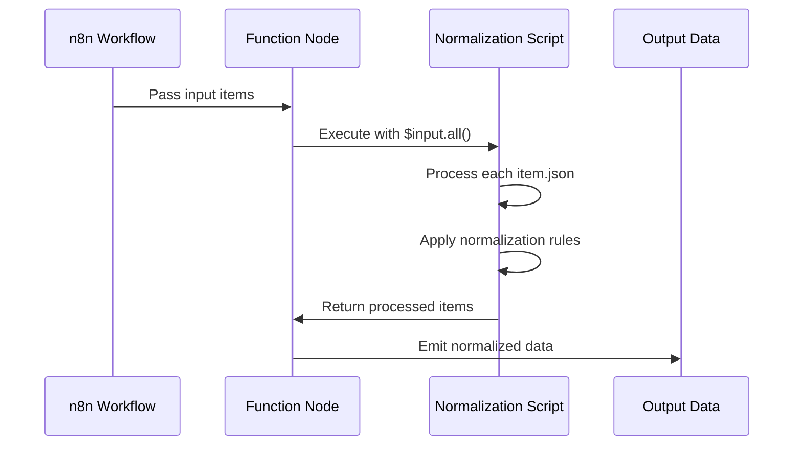
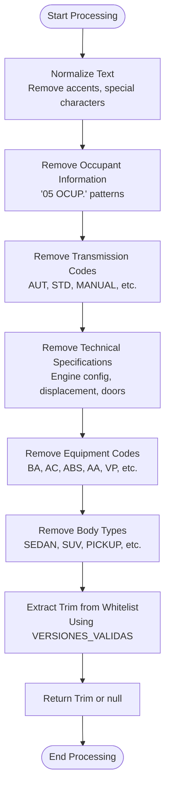
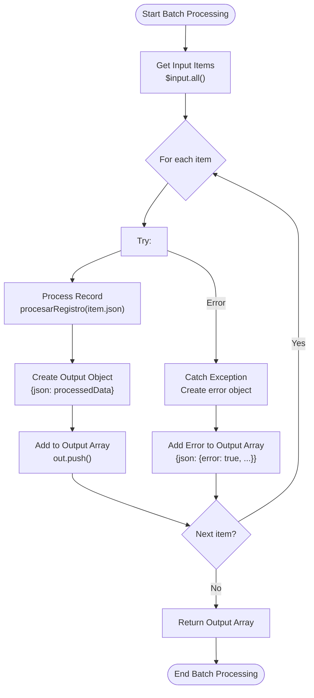
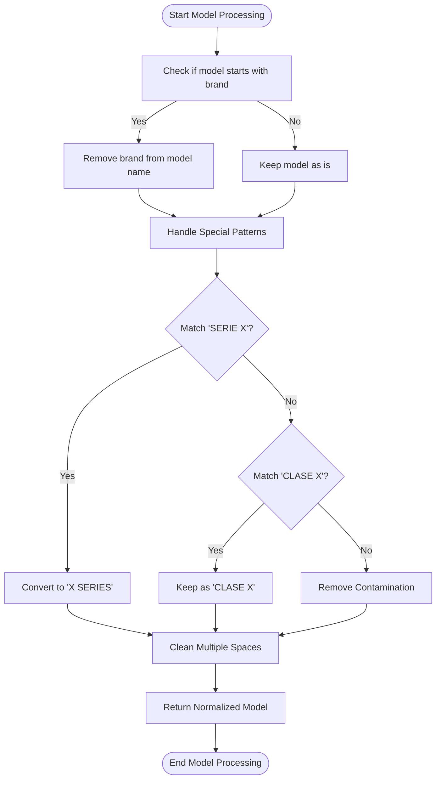
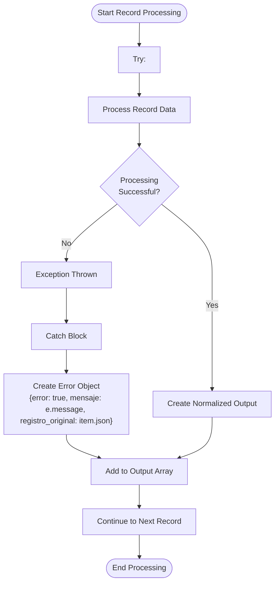
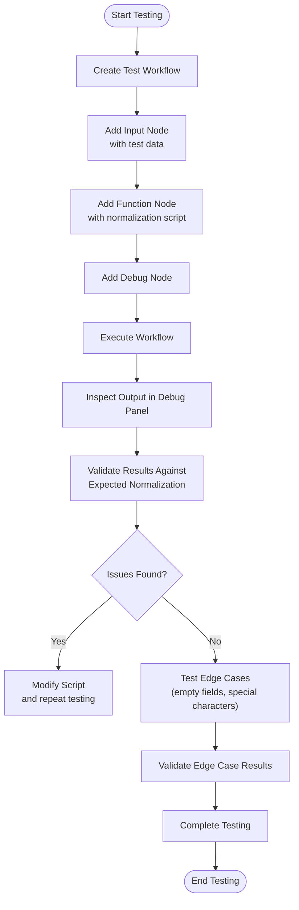
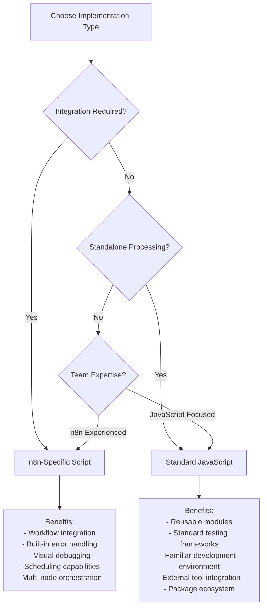

# n8n-Specific Normalization

<cite>
**Referenced Files in This Document**   
- [qualitas-codigo-de-normalizacion-n8n.js](file://src/insurers/qualitas/qualitas-codigo-de-normalizacion-n8n.js)
- [qualitas-analisis.md](file://src/insurers/qualitas/qualitas-analisis.md)
- [qualitas-query-de-extracción.sql](file://src/insurers/qualitas/qualitas-query-de-extracción.sql)
- [gnp-codigo-de-normalizacion.js](file://src/insurers/gnp/gnp-codigo-de-normalizacion.js)
- [hdi-codigo-de-normalizacion.js](file://src/insurers/hdi/hdi-codigo-de-normalizacion.js)
- [zurich-codigo-de-normalizacion.js](file://src/insurers/zurich/zurich-codigo-de-normalizacion.js)
</cite>

## Table of Contents
1. [Introduction](#introduction)
2. [n8n Execution Environment Integration](#n8n-execution-environment-integration)
3. [Qualitas Data Structure Processing](#qualitas-data-structure-processing)
4. [Batch Input Handling](#batch-input-handling)
5. [Output Formatting for RPC Processing](#output-formatting-for-rpc-processing)
6. [Complex Model Name Transformation](#complex-model-name-transformation)
7. [Error Handling and Debugging](#error-handling-and-debugging)
8. [Testing Strategies in n8n Interface](#testing-strategies-in-n8n-interface)
9. [n8n vs Standard JavaScript Implementation Guidance](#n8n-vs-standard-javascript-implementation-guidance)
10. [Conclusion](#conclusion)

## Introduction

This document details the n8n-specific normalization implementation for Qualitas, focusing on how the script adapts to n8n's execution environment and processes Qualitas-specific data structures. The normalization script is designed to extract and clean vehicle data from Qualitas' database, transforming it into a standardized format suitable for downstream processing.

The Qualitas normalization process addresses the highly contaminated nature of the `cVersion` field, which combines multiple types of information without consistent structure. The script implements a comprehensive strategy to extract meaningful data while filtering out irrelevant information such as service codes, multimedia features, and technical specifications that should not be included in the version (trim) field.

The implementation follows n8n's execution model, leveraging its built-in data access patterns and error handling mechanisms. Unlike standard JavaScript implementations, this script is specifically designed to work within n8n's workflow engine, utilizing its data structures and processing patterns.

**Section sources**
- [qualitas-analisis.md](file://src/insurers/qualitas/qualitas-analisis.md#L1-L333)
- [qualitas-codigo-de-normalizacion-n8n.js](file://src/insurers/qualitas/qualitas-codigo-de-normalizacion-n8n.js#L1-L966)

## n8n Execution Environment Integration

The Qualitas normalization script is specifically designed to integrate with n8n's execution environment, utilizing its data access patterns and workflow control mechanisms. The script leverages n8n's built-in expressions for data access, primarily using the `$input` object to retrieve input data from previous nodes in the workflow.

The script processes data through n8n's `Function` node, which allows for custom JavaScript code execution within the workflow. The primary data access pattern uses `$input.all()` to retrieve all input items, enabling batch processing of multiple records in a single execution. Each item is accessed through the `item.json` property, which contains the structured data from the previous node.



**Diagram sources**
- [qualitas-codigo-de-normalizacion-n8n.js](file://src/insurers/qualitas/qualitas-codigo-de-normalizacion-n8n.js#L955-L965)

The script does not use standard JavaScript module exports, as it operates within n8n's execution context where the return value is automatically handled by the platform. Instead of exporting functions or modules, the script directly returns the processed data array, which n8n then passes to subsequent nodes in the workflow.

n8n's built-in error handling is leveraged through try-catch blocks within the processing loop. When an error occurs during the processing of a specific record, the script catches the exception and returns an error object for that record, allowing the workflow to continue processing other records rather than failing the entire batch.

**Section sources**
- [qualitas-codigo-de-normalizacion-n8n.js](file://src/insurers/qualitas/qualitas-codigo-de-normalizacion-n8n.js#L955-L965)
- [gnp-codigo-de-normalizacion.js](file://src/insurers/gnp/gnp-codigo-de-normalizacion.js#L553-L554)
- [hdi-codigo-de-normalizacion.js](file://src/insurers/hdi/hdi-codigo-de-normalizacion.js#L632-L633)

## Qualitas Data Structure Processing

The Qualitas normalization script processes complex data structures specific to the insurer's database schema, extracting meaningful information from contaminated fields. The `cVersion` field is particularly challenging, as it combines multiple types of information including trim level, door count, engine configuration, displacement, equipment codes, transmission type, and occupant count.

The script implements a multi-step cleaning process to extract the trim level while filtering out irrelevant information. It begins by normalizing text through the `normalizarTexto` function, which converts text to uppercase, removes accents, and standardizes special characters. This ensures consistent processing regardless of the original formatting.



**Diagram sources**
- [qualitas-codigo-de-normalizacion-n8n.js](file://src/insurers/qualitas/qualitas-codigo-de-normalizacion-n8n.js#L20-L28)
- [qualitas-codigo-de-normalizacion-n8n.js](file://src/insurers/qualitas/qualitas-codigo-de-normalizacion-n8n.js#L745-L895)

The script uses comprehensive dictionaries to identify and process specific data elements. The `VERSIONES_VALIDAS` set contains a catalog of valid trim levels, while `CARROCERIA_KEYWORDS` identifies body types. The `TIPOS_TRANSMISION` array includes various transmission types that need to be filtered out from the version field.

For brand normalization, the script uses the `MARCAS_SINONIMOS` dictionary to standardize brand names, handling variations like "VW" for "VOLKSWAGEN" and "MERCEDES" for "MERCEDES BENZ". This ensures consistent brand representation across the normalized data.

The processing of technical specifications is handled separately from the trim extraction. Functions like `extraerMotorConfig` identify engine configurations (e.g., V6, L4, I4), while `inferirCarroceria` determines the body type based on keywords in the version string. The `extraerTraccion` function extracts traction information such as 4X4, AWD, or FWD.

**Section sources**
- [qualitas-analisis.md](file://src/insurers/qualitas/qualitas-analisis.md#L45-L100)
- [qualitas-codigo-de-normalizacion-n8n.js](file://src/insurers/qualitas/qualitas-codigo-de-normalizacion-n8n.js#L100-L200)
- [qualitas-codigo-de-normalizacion-n8n.js](file://src/insurers/qualitas/qualitas-codigo-de-normalizacion-n8n.js#L745-L895)

## Batch Input Handling

The Qualitas normalization script is designed to efficiently handle batched inputs within the n8n environment. The script processes multiple records in a single execution by iterating through all input items using the `$input.all()` method, which returns an array of all items from the previous node in the workflow.

The batch processing implementation follows a consistent pattern across multiple insurer scripts, with the Qualitas implementation using a try-catch block within the processing loop to ensure that errors in individual records do not halt the entire batch processing. This fault-tolerant approach allows the workflow to continue processing subsequent records even if some records contain malformed data or trigger exceptions.



**Diagram sources**
- [qualitas-codigo-de-normalizacion-n8n.js](file://src/insurers/qualitas/qualitas-codigo-de-normalizacion-n8n.js#L955-L965)

The output is structured as an array of objects, each containing a `json` property with the processed data. This format is compatible with n8n's data model and allows subsequent nodes in the workflow to easily access the normalized data. The script maintains the original record structure while adding normalized fields, ensuring traceability back to the source data.

The batch size is determined by the upstream nodes in the workflow, typically limited to 10,000 records per batch as recommended in the Qualitas analysis documentation. This batching strategy helps prevent timeouts and memory issues while maintaining efficient processing throughput.

**Section sources**
- [qualitas-analisis.md](file://src/insurers/qualitas/qualitas-analisis.md#L315-L320)
- [qualitas-codigo-de-normalizacion-n8n.js](file://src/insurers/qualitas/qualitas-codigo-de-normalizacion-n8n.js#L955-L965)
- [gnp-codigo-de-normalizacion.js](file://src/insurers/gnp/gnp-codigo-de-normalizacion.js#L553-L554)

## Output Formatting for RPC Processing

The Qualitas normalization script formats its output specifically for downstream RPC processing, generating a standardized data structure that includes both normalized vehicle information and technical identifiers. The output is designed to be compatible with Supabase RPC functions, which require consistent data formats for efficient processing and deduplication.

The script generates several key identifiers to support data integrity and deduplication. The `hash_comercial` is created using the `generarHash` function with commercial specifications (brand, model, year, transmission), while the `id_canonico` incorporates additional technical specifications (version, motor configuration, body type, traction) for a more comprehensive unique identifier.

```mermaid
erDiagram
OUTPUT ||--o{ HASHES : contains
OUTPUT ||--o{ IDENTIFIERS : contains
OUTPUT ||--o{ VEHICLE_DATA : contains
OUTPUT ||--o{ METADATA : contains
class OUTPUT {
id_canonico PK
hash_comercial UK
string_comercial
string_tecnico
}
class HASHES {
hash_comercial
id_canonico
}
class IDENTIFIERS {
id_original
origen_aseguradora
}
class VEHICLE_DATA {
marca
modelo
anio
transmision
version
motor_config
carroceria
traccion
}
class METADATA {
activo
version_original
}
```

**Diagram sources**
- [qualitas-codigo-de-normalizacion-n8n.js](file://src/insurers/qualitas/qualitas-codigo-de-normalizacion-n8n.js#L900-L950)

The output structure includes both normalized data fields and original source information for traceability. Normalized fields include `marca`, `modelo`, `anio`, `transmision`, `version`, `motor_config`, `carroceria`, and `traccion`, all processed through the script's normalization functions. Original source fields include `id_original` and `version_original`, preserving the raw data for reference and debugging.

The `activo` field is processed to ensure consistent boolean representation, converting various input formats (true/false strings, 1/0 numbers) to a standardized boolean value. This ensures compatibility with downstream systems that expect consistent boolean data types.

The output is formatted as an array of objects, each wrapped in a `json` property as required by n8n's data model. This structure allows the workflow to pass the normalized data to subsequent nodes, including RPC calls to Supabase for database insertion or further processing.

**Section sources**
- [qualitas-codigo-de-normalizacion-n8n.js](file://src/insurers/qualitas/qualitas-codigo-de-normalizacion-n8n.js#L900-L950)
- [src/supabase/Funcion RPC.sql](file://src/supabase/Funcion RPC.sql#L1-L50)

## Complex Model Name Transformation

The Qualitas normalization script implements sophisticated transformation logic for complex model names, particularly handling trim codes and technical specifications within the n8n context. The script processes model names that often contain contamination from other brands or irrelevant information, applying specific cleaning rules to extract the core model designation.

For model name normalization, the script uses the `normalizarModelo` function, which removes the brand name from the beginning of the model field when present. This prevents redundancy in the normalized data, as the brand is already captured in a separate field. The function also handles specific patterns like "SERIE X" and "CLASE X" to standardize BMW and Mercedes-Benz model designations.



**Diagram sources**
- [qualitas-codigo-de-normalizacion-n8n.js](file://src/insurers/qualitas/qualitas-codigo-de-normalizacion-n8n.js#L250-L265)

The script handles trim code extraction through a multi-step process that prioritizes longer n-grams (3-grams and 2-grams) before considering unigrams. This approach ensures that compound trim designations like "SPORT LINE" or "LIMITED PLUS" are identified before individual components. The `buscarTrim` function searches for matches in the `VERSIONES_VALIDAS` set, with additional brand-specific trim catalogs available in `VERSIONES_VALIDAS_POR_MARCA`.

For technical specifications within model names, the script applies aggressive filtering to remove irrelevant information. The `extraerVersion` function systematically removes occupant counts, transmission codes, engine configurations, displacement values, door counts, power ratings, traction systems, motor technologies, equipment codes, and body types from the version string before attempting trim extraction.

The transformation process also handles special cases like the prioritization of "WAGON" and "SPORTWAGEN" body types, which are detected early in the `inferirCarroceria` function to ensure accurate body type classification regardless of door count or other heuristics.

**Section sources**
- [qualitas-codigo-de-normalizacion-n8n.js](file://src/insurers/qualitas/qualitas-codigo-de-normalizacion-n8n.js#L250-L265)
- [qualitas-codigo-de-normalizacion-n8n.js](file://src/insurers/qualitas/qualitas-codigo-de-normalizacion-n8n.js#L745-L895)
- [qualitas-codigo-de-normalizacion-n8n.js](file://src/insurers/qualitas/qualitas-codigo-de-normalizacion-n8n.js#L600-L650)

## Error Handling and Debugging

The Qualitas normalization script implements robust error handling and debugging strategies specific to the n8n workflow environment. Unlike standard JavaScript implementations that might use module exports and external error logging, the n8n-specific script leverages the platform's built-in error handling mechanisms while maintaining data integrity across batch processing.

The primary error handling mechanism is a try-catch block wrapped around the processing of each individual record within the batch. This fault-tolerant approach ensures that if an error occurs while processing one record, the script can continue processing the remaining records rather than failing the entire batch. When an error is caught, the script creates an error object containing the error message and the original record data, allowing for post-processing analysis and debugging.



**Diagram sources**
- [qualitas-codigo-de-normalizacion-n8n.js](file://src/insurers/qualitas/qualitas-codigo-de-normalizacion-n8n.js#L955-L965)

For debugging within the n8n interface, the script's design allows for easy inspection of both successful and failed records. The output structure maintains a consistent format, with successful records containing normalized data and error records containing diagnostic information. This enables workflow designers to use n8n's built-in data inspection tools to examine the processing results and identify patterns in data quality issues.

The script does not use console.log statements for debugging, as these would not be visible in the n8n interface during normal operation. Instead, all diagnostic information is included in the output data structure, making it accessible through n8n's data inspection features. This approach aligns with n8n's execution model, where the primary output mechanism is the returned data rather than console output.

When debugging complex transformation issues, developers can use n8n's ability to process single records or small batches, allowing for focused testing of specific edge cases. The script's modular functions (e.g., `normalizarTexto`, `extraerVersion`, `inferirCarroceria`) can be tested independently by creating simplified input data that isolates specific transformation logic.

**Section sources**
- [qualitas-codigo-de-normalizacion-n8n.js](file://src/insurers/qualitas/qualitas-codigo-de-normalizacion-n8n.js#L955-L965)
- [gnp-codigo-de-normalizacion.js](file://src/insurers/gnp/gnp-codigo-de-normalizacion.js#L675-L680)

## Testing Strategies in n8n Interface

Effective testing of the Qualitas normalization script within the n8n interface requires a systematic approach that leverages the platform's workflow capabilities and data inspection tools. The testing strategy should focus on validating both the correctness of individual transformations and the robustness of batch processing.

The primary testing method involves creating test workflows with controlled input data that exercises specific transformation rules. For example, to test trim extraction, create input data with version strings containing various trim designations from the `VERSIONES_VALIDAS` set, as well as edge cases with contaminated data. The n8n interface allows for easy modification of input data, enabling rapid iteration through different test scenarios.



**Diagram sources**
- [qualitas-codigo-de-normalizacion-n8n.js](file://src/insurers/qualitas/qualitas-codigo-de-normalizacion-n8n.js#L955-L965)

The n8n debug node is essential for testing, providing a detailed view of the data structure at each point in the workflow. This allows developers to verify that the normalization script is producing the expected output format and that all fields are correctly populated. The debug panel displays both successful records and error objects, enabling comprehensive validation of the script's error handling.

For testing batch processing and error resilience, create input data that includes both well-formed records and records designed to trigger errors (e.g., missing required fields, malformed data types). This validates that the script's try-catch mechanism properly isolates errors and continues processing the remaining records.

Regression testing should be performed whenever modifications are made to the normalization script. Maintain a library of test cases that cover common scenarios, edge cases, and previously encountered data quality issues. This ensures that changes to the script do not introduce new bugs or regressions in existing functionality.

**Section sources**
- [qualitas-codigo-de-normalizacion-n8n.js](file://src/insurers/qualitas/qualitas-codigo-de-normalizacion-n8n.js#L955-L965)
- [qualitas-analisis.md](file://src/insurers/qualitas/qualitas-analisis.md#L280-L300)

## n8n vs Standard JavaScript Implementation Guidance

When deciding between n8n-specific scripts and standard JavaScript implementations for new insurers, several factors should be considered based on the integration context, maintenance requirements, and team expertise. The choice depends on whether the normalization process will be part of an automated workflow or a standalone data processing task.

n8n-specific scripts are recommended when the normalization process needs to be integrated into a larger automated workflow that includes data extraction, transformation, loading, and potentially other business processes. The n8n environment provides built-in capabilities for scheduling, error handling, monitoring, and integration with various data sources and destinations. This makes it ideal for production environments where reliability, observability, and maintainability are critical.



**Diagram sources**
- [qualitas-codigo-de-normalizacion-n8n.js](file://src/insurers/qualitas/qualitas-codigo-de-normalizacion-n8n.js#L955-L965)
- [gnp-codigo-de-normalizacion.js](file://src/insurers/gnp/gnp-codigo-de-normalizacion.js#L553-L554)

Standard JavaScript implementations are preferable when the normalization logic needs to be reused across multiple applications or when it will be integrated into existing JavaScript-based systems. Standard implementations can be packaged as modules, tested with conventional JavaScript testing frameworks, and maintained using familiar development workflows.

For new insurers with complex data quality issues similar to Qualitas, the n8n-specific approach offers advantages in terms of debugging and monitoring. The visual workflow interface makes it easier to understand the data transformation process, and the built-in debugging tools facilitate rapid identification and resolution of data quality issues.

However, if the normalization logic is expected to be particularly complex or computationally intensive, a standard JavaScript implementation might be more appropriate, as it can leverage the full Node.js ecosystem and be optimized more freely without the constraints of the n8n execution environment.

**Section sources**
- [qualitas-codigo-de-normalizacion-n8n.js](file://src/insurers/qualitas/qualitas-codigo-de-normalizacion-n8n.js#L955-L965)
- [gnp-codigo-de-normalizacion.js](file://src/insurers/gnp/gnp-codigo-de-normalizacion.js#L553-L554)
- [hdi-codigo-de-normalizacion.js](file://src/insurers/hdi/hdi-codigo-de-normalizacion.js#L632-L633)

## Conclusion

The n8n-specific normalization implementation for Qualitas demonstrates a sophisticated approach to processing complex, contaminated data within the constraints of a workflow automation platform. By leveraging n8n's execution model and data access patterns, the script efficiently transforms Qualitas' vehicle data into a standardized format suitable for downstream processing and analysis.

The implementation successfully addresses the challenges posed by Qualitas' highly contaminated `cVersion` field, systematically extracting meaningful information while filtering out irrelevant data such as service codes, multimedia features, and technical specifications. The script's design prioritizes data integrity and fault tolerance, ensuring that individual record errors do not compromise the entire batch processing operation.

Key strengths of the implementation include its comprehensive data cleaning rules, robust error handling, and efficient batch processing capabilities. The output format is specifically designed for downstream RPC processing, with standardized identifiers that support data deduplication and integrity checking.

For future insurer integrations, the choice between n8n-specific scripts and standard JavaScript implementations should be guided by the specific requirements of the integration context, the complexity of the data transformation needed, and the expertise of the development team. The Qualitas implementation serves as a strong example of how n8n can be effectively used for complex data normalization tasks within an automated workflow environment.

[No sources needed since this section summarizes without analyzing specific files]