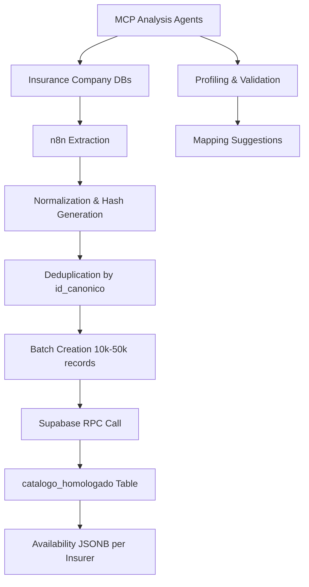
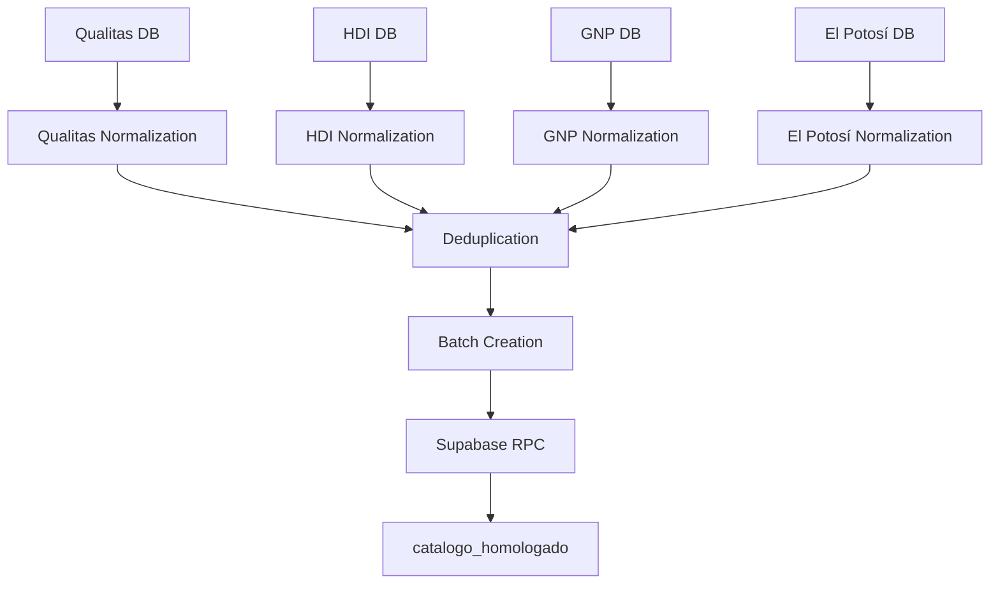

# Project Overview

<cite>
**Referenced Files in This Document**   
- [WARP.md](file://WARP.md)
- [instrucciones.md](file://instrucciones.md)
- [src/supabase/Tabla maestra.sql](file://src/supabase/Tabla maestra.sql)
- [src/supabase/Funcion RPC Nueva.sql](file://src/supabase/Funcion RPC Nueva.sql)
- [src/insurers/qualitas/qualitas-codigo-de-normalizacion-n8n.js](file://src/insurers/qualitas/qualitas-codigo-de-normalizacion-n8n.js)
- [src/insurers/hdi/hdi-codigo-de-normalizacion.js](file://src/insurers/hdi/hdi-codigo-de-normalizacion.js)
- [src/insurers/gnp/gnp-codigo-de-normalizacion.js](file://src/insurers/gnp/gnp-codigo-de-normalizacion.js)
- [src/insurers/elpotosi/elpotosi-codigo-de-normalizacion.js](file://src/insurers/elpotosi/elpotosi-codigo-de-normalizacion.js)
</cite>

## Table of Contents
1. [Introduction](#introduction)
2. [Core Objectives](#core-objectives)
3. [Target Audience](#target-audience)
4. [System Architecture](#system-architecture)
5. [Key Concepts](#key-concepts)
6. [Component Interactions](#component-interactions)
7. [Real-World Use Cases and Business Value](#real-world-use-cases-and-business-value)

## Introduction

The homologacion-ukuvi system is a vehicle catalog homologation platform designed to unify vehicle data from 11 Mexican insurance providers into a single, canonical model. This system addresses the challenge of fragmented and inconsistent vehicle catalog data across insurers by creating a standardized, traceable, and maintainable vehicle database. The solution enables data engineers, backend developers, and integration specialists to work with a unified vehicle catalog that maintains complete traceability to original insurer data while providing active/inactive status control and a reproducible data ingestion workflow.

The system processes vehicle data through a sophisticated pipeline that normalizes, deduplicates, and consolidates information from diverse insurer databases into a canonical format stored in Supabase. This approach ensures data consistency while preserving the provenance of each data point, allowing stakeholders to understand exactly which insurer provided specific vehicle information and when it was last updated.

**Section sources**
- [WARP.md](file://WARP.md#L1-L50)
- [instrucciones.md](file://instrucciones.md#L1-L20)

## Core Objectives

The homologacion-ukuvi system has several primary objectives that guide its design and implementation:

1. **Data Unification**: Create a single canonical model that consolidates vehicle catalogs from 11 insurance companies (Qualitas, HDI, AXA, GNP, Mapfre, Chubb, Zurich, Atlas, BX, El Potosí, ANA) into a unified format.

2. **Complete Traceability**: Maintain full traceability of each canonical record back to its original insurer data source, including original identifiers, version strings, and update timestamps.

3. **Status Control**: Implement active/inactive status tracking for vehicles at both the insurer level and globally, where a vehicle is considered active if at least one insurer reports it as available.

4. **Reproducible Processing**: Establish an idempotent batch processing flow that ensures consistent results when reprocessing data, preventing unintended changes or duplications.

5. **Data Integrity**: Never delete records from the canonical model; instead, update availability status to preserve historical data while reflecting current market availability.

6. **Scalable Ingestion**: Support the addition of new insurers through standardized normalization workflows that can be adapted to different data schemas and formats.

These objectives ensure that the system provides a reliable, consistent, and maintainable vehicle catalog that serves as a single source of truth for downstream applications and services.

**Section sources**
- [instrucciones.md](file://instrucciones.md#L3-L25)
- [WARP.md](file://WARP.md#L10-L25)

## Target Audience

The homologacion-ukuvi system serves several key technical audiences:

- **Data Engineers**: Responsible for maintaining data pipelines, ensuring data quality, and optimizing the normalization and ingestion processes. They work with the JavaScript normalization functions and n8n workflows to ensure accurate data transformation.

- **Backend Developers**: Focus on the Supabase database schema, RPC functions, and API integrations. They maintain the canonical data model, optimize queries, and ensure the system can handle large-scale data operations efficiently.

- **Integration Specialists**: Tasked with onboarding new insurance providers, analyzing their data schemas, and developing insurer-specific normalization rules. They use the MCP analysis agents to profile source data and create mapping specifications.

- **Data Analysts**: Utilize the unified catalog for reporting, analysis, and business intelligence, benefiting from the consistent data model and comprehensive vehicle coverage.

- **System Architects**: Oversee the overall system design, technology stack decisions, and integration patterns between components like n8n, Supabase, and external systems.

The system's design accommodates these diverse roles by providing clear separation of concerns between data extraction, transformation, and storage components, with well-defined interfaces and documentation to facilitate collaboration and maintenance.

**Section sources**
- [instrucciones.md](file://instrucciones.md#L27-L30)
- [WARP.md](file://WARP.md#L5-L10)

## System Architecture

The homologacion-ukuvi system follows a modular architecture with distinct components handling different aspects of the data processing pipeline. The architecture is designed to be scalable, maintainable, and resilient to changes in source data formats.

**Diagram sources **
- [WARP.md](file://WARP.md#L150-L170)

The system architecture consists of four main layers:

1. **Data Sources**: The original databases of 11 Mexican insurance companies, each with their own schema and data structure for vehicle catalogs.

2. **Orchestration and Transformation**: The n8n platform handles data extraction, normalization, and preprocessing. It applies insurer-specific rules to transform diverse data formats into a canonical structure.

3. **Storage and Processing**: Supabase (PostgreSQL) serves as the central data repository with the `catalogo_homologado` table as the canonical vehicle catalog. The system uses RPC functions to process batches of normalized data.

4. **Analysis and Validation**: MCP (Model Context Protocol) agents perform automated data profiling, validation, and mapping suggestions to ensure data quality and assist with integration of new insurers.

This architecture enables the system to handle the complexity of multiple data sources while providing a clean, consistent interface for consumers of the unified vehicle catalog.

**Section sources**
- [WARP.md](file://WARP.md#L50-L170)
- [instrucciones.md](file://instrucciones.md#L32-L45)

## Key Concepts

### Canonical Data Modeling

The system centers around a canonical data model that standardizes vehicle information across all insurers. The core of this model is the `catalogo_homologado` table, which contains normalized vehicle attributes such as brand, model, year, transmission, version, engine configuration, body type, and traction. Each record is uniquely identified by an `id_canonico` hash that ensures consistency across insurers.

The canonical model includes two key hash identifiers:
- **`hash_comercial`**: A SHA-256 hash of the commercial specification (brand|model|year|transmission)
- **`id_canonico`**: A SHA-256 hash of the complete technical specification including version, engine, body, and traction

These hashes enable efficient deduplication and matching of vehicles across different insurers, even when they use different terminology or data structures.

### Idempotent Batch Processing

The system employs idempotent batch processing to ensure data consistency and reliability. The RPC function `procesar_batch_homologacion` is designed to produce the same results regardless of how many times it is executed with the same input data. This property allows for safe reprocessing of data batches without creating duplicates or unintended changes.

The processing workflow follows these steps:
1. Validate input data structure and required fields
2. Stage data in a temporary table for processing
3. Perform exact matches by `id_canonico` for updates
4. Process new records with conflict detection
5. Return detailed metrics about the processing results

This approach ensures that the system can recover from failures and reprocess data as needed without compromising data integrity.

### Hash-Based Deduplication

Hash-based deduplication is a fundamental mechanism in the homologacion-ukuvi system. By generating consistent hashes from normalized vehicle specifications, the system can identify duplicate records across different insurers and consolidate them into a single canonical entry.

The deduplication process uses a multi-level approach:
1. **Exact matching** by `id_canonico` for records with identical technical specifications
2. **Compatibility matching** for records that share commercial specifications but have complementary technical details
3. **Conflict detection** for records with conflicting specifications that cannot be merged

This approach maximizes data consolidation while preserving important differences between vehicle variants reported by different insurers.

**Section sources**
- [WARP.md](file://WARP.md#L175-L250)
- [instrucciones.md](file://instrucciones.md#L50-L100)
- [src/supabase/Tabla maestra.sql](file://src/supabase/Tabla maestra.sql#L1-L50)
- [src/supabase/Funcion RPC Nueva.sql](file://src/supabase/Funcion RPC Nueva.sql#L1-L50)

## Component Interactions

The homologacion-ukuvi system relies on the coordinated interaction of several key components to achieve its objectives. These interactions follow a well-defined workflow that ensures data consistency and traceability.

### Supabase Role

Supabase serves as the central data repository and processing engine for the system. It hosts the `catalogo_homologado` table, which stores the canonical vehicle catalog with all normalized attributes and insurer-specific availability information. The PostgreSQL database provides robust transaction support, indexing for efficient queries, and JSONB storage for flexible insurer metadata.

The Supabase RPC function `procesar_batch_homologacion` acts as the primary interface for data ingestion. This function handles batch processing of normalized vehicle data, performing upsert operations, merging insurer availability information, and returning detailed processing metrics. The function is designed with security in mind, using the `SECURITY DEFINER` option to ensure proper access control.

### n8n Workflows

n8n orchestrates the data extraction and normalization process through a series of workflows that handle each insurer's data. The workflow begins with data extraction from the insurer's database, followed by normalization using JavaScript functions that apply insurer-specific rules.

The normalization process includes:
- Text cleaning and standardization
- Brand and model name consolidation
- Transmission type mapping
- Version/trim extraction
- Technical specification parsing
- Hash generation for deduplication

After normalization, the workflow performs deduplication by `id_canonico`, groups records into batches of 10,000-50,000 records, and sends them to the Supabase RPC endpoint. The workflow includes logging, error handling, and retry mechanisms to ensure reliable data processing.

### Insurer-Specific Normalization

Each insurer has a dedicated normalization workflow that addresses their specific data schema and formatting conventions. For example:

- **Qualitas**: Handles complex version strings with mixed trim and technical specifications, requiring sophisticated parsing to extract meaningful version information.
- **HDI**: Processes data from multiple related tables (InformacionVehiculo, Transmision, Version) and consolidates them into a unified record.
- **GNP**: Deals with significant data contamination issues, including incorrect brand assignments in version fields, requiring aggressive cleaning and validation.
- **El Potosí**: Manages data with inconsistent marque-model relationships and requires careful validation to ensure accuracy.

These insurer-specific workflows demonstrate the system's flexibility in handling diverse data sources while producing consistent output for the canonical model.

**Diagram sources **
- [src/insurers/qualitas/qualitas-codigo-de-normalizacion-n8n.js](file://src/insurers/qualitas/qualitas-codigo-de-normalizacion-n8n.js#L1-L50)
- [src/insurers/hdi/hdi-codigo-de-normalizacion.js](file://src/insurers/hdi/hdi-codigo-de-normalizacion.js#L1-L50)
- [src/insurers/gnp/gnp-codigo-de-normalizacion.js](file://src/insurers/gnp/gnp-codigo-de-normalizacion.js#L1-L50)
- [src/insurers/elpotosi/elpotosi-codigo-de-normalizacion.js](file://src/insurers/elpotosi/elpotosi-codigo-de-normalizacion.js#L1-L50)

**Section sources**
- [WARP.md](file://WARP.md#L255-L300)
- [instrucciones.md](file://instrucciones.md#L105-L150)
- [src/insurers/qualitas/qualitas-codigo-de-normalizacion-n8n.js](file://src/insurers/qualitas/qualitas-codigo-de-normalizacion-n8n.js#L1-L100)
- [src/insurers/hdi/hdi-codigo-de-normalizacion.js](file://src/insurers/hdi/hdi-codigo-de-normalizacion.js#L1-L100)

## Real-World Use Cases and Business Value

The homologacion-ukuvi system delivers significant business value through several real-world use cases:

### Insurance Quoting Systems

The unified vehicle catalog serves as a critical component for insurance quoting systems, providing accurate and up-to-date vehicle information for premium calculations. By consolidating data from multiple insurers, the system ensures comprehensive coverage of available vehicle models and trims, reducing the risk of quoting errors due to missing or outdated vehicle data.

### Market Analysis and Reporting

Data analysts use the canonical catalog to perform market analysis, tracking the availability and popularity of different vehicle models across insurers. The system's complete traceability enables detailed reporting on which insurers offer specific vehicles and how their offerings change over time.

### New Insurer Onboarding

The standardized architecture and documentation make it easier to onboard new insurance providers. The MCP analysis agents assist with data profiling and mapping suggestions, reducing the time and effort required to integrate new data sources into the unified catalog.

### Data Quality Improvement

By identifying discrepancies between insurers' vehicle catalogs, the system highlights potential data quality issues that can be addressed with the respective providers. This feedback loop helps improve the overall quality of vehicle data in the insurance industry.

### Regulatory Compliance

The system's comprehensive audit trail and data provenance features support regulatory compliance requirements by maintaining a complete history of vehicle availability and changes over time.

The business value of the homologacion-ukuvi system extends beyond technical benefits to include improved operational efficiency, reduced risk of errors, enhanced decision-making capabilities, and stronger relationships with insurance partners through data quality feedback.

**Section sources**
- [instrucciones.md](file://instrucciones.md#L275-L280)
- [WARP.md](file://WARP.md#L400-L414)