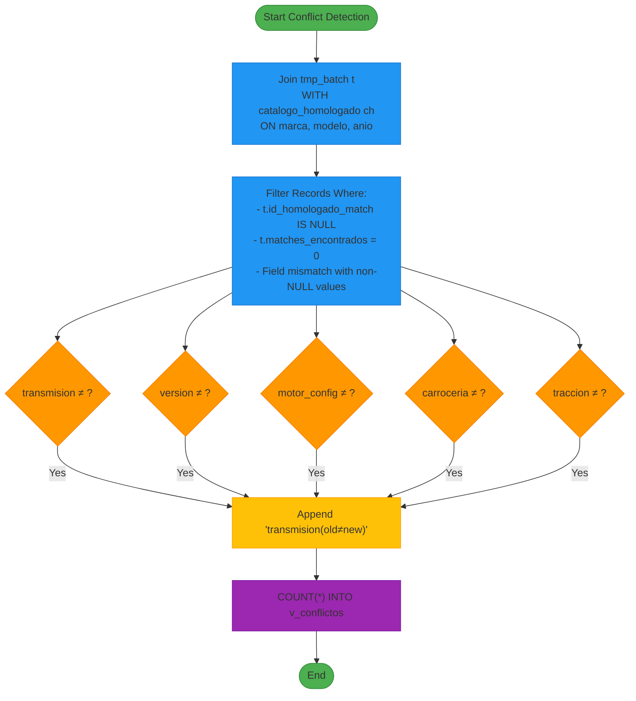
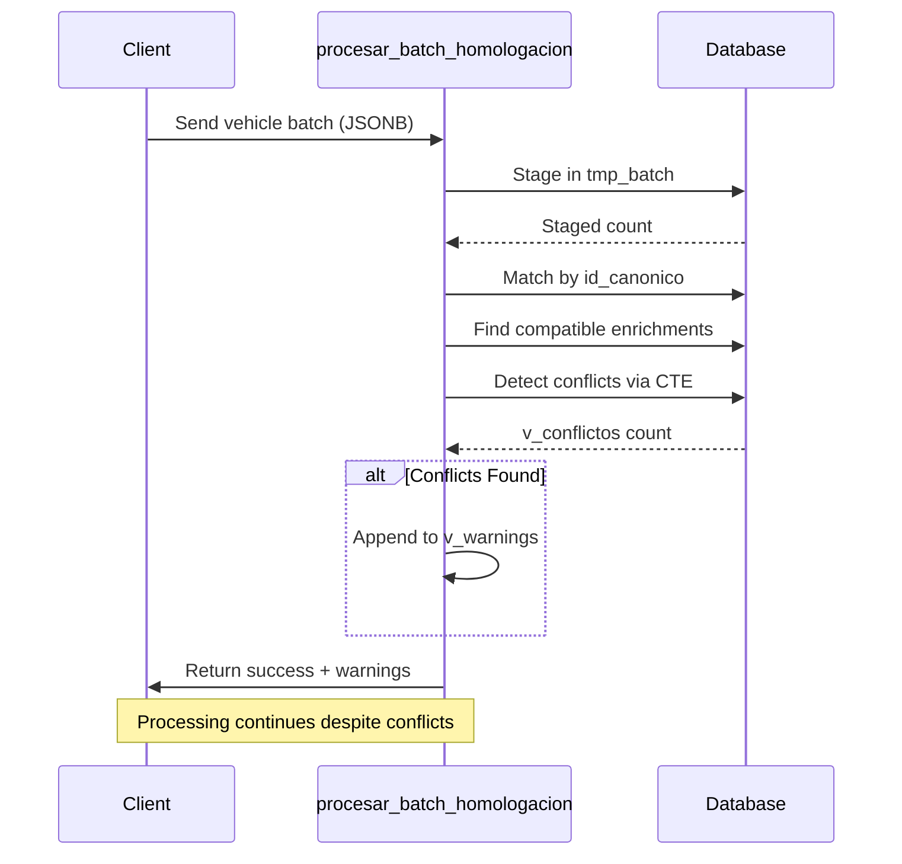

# Conflict Detection and Warning Generation

<cite>
**Referenced Files in This Document**   
- [Funcion RPC Nueva.sql](file://src/supabase/Funcion RPC Nueva.sql)
- [Tabla maestra.sql](file://src/supabase/Tabla maestra.sql)
- [axa-query-de-extraccion.sql](file://src/insurers/axa/axa-query-de-extraccion.sql)
- [zurich-query-de-extraccion.sql](file://src/insurers/zurich/zurich-query-de-extraccion.sql)
</cite>

## Table of Contents
1. [Introduction](#introduction)
2. [Conflict Detection Mechanism](#conflict-detection-mechanism)
3. [SQL Logic in conflictos_detectados CTE](#sql-logic-in-conflictos_detectados-cte)
4. [Warning Generation and Non-Blocking Ingestion](#warning-generation-and-non-blocking-ingestion)
5. [Real-World Example: AXA vs Zurich Transmission Conflict](#real-world-example-axa-vs-zurich-transmission-conflict)
6. [Business Rationale for Conflict Logging](#business-rationale-for-conflict-logging)
7. [Conclusion](#conclusion)

## Introduction
The homologation system is designed to consolidate vehicle data from multiple insurers into a unified canonical format. A critical component of this process is the detection of data conflicts—instances where incoming vehicle records from one insurer mismatch existing records in key technical fields. This document details how the system identifies such conflicts on non-NULL values in critical attributes like transmission, version, motor configuration, body type, or traction, and logs them as warnings without interrupting the ingestion pipeline.

**Section sources**
- [Funcion RPC Nueva.sql](file://src/supabase/Funcion RPC Nueva.sql#L1-L50)

## Conflict Detection Mechanism
The system detects conflicts during the homologation process when an incoming vehicle record fails to match an existing canonical entry due to incompatible values in critical fields. The matching logic requires exact alignment on `marca`, `modelo`, and `anio`, while allowing enrichment of technical fields (`motor_config`, `carroceria`, `traccion`) only if they are NULL in the existing record.

However, when both the incoming and existing records have non-NULL but differing values in any of the following fields:
- `transmision`
- `version`
- `motor_config`
- `carroceria`
- `traccion`

the system identifies a true conflict. These discrepancies prevent the incoming record from being matched or enriched, resulting in the creation of a new canonical entry and the logging of a warning.

**Section sources**
- [Funcion RPC Nueva.sql](file://src/supabase/Funcion RPC Nueva.sql#L291-L327)

## SQL Logic in conflictos_detectados CTE
The conflict detection is implemented in the `conflictos_detectados` Common Table Expression (CTE) within the `procesar_batch_homologacion` function. This CTE performs a join between the temporary batch table (`tmp_batch`) and the master catalog (`catalogo_homologado`) on `marca`, `modelo`, and `anio`.

The CTE filters for records where:
- No match was found (`t.id_homologado_match IS NULL`)
- There were zero potential matches (`t.matches_encontrados = 0`), ruling out ambiguity
- At least one critical field has non-NULL and unequal values between the incoming and existing records

For each detected conflict, a human-readable message is constructed using string concatenation that includes:
- Vehicle identity (`marca`, `modelo`, `anio`)
- Source insurer (`origen_aseguradora`)
- Specific field mismatches in the format `field(actual≠existing)`



**Diagram sources**
- [Funcion RPC Nueva.sql](file://src/supabase/Funcion RPC Nueva.sql#L349-L377)

**Section sources**
- [Funcion RPC Nueva.sql](file://src/supabase/Funcion RPC Nueva.sql#L349-L377)

## Warning Generation and Non-Blocking Ingestion
When conflicts are detected, the system does not halt processing or reject the incoming data. Instead, it increments the `v_conflictos` counter and appends descriptive messages to the `v_warnings` array in the response payload.

This non-blocking approach ensures continuous data ingestion, allowing the system to:
- Create new canonical entries for conflicting variants
- Preserve data integrity across insurers
- Avoid pipeline failures due to data inconsistencies

The warnings are limited to the first 5 distinct conflict descriptions (with a limit of 20 in the detection phase), ensuring the response remains concise while still providing actionable insights.



**Diagram sources**
- [Funcion RPC Nueva.sql](file://src/supabase/Funcion RPC Nueva.sql#L378-L390)

**Section sources**
- [Funcion RPC Nueva.sql](file://src/supabase/Funcion RPC Nueva.sql#L378-L390)

## Real-World Example: AXA vs Zurich Transmission Conflict
A practical example occurs when AXA lists a vehicle variant with manual transmission while Zurich lists the same model with automatic transmission.

For instance:
- **AXA Record**: Toyota Corolla 2023, `transmision = 'MANUAL'`
- **Zurich Record**: Toyota Corolla 2023, `transmision = 'AUTO'`

When the Zurich record is processed after AXA, the system detects that:
- Both records have non-NULL transmission values
- The values differ (`AUTO ≠ MANUAL`)
- All other matching fields (`marca`, `modelo`, `anio`) are identical

As a result, the Zurich variant is not merged with the AXA record. Instead, a new canonical entry is created, and a warning is generated:
```
"Toyota Corolla 2023 [ZURICH] - Conflicto: transmision(AUTO≠MANUAL)"
```

This preserves both variants in the system while clearly indicating the discrepancy.

**Section sources**
- [axa-query-de-extraccion.sql](file://src/insurers/axa/axa-query-de-extraccion.sql#L15-L20)
- [zurich-query-de-extraccion.sql](file://src/insurers/zurich/zurich-query-de-extraccion.sql#L15-L20)

## Business Rationale for Conflict Logging
The decision to log conflicts as warnings rather than rejecting data is driven by business needs for data auditing and reconciliation:

1. **Data Transparency**: Conflicts are visible to stakeholders, enabling investigation into data quality issues at the source.
2. **Reconciliation Workflows**: Teams can use conflict logs to engage with insurers and resolve discrepancies over time.
3. **Historical Accuracy**: The system maintains a truthful representation of what each insurer reports, avoiding premature assumptions.
4. **Operational Continuity**: Prevents ingestion pipeline failures due to external data inconsistencies.
5. **Canonical Evolution**: Allows the master catalog to evolve as more data becomes available, supporting future enrichment.

This approach supports a data governance model where conflicts are treated as opportunities for improvement rather than errors to be blocked.

**Section sources**
- [Funcion RPC Nueva.sql](file://src/supabase/Funcion RPC Nueva.sql#L378-L390)

## Conclusion
The conflict detection mechanism in the homologation system effectively identifies data mismatches in critical vehicle attributes by comparing non-NULL values across incoming and existing records. Through the `conflictos_detectados` CTE, it constructs human-readable warnings that are included in the response payload without halting processing. This non-blocking design enables robust, continuous data ingestion while supporting data auditing and reconciliation workflows. Real-world examples like transmission mismatches between AXA and Zurich illustrate the system’s ability to preserve data fidelity across insurers, making it a reliable foundation for multi-source vehicle data consolidation.