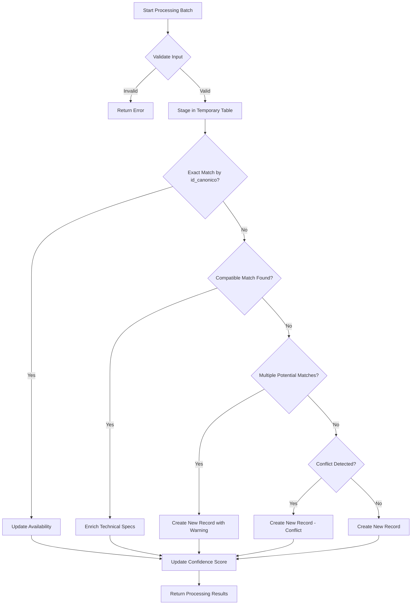
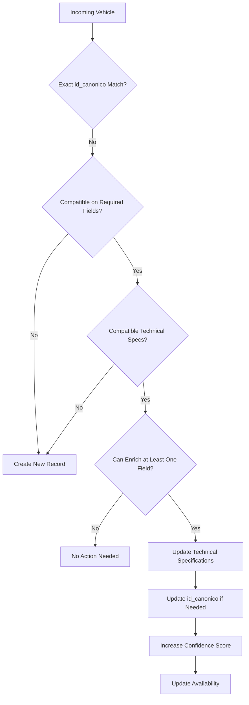
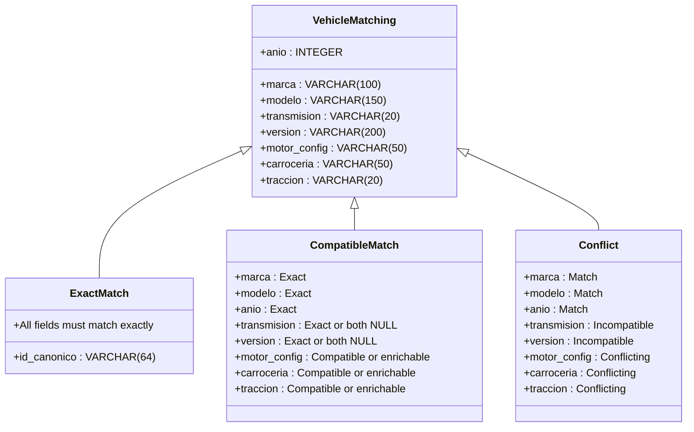
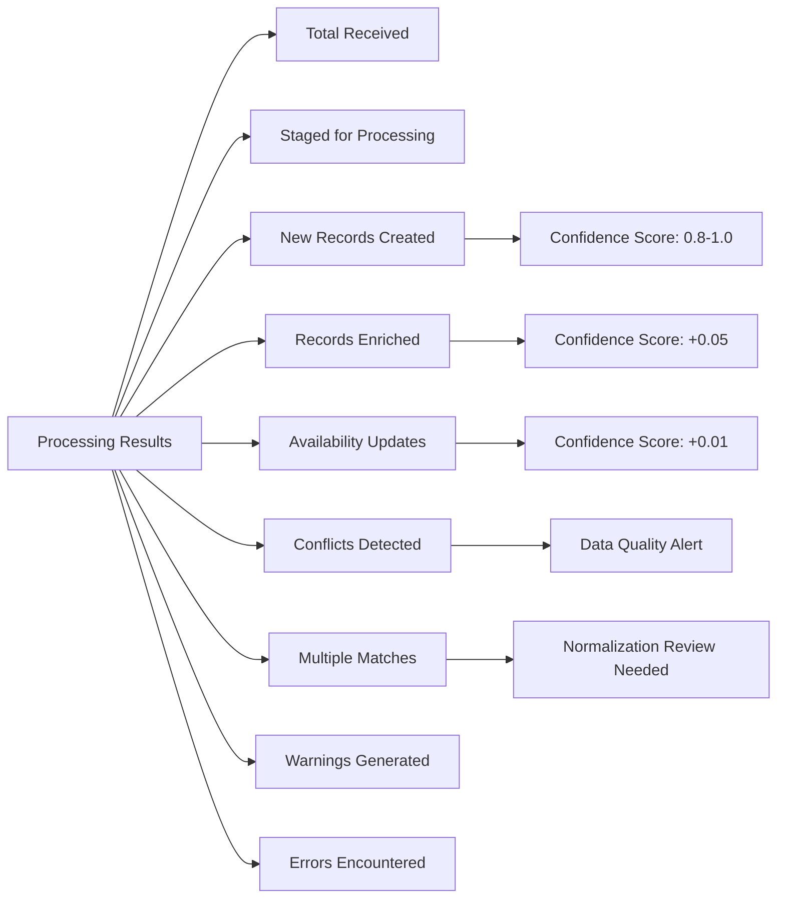

# Conflict Resolution Strategy

<cite>
**Referenced Files in This Document**   
- [Funcion RPC Nueva.sql](file://src/supabase/Funcion RPC Nueva.sql)
- [Replanteamiento homologacion.md](file://src/supabase/Replanteamiento homologacion.md)
- [casos de prueba función rpc.sql](file://src/supabase/casos de prueba función rpc.sql)
- [Tabla maestra.sql](file://src/supabase/Tabla maestra.sql)
</cite>

## Table of Contents
1. [Introduction](#introduction)
2. [Core Matching Strategy](#core-matching-strategy)
3. [Exact Match Resolution via id_canonico](#exact-match-resolution-via-id_canonico)
4. [Technical Specification Enrichment](#technical-specification-enrichment)
5. [Conflict Detection and Handling](#conflict-detection-and-handling)
6. [Matching Criteria and Field Requirements](#matching-criteria-and-field-requirements)
7. [Multiple Match Scenarios](#multiple-match-scenarios)
8. [Business Logic Behind Enrichment vs. Conflict Prevention](#business-logic-behind-enrichment-vs-conflict-prevention)
9. [Real-World Examples from Insurer Data](#real-world-examples-from-insurer-data)
10. [Summary of Resolution Outcomes](#summary-of-resolution-outcomes)

## Introduction
The RPC function `procesar_batch_homologacion` implements a sophisticated conflict resolution and deduplication strategy for vehicle catalog data from multiple insurers. This system ensures data integrity while enabling progressive enrichment of technical specifications. The strategy distinguishes between three primary scenarios: exact matches (via `id_canonico`), compatible vehicles for technical specification enrichment, and conflicting records with incompatible attributes. The system processes batches of vehicle data, applying a multi-step matching algorithm that prioritizes data consistency while allowing for controlled data enrichment.

**Section sources**
- [Replanteamiento homologacion.md](file://src/supabase/Replanteamiento homologacion.md#L0-L20)

## Core Matching Strategy
The conflict resolution process follows a hierarchical approach with multiple stages of matching. First, the system searches for exact matches using the `id_canonico` identifier. If no exact match is found, it looks for compatible vehicles that can be enriched with additional technical specifications. The system only creates new records when no compatible match exists or when multiple potential matches are found. This strategy ensures that the canonical catalog maintains data consistency while allowing for progressive enrichment of vehicle specifications from different insurers.

**Diagram sources**
- [Funcion RPC Nueva.sql](file://src/supabase/Funcion RPC Nueva.sql#L0-L44)
- [Funcion RPC Nueva.sql](file://src/supabase/Funcion RPC Nueva.sql#L102-L108)

## Exact Match Resolution via id_canonico
The primary method for identifying duplicate records is through the `id_canonico` field, which serves as a unique identifier for each vehicle configuration. When a vehicle in the incoming batch has an `id_canonico` that matches an existing record in the `catalogo_homologado` table, the system performs an availability update rather than creating a new record or modifying existing specifications. This approach ensures that multiple insurers offering the same vehicle configuration are tracked within a single canonical record.

The matching process for `id_canonico` is case-insensitive and uses trimmed, uppercase values to ensure consistency. When an exact match is found, the system updates the `disponibilidad` JSONB field to include information about the insurer's offering, including whether the vehicle is currently active, the original ID from the insurer's system, and the original version string. The confidence score is also incremented slightly to reflect the additional validation from another source.

**Section sources**
- [Funcion RPC Nueva.sql](file://src/supabase/Funcion RPC Nueva.sql#L102-L111)
- [casos de prueba función rpc.sql](file://src/supabase/casos de prueba función rpc.sql#L40-L50)

## Technical Specification Enrichment
When no exact match is found via `id_canonico`, the system attempts to find compatible vehicles that can be enriched with additional technical specifications. This process allows the canonical catalog to progressively improve its data quality by incorporating information from multiple sources. The enrichment is limited to specific technical fields: `motor_config`, `carroceria`, and `traccion`.

For a vehicle to be eligible for enrichment, it must match on all required fields: `marca`, `modelo`, `anio`, `transmision`, and `version`. The transmission and version fields must either match exactly or both be NULL. For the technical specification fields, compatibility is determined by the rule that either the existing value is NULL, the incoming value is NULL, or both values are identical. Additionally, at least one of the technical specification fields must have a non-NULL value in the incoming data that is currently NULL in the canonical record, ensuring that the update provides actual enrichment.

When enrichment occurs, the `id_canonico` is updated only if new technical specification data is provided, as this changes the canonical representation of the vehicle. The confidence score is increased by 0.05 to reflect the improved data quality from the enrichment.

**Diagram sources**
- [Funcion RPC Nueva.sql](file://src/supabase/Funcion RPC Nueva.sql#L109-L137)
- [Funcion RPC Nueva.sql](file://src/supabase/Funcion RPC Nueva.sql#L168-L197)

## Conflict Detection and Handling
The system detects conflicts when an incoming vehicle matches an existing record on the core identifying fields (`marca`, `modelo`, `anio`) but has incompatible values for required fields (`transmision`, `version`) or conflicting values for technical specification fields. A conflict occurs when both the existing and incoming values are non-NULL but different.

When a conflict is detected, the system creates a new canonical record rather than attempting to merge incompatible data. This preserves the integrity of both vehicle configurations in the catalog. The system generates warnings for detected conflicts, which include details about the specific fields that caused the conflict. These warnings help identify data quality issues across insurers and can inform normalization rules.

The conflict detection process specifically checks for differences in `transmision`, `version`, `carroceria`, `motor_config`, and `traccion` fields. If any of these fields have non-NULL values in both the existing record and incoming data, and the values differ, a conflict is registered. The system counts these conflicts and includes them in the response metrics.

**Section sources**
- [Funcion RPC Nueva.sql](file://src/supabase/Funcion RPC Nueva.sql#L349-L377)
- [Funcion RPC Nueva.sql](file://src/supabase/Funcion RPC Nueva.sql#L375-L415)

## Matching Criteria and Field Requirements
The system employs different matching criteria for various fields, distinguishing between exact requirements and flexible ones. The fields `marca`, `modelo`, and `anio` are treated as exact requirements and must match precisely for any type of match (exact or compatible). These fields form the primary identification of a vehicle model.

For `transmision` and `version`, the system requires exact matching or both values to be NULL. This means that if one record has a transmission value and another has NULL for the same field, they are considered incompatible. This strict requirement ensures that vehicle configurations are not incorrectly merged when critical differentiating information is missing from one source.

The technical specification fields (`motor_config`, `carroceria`, `traccion`) have flexible matching criteria. These fields can be enriched when one source has NULL and another has a non-NULL value. If both sources have non-NULL values, they must be identical to avoid a conflict. This approach allows the system to build more complete vehicle profiles over time while preventing the introduction of contradictory information.

**Diagram sources**
- [Funcion RPC Nueva.sql](file://src/supabase/Funcion RPC Nueva.sql#L109-L137)
- [Replanteamiento homologacion.md](file://src/supabase/Replanteamiento homologacion.md#L100-L120)

## Multiple Match Scenarios
The system handles cases where multiple potential matches are found for an incoming vehicle. This occurs when an incoming vehicle is compatible with more than one existing record in the canonical catalog. When multiple matches are detected, the system creates a new canonical record and generates a warning.

This approach prevents the system from making arbitrary decisions about which existing record to enrich, which could lead to data quality issues. By creating a new record when multiple matches exist, the system maintains data integrity and allows for manual review of the conflicting configurations. The warning includes details about the number of potential matches, which helps identify areas where normalization rules may need improvement.

The multiple match scenario typically occurs when different insurers have reported similar but not identical configurations for what might be the same vehicle model. This can happen due to differences in how insurers categorize trim levels, technical specifications, or body styles. The system's response of creating a new record ensures that these distinctions are preserved in the canonical catalog.

**Section sources**
- [Funcion RPC Nueva.sql](file://src/supabase/Funcion RPC Nueva.sql#L196-L197)
- [Funcion RPC Nueva.sql](file://src/supabase/Funcion RPC Nueva.sql#L168-L197)

## Business Logic Behind Enrichment vs. Conflict Prevention
The business logic behind allowing enrichment but preventing conflicting updates is rooted in data quality and reliability. The system is designed to be conservative when it comes to modifying existing data, only allowing updates that improve completeness without introducing contradictions.

Enrichment is permitted because it aligns with the business goal of creating a comprehensive and accurate vehicle catalog. When one insurer provides technical specification data that another insurer lacks, incorporating this information improves the overall quality of the catalog without risking accuracy. This progressive enrichment allows the system to build increasingly detailed vehicle profiles over time.

Conflict prevention is critical because merging incompatible data would undermine the reliability of the entire catalog. In the insurance context, accurate vehicle specifications are essential for proper risk assessment and pricing. Allowing conflicting updates could lead to incorrect vehicle identifications, which would have significant business implications. By creating separate records for conflicting configurations, the system preserves data integrity and provides transparency about discrepancies between insurers.

The confidence score mechanism reinforces this business logic by quantifying data quality. Records that have been enriched or confirmed by multiple insurers receive higher confidence scores, providing a clear indicator of reliability that can be used by downstream systems.

**Section sources**
- [Replanteamiento homologacion.md](file://src/supabase/Replanteamiento homologacion.md#L30-L50)
- [Funcion RPC Nueva.sql](file://src/supabase/Funcion RPC Nueva.sql#L232-L265)

## Real-World Examples from Insurer Data
The system's conflict resolution strategy can be illustrated through real-world examples from insurer data. Consider a Toyota Yaris 2014 with automatic transmission. Qualitas reports this vehicle as a "PREMIUM SEDAN" with no motor configuration specified. When this data is processed, it creates a canonical record with the available information.

Later, Zurich reports the same vehicle with the same `id_canonico`, indicating it's the exact same configuration. This triggers an availability update, adding Zurich to the list of insurers offering this vehicle without changing any specifications.

HDI then reports a Toyota Yaris 2014 with automatic transmission but identifies it as a "HATCHBACK" rather than a "SEDAN". Since body style is a technical specification field, and both values are non-NULL but different, this creates a conflict. The system creates a new canonical record for the hatchback configuration, preserving both vehicle types in the catalog.

Finally, HDI reports another Toyota Yaris 2014 with automatic transmission, identified as a "PREMIUM" model with "L4" motor configuration. This matches the existing SEDAN record on all required fields and can enrich it with the motor configuration data. The system updates the existing record with the motor configuration, updates the `id_canonico` to reflect the more complete specification, and increases the confidence score.

These examples demonstrate how the system handles various scenarios: exact matches that update availability, conflicts that create new records, and compatible data that enriches existing records.

**Section sources**
- [casos de prueba función rpc.sql](file://src/supabase/casos de prueba función rpc.sql#L14-L255)
- [Replanteamiento homologacion.md](file://src/supabase/Replanteamiento homologacion.md#L4-L20)

## Summary of Resolution Outcomes
The RPC function produces a comprehensive summary of resolution outcomes for each batch processed. The response includes metrics for received, staged, and processed vehicles, with detailed counts for each resolution type: new records created, records enriched with additional specifications, availability updates for exact matches, detected conflicts, and multiple match scenarios.

Warnings are generated for multiple match scenarios and detected conflicts, providing valuable feedback for data quality improvement. These warnings include specific details about the vehicles involved and the nature of the issue, enabling targeted investigation and resolution. The system's response structure allows consumers to understand not just the quantity of processing but also the quality and nature of the resolution outcomes.

This comprehensive reporting enables monitoring of data quality trends over time, identification of problematic insurers or vehicle models, and assessment of the effectiveness of normalization rules. The metrics support continuous improvement of the homologation process and provide transparency into the system's operation.

**Diagram sources**
- [Funcion RPC Nueva.sql](file://src/supabase/Funcion RPC Nueva.sql#L400-L415)
- [casos de prueba función rpc.sql](file://src/supabase/casos de prueba función rpc.sql#L230-L255)