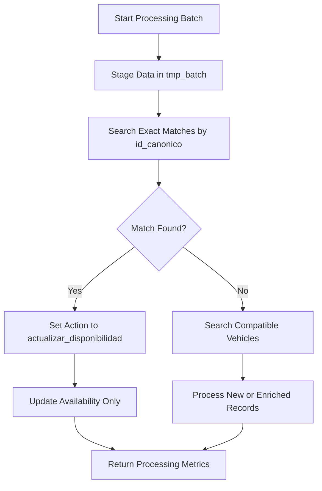
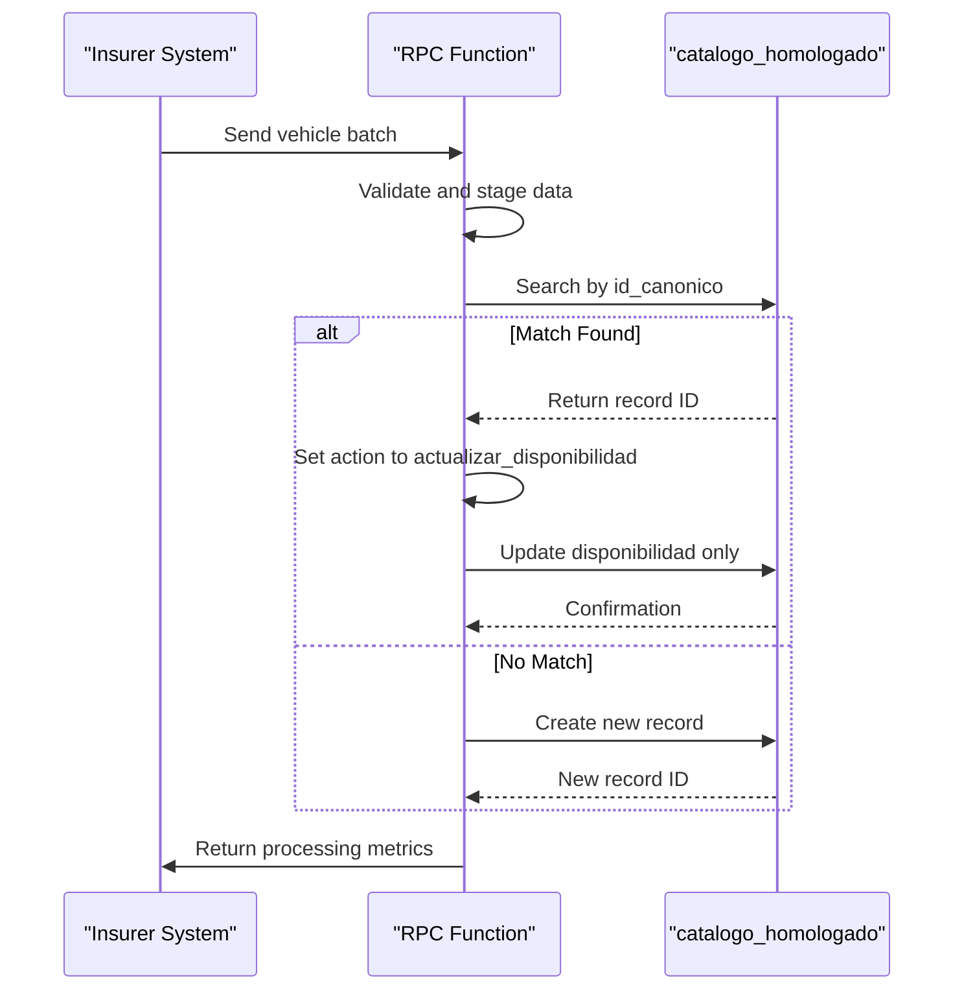

# Exact Match Resolution by id_canonico

<cite>
**Referenced Files in This Document**   
- [Funcion RPC Nueva.sql](file://src/supabase/Funcion RPC Nueva.sql)
- [Replanteamiento homologacion.md](file://src/supabase/Replanteamiento homologacion.md)
- [instrucciones.md](file://instrucciones.md)
</cite>

## Table of Contents
1. [Introduction](#introduction)
2. [Exact Match Identification Strategy](#exact-match-identification-strategy)
3. [SQL Logic for Exact Match Resolution](#sql-logic-for-exact-match-resolution)
4. [Idempotent Updates of Insurer Availability](#idempotent-updates-of-insurer-availability)
5. [JSONB Field Merging Strategy](#jsonb-field-merging-strategy)
6. [Business Rationale for id_canonico Priority](#business-rationale-for-id_canonico-priority)
7. [Data Traceability and Consistency](#data-traceability-and-consistency)

## Introduction
This document details the exact match resolution strategy implemented in the RPC function for vehicle catalog homologation. The system uses the `id_canonico` field as the primary key to identify existing records in the canonical catalog. This approach enables precise matching of vehicle records across processing batches, ensuring data consistency and traceability. The documentation explains how the system performs idempotent updates of insurer-specific availability without altering core vehicle attributes, maintaining data integrity throughout the homologation process.

## Exact Match Identification Strategy
The system implements a hierarchical matching strategy with `id_canonico` as the primary identification mechanism. This field serves as the definitive identifier for vehicle records in the canonical catalog, calculated as a SHA-256 hash of normalized attributes including `hash_comercial`, `version`, `motor_config`, `carroceria`, and `traccion`. The matching process prioritizes exact matches on `id_canonico` before considering other compatibility criteria, establishing a deterministic hierarchy that ensures consistent record identification across processing batches.

The identification strategy begins with the validation of input data, ensuring each vehicle object contains the minimum required keys: `id_canonico`, `hash_comercial`, `string_comercial`, `string_tecnico`, `marca`, `modelo`, `anio`, `transmision`, `origen_aseguradora`, and `activo`. This validation step guarantees data quality before processing, preventing incomplete records from entering the homologation pipeline.

**Section sources**
- [Replanteamiento homologacion.md](file://src/supabase/Replanteamiento homologacion.md#L174-L193)
- [instrucciones.md](file://instrucciones.md#L174-L193)

## SQL Logic for Exact Match Resolution
The SQL logic for exact match resolution is implemented through a multi-step process within the `procesar_batch_homologacion` function. The initial match detection occurs via an UPDATE operation on the temporary staging table `tmp_batch`, which identifies existing records in the canonical catalog by comparing the `id_canonico` field.



**Diagram sources**
- [Funcion RPC Nueva.sql](file://src/supabase/Funcion RPC Nueva.sql#L78-L111)

The core SQL logic for exact match detection is implemented as follows:

```sql
UPDATE tmp_batch t
SET id_homologado_match = ch.id,
    matches_encontrados = 1,
    accion = 'actualizar_disponibilidad'
FROM catalogo_homologado ch
WHERE ch.id_canonico = t.id_canonico;
```

This operation sets the `accion` field to 'actualizar_disponibilidad' when a match is found, signaling that the system should update only the availability information for the insurer without modifying the core vehicle attributes. The use of `id_canonico` as the matching criterion ensures that updates are applied to the correct canonical record, maintaining data consistency across processing cycles.

**Section sources**
- [Funcion RPC Nueva.sql](file://src/supabase/Funcion RPC Nueva.sql#L78-L111)

## Idempotent Updates of Insurer Availability
The system enables idempotent updates of insurer-specific availability through a carefully designed update mechanism that preserves core vehicle attributes. When a match is found via `id_canonico`, the system executes an update operation that modifies only the `disponibilidad` JSONB field, leaving all other vehicle attributes unchanged. This approach ensures that repeated processing of the same batch does not alter the canonical record beyond the intended availability updates.

The idempotency is achieved through the following principles:
- Updates are restricted to insurer-specific availability data
- Core vehicle attributes remain immutable once established
- Timestamps are updated to reflect the most recent processing
- Confidence scores are incrementally adjusted based on update frequency

This design prevents unintended modifications to vehicle specifications while allowing insurers to update their availability status independently. The system's idempotent nature means that reprocessing the same batch will produce identical results, ensuring reliability and predictability in the homologation process.



**Diagram sources**
- [Funcion RPC Nueva.sql](file://src/supabase/Funcion RPC Nueva.sql#L291-L327)

**Section sources**
- [Funcion RPC Nueva.sql](file://src/supabase/Funcion RPC Nueva.sql#L291-L327)

## JSONB Field Merging Strategy
The system employs a strategic approach to merging data into the `disponibilidad` JSONB field, preserving existing information while incorporating new insurer-specific data. When updating availability, the system uses the JSONB concatenation operator (`||`) to merge the new insurer data with existing availability information, ensuring that data from other insurers remains intact.

The merging process follows these rules:
- The `activo` field is updated with the incoming value (true/false)
- `id_original` and `version_original` are updated with current values
- `fecha_actualizacion` is set to the current timestamp (NOW())
- Data for other insurers in the JSONB structure remains unchanged

This selective merging strategy ensures that each insurer's availability information is maintained independently within the same record, enabling comprehensive tracking of vehicle availability across multiple insurance providers. The use of JSONB allows for flexible schema evolution, accommodating additional insurer-specific fields without requiring database schema changes.

**Section sources**
- [Replanteamiento homologacion.md](file://src/supabase/Replanteamiento homologacion.md#L174-L193)
- [instrucciones.md](file://instrucciones.md#L174-L193)

## Business Rationale for id_canonico Priority
The prioritization of `id_canonico` matches is driven by several key business requirements that emphasize data accuracy, consistency, and traceability. By establishing `id_canonico` as the primary matching criterion, the system ensures that vehicle records are uniquely and consistently identified across processing batches, regardless of variations in insurer-specific data.

The business rationale includes:
- **Data Integrity**: Ensuring that updates are applied to the correct canonical record
- **Traceability**: Maintaining a clear audit trail of changes to vehicle availability
- **Consistency**: Preventing fragmentation of vehicle records across multiple entries
- **Efficiency**: Reducing processing time by using a direct lookup mechanism

This approach supports the business objective of creating a unified vehicle catalog that accurately reflects availability across multiple insurers while maintaining a single source of truth for vehicle specifications. The deterministic nature of `id_canonico` matching eliminates ambiguity in record identification, which is critical for regulatory compliance and operational reliability.

**Section sources**
- [Replanteamiento homologacion.md](file://src/supabase/Replanteamiento homologacion.md#L88-L101)
- [instrucciones.md](file://instrucciones.md#L88-L101)

## Data Traceability and Consistency
The exact match resolution strategy by `id_canonico` provides robust data traceability and consistency across processing batches. Each vehicle record in the canonical catalog maintains a complete history of availability changes through the `disponibilidad` JSONB field, which stores insurer-specific information including activation status, original identifiers, and update timestamps.

The system ensures consistency through several mechanisms:
- **Immutable Core Attributes**: Vehicle specifications remain unchanged once established
- **Versioned Availability**: Each insurer's availability data includes a timestamp
- **Conflict Detection**: The system identifies and reports potential data conflicts
- **Audit Trail**: Processing metrics capture the history of batch operations

This comprehensive approach to data management enables stakeholders to trace the complete lifecycle of a vehicle record, from initial creation through subsequent availability updates. The consistency across batches ensures that the canonical catalog remains a reliable source of truth for vehicle availability, supporting business decisions and operational processes.

**Section sources**
- [Replanteamiento homologacion.md](file://src/supabase/Replanteamiento homologacion.md#L174-L193)
- [instrucciones.md](file://instrucciones.md#L174-L193)