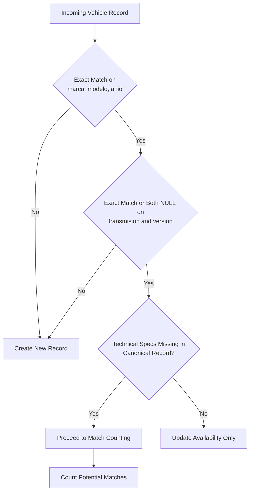
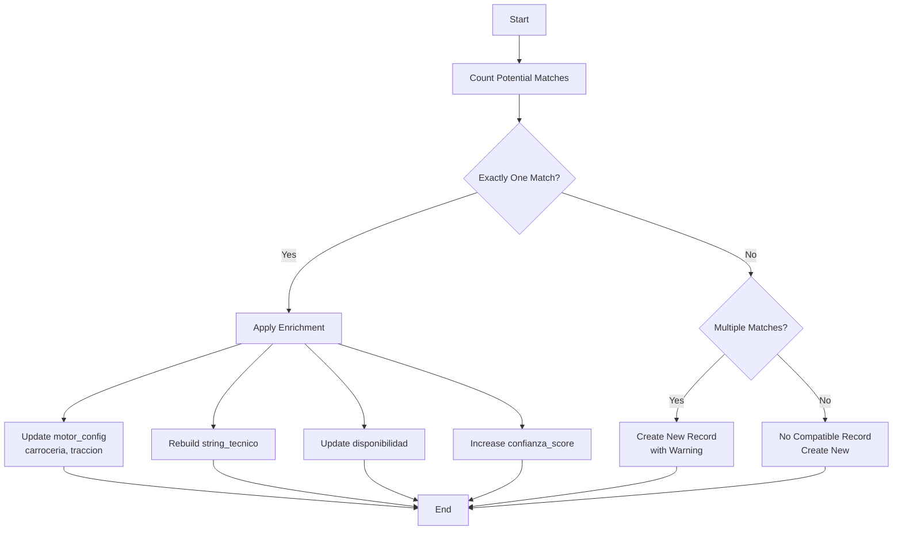
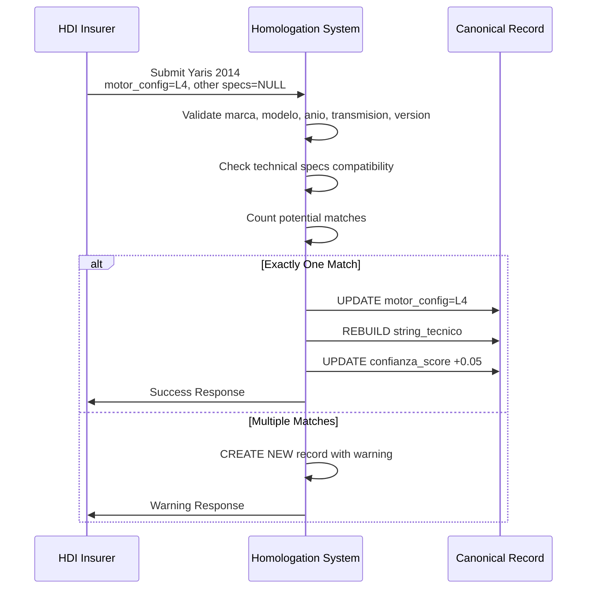
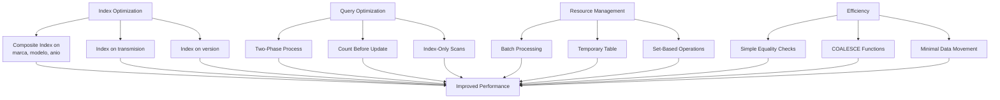

# Technical Specification Enrichment Rules

<cite>
**Referenced Files in This Document**   
- [Funcion RPC Nueva.sql](file://src/supabase/Funcion RPC Nueva.sql)
- [casos de prueba función rpc.sql](file://src/supabase/casos de prueba función rpc.sql)
- [hdi-analisis.md](file://src/insurers/hdi/hdi-analisis.md)
- [gnp-analisis.md](file://src/insurers/gnp/gnp-analisis.md)
</cite>

## Table of Contents
1. [Introduction](#introduction)
2. [Enrichment Matching Criteria](#enrichment-matching-criteria)
3. [Two-Phase Enrichment Process](#two-phase-enrichment-process)
4. [Concrete Enrichment Examples](#concrete-enrichment-examples)
5. [Performance Considerations](#performance-considerations)

## Introduction
This document details the technical specification enrichment logic within the conflict resolution strategy for the vehicle homologation system. The system enables safe population of missing technical specifications (motor_config, carroceria, or traccion) from incoming insurer data when these fields are absent in the canonical record. The enrichment process follows strict matching criteria and a two-phase validation approach to ensure data integrity while maximizing information completeness across insurer catalogs.

**Section sources**
- [Funcion RPC Nueva.sql](file://src/supabase/Funcion RPC Nueva.sql#L0-L428)

## Enrichment Matching Criteria
The system identifies compatible vehicles for technical specification enrichment based on exact matches for core commercial attributes while allowing supplementation of missing technical details. The matching criteria require exact alignment on marca, modelo, anio, transmision, and version fields, with proper NULL handling to ensure compatibility.

For a vehicle to be eligible for enrichment, all mandatory commercial fields must match exactly between the incoming record and the canonical record. The transmision and version fields must either both be NULL or have identical non-NULL values. This ensures that only vehicles with identical commercial characteristics are considered for technical specification supplementation.

The system specifically allows enrichment of three technical specification fields: motor_config, carroceria, and traccion. These fields can be populated from incoming data when they are NULL in the canonical record and contain valid values in the incoming record. The enrichment logic uses COALESCE functions to preserve existing canonical values while filling gaps with incoming data.

The matching algorithm implements comprehensive NULL handling through explicit conditions that check for both NULL states or exact value matches. This prevents false matches when one record has a defined value and the canonical record has NULL for the same field, ensuring that only truly compatible vehicles participate in the enrichment process.

**Diagram sources**
- [Funcion RPC Nueva.sql](file://src/supabase/Funcion RPC Nueva.sql#L112-L158)

**Section sources**
- [Funcion RPC Nueva.sql](file://src/supabase/Funcion RPC Nueva.sql#L112-L158)

## Two-Phase Enrichment Process
The system implements a two-phase process for technical specification enrichment to prevent conflicts and ensure data integrity. The first phase counts potential matches, while the second phase applies enrichment only when exactly one compatible canonical record exists.

In the first phase, the system counts all potential matches that satisfy the enrichment criteria. This counting operation evaluates all records in the catalogo_homologado table that match on marca, modelo, anio, transmision, and version (with NULL handling) and where at least one technical specification field (motor_config, carroceria, or traccion) can be enriched. The count operation is critical for identifying ambiguous situations where multiple canonical records could potentially accept the incoming technical specifications.

**Diagram sources**
- [Funcion RPC Nueva.sql](file://src/supabase/Funcion RPC Nueva.sql#L159-L231)

The second phase applies enrichment only when the match count equals exactly one. This strict requirement prevents data conflicts that could arise from ambiguous matching scenarios. When multiple potential matches exist (matches_encontrados > 1), the system creates a new record instead of enriching existing ones, accompanied by a warning to alert operators of the ambiguity.

The enrichment phase updates the canonical record by setting the technical specification fields using COALESCE functions that preserve existing values while filling NULL gaps. The motor_config, carroceria, and traccion fields are updated simultaneously when any of them can be enriched. The system also reconstructs the string_tecnico field to reflect the updated technical specifications and increments the confianza_score by 0.05 to reflect the increased data completeness.

The two-phase approach ensures data consistency by preventing partial enrichment in ambiguous scenarios. It also maintains a clear audit trail through the matches_encontrados counter, which helps identify data quality issues in the source catalogs that lead to multiple potential matches.

**Section sources**
- [Funcion RPC Nueva.sql](file://src/supabase/Funcion RPC Nueva.sql#L159-L231)

## Concrete Enrichment Examples
The system demonstrates effective technical specification enrichment through real-world scenarios involving insurer data from HDI, GNP, and other providers. These examples illustrate how the matching criteria and two-phase process work together to enhance data completeness while maintaining integrity.

One primary example involves HDI providing motor configuration data for a vehicle originally recorded by GNP. When GNP initially submits a Toyota Yaris 2014 with transmission AUTO and version PREMIUM but with NULL values for motor_config, carroceria, and traccion, the system creates a canonical record with incomplete technical specifications. Later, when HDI submits the same vehicle with motor_config "L4" but NULL values for other technical fields, the system identifies this as an enrichment opportunity.

The matching process verifies exact alignment on marca (TOYOTA), modelo (YARIS), anio (2014), transmision (AUTO), and version (PREMIUM), with proper NULL handling for the technical fields. With exactly one matching canonical record, the system enriches the existing record by setting motor_config to "L4" while preserving other fields. The string_tecnico is reconstructed to include the new motor configuration, and the confianza_score increases from 1.0 to 1.05 (capped at 1.0).

Another example demonstrates progressive enrichment for a Volkswagen Gol. Qualitas first submits a 2017 Gol with no version and all technical specifications as NULL. Later, Zurich submits the same vehicle with carroceria "HATCHBACK" but NULL for other technical fields. The system matches on marca, modelo, anio, and transmision, with both records having NULL for version. With exactly one match, the system enriches the canonical record with carroceria "HATCHBACK", demonstrating how technical specifications can be accumulated from multiple insurers over time.

The system also handles conflict scenarios appropriately. When HDI submits a Toyota Yaris 2014 with carroceria "HATCHBACK" while the canonical record has carroceria "SEDAN", the exact match requirement on carroceria fails (neither both NULL nor identical values), preventing enrichment and resulting in a new record creation. This ensures that conflicting technical specifications are not merged, maintaining data accuracy.

**Diagram sources**
- [casos de prueba función rpc.sql](file://src/supabase/casos de prueba función rpc.sql#L103-L137)
- [hdi-analisis.md](file://src/insurers/hdi/hdi-analisis.md#L0-L524)
- [gnp-analisis.md](file://src/insurers/gnp/gnp-analisis.md#L0-L280)

**Section sources**
- [casos de prueba función rpc.sql](file://src/supabase/casos de prueba función rpc.sql#L103-L137)
- [hdi-analisis.md](file://src/insurers/hdi/hdi-analisis.md#L0-L524)
- [gnp-analisis.md](file://src/insurers/gnp/gnp-analisis.md#L0-L280)

## Performance Considerations
The technical specification enrichment system incorporates several performance optimizations to ensure efficient query execution and scalability with large datasets. These considerations focus on indexing strategies, query optimization, and resource management to maintain responsive processing times.

The system relies on strategic database indexing to accelerate the matching process. Key fields used in the WHERE clauses of enrichment queries are indexed to minimize full table scans. The marca, modelo, and anio fields have a composite index to optimize the primary matching condition. Additional indexes on transmision and version support the exact match and NULL handling requirements. These indexes significantly reduce query execution time when searching for compatible records.

Query optimization is achieved through the two-phase approach, which separates counting from updating operations. The counting phase uses a SELECT COUNT(*) operation that can leverage index-only scans when possible, avoiding the overhead of row locking. Only after determining exactly one match does the system proceed to the UPDATE operation, minimizing contention on the catalogo_homologado table.

The use of temporary tables (tmp_batch) for staging incoming records allows batch processing and reduces the number of individual transactions. This approach enables set-based operations rather than row-by-row processing, improving overall throughput. The temporary table is created with appropriate constraints and indexes to optimize the UPDATE operations that perform the matching logic.

Resource management considerations include limiting the number of records processed in a single batch to prevent excessive memory usage and long-running transactions. The system processes records in batches, allowing for checkpointing and recovery in case of failures. This batch-oriented approach also facilitates monitoring and performance tuning by providing clear boundaries for measuring processing times.

The enrichment logic minimizes expensive operations by using simple equality comparisons and NULL checks rather than complex string operations or regular expressions. The COALESCE functions used for updating technical specifications are optimized by the database engine and execute efficiently. The system avoids unnecessary data movement by updating only the required fields rather than rewriting entire records.

**Diagram sources**
- [Funcion RPC Nueva.sql](file://src/supabase/Funcion RPC Nueva.sql#L78-L111)
- [Tabla maestra.sql](file://src/supabase/Tabla maestra.sql#L83-L86)

**Section sources**
- [Funcion RPC Nueva.sql](file://src/supabase/Funcion RPC Nueva.sql#L78-L111)
- [Tabla maestra.sql](file://src/supabase/Tabla maestra.sql#L83-L86)