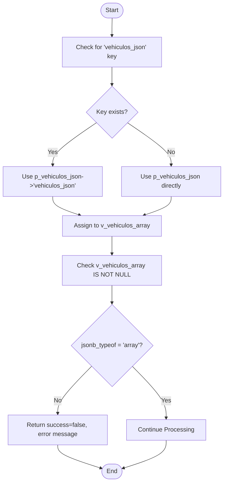
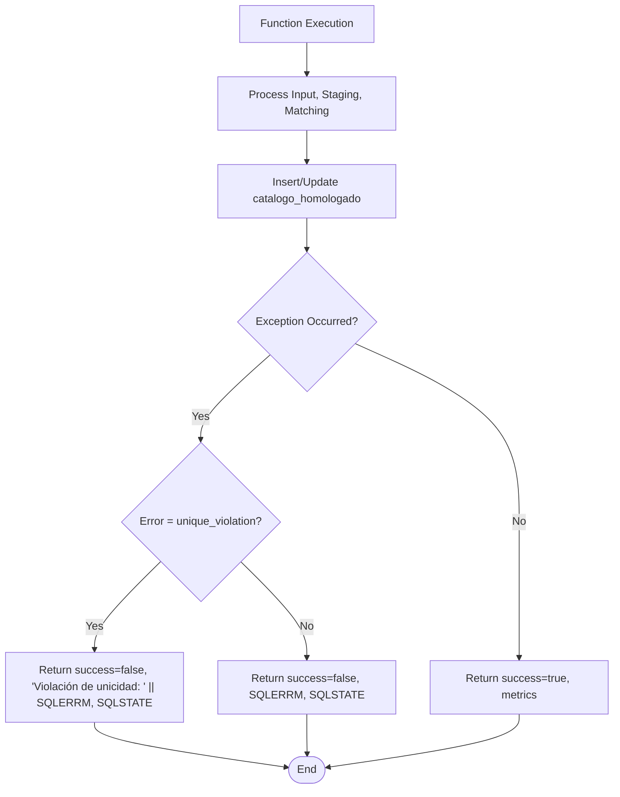

# Error Handling

<cite>
**Referenced Files in This Document**   
- [Funcion RPC Nueva.sql](file://src/supabase/Funcion RPC Nueva.sql)
- [instrucciones.md](file://instrucciones.md)
- [casos de prueba función rpc.sql](file://src/supabase/casos de prueba función rpc.sql)
</cite>

## Table of Contents
1. [Introduction](#introduction)
2. [Input Validation Mechanisms](#input-validation-mechanisms)
3. [Exception Handling and SQL Error Management](#exception-handling-and-sql-error-management)
4. [Response Structure for Errors and Warnings](#response-structure-for-errors-and-warnings)
5. [Differentiating Warnings from Errors](#differentiating-warnings-from-errors)
6. [Developer Guidance for Debugging Common Issues](#developer-guidance-for-debugging-common-issues)
7. [Conclusion](#conclusion)

## Introduction
The `procesar_batch_homologacion` function is a PostgreSQL PL/pgSQL stored procedure responsible for processing vehicle data batches from multiple insurers into a canonical homologated catalog. This document details the comprehensive error handling mechanisms implemented within this function, focusing on input validation, exception handling, response formatting, and guidance for developers to interpret and resolve common issues. The function ensures data integrity and provides clear feedback on processing outcomes, distinguishing between blocking errors and non-blocking warnings.

**Section sources**
- [Funcion RPC Nueva.sql](file://src/supabase/Funcion RPC Nueva.sql#L1-L429)

## Input Validation Mechanisms
The function begins with a robust input validation phase to ensure the integrity of the incoming JSON data. It first checks whether the input JSON contains a nested `vehiculos_json` key. If present, it extracts the array from this key; otherwise, it assumes the input itself is the array. The validation then confirms that the resulting `v_vehiculos_array` is not null and is of type 'array' using `jsonb_typeof`. If the input fails this validation, the function immediately returns a response with `success=false`, an error message indicating that the input must contain a vehicle array, and a `received` count of 0. This early validation prevents further processing of malformed data and ensures that only properly structured JSON arrays are processed.

**Diagram sources**
- [Funcion RPC Nueva.sql](file://src/supabase/Funcion RPC Nueva.sql#L15-L30)

**Section sources**
- [Funcion RPC Nueva.sql](file://src/supabase/Funcion RPC Nueva.sql#L15-L30)

## Exception Handling and SQL Error Management
The function employs a structured exception handling block to manage runtime errors, particularly those arising from SQL operations. The primary exception caught is `unique_violation`, which occurs when an attempt is made to insert a record that violates the unique constraint on the `id_canonico` field in the `catalogo_homologado` table. In this case, the function returns a JSONB object with `success=false`, an error message prefixed with "Violación de unicidad: " followed by the specific SQL error message (`SQLERRM`), and the `SQLSTATE` code for detailed error classification. For any other unforeseen SQL exceptions (`WHEN OTHERS`), the function returns a generic error response containing the `SQLERRM` and `SQLSTATE`, ensuring that the calling system receives meaningful information about the failure while preventing the exposure of sensitive internal details.

**Diagram sources**
- [Funcion RPC Nueva.sql](file://src/supabase/Funcion RPC Nueva.sql#L415-L428)

**Section sources**
- [Funcion RPC Nueva.sql](file://src/supabase/Funcion RPC Nueva.sql#L415-L428)

## Response Structure for Errors and Warnings
The function communicates its processing results through a well-defined JSONB response structure. For successful executions, the response includes `success=true`, the number of vehicles received and processed, and detailed metrics on new, enriched, and updated records. Crucially, all validation failures are communicated through this response object rather than by raising exceptions. For instance, if the input is not a valid array, the function returns `success=false` with a descriptive error message and a `received` count of 0. This approach allows the calling application (e.g., n8n) to handle the error gracefully without the process being interrupted by a database exception. The response also includes a `warnings` array for non-critical issues, such as multiple potential matches, ensuring that the caller is informed of potential data quality concerns without halting the entire batch process.

**Section sources**
- [Funcion RPC Nueva.sql](file://src/supabase/Funcion RPC Nueva.sql#L25-L30)
- [Funcion RPC Nueva.sql](file://src/supabase/Funcion RPC Nueva.sql#L405-L413)

## Differentiating Warnings from Errors
The function clearly distinguishes between errors (blocking issues) and warnings (non-blocking issues). Errors, such as invalid JSON structure or a malformed array, prevent any processing of the batch and result in an immediate return with `success=false`. In contrast, warnings are used for non-critical situations that do not stop the processing of the entire batch. A primary example is the detection of "multiple matches," where a vehicle from the input batch could potentially match more than one existing record in the canonical catalog based on its specifications. In such cases, the function logs a warning message detailing the vehicle and the number of potential matches, then proceeds to create a new canonical record. This distinction allows the system to maintain high throughput while still flagging potential data inconsistencies for later review.

**Section sources**
- [Funcion RPC Nueva.sql](file://src/supabase/Funcion RPC Nueva.sql#L130-L150)
- [Funcion RPC Nueva.sql](file://src/supabase/Funcion RPC Nueva.sql#L250-L260)

## Developer Guidance for Debugging Common Issues
Developers can use the function's response to diagnose and resolve common issues. For a `success=false` response with a `unique_violation` error, the issue is a duplicate `id_canonico`. This typically indicates a problem in the data preparation phase (e.g., in n8n) where the same canonical ID was generated for two different vehicles, or a hash collision. The `SQLSTATE` code can be used to confirm the exact nature of the constraint violation. For warnings about "multiple matches," developers should investigate the specific vehicle's data (marca, modelo, anio, version, etc.) to understand why it matched multiple existing records, which may point to inconsistencies in the canonical data or overly broad matching logic. Hash mismatches can be debugged by verifying the normalization and hashing logic in the data preparation pipeline, ensuring consistent application of `UPPER` and `TRIM` functions. The provided test cases in `casos de prueba función rpc.sql` serve as excellent examples for validating expected behavior under various scenarios.

**Section sources**
- [instrucciones.md](file://instrucciones.md#L0-L279)
- [casos de prueba función rpc.sql](file://src/supabase/casos de prueba función rpc.sql#L0-L255)

## Conclusion
The `procesar_batch_homologacion` function implements a robust and well-structured error handling system. It proactively validates input data, uses exceptions judiciously for critical SQL errors, and communicates all outcomes—successes, errors, and warnings—through a consistent JSON response. By differentiating between blocking errors and non-blocking warnings, the function ensures reliable batch processing while providing valuable feedback for data quality improvement. This design supports the overall goal of building a reliable, traceable, and maintainable homologated vehicle catalog.