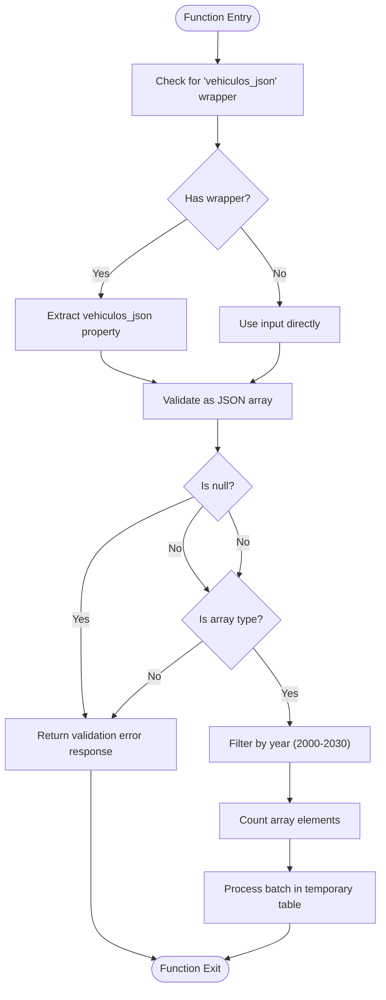
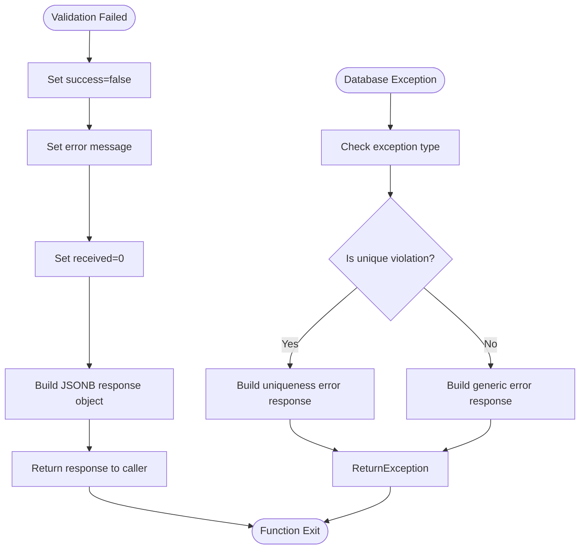

# Input Validation

<cite>
**Referenced Files in This Document**   
- [Funcion RPC Nueva.sql](file://src/supabase/Funcion RPC Nueva.sql)
- [Replanteamiento homologacion.md](file://src/supabase/Replanteamiento homologacion.md)
- [instrucciones.md](file://instrucciones.md)
- [casos de prueba función rpc.sql](file://src/supabase/casos de prueba función rpc.sql)
</cite>

## Table of Contents
1. [Introduction](#introduction)
2. [Input Structure Validation](#input-structure-validation)
3. [Validation Failure Response](#validation-failure-response)
4. [Valid and Invalid Input Examples](#valid-and-invalid-input-examples)
5. [Debugging Common Input Issues](#debugging-common-input-issues)
6. [Best Practices for Input Preparation](#best-practices-for-input-preparation)

## Introduction
The `procesar_batch_homologacion` function serves as a critical RPC endpoint for processing vehicle homologation data in the Supabase environment. This document provides comprehensive documentation on its input validation mechanisms, focusing on how the function handles JSONB input structure, validates array types, manages malformed inputs, and responds to validation failures. The analysis is based on direct examination of the function's implementation and supporting documentation.

**Section sources**
- [Funcion RPC Nueva.sql](file://src/supabase/Funcion RPC Nueva.sql#L0-L429)
- [Replanteamiento homologacion.md](file://src/supabase/Replanteamiento homologacion.md#L0-L280)

## Input Structure Validation

The `procesar_batch_homologacion` function implements a robust two-step validation process for its JSONB input parameter. The function first checks for the presence of an optional 'vehiculos_json' wrapper property and then validates that the resulting data is a proper JSON array.

The validation begins by checking whether the input JSONB object contains a top-level property named 'vehiculos_json' using the `?` operator. If this property exists, the function extracts its value; otherwise, it uses the entire input as the data source. This design provides flexibility for clients to either wrap their vehicle data in a named property or send the array directly.

After extracting the potential array, the function performs strict type validation using PostgreSQL's `jsonb_typeof()` function. It verifies that the extracted value is not null and that its type is specifically 'array'. The function also filters input data to include only vehicles with model years between 2000 and 2030, ensuring data quality and relevance.



**Diagram sources**
- [Funcion RPC Nueva.sql](file://src/supabase/Funcion RPC Nueva.sql#L15-L35)

**Section sources**
- [Funcion RPC Nueva.sql](file://src/supabase/Funcion RPC Nueva.sql#L15-L45)

## Validation Failure Response

When input validation fails, the `procesar_batch_homologacion` function returns a standardized JSONB response structure that clearly communicates the error condition. The response includes three key components: a success flag, an error message, and a received count.

The response format follows the pattern: `{success: false, error: 'descriptive message', received: 0}`. The 'success' field is set to false to indicate validation failure. The 'error' field contains a descriptive message in Spanish that explains the nature of the validation failure, specifically stating "Input debe contener un array de vehículos" (Input must contain an array of vehicles). The 'received' field is set to 0, indicating that no valid vehicle records were processed due to the validation failure.

In addition to the primary validation failure path, the function includes exception handling for database-level errors. If a unique constraint violation occurs during processing, the function returns a specialized error response with the 'success' flag set to false and an error message describing the uniqueness violation. For all other unexpected exceptions, a generic error response is returned with the SQL error message included.



**Diagram sources**
- [Funcion RPC Nueva.sql](file://src/supabase/Funcion RPC Nueva.sql#L30-L40)
- [Funcion RPC Nueva.sql](file://src/supabase/Funcion RPC Nueva.sql#L400-L415)

**Section sources**
- [Funcion RPC Nueva.sql](file://src/supabase/Funcion RPC Nueva.sql#L30-L45)
- [Funcion RPC Nueva.sql](file://src/supabase/Funcion RPC Nueva.sql#L400-L420)

## Valid and Invalid Input Examples

Based on the function implementation and documentation, several examples illustrate the expected input formats and common validation failure scenarios.

Valid input can be structured in two acceptable formats. The first format uses the 'vehiculos_json' wrapper property containing an array of vehicle objects:

```json
{
  "vehiculos_json": [
    {
      "id_canonico": "66b4fe23a96e8de9b1dac624069d9a03f96d3f17d7319673621254cb42c651dc",
      "hash_comercial": "7cc9374cee0e1c1bc8638521b2690cb010dae9729134790042f19c05346f8d45",
      "marca": "ACURA",
      "modelo": "ADX",
      "anio": 2025,
      "transmision": "AUTO",
      "origen_aseguradora": "QUALITAS",
      "activo": true
    }
  ]
}
```

The second valid format omits the wrapper and provides the array directly:

```json
[
  {
    "id_canonico": "66b4fe23a96e8de9b1dac624069d9a03f96d3f17d7319673621254cb42c651dc",
    "hash_comercial": "7cc9374cee0e1c1bc8638521b2690cb010dae9729134790042f19c05346f8d45",
    "marca": "ACURA",
    "modelo": "ADX",
    "anio": 2025,
    "transmision": "AUTO",
    "origen_aseguradora": "QUALITAS",
    "activo": true
  }
]
```

Invalid inputs that trigger validation failures include:
- Null or empty input: `null` or `{}` (no array present)
- Non-array JSON objects: `{"vehiculos_json": {}}` (object instead of array)
- String input: `"not a json object"` (incorrect data type)
- Number input: `123` (incorrect data type)
- Array with invalid year: vehicles with anio outside 2000-2030 range

The function's test cases in `casos de prueba función rpc.sql` demonstrate various input scenarios, including edge cases that test the validation logic thoroughly.

**Section sources**
- [Funcion RPC Nueva.sql](file://src/supabase/Funcion RPC Nueva.sql#L15-L45)
- [Replanteamiento homologacion.md](file://src/supabase/Replanteamiento homologacion.md#L200-L250)
- [casos de prueba función rpc.sql](file://src/supabase/casos de prueba función rpc.sql#L0-L220)

## Debugging Common Input Issues

Developers encountering validation errors with the `procesar_batch_homologacion` function should systematically check several common issues. The most frequent problem is incorrect JSON structure, where the input is not a proper JSON array or is wrapped incorrectly.

When debugging, first verify that the input is valid JSON and that it represents an array of vehicle objects. Use JSON validation tools to confirm the structure. If using the 'vehiculos_json' wrapper, ensure it contains an array, not a single object or other data type.

Second, check that each vehicle object contains the required fields as specified in the documentation, particularly 'marca', 'modelo', 'anio', 'transmision', 'origen_aseguradora', and 'activo'. Missing required fields may not trigger the initial validation but could cause issues in later processing stages.

Third, validate that the 'anio' (year) values are within the acceptable range of 2000-2030. Vehicles outside this range are filtered out during processing and will not be counted in the final statistics.

Fourth, ensure that string values are properly formatted and do not contain unexpected characters or encoding issues. The function applies TRIM and UPPER operations to string fields, but malformed UTF-8 sequences could still cause problems.

Finally, when testing, use the example payloads provided in the documentation as a baseline, then gradually modify them to match your specific use case. The `casos de prueba función rpc.sql` file contains multiple test scenarios that can serve as reference implementations.

**Section sources**
- [Funcion RPC Nueva.sql](file://src/supabase/Funcion RPC Nueva.sql#L15-L45)
- [Replanteamiento homologacion.md](file://src/supabase/Replanteamiento homologacion.md#L200-L250)
- [casos de prueba función rpc.sql](file://src/supabase/casos de prueba función rpc.sql#L0-L220)

## Best Practices for Input Preparation

To ensure successful processing by the `procesar_batch_homologacion` function, developers should follow several best practices when preparing input data. These practices help prevent validation errors and ensure data quality.

First, always validate the JSON structure before sending the request. Use JSON schema validation or similar tools to confirm that the input matches the expected format. This pre-validation step can catch structural issues before they reach the RPC function.

Second, implement client-side filtering to ensure all vehicle records have 'anio' values between 2000 and 2030. This prevents sending data that will be filtered out during processing, reducing network overhead and improving efficiency.

Third, consider using the direct array format rather than the 'vehiculos_json' wrapper unless your system specifically requires the wrapped format. The direct format is simpler and reduces the chance of wrapping errors.

Fourth, ensure all required fields are present in each vehicle object. Based on the function's implementation and documentation, critical fields include 'id_canonico', 'hash_comercial', 'marca', 'modelo', 'anio', 'transmision', 'origen_aseguradora', and 'activo'.

Fifth, apply data normalization before sending the request. Convert string fields to uppercase and trim whitespace, as the function performs these operations internally. Pre-normalizing data can help identify potential issues earlier in the process.

Sixth, implement proper error handling in the client application to gracefully handle validation failures. Parse the error response and provide meaningful feedback to users or logging systems.

Finally, when processing large batches, consider implementing chunking to divide data into smaller, manageable requests. This approach improves error isolation and makes it easier to retry failed batches.

**Section sources**
- [Funcion RPC Nueva.sql](file://src/supabase/Funcion RPC Nueva.sql#L15-L45)
- [Replanteamiento homologacion.md](file://src/supabase/Replanteamiento homologacion.md#L200-L250)
- [instrucciones.md](file://instrucciones.md#L200-L250)