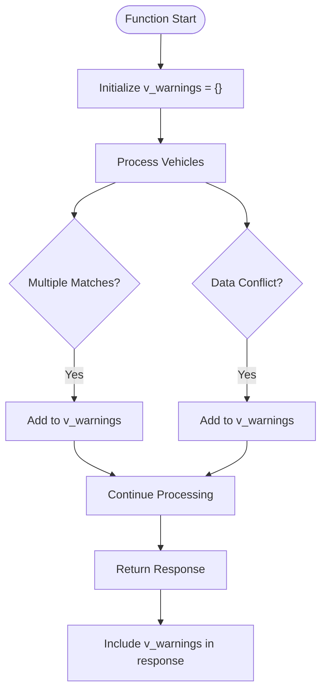
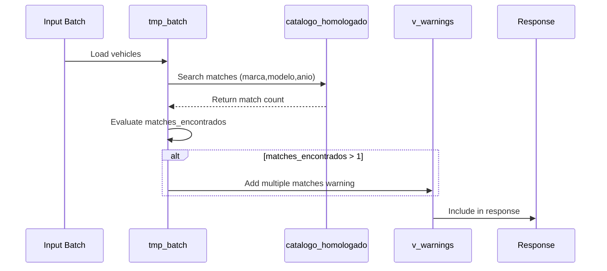
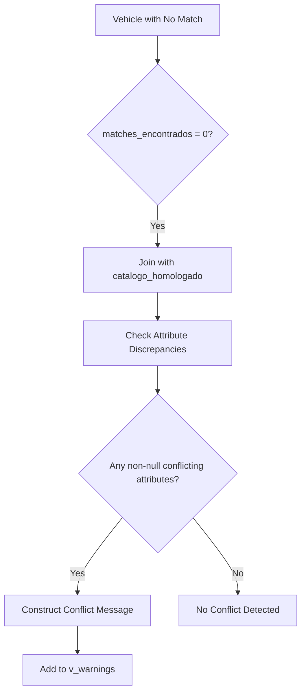

# Warning Management

<cite>
**Referenced Files in This Document**   
- [Funcion RPC Nueva.sql](file://src/supabase/Funcion RPC Nueva.sql)
- [Replanteamiento homologacion.md](file://src/supabase/Replanteamiento homologacion.md)
- [instrucciones.md](file://instrucciones.md)
</cite>

## Table of Contents
1. [Introduction](#introduction)
2. [Warning Collection Mechanism](#warning-collection-mechanism)
3. [Multiple Matches Detection](#multiple-matches-detection)
4. [Conflict Detection Logic](#conflict-detection-logic)
5. [Warning Message Construction](#warning-message-construction)
6. [Response Structure and Non-blocking Behavior](#response-structure-and-non-blocking-behavior)
7. [Examples of Warning Messages](#examples-of-warning-messages)
8. [Developer Guidance for Data Quality Improvement](#developer-guidance-for-data-quality-improvement)

## Introduction
The `procesar_batch_homologacion` function implements a robust warning system to handle non-critical issues during vehicle data homologation. This system allows processing to continue while capturing important data quality concerns such as multiple potential matches and attribute conflicts. Warnings are collected in the `v_warnings` array and returned alongside successful responses, enabling downstream systems to monitor and address data inconsistencies without interrupting the core processing flow.

**Section sources**
- [Funcion RPC Nueva.sql](file://src/supabase/Funcion RPC Nueva.sql#L16)

## Warning Collection Mechanism
The warning system uses a `TEXT[]` array named `v_warnings` to collect non-blocking issues encountered during batch processing. This array is initialized as an empty array at the beginning of function execution and populated when specific conditions are detected. Two primary scenarios trigger warning generation: multiple potential matches during compatibility search and data conflicts with existing records. The system distinguishes these warnings from errors, allowing the function to maintain `success=true` in the response while still alerting consumers to potential data quality issues.



**Diagram sources**
- [Funcion RPC Nueva.sql](file://src/supabase/Funcion RPC Nueva.sql#L16)
- [Funcion RPC Nueva.sql](file://src/supabase/Funcion RPC Nueva.sql#L201)
- [Funcion RPC Nueva.sql](file://src/supabase/Funcion RPC Nueva.sql#L388-L389)

**Section sources**
- [Funcion RPC Nueva.sql](file://src/supabase/Funcion RPC Nueva.sql#L16)
- [Funcion RPC Nueva.sql](file://src/supabase/Funcion RPC Nueva.sql#L201)
- [Funcion RPC Nueva.sql](file://src/supabase/Funcion RPC Nueva.sql#L388-L389)

## Multiple Matches Detection
The system detects multiple potential matches during the compatibility search phase by counting viable candidates in the `catalogo_homologado` table. When a vehicle from the input batch doesn't have an exact match via `id_canonico`, the function searches for compatible records based on core attributes (marca, modelo, anio) and specific matching rules for transmission and version. The query counts all potential matches that satisfy the compatibility criteria, including cases where technical specifications (motor_config, carroceria, traccion) could be enriched. If this count exceeds one (`matches_encontrados > 1`), it indicates ambiguity in the matching process, triggering a warning.



**Diagram sources**
- [Funcion RPC Nueva.sql](file://src/supabase/Funcion RPC Nueva.sql#L150-L190)
- [Funcion RPC Nueva.sql](file://src/supabase/Funcion RPC Nueva.sql#L195-L201)

**Section sources**
- [Funcion RPC Nueva.sql](file://src/supabase/Funcion RPC Nueva.sql#L150-L190)
- [Funcion RPC Nueva.sql](file://src/supabase/Funcion RPC Nueva.sql#L195-L201)

## Conflict Detection Logic
Conflict detection occurs when a vehicle fails to match any existing record and has zero potential matches (`matches_encontrados = 0`). The system identifies real data conflicts by joining the input vehicle with existing records that share the same marca, modelo, and anio but differ in critical attributes. Conflicts are detected when there are discrepancies in transmission, version, body type, engine configuration, or traction where both values are non-null. The system constructs detailed conflict messages showing the specific attributes that don't align, using the format "attribute(existing≠new)" to clearly indicate the nature of the conflict.



**Diagram sources**
- [Funcion RPC Nueva.sql](file://src/supabase/Funcion RPC Nueva.sql#L320-L360)
- [Funcion RPC Nueva.sql](file://src/supabase/Funcion RPC Nueva.sql#L365-L389)

**Section sources**
- [Funcion RPC Nueva.sql](file://src/supabase/Funcion RPC Nueva.sql#L320-L360)
- [Funcion RPC Nueva.sql](file://src/supabase/Funcion RPC Nueva.sql#L365-L389)

## Warning Message Construction
Warning messages are constructed with sufficient vehicle context to enable identification and resolution. For multiple matches, the message includes the vehicle's marca, modelo, anio, transmission, version, origin insurer, and the count of potential matches. For conflicts, the message includes the basic vehicle identification and a detailed breakdown of conflicting attributes. Messages are limited to the first 5 instances in each category to prevent response bloat, with the full count available in the response metrics. The construction uses string concatenation with pipe delimiters and bracket notation for insurer identification.

**Section sources**
- [Funcion RPC Nueva.sql](file://src/supabase/Funcion RPC Nueva.sql#L195-L201)
- [Funcion RPC Nueva.sql](file://src/supabase/Funcion RPC Nueva.sql#L365-L389)

## Response Structure and Non-blocking Behavior
The function returns warnings in the response while maintaining `success=true`, allowing processing to continue uninterrupted. The response includes a `warnings` field containing the collected warning messages as a JSON array. This non-blocking approach ensures that data ingestion isn't halted by quality issues, while still providing visibility into potential problems. The system separates warnings from errors, with errors causing `success=false` and typically stopping processing. Warnings are designed to be monitored over time to identify systemic data quality issues across insurers.

```mermaid
flowchart LR
A[Input Processing] --> B{Critical Errors?}
B --> |Yes| C[success=false, errors]
B --> |No| D[Collect Warnings]
D --> E[Process All Vehicles]
E --> F[Build Response]
F --> G[success=true]
G --> H[Include warnings[]]
H --> I[Return Response]
```

**Diagram sources**
- [Funcion RPC Nueva.sql](file://src/supabase/Funcion RPC Nueva.sql#L408)
- [Funcion RPC Nueva.sql](file://src/supabase/Funcion RPC Nueva.sql#L8-L10)

**Section sources**
- [Funcion RPC Nueva.sql](file://src/supabase/Funcion RPC Nueva.sql#L408)
- [instrucciones.md](file://instrucciones.md#L187)

## Examples of Warning Messages
The system generates warning messages in standardized formats:

**Multiple Matches Example:**
```
TOYOTA YARIS 2020 AUTO ADVANCE [QUALITAS] - 3 matches potenciales, creando nuevo registro
```

**Conflict Example:**
```
HONDA CIVIC 2021 [HDI] - Conflicto con existente
```

These messages include the vehicle's make, model, year, and originating insurer, providing sufficient context for identification. The multiple matches warning also includes the count of potential matches and indicates that a new record will be created. Conflict warnings are more general but correspond to detailed conflict information available in the processing logs.

**Section sources**
- [Funcion RPC Nueva.sql](file://src/supabase/Funcion RPC Nueva.sql#L195-L201)
- [Funcion RPC Nueva.sql](file://src/supabase/Funcion RPC Nueva.sql#L365-L389)

## Developer Guidance for Data Quality Improvement
Developers should monitor the warnings array to identify recurring data quality issues. For multiple matches, investigate whether additional normalization rules could improve matching accuracy or if the data model needs enhancement. For conflicts, analyze patterns across insurers to identify systematic data entry issues. Consider implementing pre-processing validation based on common warning patterns. The `confianza_score` field in the catalogo_homologado table is reduced for vehicles with multiple potential matches (set to 0.8), providing a quantitative measure of data certainty that can be used in downstream applications. Regular analysis of warnings can drive improvements in data normalization rules and matching algorithms.

**Section sources**
- [Funcion RPC Nueva.sql](file://src/supabase/Funcion RPC Nueva.sql#L270-L275)
- [Replanteamiento homologacion.md](file://src/supabase/Replanteamiento homologacion.md#L47-L91)
- [Replanteamiento homologacion.md](file://src/supabase/Replanteamiento homologacion.md#L88-L101)