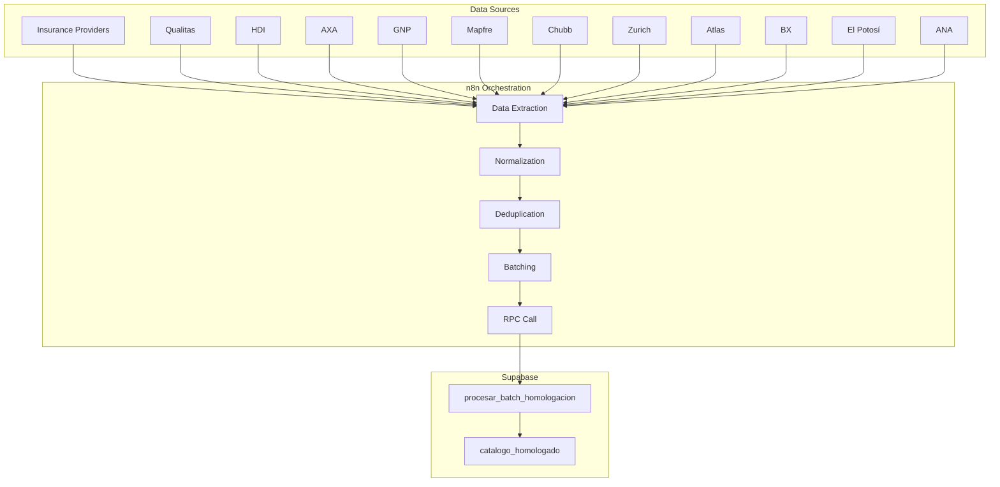

# Function Signature

<cite>
**Referenced Files in This Document**   
- [Funcion RPC Nueva.sql](file://src/supabase/Funcion RPC Nueva.sql)
- [Funcion RPC.sql](file://src/supabase/Funcion RPC.sql)
- [Replanteamiento homologacion.md](file://src/supabase/Replanteamiento homologacion.md)
- [casos de prueba función rpc.sql](file://src/supabase/casos de prueba función rpc.sql)
</cite>

## Table of Contents
1. [Function Signature](#function-signature)
2. [Parameter Details](#parameter-details)
3. [Return Value Structure](#return-value-structure)
4. [Legacy vs New Version Comparison](#legacy-vs-new-version-comparison)
5. [Integration with n8n Workflows](#integration-with-n8n-workflows)
6. [Usage Examples](#usage-examples)

## Function Signature

The `procesar_batch_homologacion` function is a Supabase RPC (Remote Procedure Call) function implemented in PL/pgSQL that processes batches of vehicle data for homologation into a canonical catalog. The function signature is defined as follows:

```sql
CREATE OR REPLACE FUNCTION public.procesar_batch_homologacion(
    p_vehiculos_json JSONB
)
RETURNS JSONB
LANGUAGE plpgsql
SECURITY DEFINER
SET search_path = public
```

This function accepts a single JSONB parameter containing vehicle data and returns a JSONB object with processing results, metrics, warnings, and errors. It operates under the `SECURITY DEFINER` context, allowing it to access necessary tables and perform required operations regardless of the caller's permissions.

**Section sources**
- [Funcion RPC Nueva.sql](file://src/supabase/Funcion RPC Nueva.sql#L1-L10)

## Parameter Details

### Input Parameter: `p_vehiculos_json`

The function accepts a single JSONB parameter named `p_vehiculos_json` that contains vehicle data to be processed. This parameter can be provided in two formats:

1. **Direct array format**: A JSON array of vehicle objects
2. **Wrapped format**: An object with a `vehiculos_json` property containing the array

The function automatically detects and extracts the vehicle array from either format.

### Expected Vehicle Object Structure

Each vehicle object in the input array should contain the following properties:

- **Identification**
  - `id_canonico`: Canonical ID (SHA-256 hash of technical specifications)
  - `hash_comercial`: Commercial hash (SHA-256 of marca|modelo|anio|transmision)
  - `string_comercial`: Commercial string representation
  - `string_tecnico`: Technical string representation

- **Vehicle Specifications**
  - `marca`: Vehicle brand (e.g., "TOYOTA")
  - `modelo`: Model name (e.g., "YARIS")
  - `anio`: Year (integer between 2000-2030)
  - `transmision`: Transmission type ("AUTO", "MANUAL", or NULL)
  - `version`: Version name (e.g., "PREMIUM", "CORE")
  - `motor_config`: Engine configuration (e.g., "L4", "V6", "ELECTRIC")
  - `carroceria`: Body type (e.g., "SEDAN", "SUV", "HATCHBACK")
  - `traccion`: Drive type (e.g., "FWD", "AWD", "4X4")

- **Source Information**
  - `origen_aseguradora`: Source insurance provider
  - `id_original`: Original ID from source system
  - `version_original`: Original version description from source
  - `activo`: Boolean indicating if the vehicle is active in the source catalog

The function validates that the input contains a proper array of vehicles and returns an error response if validation fails.

**Section sources**
- [Funcion RPC Nueva.sql](file://src/supabase/Funcion RPC Nueva.sql#L15-L40)
- [Replanteamiento homologacion.md](file://src/supabase/Replanteamiento homologacion.md#L88-L101)

## Return Value Structure

The function returns a JSONB object with the following structure:

```json
{
  "success": boolean,
  "received": integer,
  "staged": integer,
  "procesados": {
    "nuevos": integer,
    "enriquecidos": integer,
    "actualizados": integer,
    "conflictos": integer,
    "multiples_matches": integer
  },
  "warnings": array,
  "errors": array
}
```

### Response Fields

- **`success`**: Boolean indicating overall success of the operation
- **`received`**: Total number of vehicle records received in the input
- **`staged`**: Number of vehicle records successfully loaded into the processing stage (after filtering)
- **`procesados`**: Object containing detailed processing metrics:
  - `nuevos`: Number of new vehicle records created
  - `enriquecidos`: Number of existing records enriched with additional technical specifications
  - `actualizados`: Number of existing records with updated availability information
  - `conflictos`: Number of records that conflicted with existing entries
  - `multiples_matches`: Number of records with multiple potential matches
- **`warnings`**: Array of warning messages about potential issues
- **`errors`**: Array of error messages (typically empty on success)

In case of validation or processing errors, the function returns a simplified error response:
```json
{
  "success": false,
  "error": "Error description",
  "detail": "SQL error code",
  "received": integer
}
```

**Section sources**
- [Funcion RPC Nueva.sql](file://src/supabase/Funcion RPC Nueva.sql#L390-L428)
- [casos de prueba función rpc.sql](file://src/supabase/casos de prueba función rpc.sql#L1-L255)

## Legacy vs New Version Comparison

The `procesar_batch_homologacion` function represents a significant evolution from the legacy `procesar_batch_completo` function, with major improvements in functionality, error handling, and response structure.

### Key Differences

#### Parameter Handling
- **Legacy**: Accepted `JSON` type parameter named `vehiculos_json`
- **New**: Accepts `JSONB` type parameter named `p_vehiculos_json` with support for both direct array and wrapped formats

#### Processing Logic
- **Legacy**: Simple upsert operation based on `hash_tecnico` with basic conflict resolution
- **New**: Multi-stage processing with sophisticated matching logic:
  1. Direct match by `id_canonico`
  2. Compatibility matching for enrichment
  3. Conflict detection
  4. Progressive enrichment of technical specifications

#### Response Structure
- **Legacy**: Basic success/failure with simple metrics
```json
{
  "success": true,
  "total": 100,
  "insertados": 50,
  "actualizados": 30,
  "omitidos": 20,
  "aseguradora": "QUALITAS",
  "timestamp": "2025-01-15T10:00:00Z"
}
```

- **New**: Comprehensive response with detailed metrics, warnings, and error handling
```json
{
  "success": true,
  "received": 100,
  "staged": 95,
  "procesados": {
    "nuevos": 40,
    "enriquecidos": 25,
    "actualizados": 30,
    "conflictos": 5,
    "multiples_matches": 10
  },
  "warnings": ["Multiple matches found for TOYOTA YARIS 2014"],
  "errors": []
}
```

#### Error Handling
- **Legacy**: Generic error response with only error message
- **New**: Specific error handling with different responses for unique violations and other exceptions, including SQL state codes

#### Data Model
- **Legacy**: Used `vehiculos_maestro` table with simple array-based availability tracking
- **New**: Uses `catalogo_homologado` table with JSONB-based `disponibilidad` field for richer insurance provider tracking and `confianza_score` for data quality metrics

**Section sources**
- [Funcion RPC Nueva.sql](file://src/supabase/Funcion RPC Nueva.sql#L1-L428)
- [Funcion RPC.sql](file://src/supabase/Funcion RPC.sql#L1-L95)
- [Replanteamiento homologacion.md](file://src/supabase/Replanteamiento homologacion.md#L47-L91)

## Integration with n8n Workflows

The `procesar_batch_homologacion` function is designed to integrate seamlessly with n8n workflows as part of a larger data pipeline for vehicle catalog homologation.

### Workflow Architecture



**Diagram sources**
- [Replanteamiento homologacion.md](file://src/supabase/Replanteamiento homologacion.md#L1-L279)

### Integration Steps

1. **Data Extraction**: n8n nodes extract vehicle data from each insurance provider's database or API
2. **Normalization**: JavaScript code nodes normalize data to the canonical format, calculating:
   - `string_comercial` = UPPER(marca)|UPPER(modelo)|anio|transmision
   - `hash_comercial` = SHA-256(string_comercial)
   - `string_tecnico` = string_comercial|version|motor_config|carroceria|traccion
   - `id_canonico` = SHA-256(hash_comercial|version|motor_config|carroceria|traccion)
3. **Deduplication**: Remove duplicates by `id_canonico` before sending to Supabase
4. **Batching**: Split large datasets into manageable chunks (typically 10k-50k records)
5. **RPC Call**: HTTP request node calls the Supabase RPC endpoint:
   - **URL**: `/rest/v1/rpc/procesar_batch_homologacion`
   - **Method**: POST
   - **Headers**: 
     - `apikey`: Supabase project API key
     - `Authorization`: Bearer token with service role
     - `Content-Type`: application/json
     - `Prefer`: return=minimal
   - **Body**: JSON object with `vehiculos_json` array
6. **Error Handling**: Implement retry logic with exponential backoff for rate limiting (429) or server errors (5xx)
7. **Logging**: Store processing results for monitoring and auditing

The function's idempotent design ensures that reprocessing the same batch will not create duplicate records or alter data unnecessarily, making the workflow resilient to failures and restarts.

**Section sources**
- [Replanteamiento homologacion.md](file://src/supabase/Replanteamiento homologacion.md#L1-L279)
- [casos de prueba función rpc.sql](file://src/supabase/casos de prueba función rpc.sql#L1-L255)

## Usage Examples

### Valid Payload Examples

#### Single Insurance Provider
```json
{
  "vehiculos_json": [
    {
      "id_canonico": "a7a8fbec4e5bed8535f19ab418fe9bb83bda4eb4d26058eb0e2d2b9218069221",
      "hash_comercial": "98d9e4baceb9ed37cbe3e24512c24e62cb30b125a2d25cbb27348468340990b2",
      "string_comercial": "TOYOTA|YARIS|2014|AUTO",
      "string_tecnico": "TOYOTA|YARIS|2014|AUTO|PREMIUM|NULL|NULL|NULL|SEDAN|NULL",
      "marca": "TOYOTA",
      "modelo": "YARIS",
      "anio": 2014,
      "transmision": "AUTO",
      "version": "PREMIUM",
      "motor_config": null,
      "carroceria": "SEDAN",
      "traccion": null,
      "origen_aseguradora": "QUALITAS",
      "id_original": "Q-123456",
      "version_original": "PREMIUM SEDAN 1.5L AUTO",
      "activo": true
    }
  ]
}
```

#### Multiple Insurance Providers
```json
{
  "vehiculos_json": [
    {
      "id_canonico": "a7a8fbec4e5bed8535f19ab418fe9bb83bda4eb4d26058eb0e2d2b9218069221",
      "hash_comercial": "98d9e4baceb9ed37cbe3e24512c24e62cb30b125a2d25cbb27348468340990b2",
      "string_comercial": "TOYOTA|YARIS|2014|AUTO",
      "string_tecnico": "TOYOTA|YARIS|2014|AUTO|PREMIUM|NULL|NULL|NULL|SEDAN|NULL",
      "marca": "TOYOTA",
      "modelo": "YARIS",
      "anio": 2014,
      "transmision": "AUTO",
      "version": "PREMIUM",
      "motor_config": null,
      "carroceria": "SEDAN",
      "traccion": null,
      "origen_aseguradora": "QUALITAS",
      "id_original": "Q-123456",
      "version_original": "PREMIUM SEDAN 1.5L AUTO",
      "activo": true
    },
    {
      "id_canonico": "a7a8fbec4e5bed8535f19ab418fe9bb83bda4eb4d26058eb0e2d2b9218069221",
      "hash_comercial": "98d9e4baceb9ed37cbe3e24512c24e62cb30b125a2d25cbb27348468340990b2",
      "string_comercial": "TOYOTA|YARIS|2014|AUTO",
      "string_tecnico": "TOYOTA|YARIS|2014|AUTO|PREMIUM|NULL|NULL|NULL|SEDAN|NULL",
      "marca": "TOYOTA",
      "modelo": "YARIS",
      "anio": 2014,
      "transmision": "AUTO",
      "version": "PREMIUM",
      "motor_config": null,
      "carroceria": "SEDAN",
      "traccion": null,
      "origen_aseguradora": "ZURICH",
      "id_original": "Z-789",
      "version_original": "PREMIUM 1.5L SEDAN",
      "activo": true
    }
  ]
}
```

#### Direct Array Format
```json
[
  {
    "id_canonico": "a7a8fbec4e5bed8535f19ab418fe9bb83bda4eb4d26058eb0e2d2b9218069221",
    "hash_comercial": "98d9e4baceb9ed37cbe3e24512c24e62cb30b125a2d25cbb27348468340990b2",
    "string_comercial": "TOYOTA|YARIS|2014|AUTO",
    "string_tecnico": "TOYOTA|YARIS|2014|AUTO|PREMIUM|NULL|NULL|NULL|SEDAN|NULL",
    "marca": "TOYOTA",
    "modelo": "YARIS",
    "anio": 2014,
    "transmision": "AUTO",
    "version": "PREMIUM",
    "motor_config": null,
    "carroceria": "SEDAN",
    "traccion": null,
    "origen_aseguradora": "QUALITAS",
    "id_original": "Q-123456",
    "version_original": "PREMIUM SEDAN 1.5L AUTO",
    "activo": true
  }
]
```

### Invalid Payload Examples

#### Missing Required Fields
```json
{
  "vehiculos_json": [
    {
      "marca": "TOYOTA",
      "modelo": "YARIS",
      "anio": 2014
      // Missing id_canonico, hash_comercial, and other required fields
    }
  ]
}
```

#### Invalid Data Types
```json
{
  "vehiculos_json": [
    {
      "id_canonico": "valid-hash",
      "hash_comercial": "valid-hash",
      "string_comercial": "TOYOTA|YARIS|2014|AUTO",
      "string_tecnico": "TOYOTA|YARIS|2014|AUTO|PREMIUM|NULL|NULL|NULL|SEDAN|NULL",
      "marca": "TOYOTA",
      "modelo": "YARIS",
      "anio": "2014",  // Should be integer, not string
      "transmision": "AUTO",
      "version": "PREMIUM",
      "motor_config": null,
      "carroceria": "SEDAN",
      "traccion": null,
      "origen_aseguradora": "QUALITAS",
      "id_original": "Q-123456",
      "version_original": "PREMIUM SEDAN 1.5L AUTO",
      "activo": "true"  // Should be boolean, not string
    }
  ]
}
```

#### Non-Array Input
```json
{
  "vehiculos_json": "not-an-array"
}
```

#### Out of Range Year
```json
{
  "vehiculos_json": [
    {
      "id_canonico": "valid-hash",
      "hash_comercial": "valid-hash",
      "string_comercial": "TOYOTA|YARIS|1999|AUTO",
      "string_tecnico": "TOYOTA|YARIS|1999|AUTO|PREMIUM|NULL|NULL|NULL|SEDAN|NULL",
      "marca": "TOYOTA",
      "modelo": "YARIS",
      "anio": 1999,  // Year below minimum threshold of 2000
      "transmision": "AUTO",
      "version": "PREMIUM",
      "motor_config": null,
      "carroceria": "SEDAN",
      "traccion": null,
      "origen_aseguradora": "QUALITAS",
      "id_original": "Q-123456",
      "version_original": "PREMIUM SEDAN 1.5L AUTO",
      "activo": true
    }
  ]
}
```

**Section sources**
- [casos de prueba función rpc.sql](file://src/supabase/casos de prueba función rpc.sql#L1-L255)
- [Replanteamiento homologacion.md](file://src/supabase/Replanteamiento homologacion.md#L1-L279)