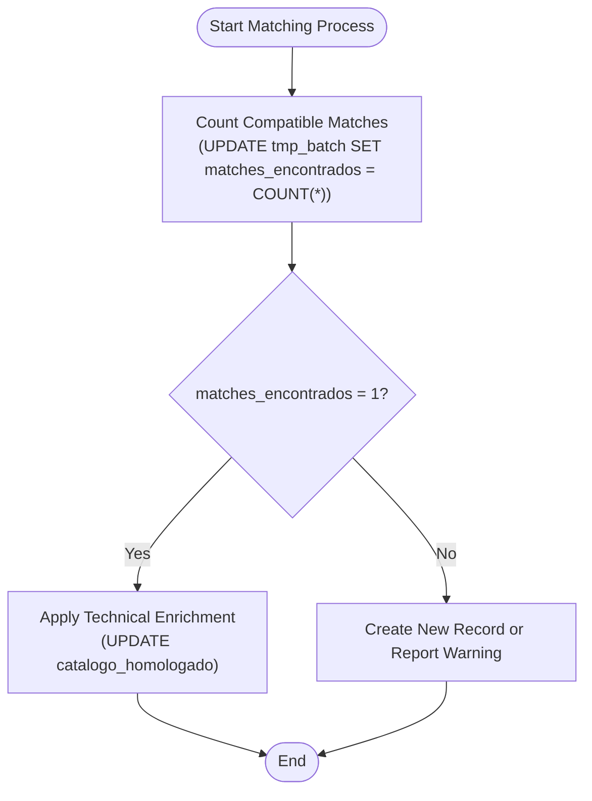

# Compatibility Matching for Enrichment

<cite>
**Referenced Files in This Document**   
- [Funcion RPC Nueva.sql](file://src/supabase/Funcion RPC Nueva.sql)
- [Tabla maestra.sql](file://src/supabase/Tabla maestra.sql)
</cite>

## Table of Contents
1. [Introduction](#introduction)
2. [Two-Step Matching Process](#two-step-matching-process)
3. [Field Comparison Rules](#field-comparison-rules)
4. [Enrichment Conditions](#enrichment-conditions)
5. [SQL Implementation Details](#sql-implementation-details)
6. [Handling Multiple Matches and Warnings](#handling-multiple-matches-and-warnings)
7. [Conclusion](#conclusion)

## Introduction
The compatibility matching logic is designed to enrich existing vehicle records in the master catalog (`catalogo_homologado`) with missing technical specifications from incoming insurer data. This process ensures data consistency and completeness across multiple sources while preventing incorrect or ambiguous matches. The system uses a two-step approach: first counting potential matches via the `matches_encontrados` field, then applying enrichment only when exactly one valid match exists. This document details the matching rules, field comparison logic, and handling of edge cases such as multiple matches or conflicting data.

**Section sources**
- [Funcion RPC Nueva.sql](file://src/supabase/Funcion RPC Nueva.sql#L1-L50)

## Two-Step Matching Process
The matching process follows a strict two-phase logic to ensure accuracy and prevent ambiguous enrichments:

1. **Count Phase**: The system first counts all potential matches in the master catalog that meet the compatibility criteria using a subquery that sets the `matches_encontrados` counter.
2. **Enrichment Phase**: Only if `matches_encontrados = 1`, the system proceeds to enrich the record by updating missing technical fields.

This prevents partial or incorrect data from being merged when multiple plausible candidates exist, ensuring data integrity.



**Diagram sources**
- [Funcion RPC Nueva.sql](file://src/supabase/Funcion RPC Nueva.sql#L116-L180)

**Section sources**
- [Funcion RPC Nueva.sql](file://src/supabase/Funcion RPC Nueva.sql#L116-L180)

## Field Comparison Rules
The matching logic applies different comparison rules depending on the type of field:

### Strict Equality Fields
The following fields must match exactly or both be NULL:
- **marca**: Vehicle brand
- **modelo**: Vehicle model
- **anio**: Year of manufacture
- **transmision**: Transmission type (AUTO/MANUAL)
- **version**: Trim/version of the vehicle

These comparisons use NULL-safe equality:
```sql
(ch.transmision IS NULL AND t.transmision IS NULL) OR (ch.transmision = t.transmision)
```

### Conditional Matching Fields
The following technical fields can match if either value is NULL or both are equal:
- **motor_config**: Engine configuration (e.g., L4, V6)
- **carroceria**: Body type (e.g., SEDAN, SUV)
- **traccion**: Drive type (e.g., 4X4, 2WD)

This allows partial information in the master record to be completed by incoming data.

**Section sources**
- [Funcion RPC Nueva.sql](file://src/supabase/Funcion RPC Nueva.sql#L135-L142)

## Enrichment Conditions
For a record to be eligible for enrichment, two conditions must be met:

1. **Exactly One Match**: The `matches_encontrados` counter must equal 1.
2. **At Least One Enrichable Field**: At least one technical field must be NULL in the master record but populated in the incoming data.

The condition is implemented as:
```sql
AND (
    (ch.motor_config IS NULL AND t.motor_config IS NOT NULL)
    OR (ch.carroceria IS NULL AND t.carroceria IS NOT NULL)
    OR (ch.traccion IS NULL AND t.traccion IS NOT NULL)
)
```

This ensures that enrichment only occurs when actual new information is available, preventing unnecessary updates.


**Diagram sources**
- [Funcion RPC Nueva.sql](file://src/supabase/Funcion RPC Nueva.sql#L140-L142)

**Section sources**
- [Funcion RPC Nueva.sql](file://src/supabase/Funcion RPC Nueva.sql#L140-L142)

## SQL Implementation Details
The core matching logic is implemented in the `procesar_batch_homologacion` function using PostgreSQL's PL/pgSQL. Key implementation aspects include:

- **Temporary Table**: Uses `tmp_batch` to stage incoming vehicles with a `matches_encontrados` counter.
- **Exact ID Matching**: First attempts match by `id_canonico` for direct updates.
- **Compatibility Query**: Uses complex WHERE conditions with NULL-safe comparisons for technical fields.
- **LIMIT 1**: Ensures only one match is selected even if multiple exist (though this case should be avoided by the count phase).
- **COALESCE for Enrichment**: Uses `COALESCE(ch.field, t.field)` to preserve existing values and only fill in NULLs.

The function returns detailed metrics including counts of new, enriched, and conflicted records.

**Section sources**
- [Funcion RPC Nueva.sql](file://src/supabase/Funcion RPC Nueva.sql#L65-L257)

## Handling Multiple Matches and Warnings
When multiple compatible matches are found (`matches_encontrados > 1`), the system does not enrich any record to avoid ambiguity. Instead:

1. It increments the `v_multiples_matches` counter.
2. It generates warning messages listing the vehicle details and number of potential matches.
3. It creates a new canonical record with a lower confidence score (0.8 instead of 1.0).

This approach ensures data safety while still incorporating new information. The warnings help identify data quality issues that may need manual review or additional normalization rules.


**Diagram sources**
- [Funcion RPC Nueva.sql](file://src/supabase/Funcion RPC Nueva.sql#L186-L198)

**Section sources**
- [Funcion RPC Nueva.sql](file://src/supabase/Funcion RPC Nueva.sql#L186-L198)

## Conclusion
The compatibility matching system provides a robust mechanism for enriching vehicle records while maintaining data integrity. By requiring exact matches for core fields and allowing conditional matching for technical specifications, it balances completeness with accuracy. The two-step process—first counting matches, then enriching only unambiguous cases—prevents data corruption from partial or conflicting information. The use of warnings and confidence scores provides visibility into data quality issues, enabling continuous improvement of the homologation process.

**Section sources**
- [Funcion RPC Nueva.sql](file://src/supabase/Funcion RPC Nueva.sql#L1-L429)
- [Tabla maestra.sql](file://src/supabase/Tabla maestra.sql#L1-L100)