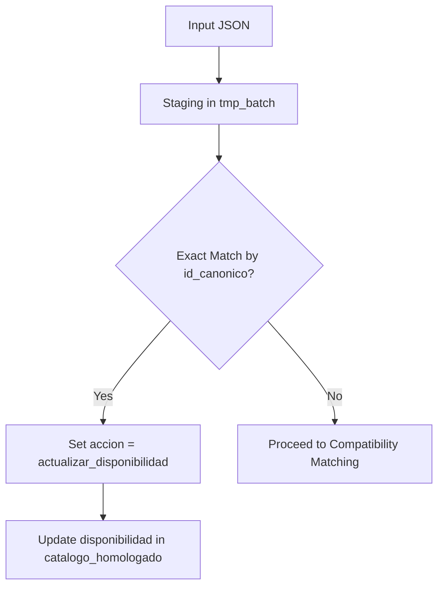
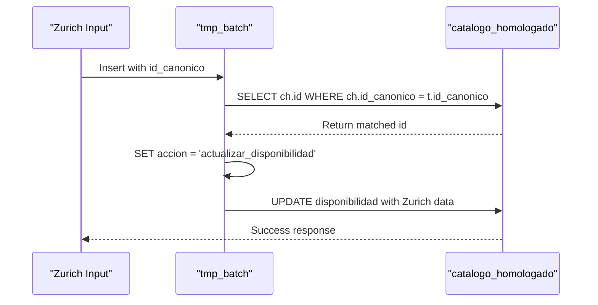

# Exact Matching by id_canonico

<cite>
**Referenced Files in This Document**   
- [Funcion RPC Nueva.sql](file://src/supabase/Funcion RPC Nueva.sql)
- [casos de prueba función rpc.sql](file://src/supabase/casos de prueba función rpc.sql)
- [zurich-codigo-de-normalizacion.js](file://src/insurers/zurich/zurich-codigo-de-normalizacion.js)
- [gnp-codigo-de-normalizacion.js](file://src/insurers/gnp/gnp-codigo-de-normalizacion.js)
</cite>

## Table of Contents
1. [Introduction](#introduction)
2. [Exact Matching Phase Overview](#exact-matching-phase-overview)
3. [id_canonico as Primary Key](#id_canonico-as-primary-key)
4. [SQL UPDATE Operation for Exact Matches](#sql-update-operation-for-exact-matches)
5. [Action Flag Assignment: actualizar_disponibilidad](#action-flag-assignment-actualizar_disponibilidad)
6. [Bypassing Field-by-Field Comparison](#bypassing-field-by-field-comparison)
7. [Example: Exact Match Workflow](#example-exact-match-workflow)
8. [Troubleshooting Scenarios](#troubleshooting-scenarios)
9. [Prevention Through Prior Normalization](#prevention-through-prior-normalization)
10. [Conclusion](#conclusion)

## Introduction
The `procesar_batch_homologacion` function implements a multi-phase vehicle homologation process that integrates data from multiple insurers into a unified master catalog. One of the most critical phases in this process is the exact matching phase, which leverages the `id_canonico` field as a definitive identifier for direct record linkage. This document provides a detailed explanation of how the system uses `id_canonico` to identify and update vehicle records without performing field-by-field comparisons. It covers the SQL logic used for matching, the action flagging mechanism, and how prior normalization steps prevent common issues such as hash collisions or inconsistent identifiers across insurers.

**Section sources**
- [Funcion RPC Nueva.sql](file://src/supabase/Funcion RPC Nueva.sql#L0-L428)

## Exact Matching Phase Overview
The exact matching phase is the first step in the homologation workflow after data staging. Its primary purpose is to identify vehicles that have already been normalized and assigned a canonical identifier (`id_canonico`) in previous processing stages. Unlike fuzzy or compatibility-based matching, this phase performs a direct lookup using `id_canonico` as a primary key to link incoming records with existing entries in the `catalogo_homologado` table. When a match is found, the system immediately assigns an action flag (`accion = 'actualizar_disponibilidad'`) and skips further comparison logic. This approach ensures high performance and accuracy for records that have already undergone normalization, while reserving more complex matching algorithms for cases where canonical identity has not yet been established.



**Diagram sources**
- [Funcion RPC Nueva.sql](file://src/supabase/Funcion RPC Nueva.sql#L109-L137)

**Section sources**
- [Funcion RPC Nueva.sql](file://src/supabase/Funcion RPC Nueva.sql#L109-L137)

## id_canonico as Primary Key
The `id_canonico` field serves as the primary key for exact matching in the homologation process. It is a SHA-256 hash generated during the normalization phase from a combination of key vehicle attributes, including brand, model, year, transmission, version, and technical specifications. This hash acts as a unique fingerprint that represents the canonical form of a vehicle configuration across all insurers. During the exact matching phase, the system performs a direct join between the `tmp_batch` staging table and the `catalogo_homologado` master table using `id_canonico` as the join condition. This allows for immediate identification of existing records without requiring any additional field comparisons. The use of a cryptographic hash ensures both uniqueness and consistency, making it possible to reliably match records across different insurers even when their original data formats or terminology differ.

**Section sources**
- [zurich-codigo-de-normalizacion.js](file://src/insurers/zurich/zurich-codigo-de-normalizacion.js#L0-L733)
- [gnp-codigo-de-normalizacion.js](file://src/insurers/gnp/gnp-codigo-de-normalizacion.js#L0-L680)

## SQL UPDATE Operation for Exact Matches
The exact matching logic is implemented through a targeted SQL UPDATE operation that joins the `tmp_batch` staging table with the `catalogo_homologado` master table. The operation uses the `id_canonico` field as the join key to identify matching records and sets two critical fields in the `tmp_batch` table: `id_homologado_match` (the foreign key to the matched record) and `accion` (the action flag). This UPDATE statement is executed early in the process, ensuring that exact matches are identified before any other matching logic is applied. By setting the `accion` field to `'actualizar_disponibilidad'`, the system flags these records for a specific update path that only modifies availability information without altering other attributes of the master record.

```sql
UPDATE tmp_batch t
SET id_homologado_match = ch.id,
    matches_encontrados = 1,
    accion = 'actualizar_disponibilidad'
FROM catalogo_homologado ch
WHERE ch.id_canonico = t.id_canonico;
```

**Diagram sources**
- [Funcion RPC Nueva.sql](file://src/supabase/Funcion RPC Nueva.sql#L109-L115)

**Section sources**
- [Funcion RPC Nueva.sql](file://src/supabase/Funcion RPC Nueva.sql#L109-L115)

## Action Flag Assignment: actualizar_disponibilidad
When an exact match is found via `id_canonico`, the system assigns the action flag `'actualizar_disponibilidad'` to the corresponding record in the `tmp_batch` table. This flag determines the subsequent processing path for the record, directing it to a specialized UPDATE operation that only modifies the `disponibilidad` field in the `catalogo_homologado` table. The `disponibilidad` field is a JSONB structure that tracks which insurers offer coverage for each vehicle, along with metadata such as activation status, original ID, version, and update timestamp. By limiting the update to this field, the system ensures that the core attributes of the master record remain unchanged while still incorporating new availability information from the incoming batch. This approach maintains data integrity and prevents conflicts that could arise from attempting to merge divergent specifications.

**Section sources**
- [Funcion RPC Nueva.sql](file://src/supabase/Funcion RPC Nueva.sql#L291-L327)

## Bypassing Field-by-Field Comparison
One of the key advantages of the exact matching phase is that it bypasses field-by-field comparison entirely. Once a match is established via `id_canonico`, the system assumes that the incoming record represents the same vehicle configuration as the existing master record, regardless of any differences in individual fields. This eliminates the need for complex comparison logic involving brand, model, year, transmission, version, or technical specifications. The assumption is that the normalization process has already resolved any discrepancies between insurers' data formats, ensuring that vehicles with the same `id_canonico` are functionally identical. This approach significantly improves performance by reducing the number of comparisons required and avoids potential false negatives that could occur due to minor variations in data entry or formatting.

**Section sources**
- [Funcion RPC Nueva.sql](file://src/supabase/Funcion RPC Nueva.sql#L109-L137)

## Example: Exact Match Workflow
The exact match workflow can be illustrated through a test case where Zurich adds a vehicle that already exists in the master catalog under Qualitas. Both insurers have normalized the vehicle data to produce the same `id_canonico`, allowing for direct matching. When the Zurich record is processed, the system identifies the existing Qualitas record via `id_canonico` and sets the `accion` flag to `'actualizar_disponibilidad'`. In the subsequent update phase, the system modifies the `disponibilidad` field to include Zurich as an additional insurer, while leaving all other attributes of the master record unchanged. This results in a single unified record that reflects coverage availability from both insurers, demonstrating how the exact matching phase enables seamless integration of data from multiple sources.



**Diagram sources**
- [casos de prueba función rpc.sql](file://src/supabase/casos de prueba función rpc.sql#L34-L68)

**Section sources**
- [casos de prueba función rpc.sql](file://src/supabase/casos de prueba función rpc.sql#L34-L68)

## Troubleshooting Scenarios
While the exact matching phase is designed to be robust, certain scenarios can lead to issues if not properly addressed. One potential problem is hash collisions, where two different vehicle configurations produce the same `id_canonico` due to errors in the normalization process. Another issue is inconsistent `id_canonico` generation across insurers, which can prevent valid matches from being identified. These problems are typically caused by incomplete or incorrect normalization of input data, such as failure to standardize brand names, model variants, or technical specifications. To mitigate these risks, the system includes validation checks and logging mechanisms that help identify and resolve discrepancies before they affect the homologation process.

**Section sources**
- [zurich-codigo-de-normalizacion.js](file://src/insurers/zurich/zurich-codigo-de-normalizacion.js#L0-L733)
- [gnp-codigo-de-normalizacion.js](file://src/insurers/gnp/gnp-codigo-de-normalizacion.js#L0-L680)

## Prevention Through Prior Normalization
The prevention of hash collisions and inconsistent `id_canonico` generation is achieved through rigorous prior normalization of input data. Each insurer's data undergoes a comprehensive normalization process that standardizes brand names, model designations, transmission types, version levels, and technical specifications before the `id_canonico` is generated. This process includes removing redundant information, resolving synonyms, and extracting key attributes from free-text fields. For example, the Zurich normalization script includes extensive logic for detecting and eliminating technical specifications from version strings, ensuring that only the trim level is used in the hash calculation. Similarly, the GNP normalization process includes special handling for contaminated data, such as removing references to other manufacturers that may appear in version fields. These normalization steps ensure that vehicles with the same configuration produce identical `id_canonico` values across all insurers, enabling reliable exact matching.

**Section sources**
- [zurich-codigo-de-normalizacion.js](file://src/insurers/zurich/zurich-codigo-de-normalizacion.js#L0-L733)
- [gnp-codigo-de-normalizacion.js](file://src/insurers/gnp/gnp-codigo-de-normalizacion.js#L0-L680)

## Conclusion
The exact matching phase in the `procesar_batch_homologacion` function plays a crucial role in efficiently integrating vehicle data from multiple insurers into a unified master catalog. By leveraging the `id_canonico` field as a primary key, the system can perform direct record identification and availability updates without resorting to field-by-field comparisons. This approach not only improves performance but also ensures data consistency by relying on prior normalization steps to resolve discrepancies between insurers' data formats. The use of a cryptographic hash as a canonical identifier enables reliable matching across different sources, while the action flagging mechanism ensures that updates are applied appropriately based on the type of match found. Together, these mechanisms form a robust foundation for the homologation process, enabling accurate and efficient integration of vehicle data at scale.