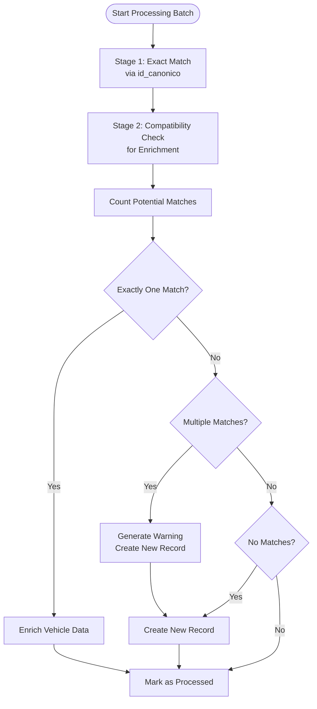
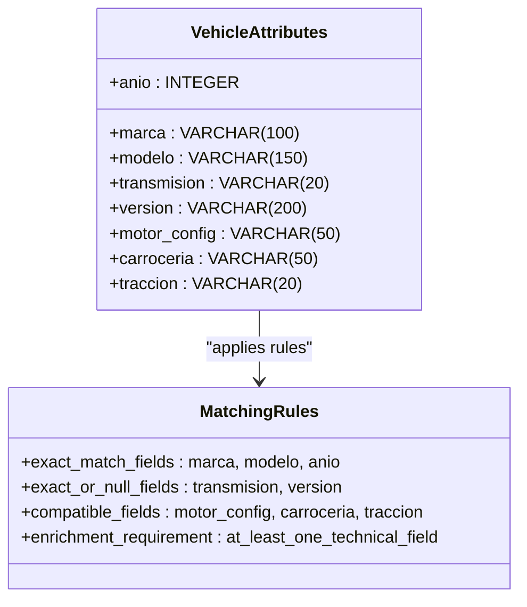

# Matching Strategy

<cite>
**Referenced Files in This Document**   
- [Funcion RPC Nueva.sql](file://src/supabase/Funcion RPC Nueva.sql)
- [Replanteamiento homologacion.md](file://src/supabase/Replanteamiento homologacion.md)
- [instrucciones.md](file://instrucciones.md)
</cite>

## Table of Contents
1. [Introduction](#introduction)
2. [Two-Stage Matching Strategy](#two-stage-matching-strategy)
3. [Exact Matching via id_canonico](#exact-matching-via-id_canonico)
4. [Compatibility Matching for Enrichment](#compatibility-matching-for-enrichment)
5. [Field Comparison Rules](#field-comparison-rules)
6. [Match Counting and Selection Logic](#match-counting-and-selection-logic)
7. [Enrichment Process](#enrichment-process)
8. [Troubleshooting Scenarios](#troubleshooting-scenarios)
9. [Conclusion](#conclusion)

## Introduction
The `procesar_batch_homologacion` function implements a two-stage matching strategy to process vehicle data batches and maintain a canonical homologated catalog. This document details the exact and compatibility matching logic used to update availability information and enrich vehicle specifications. The process ensures data consistency across insurance providers while maintaining traceability and confidence scoring.

**Section sources**
- [Funcion RPC Nueva.sql](file://src/supabase/Funcion RPC Nueva.sql#L1-L429)

## Two-Stage Matching Strategy
The matching process consists of two distinct stages executed sequentially. The first stage performs exact matching using the `id_canonico` identifier to update availability information. The second stage conducts compatibility matching based on vehicle attributes to identify opportunities for data enrichment. This two-phase approach ensures that exact matches are prioritized while allowing for intelligent data enrichment when exact matches are not available.

**Diagram sources**
- [Funcion RPC Nueva.sql](file://src/supabase/Funcion RPC Nueva.sql#L78-L265)

## Exact Matching via id_canonico
The first stage of the matching process identifies vehicles through exact matching of the `id_canonico` field. When a match is found, the system updates the availability information for the corresponding insurance provider without modifying the core vehicle specifications. This ensures that active/inactive status changes from insurance providers are accurately reflected in the homologated catalog.

The exact matching process sets the `accion` field to 'actualizar_disponibilidad' and updates the `disponibilidad` JSONB field with the provider-specific information, including active status, original ID, version, and update timestamp. This approach maintains data integrity by preserving existing technical specifications while updating availability status.

**Section sources**
- [Funcion RPC Nueva.sql](file://src/supabase/Funcion RPC Nueva.sql#L78-L85)

## Compatibility Matching for Enrichment
When no exact match is found via `id_canonico`, the system proceeds to compatibility matching for data enrichment. This stage identifies vehicles in the homologated catalog that are compatible with the incoming vehicle data and can be enriched with additional technical specifications. The compatibility matching focuses on enriching technical fields (motor_config, carroceria, traccion) while requiring exact matches for core identification fields.

The enrichment process is designed to improve data completeness in the homologated catalog by incorporating missing technical specifications from incoming data when they are compatible with existing records. This ensures that the catalog progressively improves its data quality over time without compromising data accuracy.

**Section sources**
- [Funcion RPC Nueva.sql](file://src/supabase/Funcion RPC Nueva.sql#L87-L109)

## Field Comparison Rules
The compatibility matching applies specific comparison rules for different vehicle attributes. For identification fields (marca, modelo, anio), exact matches are required. For transmission and version fields, exact matches are required, but both NULL values are considered compatible. For technical specifications (motor_config, carroceria, traccion), values must either match exactly or one must be NULL while the other has a value.

The system requires that at least one technical field can be enriched (i.e., the homologated record has NULL in a technical field while the incoming data has a non-NULL value). This ensures that the enrichment process adds value by filling missing information rather than simply confirming existing data.

**Diagram sources**
- [Funcion RPC Nueva.sql](file://src/supabase/Funcion RPC Nueva.sql#L109-L137)

## Match Counting and Selection Logic
The system counts potential matches before proceeding with enrichment to ensure data integrity. It uses the `matches_encontrados` field in the temporary batch table to store the count of compatible vehicles. The counting process applies the same compatibility rules used for matching but returns the total count rather than individual records.

Only when exactly one compatible match is found does the system proceed with enrichment. This prevents ambiguous matches that could lead to incorrect data integration. The use of `LIMIT 1` in the match selection query ensures that even if multiple compatible records exist (which should not occur due to proper counting), only one is selected for enrichment.

The SQL logic for counting matches is implemented through an UPDATE statement that sets the `matches_encontrados` field based on a subquery that counts compatible records in the `catalogo_homologado` table.

**Section sources**
- [Funcion RPC Nueva.sql](file://src/supabase/Funcion RPC Nueva.sql#L109-L168)

## Enrichment Process
When a single compatible match is identified, the system enriches the existing record with technical specifications from the incoming data. The enrichment process uses COALESCE functions to update technical fields only when they are currently NULL in the homologated record. This preserves existing data while filling gaps in technical specifications.

The enrichment process also updates the `string_tecnico` field to reflect the new technical specifications and increments the `confianza_score` to reflect improved data quality. If the incoming data provides new technical information, the `id_canonico` is updated to reflect the more complete specification, ensuring that future exact matches will use the enriched record.

**Section sources**
- [Funcion RPC Nueva.sql](file://src/supabase/Funcion RPC Nueva.sql#L232-L265)

## Troubleshooting Scenarios
When multiple compatible matches are found, the system generates warnings and creates a new record instead of attempting enrichment. This prevents data ambiguity and maintains data integrity. The warning message includes details about the vehicle and the number of potential matches, aiding in troubleshooting and data quality improvement.

The system also detects and reports conflicts where incoming data differs from existing records in ways that violate compatibility rules. These conflicts are reported as warnings, allowing data stewards to investigate and resolve discrepancies. Vehicles with no matches are processed as new records, ensuring that all incoming data is accounted for in the system.

**Section sources**
- [Funcion RPC Nueva.sql](file://src/supabase/Funcion RPC Nueva.sql#L168-L197)

## Conclusion
The two-stage matching strategy in `procesar_batch_homologacion` effectively balances data accuracy with data enrichment. By prioritizing exact matches for availability updates and applying strict compatibility rules for enrichment, the system maintains data integrity while progressively improving catalog completeness. The requirement for exactly one match before enrichment prevents ambiguous data integration, and the comprehensive warning system enables effective troubleshooting of data quality issues.