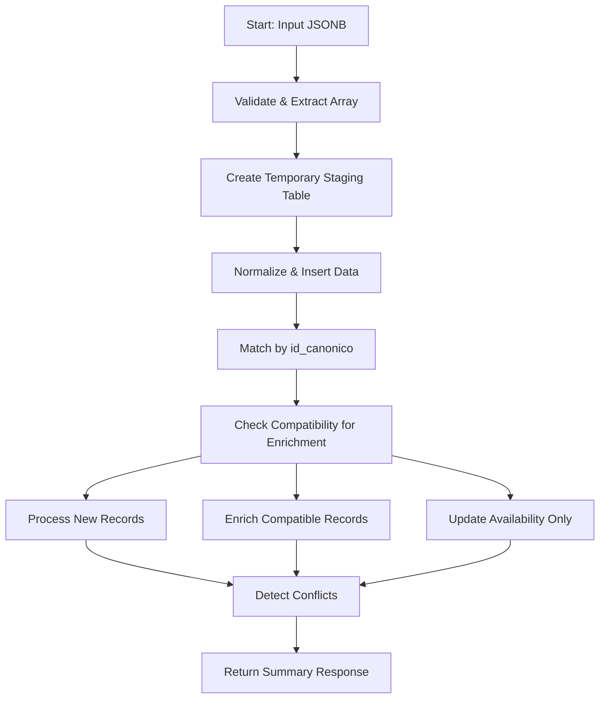

# Processing Logic

<cite>
**Referenced Files in This Document**   
- [Funcion RPC Nueva.sql](file://src/supabase/Funcion RPC Nueva.sql)
- [Tabla maestra.sql](file://src/supabase/Tabla maestra.sql)
- [Funcion RPC.sql](file://src/supabase/Funcion RPC.sql)
- [Validacion y metricas.sql](file://src/supabase/Validacion y metricas.sql)
</cite>

## Table of Contents
1. [Introduction](#introduction)
2. [Core Workflow Overview](#core-workflow-overview)
3. [Input Normalization and Staging](#input-normalization-and-staging)
4. [Match Detection Using id_canonico](#match-detection-using-id_canonico)
5. [Compatibility Checking for Enrichment](#compatibility-checking-for-enrichment)
6. [Final Record Processing Paths](#final-record-processing-paths)
7. [Transaction Safety and Batch Efficiency](#transaction-safety-and-batch-efficiency)
8. [Performance Considerations](#performance-considerations)
9. [Conclusion](#conclusion)

## Introduction
The `procesar_batch_homologacion` function is a critical component in the vehicle data homogenization pipeline, responsible for processing batches of vehicle records from multiple insurers. It ensures data consistency by normalizing inputs, identifying canonical matches, enriching incomplete records, and updating availability status—all within a single atomic transaction. This document details the step-by-step logic, processing paths, and performance optimizations implemented in the function.

**Section sources**
- [Funcion RPC Nueva.sql](file://src/supabase/Funcion RPC Nueva.sql#L1-L429)

## Core Workflow Overview
The function follows a structured workflow to process incoming vehicle data:
1. **Input validation and extraction**
2. **Staging in a temporary table with normalization**
3. **Match detection using `id_canonico`**
4. **Compatibility analysis for enrichment**
5. **Processing of new, enrichable, and update-only records**
6. **Conflict detection and reporting**
7. **Aggregated response generation**

Each phase operates within a PostgreSQL PL/pgSQL function, ensuring transactional integrity and efficient batch handling.

**Diagram sources**
- [Funcion RPC Nueva.sql](file://src/supabase/Funcion RPC Nueva.sql#L1-L429)

## Input Normalization and Staging
The function begins by validating the input structure, expecting either a direct JSONB array of vehicles or an object containing a `vehiculos_json` field. Invalid inputs trigger an immediate error response.

Upon validation, a temporary table `tmp_batch` is created to stage the incoming data. This table includes fields for both commercial and technical vehicle specifications, origin metadata, and internal control flags. All string values are normalized via `TRIM(UPPER())`, and numeric fields are cast appropriately. Records with invalid or out-of-range years (outside 2000–2030) are filtered out during insertion.

**Section sources**
- [Funcion RPC Nueva.sql](file://src/supabase/Funcion RPC Nueva.sql#L20-L85)

## Match Detection Using id_canonico
The first matching phase identifies exact matches using the `id_canonico` field. If a record in the input batch has an `id_canonico` that exists in the `catalogo_homologado` table, it is flagged for availability update only. This ensures that canonical records are preserved while insurer-specific availability status is synchronized.

This step uses a direct `UPDATE ... FROM` statement to join the temporary table with the master catalog, setting the `id_homologado_match` and marking the action as `actualizar_disponibilidad`.

**Section sources**
- [Funcion RPC Nueva.sql](file://src/supabase/Funcion RPC Nueva.sql#L90-L105)

## Compatibility Checking for Enrichment
For records without an `id_canonico` match, the function evaluates compatibility for enrichment. A match is considered valid if:
- **Required fields** (`marca`, `modelo`, `anio`) match exactly.
- **Transmission and version** must either match exactly or both be `NULL`.
- **Technical specs** (`motor_config`, `carroceria`, `traccion`) may be `NULL` or match.
- At least one technical field in the input can enrich the existing record (i.e., the catalog has `NULL` and input has a value).

To prevent ambiguity, only records with **exactly one** compatible match are processed for enrichment. Multiple potential matches are flagged as warnings, and the record is treated as new.

**Section sources**
- [Funcion RPC Nueva.sql](file://src/supabase/Funcion RPC Nueva.sql#L107-L190)

## Final Record Processing Paths
The function routes records into three distinct processing paths based on match results:

### New Records
Records with no match or multiple matches are inserted as new entries into `catalogo_homologado`. The `id_canonico` from the input is used, and a `confianza_score` of 0.8 is assigned if multiple matches existed (indicating lower certainty). These records are marked as processed.

**Diagram sources**
- [Funcion RPC Nueva.sql](file://src/supabase/Funcion RPC Nueva.sql#L192-L218)

### Enrichable Records
Records with a single compatible match are updated to enrich missing technical specifications. The update includes:
- Filling in `NULL` values for `motor_config`, `carroceria`, or `traccion`.
- Rebuilding the `string_tecnico` with updated specs.
- Updating the `disponibilidad` JSONB field with insurer data.
- Incrementing `confianza_score` by 0.05.
- Optionally updating `id_canonico` if new specs improve data completeness.

**Diagram sources**
- [Funcion RPC Nueva.sql](file://src/supabase/Funcion RPC Nueva.sql#L254-L285)

### Availability Updates
Records matched by `id_canonico` have only their `disponibilidad` field updated with the insurer's status, `id_original`, and timestamp. No structural changes are made to the canonical record.

**Diagram sources**
- [Funcion RPC Nueva.sql](file://src/supabase/Funcion RPC Nueva.sql#L301-L320)

## Transaction Safety and Batch Efficiency
The entire process runs within a single transaction, ensuring atomicity. The temporary table `tmp_batch` is automatically dropped on commit, preventing state leakage. All updates and inserts are batched using `FROM` clauses and CTEs, minimizing round trips and maximizing throughput.

The function avoids row-by-row processing, instead using set-based operations for match detection and updates. This design ensures scalability even with large batches.

**Section sources**
- [Funcion RPC Nueva.sql](file://src/supabase/Funcion RPC Nueva.sql#L1-L429)

## Performance Considerations
### Row Counting and Filtering
The function uses `GET DIAGNOSTICS` to efficiently capture row counts after bulk operations. Filtering by year (2000–2030) reduces noise and improves performance.

### Indexing Strategies
Although not defined in the function, the `catalogo_homologado` table likely benefits from indexes on:
- `id_canonico` (exact match)
- `marca`, `modelo`, `anio` (compatibility check)
- `hash_comercial` (grouping)
- `disponibilidad` (GIN index for JSONB insurer lookups)

These indexes are implied by the query patterns and are essential for performance at scale.

### Memory Usage
The use of a temporary table with `ON COMMIT DROP` ensures memory is freed after transaction completion. The `DISTINCT ON` clause during staging prevents duplicate processing within the batch.

**Section sources**
- [Funcion RPC Nueva.sql](file://src/supabase/Funcion RPC Nueva.sql#L60-L65)
- [Tabla maestra.sql](file://src/supabase/Tabla maestra.sql#L40-L43)

## Conclusion
The `procesar_batch_homologacion` function implements a robust, transaction-safe workflow for vehicle data homogenization. By leveraging temporary staging, set-based operations, and clear processing paths, it efficiently handles new entries, enrichments, and availability updates. Its design prioritizes data integrity, performance, and clarity, making it a cornerstone of the homologation system.