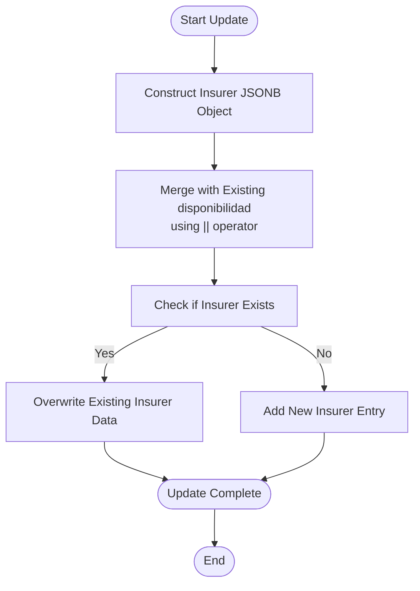

# Availability Updates

<cite>
**Referenced Files in This Document**   
- [Funcion RPC Nueva.sql](file://src/supabase/Funcion RPC Nueva.sql)
- [Replanteamiento homologacion.md](file://src/supabase/Replanteamiento homologacion.md)
- [instrucciones.md](file://instrucciones.md)
</cite>

## Table of Contents
1. [Introduction](#introduction)
2. [Availability Update Path](#availability-update-path)
3. [JSONB Merge Operation](#jsonb-merge-operation)
4. [Confidence Score and Timestamp Updates](#confidence-score-and-timestamp-updates)
5. [Trigger Condition and Field Protection](#trigger-condition-and-field-protection)
6. [Concurrency and Transaction Safety](#concurrency-and-transaction-safety)
7. [Multi-Insurer Availability Management](#multi-insurer-availability-management)
8. [Code Example](#code-example)

## Introduction
This document details the availability update path in the `procesar_batch_homologacion` function, which handles updates to vehicle availability information from insurance providers. The system maintains a canonical vehicle catalog where availability data from multiple insurers is consolidated within a single record using JSONB fields. This approach enables efficient tracking of vehicle availability across different insurance providers while maintaining data integrity and performance.

**Section sources**
- [Replanteamiento homologacion.md](file://src/supabase/Replanteamiento homologacion.md#L1-L280)
- [instrucciones.md](file://instrucciones.md#L1-L280)

## Availability Update Path
The availability update path is executed when the system identifies an existing canonical vehicle record that needs its availability status updated for a specific insurer. This path is specifically triggered when a vehicle in the input batch has an `id_canonico` that matches an existing record in the `catalogo_homologado` table. The update process focuses exclusively on modifying the `disponibilidad` JSONB field, leaving all other technical and canonical fields unchanged.

The path begins with the function identifying matching records through the `id_canonico` field, which serves as the unique identifier for canonical vehicles. When a match is found, the temporary batch processing table `tmp_batch` sets the `accion` field to 'actualizar_disponibilidad', signaling that this record should undergo an availability update rather than a full record update or creation of a new record.

This selective update approach ensures that only availability information is modified, preserving the integrity of the canonical data model while allowing insurers to independently update their availability status for vehicles. The process maintains historical data by keeping previous availability records while adding or updating the current insurer's status.

**Section sources**
- [Funcion RPC Nueva.sql](file://src/supabase/Funcion RPC Nueva.sql#L291-L327)
- [Replanteamiento homologacion.md](file://src/supabase/Replanteamiento homologacion.md#L1-L280)

## JSONB Merge Operation
The system uses PostgreSQL's JSONB merge operator (`||`) to update the `disponibilidad` field with new insurer-specific availability information. This operation allows for efficient addition or updating of insurer data within the JSONB structure without affecting other insurers' data in the same field.

When updating availability, the system constructs a new JSONB object for the specific insurer containing the following fields:
- `activo`: Boolean indicating whether the vehicle is currently available from the insurer
- `id_original`: The insurer's internal identifier for the vehicle
- `version_original`: The insurer's version description of the vehicle
- `fecha_actualizacion`: Timestamp of the update, set to the current time using `NOW()`

The merge operation `ch.disponibilidad || jsonb_build_object(...)` combines the existing availability data with the new insurer data. If the insurer already exists in the JSONB field, their data is overwritten with the new values. If the insurer does not exist, a new entry is created. This approach ensures that each insurer has exactly one entry in the availability data, maintaining data consistency while allowing for updates.

The JSONB format enables flexible schema evolution, as additional fields can be added to individual insurer records without requiring database schema changes. It also supports efficient querying through GIN indexes, allowing for fast lookups of vehicles available from specific insurers.



**Diagram sources**
- [Funcion RPC Nueva.sql](file://src/supabase/Funcion RPC Nueva.sql#L300-L308)

## Confidence Score and Timestamp Updates
Alongside the JSONB merge operation, the system updates two additional fields: `confianza_score` and `fecha_actualizacion`. These updates occur atomically with the availability update to ensure data consistency.

The `confianza_score` is incremented by 0.01 to reflect the increased reliability of the record due to receiving updated information from an insurer. However, this increment is capped at a maximum value of 1.0 using the `LEAST()` function. This scoring mechanism rewards records that are regularly updated and maintained by insurers, with higher scores indicating more current and reliable data. The small increment ensures that confidence grows gradually over time rather than spiking with a single update.

The `fecha_actualizacion` field is updated to the current timestamp using `NOW()`, providing an accurate record of when the availability information was last modified. This timestamp serves multiple purposes:
- It enables temporal queries to find recently updated records
- It supports data freshness monitoring and reporting
- It helps in identifying stale records that haven't been updated in extended periods
- It provides audit trail information for data changes

These updates occur within the same UPDATE statement as the JSONB merge, ensuring atomicity and consistency. All three modifications (availability merge, confidence score increment, and timestamp update) are applied as a single database transaction, preventing partial updates in case of failures.

**Section sources**
- [Funcion RPC Nueva.sql](file://src/supabase/Funcion RPC Nueva.sql#L308-L312)

## Trigger Condition and Field Protection
The availability update path is specifically triggered by the condition `accion = 'actualizar_disponibilidad'`, which is set during the batch processing phase when a vehicle's `id_canonico` matches an existing record in the canonical catalog. This condition ensures that only records with matching canonical identifiers proceed through this update path.

A critical aspect of this update path is its strict protection of technical and canonical fields. Unlike other update paths that might modify vehicle specifications, this path is designed to only affect the `disponibilidad` JSONB field, `confianza_score`, and `fecha_actualizacion`. All other fields such as `marca`, `modelo`, `anio`, `transmision`, `version`, `motor_config`, `carroceria`, and `traccion` remain completely unchanged during this operation.

This field protection is implemented through the targeted UPDATE statement structure, which explicitly lists only the fields that should be modified. By not including other fields in the UPDATE clause, the database preserves their existing values. This design prevents accidental overwrites of canonical data and maintains data integrity across insurer updates.

The separation of concerns between availability updates and canonical data updates allows insurers to independently manage their availability status without affecting the core vehicle specifications in the catalog. This is particularly important in a multi-tenant system where different insurers might have varying availability for the same canonical vehicle.

**Section sources**
- [Funcion RPC Nueva.sql](file://src/supabase/Funcion RPC Nueva.sql#L291-L327)
- [Replanteamiento homologacion.md](file://src/supabase/Replanteamiento homologacion.md#L1-L280)

## Concurrency and Transaction Safety
The availability update path incorporates several mechanisms to ensure concurrency safety and transaction isolation. The entire update operation is wrapped within a single database transaction, providing atomicity guarantees that ensure either all changes are applied or none are in case of errors.

The system leverages PostgreSQL's row-level locking mechanism during the UPDATE operation. When multiple processes attempt to update the same vehicle record simultaneously, PostgreSQL automatically handles the concurrency by queuing the operations and applying them sequentially. This prevents race conditions that could lead to data corruption or lost updates.

Transaction isolation is maintained through PostgreSQL's default READ COMMITTED isolation level, which ensures that each transaction sees a consistent snapshot of the database. This prevents phenomena such as dirty reads, non-repeatable reads, and phantom reads that could compromise data integrity.

The use of the `tmp_batch` temporary table with `ON COMMIT DROP` ensures that intermediate processing data is automatically cleaned up, even if the transaction fails. This temporary table approach also provides a staging area that isolates the batch processing logic from the main catalog table, reducing lock contention and improving overall system performance.

Error handling is implemented through the EXCEPTION block at the end of the function, which catches and appropriately responds to various error conditions including unique violations and other SQL exceptions. This ensures that the system can gracefully handle error conditions without leaving the database in an inconsistent state.

**Section sources**
- [Funcion RPC Nueva.sql](file://src/supabase/Funcion RPC Nueva.sql#L375-L428)

## Multi-Insurer Availability Management
The system is designed to maintain availability information from multiple insurers within a single canonical vehicle record. The `disponibilidad` JSONB field serves as a container for insurer-specific data, with each insurer represented as a key in the JSON object.

This approach enables several important capabilities:
- **Consolidated View**: A single record provides a comprehensive view of which insurers offer a particular vehicle
- **Independent Updates**: Each insurer can update their availability status without affecting other insurers' data
- **Historical Tracking**: The system maintains historical availability data, allowing for trend analysis
- **Flexible Schema**: New insurers can be added without database schema changes

The JSONB structure allows for efficient querying of availability data using PostgreSQL's JSONB operators and GIN indexes. For example, queries can easily find all vehicles available from a specific insurer or identify vehicles with availability from multiple insurers.

The system also supports the concept of global vehicle availability, where a vehicle is considered available if at least one insurer reports it as active. This derived status enables applications to quickly determine vehicle availability across the entire insurance network without having to process individual insurer data.

When all insurers report a vehicle as inactive for an extended period (configurable threshold), the system can flag the record for potential archival, helping to maintain catalog freshness and relevance.

**Section sources**
- [Replanteamiento homologacion.md](file://src/supabase/Replanteamiento homologacion.md#L1-L280)
- [instrucciones.md](file://instrucciones.md#L1-L280)

## Code Example
The following example demonstrates a batch input that updates availability for an existing vehicle in the canonical catalog:

```json
{
  "vehiculos_json": [
    {
      "id_canonico": "66b4fe23a96e8de9b1dac624069d9a03f96d3f17d7319673621254cb42c651dc",
      "hash_comercial": "7cc9374cee0e1c1bc8638521b2690cb010dae9729134790042f19c05346f8d45",
      "marca": "TOYOTA",
      "modelo": "COROLLA",
      "anio": 2023,
      "transmision": "AUTO",
      "version": "LE",
      "motor_config": "L4",
      "carroceria": "SEDAN",
      "traccion": "FWD",
      "origen_aseguradora": "QUALITAS",
      "id_original": "Q_123456",
      "version_original": "COROLLA LE 1.8L AUTOMATIC",
      "activo": true
    }
  ]
}
```

After processing this update, the resulting JSONB structure in the database would be:

```json
{
  "QUALITAS": {
    "activo": true,
    "id_original": "Q_123456",
    "version_original": "COROLLA LE 1.8L AUTOMATIC",
    "fecha_actualizacion": "2025-01-15T10:00:00Z"
  },
  "HDI": {
    "activo": true,
    "id_original": "HDI_789012",
    "version_original": "COROLLA LE PREMIUM",
    "fecha_actualizacion": "2025-01-10T14:30:00Z"
  }
}
```

With the following additional field updates:
- `confianza_score`: Increased by 0.01 (capped at 1.0)
- `fecha_actualizacion`: Updated to current timestamp

The example shows how the system preserves existing insurer data (HDI) while adding or updating the data for the insurer in the current batch (QUALITAS). The canonical fields remain unchanged, and the confidence score is appropriately incremented.

**Section sources**
- [Funcion RPC Nueva.sql](file://src/supabase/Funcion RPC Nueva.sql#L291-L327)
- [Replanteamiento homologacion.md](file://src/supabase/Replanteamiento homologacion.md#L1-L280)