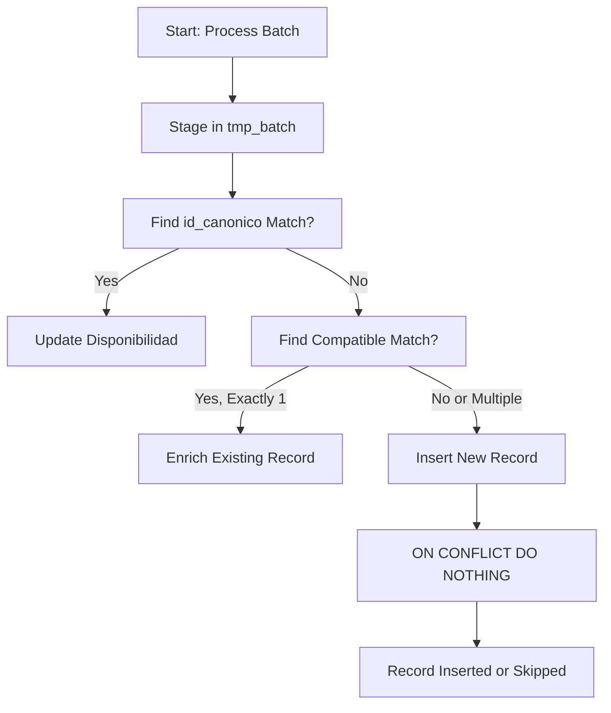

# New Record Insertion

<cite>
**Referenced Files in This Document**   
- [Funcion RPC Nueva.sql](file://src/supabase/Funcion RPC Nueva.sql)
- [Replanteamiento homologacion.md](file://src/supabase/Replanteamiento homologacion.md)
- [instrucciones.md](file://instrucciones.md)
</cite>

## Table of Contents
1. [Introduction](#introduction)
2. [New Record Classification Criteria](#new-record-classification-criteria)
3. [Insertion Process and Conflict Handling](#insertion-process-and-conflict-handling)
4. [Disponibilidad JSONB Field Construction](#disponibilidad-jsonb-field-construction)
5. [Confianza Score Calculation](#confianza-score-calculation)
6. [Transactional Behavior and Warnings](#transactional-behavior-and-warnings)
7. [Code Example](#code-example)

## Introduction
This document details the process by which new vehicle records are inserted into the `catalogo_homologado` table via the `procesar_batch_homologacion` function. The insertion occurs when a vehicle from an insurer does not match any existing canonical record, either due to lack of prior existence or ambiguity in matching. The mechanism uses PostgreSQL's `ON CONFLICT DO NOTHING` clause to ensure idempotency, constructs a structured `disponibilidad` JSONB field for insurer-specific metadata, and assigns an initial `confianza_score` based on data completeness and match ambiguity.

**Section sources**
- [Funcion RPC Nueva.sql](file://src/supabase/Funcion RPC Nueva.sql#L1-L50)

## New Record Classification Criteria
A record is classified as 'new' and eligible for insertion when it meets **both** of the following conditions:
1. The `id_homologado_match` field in the temporary staging table `tmp_batch` is `NULL`, indicating no exact match was found via `id_canonico`.
2. There are **no valid compatible matches** in the existing catalog, or there are **multiple potential matches** (ambiguous case).

Specifically, a record is considered new if:
- No existing record shares the same `id_canonico`
- OR, during compatibility matching, more than one potential match is found (`matches_encontrados > 1`)
- OR, no compatible match is found due to conflicting technical specifications (e.g., transmission, version, body type)

This classification ensures that only truly novel or ambiguous entries trigger a new insertion, while existing records are either enriched or have their availability updated.

**Section sources**
- [Funcion RPC Nueva.sql](file://src/supabase/Funcion RPC Nueva.sql#L109-L168)
- [Funcion RPC Nueva.sql](file://src/supabase/Funcion RPC Nueva.sql#L232-L265)

## Insertion Process and Conflict Handling
New records are inserted using a `WITH` clause (CTE) that performs an `INSERT INTO catalogo_homologado` operation. The insertion targets only rows in the `tmp_batch` table where `id_homologado_match IS NULL`.

The key safeguard against duplicate entries is the `ON CONFLICT (id_canonico) DO NOTHING` clause. This leverages the `UNIQUE` constraint on the `id_canonico` column of the `catalogo_homologado` table. If a concurrent process or a retry attempts to insert a record with an `id_canonico` that already exists, the operation is silently skipped without raising an error.

This approach ensures:
- **Idempotency**: Repeated calls with the same data will not create duplicates.
- **Atomicity**: Each insertion is atomic within the transaction.
- **Data Integrity**: The unique constraint on `id_canonico` is the primary key for preventing duplicates.



**Diagram sources**
- [Funcion RPC Nueva.sql](file://src/supabase/Funcion RPC Nueva.sql#L232-L265)
- [Replanteamiento homologacion.md](file://src/supabase/Replanteamiento homologacion.md#L47-L91)

**Section sources**
- [Funcion RPC Nueva.sql](file://src/supabase/Funcion RPC Nueva.sql#L232-L265)

## Disponibilidad JSONB Field Construction
For new records, the `disponibilidad` JSONB field is initialized with data from the incoming insurer record. This field stores insurer-specific availability and metadata in a structured, queryable format.

The construction uses `jsonb_build_object` to create a nested JSON structure:
- The top-level key is the `origen_aseguradora` (e.g., "HDI", "QUALITAS").
- The value is another JSON object containing:
  - `activo`: The active status from the source.
  - `id_original`: The original ID from the insurer's system.
  - `version_original`: The original version string as provided by the insurer.
  - `fecha_actualizacion`: The timestamp of when the record was processed (using `NOW()`).

This structure allows the system to track which insurers offer a particular vehicle model and the state of that offering at the time of ingestion, enabling future reconciliation and auditability.

**Section sources**
- [Funcion RPC Nueva.sql](file://src/supabase/Funcion RPC Nueva.sql#L245-L254)

## Confianza Score Calculation
The initial `confianza_score` for a new record is determined by the level of ambiguity during the matching phase:
- **Score = 1.0**: Assigned when no existing matches were found (`matches_encontrados = 0`). This indicates a clear, unambiguous new entry.
- **Score = 0.8**: Assigned when multiple potential matches were detected (`matches_encontrados > 1`). This lower score reflects the uncertainty about whether the vehicle is truly new or a variant of an existing model.

This scoring mechanism provides a quantitative measure of data quality and matching confidence, which can be used for downstream prioritization (e.g., flagging low-confidence records for manual review).

**Section sources**
- [Funcion RPC Nueva.sql](file://src/supabase/Funcion RPC Nueva.sql#L255-L260)

## Transactional Behavior and Warnings
The entire `procesar_batch_homologacion` function runs within a single PostgreSQL transaction. This ensures that all operations (staging, matching, insertion, enrichment) are atomic. If any part fails, the entire transaction is rolled back, maintaining data consistency.

When a record is classified as new due to multiple potential matches, a warning is generated. The system aggregates up to five such cases into a `v_warnings` array, which is included in the function's JSONB response. These warnings detail the vehicle (marca, modelo, anio) and the number of potential matches, providing visibility into ambiguous cases without halting the entire batch process.

Additionally, if a record fails to match due to conflicting specifications (e.g., different transmission types for the same model/year), this is also captured as a warning, helping to identify data quality issues in the source insurer data.

**Section sources**
- [Funcion RPC Nueva.sql](file://src/supabase/Funcion RPC Nueva.sql#L169-L231)
- [Funcion RPC Nueva.sql](file://src/supabase/Funcion RPC Nueva.sql#L375-L415)

## Code Example
The following JSONB input represents a vehicle from the insurer "HDI" that does not exist in the `catalogo_homologado` table. This will trigger a new insertion.

```json
{
  "vehiculos_json": [
    {
      "id_canonico": "ABC123DEF456",
      "hash_comercial": "XYZ789",
      "string_comercial": "TOYOTA|COROLLA|2022|AUTO",
      "string_tecnico": "TOYOTA|COROLLA|2022|AUTO|LE|L4|SEDAN|FWD",
      "marca": "TOYOTA",
      "modelo": "COROLLA",
      "anio": 2022,
      "transmision": "AUTO",
      "version": "LE",
      "motor_config": "L4",
      "carroceria": "SEDAN",
      "traccion": "FWD",
      "origen_aseguradora": "HDI",
      "id_original": "HDI_98765",
      "version_original": "COROLLA LE 2022 AUTOMATICO",
      "activo": true
    }
  ]
}
```

After processing, the resulting row in the `catalogo_homologado` table would be:
- `id_canonico`: "ABC123DEF456"
- `marca`: "TOYOTA"
- `modelo`: "COROLLA"
- `anio`: 2022
- `disponibilidad`: `{"HDI": {"activo": true, "id_original": "HDI_98765", "version_original": "COROLLA LE 2022 AUTOMATICO", "fecha_actualizacion": "2025-04-05T10:00:00Z"}}`
- `confianza_score`: 1.0 (assuming no multiple matches were found)

**Section sources**
- [Funcion RPC Nueva.sql](file://src/supabase/Funcion RPC Nueva.sql#L232-L265)
- [Replanteamiento homologacion.md](file://src/supabase/Replanteamiento homologacion.md#L47-L91)