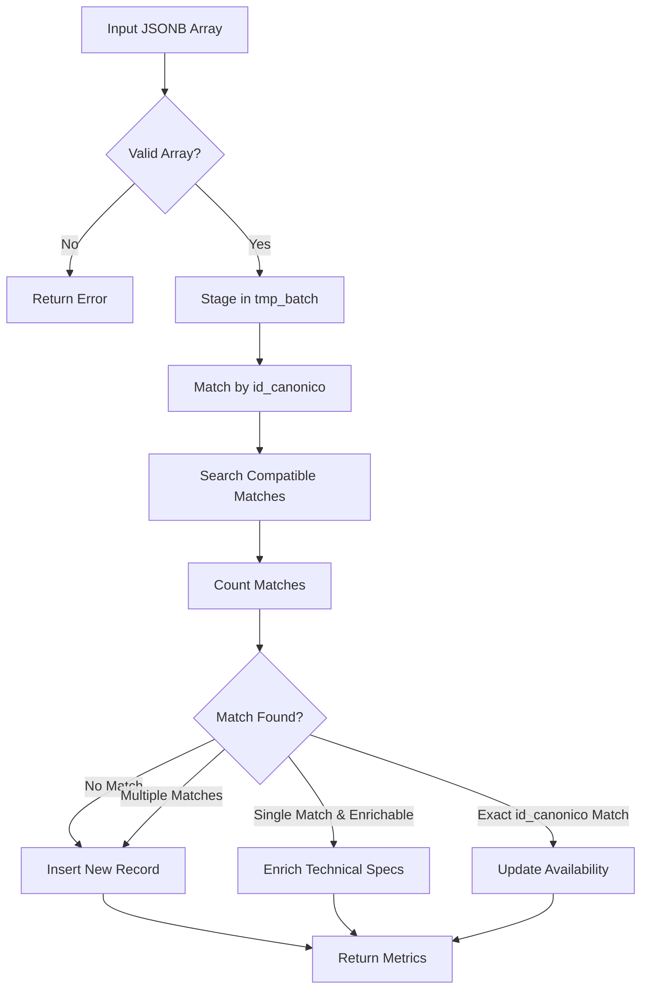

# Record Processing

<cite>
**Referenced Files in This Document**   
- [Funcion RPC Nueva.sql](file://src/supabase/Funcion RPC Nueva.sql)
- [casos de prueba función rpc.sql](file://src/supabase/casos de prueba función rpc.sql)
</cite>

## Table of Contents
1. [Introduction](#introduction)
2. [Processing Paths Overview](#processing-paths-overview)
3. [New Record Insertion](#new-record-insertion)
4. [Technical Enrichment](#technical-enrichment)
5. [Availability Updates](#availability-updates)
6. [Transactional Safety and Error Handling](#transactional-safety-and-error-handling)
7. [Response Structure and Metrics](#response-structure-and-metrics)

## Introduction
The `procesar_batch_homologacion` function is a PostgreSQL PL/pgSQL function responsible for processing batches of vehicle records from insurance providers. It intelligently routes each record into one of three distinct processing paths: new record insertion, technical enrichment, or availability updates. This document details each path, including logic, data transformations, confidence scoring, and transactional behavior.

**Section sources**
- [Funcion RPC Nueva.sql](file://src/supabase/Funcion RPC Nueva.sql#L1-L428)

## Processing Paths Overview
The function processes incoming vehicle data through a multi-step pipeline that first validates input, stages data in a temporary table, identifies compatibility matches, and then routes records into one of three paths:
- **New Record Insertion**: For vehicles with no canonical match or ambiguous matches
- **Technical Enrichment**: For vehicles matching existing entries where technical specs can be enhanced
- **Availability Updates**: For vehicles matching by `id_canonico`, updating insurer availability

Each path maintains data integrity through atomic operations and contributes to a unified response with processing metrics.



**Diagram sources**
- [Funcion RPC Nueva.sql](file://src/supabase/Funcion RPC Nueva.sql#L1-L428)

## New Record Insertion
When a vehicle has no existing match or multiple potential matches, it is inserted as a new record into the `catalogo_homologado` table. The insertion uses `ON CONFLICT DO NOTHING` on the `id_canonico` field to ensure idempotency and prevent duplicates.

The `disponibilidad` JSONB field is constructed to include the originating insurer's details such as `activo`, `id_original`, `version_original`, and `fecha_actualizacion`. This field acts as a registry of which insurers offer coverage for the vehicle.

Confidence scoring is applied based on match ambiguity:
- **1.0**: For clean insertions with no prior matches
- **0.8**: When multiple potential matches exist, indicating lower confidence due to ambiguity

This scoring informs downstream systems about data reliability.

**Section sources**
- [Funcion RPC Nueva.sql](file://src/supabase/Funcion RPC Nueva.sql#L208-L240)

## Technical Enrichment
This path handles vehicles that match existing records based on core attributes (marca, modelo, anio, transmision, version) but can contribute missing technical specifications (`motor_config`, `carroceria`, `traccion`).

Only technical fields are updated using `COALESCE` to preserve existing data. The `string_tecnico` field is reconstructed with updated values to maintain consistency.

The `id_canonico` may be updated if the incoming data provides additional technical information, ensuring the most complete identifier is retained. This dynamic update supports progressive data enrichment across insurers.

The confidence score is incrementally increased by 0.05 (capped at 1.0) to reflect improved data completeness.

**Section sources**
- [Funcion RPC Nueva.sql](file://src/supabase/Funcion RPC Nueva.sql#L254-L290)

## Availability Updates
For vehicles matching by `id_canonico`, only the `disponibilidad` JSONB field is updated. This operation uses a JSONB merge (`||`) to add or update the insurer's entry without altering technical specifications.

The merge preserves existing availability data while appending new insurer information. The confidence score is increased by 0.01 (capped at 1.0) to reflect broader market validation.

This path ensures that multiple insurers offering the same vehicle are tracked without redundant data storage.

**Section sources**
- [Funcion RPC Nueva.sql](file://src/supabase/Funcion RPC Nueva.sql#L301-L330)

## Transactional Safety and Error Handling
The entire function runs within a single transaction, ensuring atomicity. All operations are rolled back on failure.

Error handling is implemented via `EXCEPTION` blocks:
- `unique_violation`: Catches constraint violations with descriptive messages
- `OTHERS`: Captures any unexpected errors, returning SQL error details

Temporary tables use `ON COMMIT DROP` to ensure cleanup, preventing resource leaks.

The staging process uses `DISTINCT ON` to eliminate duplicates early, improving processing reliability.

**Section sources**
- [Funcion RPC Nueva.sql](file://src/supabase/Funcion RPC Nueva.sql#L400-L428)

## Response Structure and Metrics
The function returns a JSONB object containing comprehensive processing metrics:

```json
{
  "success": true,
  "received": 5,
  "staged": 5,
  "procesados": {
    "nuevos": 2,
    "enriquecidos": 1,
    "actualizados": 1,
    "conflictos": 0,
    "multiples_matches": 1
  },
  "warnings": [],
  "errors": []
}
```

Key metrics include:
- **received**: Total input records
- **staged**: Valid records after filtering
- **nuevos**: New insertions
- **enriquecidos**: Technically enriched records
- **actualizados**: Availability-only updates
- **conflictos**: Records with conflicting specs
- **multiples_matches**: Ambiguous matches leading to new records

Warnings are generated for multiple matches and conflicts, aiding data quality monitoring.

**Section sources**
- [Funcion RPC Nueva.sql](file://src/supabase/Funcion RPC Nueva.sql#L385-L415)
- [casos de prueba función rpc.sql](file://src/supabase/casos de prueba función rpc.sql#L6-L255)