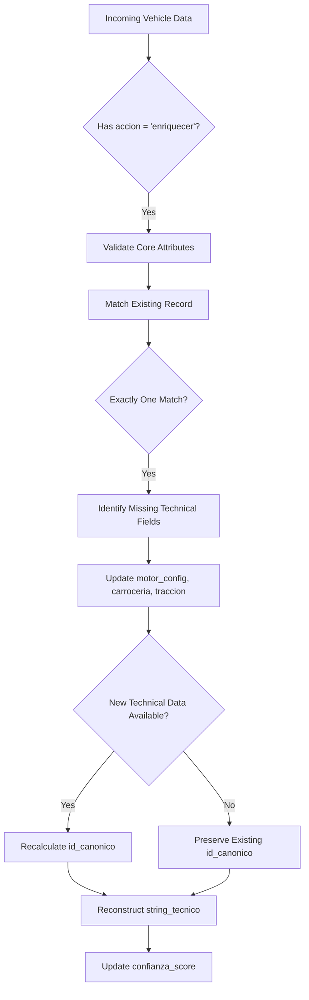

# Technical Enrichment

<cite>
**Referenced Files in This Document**   
- [Funcion RPC Nueva.sql](file://src/supabase/Funcion RPC Nueva.sql)
- [Replanteamiento homologacion.md](file://src/supabase/Replanteamiento homologacion.md)
- [instrucciones.md](file://instrucciones.md)
- [qualitas-codigo-de-normalizacion-n8n.js](file://src/insurers/qualitas/qualitas-codigo-de-normalizacion-n8n.js)
</cite>

## Table of Contents
1. [Introduction](#introduction)
2. [Technical Enrichment Processing Path](#technical-enrichment-processing-path)
3. [String Técnico Reconstruction and Canonical ID Recalculation](#string-técnico-reconstruction-and-canonical-id-recalculation)
4. [Confidence Score Adjustment and Data Completeness](#confidence-score-adjustment-and-data-completeness)
5. [Redundant Update Prevention](#redundant-update-prevention)
6. [Code Example: Vehicle Record Update](#code-example-vehicle-record-update)

## Introduction
The `procesar_batch_homologacion` function implements a technical enrichment process that updates existing vehicle records with enhanced technical specifications while preserving canonical identity. This document details how the `accion = 'enriquecer'` flag triggers selective updates to technical fields such as `string_tecnico`, `cilindros`, and `transmision`, while maintaining data integrity and improving canonical resolution when appropriate.

**Section sources**
- [Funcion RPC Nueva.sql](file://src/supabase/Funcion RPC Nueva.sql#L1-L428)

## Technical Enrichment Processing Path
The technical enrichment process begins when the `accion = 'enriquecer'` flag is detected in the input batch. The system first validates and stages incoming vehicle data in a temporary table (`tmp_batch`). It then performs compatibility matching to identify existing records that can be enriched with new technical specifications.

The matching logic requires exact alignment on core commercial attributes (marca, modelo, anio) and transmission/version fields, while allowing technical specifications (motor_config, carroceria, traccion) to be enriched when they are currently null in the existing record but provided in the new data. The system counts potential matches and only proceeds with enrichment when exactly one compatible record is found, preventing ambiguous updates.

When a match is identified, the system sets `accion = 'enriquecer'` and proceeds to update only the technical fields, preserving the existing canonical identity unless the new technical data improves resolution. This selective update approach ensures that only technical enhancements are applied without altering the fundamental commercial identity of the vehicle.

**Section sources**
- [Funcion RPC Nueva.sql](file://src/supabase/Funcion RPC Nueva.sql#L150-L250)

## String Técnico Reconstruction and Canonical ID Recalculation
The `string_tecnico` field is reconstructed using normalized inputs from both the existing record and the new data. The system combines the marca, modelo, anio, transmision, version, and technical specifications (using COALESCE to prioritize non-null values) into a pipe-delimited string. This reconstruction occurs during the enrichment update, ensuring the technical string reflects the most complete information available.

The `id_canonico` may be recalculated when the new technical data improves canonical resolution. The system evaluates whether the incoming data provides non-null values for motor_config, carroceria, or traccion that were previously null in the existing record. When such improvements are detected, the system updates the `id_canonico` to reflect the enhanced technical specificity, using the SHA-256 hash of the complete technical specification set. This recalculation strengthens the canonical identity by incorporating newly available technical details.



**Diagram sources**
- [Funcion RPC Nueva.sql](file://src/supabase/Funcion RPC Nueva.sql#L291-L327)
- [Replanteamiento homologacion.md](file://src/supabase/Replanteamiento homologacion.md#L88-L101)

## Confidence Score Adjustment and Data Completeness
The system implements a confidence scoring mechanism that adjusts based on data completeness and enrichment. When a record undergoes technical enrichment, its `confianza_score` is increased by 0.05 (capped at 1.0), reflecting the improved data quality from the additional technical specifications. This incremental boost acknowledges the value of enhanced technical detail in the canonical record.

For partial technical data, the system employs a selective enrichment strategy, updating only the specific technical fields that are provided and currently null in the existing record. Complete technical data sets trigger more comprehensive updates and potentially larger confidence score improvements. The system distinguishes between partial and complete updates by evaluating which technical fields are present in the incoming data, ensuring appropriate handling based on data completeness.

The confidence score also factors in match ambiguity, with records that had multiple potential matches during processing receiving a lower initial confidence score (0.8) compared to those with clear, unambiguous matches (1.0). This scoring system provides a quantitative measure of data reliability that evolves as records are enriched with additional technical information.

**Section sources**
- [Funcion RPC Nueva.sql](file://src/supabase/Funcion RPC Nueva.sql#L305-L315)
- [Replanteamiento homologacion.md](file://src/supabase/Replanteamiento homologacion.md#L47-L91)

## Redundant Update Prevention
The system prevents redundant updates through several mechanisms. First, it uses the `procesado` flag in the temporary batch table to track which records have already been processed, ensuring each vehicle is handled only once per batch. Second, the matching logic requires that technical fields be null in the existing record and non-null in the incoming data before triggering an enrichment update, preventing unnecessary overwrites of existing information.

The system also implements idempotent processing by checking for exact matches on `id_canonico` before considering enrichment. When an exact match is found, the system sets `accion = 'actualizar_disponibilidad'` instead of 'enriquecer', directing the record to a different processing path that only updates availability information without altering technical specifications. This distinction prevents redundant technical updates when the canonical identity already matches perfectly.

Additionally, the system detects and reports multiple potential matches, creating new records rather than attempting ambiguous enrichments. This approach maintains data integrity by avoiding speculative updates when the matching logic cannot identify a single, clear target for enrichment.

**Section sources**
- [Funcion RPC Nueva.sql](file://src/supabase/Funcion RPC Nueva.sql#L200-L250)

## Code Example: Vehicle Record Update
Consider a vehicle record update that enhances technical specifications. An existing record for a 2020 Toyota Yaris with transmission and commercial details but missing technical specifications receives an update with motor configuration (L4), body type (SEDAN), and traction (FWD). The system identifies this as an enrichment opportunity, updates the technical fields, reconstructs the `string_tecnico`, recalculates the `id_canonico` to reflect the improved technical resolution, and increases the confidence score from 0.95 to 1.0.

The resulting changes in the `catalogo_homologado` table include updated values for `motor_config`, `carroceria`, `traccion`, `string_tecnico`, and `id_canonico`, along with an incremented `confianza_score` and updated `fecha_actualizacion`. The `disponibilidad` field is also updated to include the new source insurer's information, preserving the complete provenance of all data sources while enhancing the technical richness of the canonical record.

```mermaid
erDiagram
catalogo_homologado {
id BIGSERIAL PK
id_canonico VARCHAR(64) UK
hash_comercial VARCHAR(64)
string_comercial TEXT
string_tecnico TEXT
marca VARCHAR(100)
modelo VARCHAR(150)
anio INTEGER
transmision VARCHAR(20)
version VARCHAR(200)
motor_config VARCHAR(50)
carroceria VARCHAR(50)
traccion VARCHAR(20)
disponibilidad JSONB
confianza_score DECIMAL(3,2)
fecha_creacion TIMESTAMP
fecha_actualizacion TIMESTAMP
}
catalogo_homologado ||--o{ tmp_batch : "staging"
catalogo_homologado }|--|| insurers : "source"
```

**Diagram sources**
- [Funcion RPC Nueva.sql](file://src/supabase/Funcion RPC Nueva.sql#L291-L327)
- [Replanteamiento homologacion.md](file://src/supabase/Replanteamiento homologacion.md#L47-L91)