# Staging Phase

<cite>
**Referenced Files in This Document**   
- [Funcion RPC Nueva.sql](file://src/supabase/Funcion RPC Nueva.sql)
- [Replanteamiento homologacion.md](file://src/supabase/Replanteamiento homologacion.md)
- [instrucciones.md](file://instrucciones.md)
</cite>

## Table of Contents
1. [Introduction](#introduction)
2. [Input Validation and Vehicle Array Extraction](#input-validation-and-vehicle-array-extraction)
3. [Temporary Table Creation and Population](#temporary-table-creation-and-population)
4. [Data Normalization and Filtering Logic](#data-normalization-and-filtering-logic)
5. [Performance and Transaction Safety Considerations](#performance-and-transaction-safety-considerations)
6. [Conclusion](#conclusion)

## Introduction
The `procesar_batch_homologacion` function serves as a critical RPC endpoint in the vehicle catalog homologation system, responsible for ingesting, validating, and processing batches of vehicle data from multiple insurers. This document focuses specifically on the staging phase of this function, detailing how input JSONB data is validated and extracted, how the temporary table `tmp_batch` is created and populated, and the various normalization, filtering, and deduplication steps applied during this process. The staging phase ensures data integrity, consistency, and efficiency before further processing steps such as matching, enrichment, and conflict resolution.

**Section sources**
- [Funcion RPC Nueva.sql](file://src/supabase/Funcion RPC Nueva.sql#L1-L44)

## Input Validation and Vehicle Array Extraction
The staging phase begins with rigorous input validation to ensure the provided JSONB payload conforms to expected structure. The function first checks whether the top-level JSON object contains a key named `vehiculos_json`. If present, the value associated with this key is extracted as the vehicle array. This design accommodates both direct array inputs and wrapped payloads, providing flexibility for different client implementations. If the `vehiculos_json` key is absent, the entire input parameter `p_vehiculos_json` is treated as the vehicle array.

Following extraction, the function validates that the resulting `v_vehiculos_array` is not null and is of JSONB type 'array'. If validation fails, an error response is immediately returned indicating that the input must contain a vehicle array, along with a received count of zero. Upon successful validation, the number of vehicles in the array is determined using `jsonb_array_length` and stored in the `v_received` variable for later reporting in the response metrics.

```mermaid
flowchart TD
Start([Function Entry]) --> CheckWrapper{"Contains 'vehiculos_json' key?"}
CheckWrapper --> |Yes| ExtractArray["Extract v_vehiculos_array = p_vehiculos_json->'vehiculos_json'"]
CheckWrapper --> |No| UseDirect["Use v_vehiculos_array = p_vehiculos_json"]
ExtractArray --> ValidateInput["Validate Array Type and Non-null"]
UseDirect --> ValidateInput
ValidateInput --> IsValid{"Valid Array?"}
IsValid --> |No| ReturnError["Return Error: 'Input debe contener un array de vehículos'"]
IsValid --> |Yes| ContinueStaging["Proceed to Staging Phase"]
ReturnError --> End([Function Exit])
ContinueStaging --> End
```

**Diagram sources**
- [Funcion RPC Nueva.sql](file://src/supabase/Funcion RPC Nueva.sql#L24-L38)

**Section sources**
- [Funcion RPC Nueva.sql](file://src/supabase/Funcion RPC Nueva.sql#L24-L38)

## Temporary Table Creation and Population
After successful input validation, the function proceeds to create a temporary table named `tmp_batch` to stage the incoming vehicle data. This table is defined with a comprehensive schema that mirrors the core attributes of a vehicle, including identification fields (`id_canonico`, `hash_comercial`), descriptive data (`marca`, `modelo`, `anio`, `version`), technical specifications (`transmision`, `motor_config`, `carroceria`, `traccion`), origin information (`origen_aseguradora`, `id_original`, `version_original`), and internal control flags (`procesado`, `accion`).

The creation of `tmp_batch` employs the `ON COMMIT DROP` clause, which ensures the table is automatically dropped at the end of the transaction. This provides transactional safety and automatic cleanup, preventing any potential data leakage or conflicts between different function invocations. The table is populated using an `INSERT INTO ... SELECT` statement that processes each element of the validated `v_vehiculos_array` via `jsonb_array_elements`.

**Diagram sources**
- [Funcion RPC Nueva.sql](file://src/supabase/Funcion RPC Nueva.sql#L43-L70)

**Section sources**
- [Funcion RPC Nueva.sql](file://src/supabase/Funcion RPC Nueva.sql#L43-L70)

## Data Normalization and Filtering Logic
The data population process incorporates several critical normalization and filtering steps to ensure data quality and consistency. During the `INSERT INTO ... SELECT` operation, various normalization techniques are applied to text fields. All string values are converted to uppercase using `UPPER` and whitespace is removed from the beginning and end using `TRIM`. This standardization ensures case-insensitive and whitespace-insensitive comparisons in subsequent processing stages.

For optional fields like `transmision`, `version`, `motor_config`, `carroceria`, and `traccion`, the function uses `NULLIF(TRIM(...), '')` to convert empty strings into proper SQL `NULL` values, maintaining data integrity. The `activo` field is handled with `COALESCE((v->>'activo')::BOOLEAN, TRUE)`, defaulting to `true` if the field is missing or null, which aligns with the business rule that vehicles are considered active by default.

A key filtering step is applied in the `WHERE` clause of the `SELECT` statement, which restricts the insertion to only those vehicles with a model year (`anio`) between 2000 and 2030. This range filter excludes potentially erroneous or outdated records, focusing the processing on relevant, modern vehicle models. The `DISTINCT ON (v->>'origen_aseguradora', v->>'id_original')` clause is used to prevent duplicate entries from the same insurer and original ID within a single batch, ensuring each unique vehicle from a given source is processed only once.

**Diagram sources**
- [Funcion RPC Nueva.sql](file://src/supabase/Funcion RPC Nueva.sql#L55-L70)

**Section sources**
- [Funcion RPC Nueva.sql](file://src/supabase/Funcion RPC Nueva.sql#L55-L70)

## Performance and Transaction Safety Considerations
The staging phase is designed with significant performance and safety considerations. The use of a temporary table (`tmp_batch`) allows for efficient bulk processing of the entire batch within a single transaction. This approach minimizes the number of round trips to the database and enables the use of set-based operations for subsequent matching and updating logic, which is far more efficient than row-by-row processing.

The `ON COMMIT DROP` directive is a crucial performance and safety feature. It guarantees that the temporary table is automatically cleaned up when the transaction ends, whether it commits or rolls back. This eliminates the need for manual cleanup code and prevents the accumulation of stale temporary data, which could otherwise consume memory and disk space over time.

Memory usage is a key consideration, as the entire batch of vehicle data is loaded into the `tmp_batch` table. The function's performance will scale with the size of the input batch. While larger batches improve throughput by amortizing transaction overhead, they also increase memory consumption. The recommended batch size of 10,000 to 50,000 records, as mentioned in the project documentation, represents a balance between efficiency and resource utilization. The `GET DIAGNOSTICS v_staged = ROW_COUNT;` statement captures the number of successfully staged records, providing valuable feedback for monitoring and performance tuning.

**Section sources**
- [Funcion RPC Nueva.sql](file://src/supabase/Funcion RPC Nueva.sql#L43-L70)
- [instrucciones.md](file://instrucciones.md#L88-L101)

## Conclusion
The staging phase of the `procesar_batch_homologacion` function is a robust and well-structured process that effectively handles the initial ingestion of vehicle data. It combines flexible input handling, strict validation, comprehensive data normalization, and intelligent filtering to prepare a clean, consistent dataset for the subsequent homologation steps. The strategic use of a transaction-scoped temporary table ensures both performance efficiency and data safety. By enforcing data quality rules such as year filtering and duplicate prevention at this early stage, the function lays a solid foundation for the accurate and reliable creation of a unified, canonical vehicle catalog.