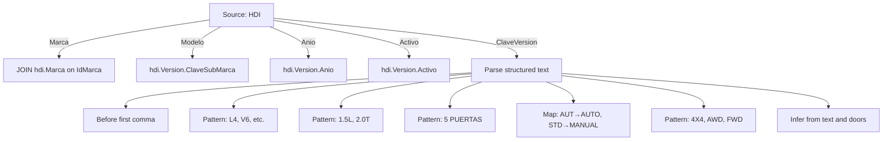
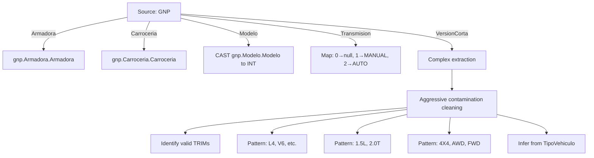
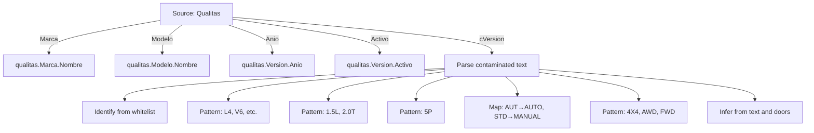
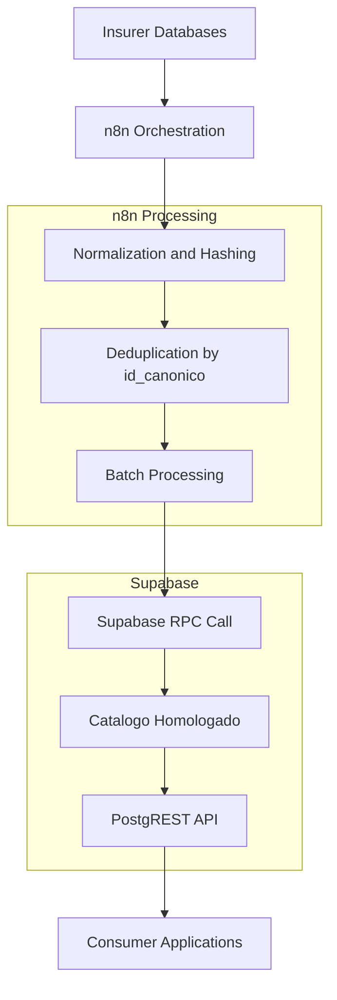

# Canonical Data Modeling

<cite>
**Referenced Files in This Document**   
- [Replanteamiento homologacion.md](file://src/supabase/Replanteamiento%20homologacion.md)
- [Tabla maestra.sql](file://src/supabase/Tabla%20maestra.sql)
- [Funcion RPC Nueva.sql](file://src/supabase/Funcion%20RPC%20Nueva.sql)
- [hdi-analisis.md](file://src/insurers/hdi/hdi-analisis.md)
- [gnp-analisis.md](file://src/insurers/gnp/gnp-analisis.md)
- [qualitas-analisis.md](file://src/insurers/qualitas/qualitas-analisis.md)
- [qualitas-codigo-de-normalizacion-n8n.js](file://src/insurers/qualitas/qualitas-codigo-de-normalizacion-n8n.js)
- [hdi-codigo-de-normalizacion.js](file://src/insurers/hdi/hdi-codigo-de-normalizacion.js)
- [gnp-codigo-de-normalizacion.js](file://src/insurers/gnp/gnp-codigo-de-normalizacion.js)
</cite>

## Table of Contents
1. [Introduction](#introduction)
2. [Canonical Data Model](#canonical-data-model)
3. [Source-to-Canonical Mapping](#source-to-canonical-mapping)
4. [Normalization and Transformation Rules](#normalization-and-transformation-rules)
5. [Data Integrity and Constraints](#data-integrity-and-constraints)
6. [Availability Tracking](#availability-tracking)
7. [Semantic Equivalence and Inference](#semantic-equivalence-and-inference)
8. [Architecture and Processing Flow](#architecture-and-processing-flow)
9. [Conclusion](#conclusion)

## Introduction

The homologacion-ukuvi system establishes a unified vehicle catalog by integrating disparate insurer schemas into a single canonical model. This document details the structure, transformation logic, and operational mechanics of the `catalogo_homologado` table, which serves as the central repository for vehicle data. The system ingests data from 11 insurers including HDI, GNP, and Qualitas, normalizes it into a consistent format, and maintains insurer-specific availability information. The canonical model enables consistent vehicle identification across insurers while preserving source-level traceability and supporting complex queries for insurance pricing and risk assessment.

**Section sources**
- [Replanteamiento homologacion.md](file://src/supabase/Replanteamiento%20homologacion.md#L1-L20)

## Canonical Data Model

The `catalogo_homologado` table represents the unified vehicle catalog with standardized fields that enable consistent identification and comparison across insurers. The model includes both commercial and technical specifications, with each vehicle uniquely identified by its `id_canonico`. The table structure supports comprehensive vehicle characterization while maintaining efficient query performance through strategic indexing.

```mermaid
erDiagram
CATALOGO_HOMOLOGADO {
bigint id PK
varchar(64) id_canonico UK
varchar(64) hash_comercial
text string_comercial
text string_tecnico
varchar(100) marca
varchar(150) modelo
integer anio
varchar(20) transmision
varchar(200) version
varchar(50) motor_config
varchar(50) carroceria
varchar(20) traccion
jsonb disponibilidad
decimal(3,2) confianza_score
timestamp fecha_creacion
timestamp fecha_actualizacion
}
```

**Diagram sources**
- [Replanteamiento homologacion.md](file://src/supabase/Replanteamiento%20homologacion.md#L45-L99)

### Core Fields

The canonical model includes several key fields that define a vehicle's identity and characteristics:

- **id_canonico**: The primary key, a SHA-256 hash that uniquely identifies each vehicle configuration across all insurers. This hash is generated from normalized commercial and technical specifications, ensuring that identical vehicle configurations from different insurers map to the same canonical record.

- **hash_comercial**: A SHA-256 hash of the normalized commercial string (marca|modelo|anio|transmision), used for grouping vehicles with identical commercial specifications across different technical configurations.

- **string_comercial**: A pipe-delimited string containing the normalized commercial attributes (marca|modelo|anio|transmision) that provides a human-readable representation of the vehicle's commercial identity.

- **string_tecnico**: A comprehensive pipe-delimited string that includes all technical specifications (marca|modelo|anio|transmision|version|motor_config|carroceria|traccion), providing a complete technical fingerprint of the vehicle.

- **marca, modelo, anio, trim**: The normalized commercial attributes that define the vehicle's basic identity. These fields are standardized across insurers to ensure consistent representation.

**Section sources**
- [Replanteamiento homologacion.md](file://src/supabase/Replanteamiento%20homologacion.md#L45-L99)

## Source-to-Canonical Mapping

The system integrates data from 11 insurers, each with their own schema and data representation. The mapping process transforms these disparate schemas into the unified canonical model, preserving the original data while creating a consistent representation. The mapping varies significantly between insurers due to differences in data quality, structure, and completeness.

### HDI Mapping Strategy

HDI's data structure is considered high quality with a clean, standardized format that facilitates reliable extraction. The mapping process leverages HDI's consistent data organization to extract precise vehicle specifications.



**Diagram sources**
- [hdi-analisis.md](file://src/insurers/hdi/hdi-analisis.md#L1-L525)

### GNP Mapping Strategy

GNP presents significant data quality challenges, including the absence of an active/inactive flag and severe data contamination issues. The mapping process requires aggressive cleaning and validation to ensure data integrity.



**Diagram sources**
- [gnp-analisis.md](file://src/insurers/gnp/gnp-analisis.md#L1-L281)

### Qualitas Mapping Strategy

Qualitas has a large catalog with a highly contaminated version field that mixes multiple types of information without consistent structure. The mapping process focuses on extracting meaningful information while filtering out irrelevant equipment codes.



**Diagram sources**
- [qualitas-analisis.md](file://src/insurers/qualitas/qualitas-analisis.md#L1-L333)

## Normalization and Transformation Rules

The normalization process applies consistent rules across all insurer data to create a unified representation. These rules address text standardization, abbreviation expansion, and structural parsing to ensure that equivalent vehicles from different insurers are represented identically in the canonical model.

### Text Normalization

All text fields undergo standardization to ensure consistency:

- Convert to uppercase
- Remove accents and special characters
- Replace multiple spaces with single spaces
- Trim leading and trailing whitespace

### Hash Generation

The system uses two levels of hashing to identify vehicles at different levels of specificity:

- **hash_comercial**: Generated from the normalized commercial string (marca|modelo|anio|transmision). This hash groups vehicles with identical commercial specifications, regardless of technical differences.

- **id_canonico**: Generated from the normalized technical string (hash_comercial|version|motor_config|carroceria|traccion). This hash uniquely identifies each specific vehicle configuration.

```javascript
function generarHash(...componentes) {
  const texto = componentes
    .filter((c) => c !== undefined && c !== null)
    .join("|")
    .toUpperCase();
  return crypto.createHash("sha256").update(texto).digest("hex");
}
```

**Section sources**
- [Replanteamiento homologacion.md](file://src/supabase/Replanteamiento%20homologacion.md#L85-L90)
- [qualitas-codigo-de-normalizacion-n8n.js](file://src/insurers/qualitas/qualitas-codigo-de-normalizacion-n8n.js#L15-L25)

### TRIM Extraction

The extraction of the TRIM (version) field varies by insurer due to differences in data structure:

- **HDI**: Extract text before the first comma in the ClaveVersion field, as HDI uses a highly standardized format with consistent separation.

- **Qualitas**: Search for known TRIM values in a whitelist, prioritizing premium and performance trims, and return null when no valid TRIM is found.

- **GNP**: Apply aggressive cleaning to remove contamination from other brands, then search for valid TRIMs in the cleaned text.

**Section sources**
- [hdi-analisis.md](file://src/insurers/hdi/hdi-analisis.md#L100-L150)
- [qualitas-analisis.md](file://src/insurers/qualitas/qualitas-analisis.md#L100-L150)
- [gnp-analisis.md](file://src/insurers/gnp/gnp-analisis.md#L100-L150)

## Data Integrity and Constraints

The canonical model enforces data integrity through constraints, indexes, and validation rules that ensure consistency and reliability. These mechanisms prevent duplicate records, enforce data quality, and support efficient querying.

### Constraints

The table includes several constraints to maintain data quality:

- **PRIMARY KEY**: The `id` field ensures each record has a unique identifier.
- **UNIQUE**: The `id_canonico` field prevents duplicate vehicle configurations.
- **CHECK**: The `anio` field is constrained to values between 2000 and 2030, ensuring only relevant vehicle years are included.
- **NOT NULL**: Critical fields like `marca`, `modelo`, `anio`, and `id_canonico` cannot be null, ensuring complete vehicle identification.

### Indexes

Strategic indexing supports efficient querying and data retrieval:

- **idx_marca_modelo_anio_hom**: Composite index on marca, modelo, and anio for fast filtering by vehicle identity.
- **idx_hash_comercial_hom**: Index on hash_comercial for grouping vehicles with identical commercial specifications.
- **idx_disponibilidad_gin_hom**: GIN index on disponibilidad for efficient JSONB querying of insurer availability.
- **idx_id_canonico_hom**: Index on id_canonico for fast lookups by the primary vehicle identifier.

```sql
CREATE INDEX idx_marca_modelo_anio_hom ON catalogo_homologado(marca, modelo, anio);
CREATE INDEX idx_hash_comercial_hom ON catalogo_homologado(hash_comercial);
CREATE INDEX idx_disponibilidad_gin_hom ON catalogo_homologado USING GIN(disponibilidad);
CREATE INDEX idx_id_canonico_hom ON catalogo_homologado(id_canonico);
```

**Section sources**
- [Replanteamiento homologacion.md](file://src/supabase/Replanteamiento%20homologacion.md#L70-L75)

## Availability Tracking

The `disponibilidad` JSONB field tracks insurer-specific availability information, enabling the system to determine which insurers offer each vehicle configuration. This field preserves source-level traceability while supporting complex queries about vehicle availability across insurers.

### JSONB Structure

The disponibilidad field contains a JSON object with insurer codes as keys and availability information as values:

```json
{
  "QUALITAS": {
    "activo": true,
    "id_original": "372340",
    "version_original": "ADVANCE 5P L4 1.5T AUT., 05 OCUP.",
    "fecha_actualizacion": "2025-01-15T10:00:00Z"
  },
  "HDI": {
    "activo": false,
    "id_original": "HDI_3787",
    "version_original": "YARIS CORE L4 5.0 SUV",
    "fecha_actualizacion": "2025-01-15T10:00:00Z"
  }
}
```

### Active/Inactive Rules

The system defines active and inactive status at the insurer level:

- **Active**: The insurer declares the vehicle as currently offerable in their catalog (activo=true).
- **Inactive**: The insurer has discontinued the vehicle or no longer offers it (activo=false).
- **Global Vigency**: A vehicle is considered globally active if at least one insurer reports it as active.

The system never deletes records for inactive vehicles; instead, it updates the disponibilidad field to preserve historical data and enable reactivation if an insurer reintroduces a vehicle.

**Section sources**
- [Replanteamiento homologacion.md](file://src/supabase/Replanteamiento%20homologacion.md#L100-L130)

## Semantic Equivalence and Inference

The system addresses challenges in semantic equivalence across insurers through inference logic that standardizes vehicle characteristics. These inference rules resolve differences in terminology, structure, and completeness to create a consistent representation.

### Carrocería Inference

The inference of carrocería (body type) varies by insurer based on data availability and quality:

- **HDI**: Uses explicit text detection (SEDAN, SUV, etc.) combined with door count inference when explicit information is unavailable.

- **Qualitas**: Prioritizes WAGON/SPORTWAGEN detection, then uses dictionary-based matching, and finally applies door count heuristics as a last resort.

- **GNP**: Infers from TipoVehiculo field (CA1→PICKUP) combined with text analysis and model-based fallbacks.

```javascript
function inferirCarroceriaHDI(claveVersion, puertas) {
  const version = claveVersion.toUpperCase();
  
  if (version.includes("SEDAN")) return "SEDAN";
  if (version.includes("SUV")) return "SUV";
  if (version.includes("HATCHBACK") || version.includes("HB")) return "HATCHBACK";
  if (version.includes("COUPE")) return "COUPE";
  if (version.includes("CONVERTIBLE") || version.includes("CABRIO")) return "CONVERTIBLE";
  if (version.includes("PICKUP") || version.includes("PICK UP")) return "PICKUP";
  if (version.includes("VAN")) return "VAN";
  if (version.includes("WAGON") || version.includes("ESTATE")) return "WAGON";
  
  if (puertas) {
    if (puertas === 2) return "COUPE";
    if (puertas === 3) return "HATCHBACK";
    if (puertas === 4) return "SEDAN";
    if (puertas === 5) return "SUV";
  }
  
  return null;
}
```

**Section sources**
- [hdi-analisis.md](file://src/insurers/hdi/hdi-analisis.md#L300-L350)
- [qualitas-codigo-de-normalizacion-n8n.js](file://src/insurers/qualitas/qualitas-codigo-de-normalizacion-n8n.js#L500-L550)
- [gnp-codigo-de-normalizacion.js](file://src/insurers/gnp/gnp-codigo-de-normalizacion.js#L500-L550)

## Architecture and Processing Flow

The system follows a structured processing flow that ingests data from insurers, normalizes it, and persists it in the canonical model. This flow ensures data consistency, traceability, and reliability through a combination of orchestration, transformation, and persistence layers.



**Diagram sources**
- [Replanteamiento homologacion.md](file://src/supabase/Replanteamiento%20homologacion.md#L20-L30)

### RPC Contract

The `procesar_batch_homologacion` RPC function handles batch processing of vehicle data, ensuring idempotent updates and proper merging of availability information:

- Validates input data for required fields
- Performs upsert operations based on id_canonico
- Merges disponibilidad JSONB for the source insurer
- Updates timestamps and confidence scores
- Returns processing metrics

The function is designed to be idempotent, allowing reprocessing of batches without unintended side effects.

**Section sources**
- [Replanteamiento homologacion.md](file://src/supabase/Replanteamiento%20homologacion.md#L135-L200)
- [Funcion RPC Nueva.sql](file://src/supabase/Funcion%20RPC%20Nueva.sql#L1-L429)

## Conclusion

The canonical vehicle catalog in the homologacion-ukuvi system provides a unified view of vehicle data across multiple insurers, enabling consistent identification and comparison. The `catalogo_homologado` table serves as the central repository with standardized fields that support comprehensive vehicle characterization. The system successfully integrates disparate insurer schemas through sophisticated normalization and transformation rules, preserving source-level traceability while creating a consistent representation. Challenges in data quality and semantic equivalence are addressed through inference logic and careful validation, ensuring data integrity and reliability. The architecture supports efficient querying and updating, making the canonical catalog a robust foundation for insurance pricing and risk assessment applications.