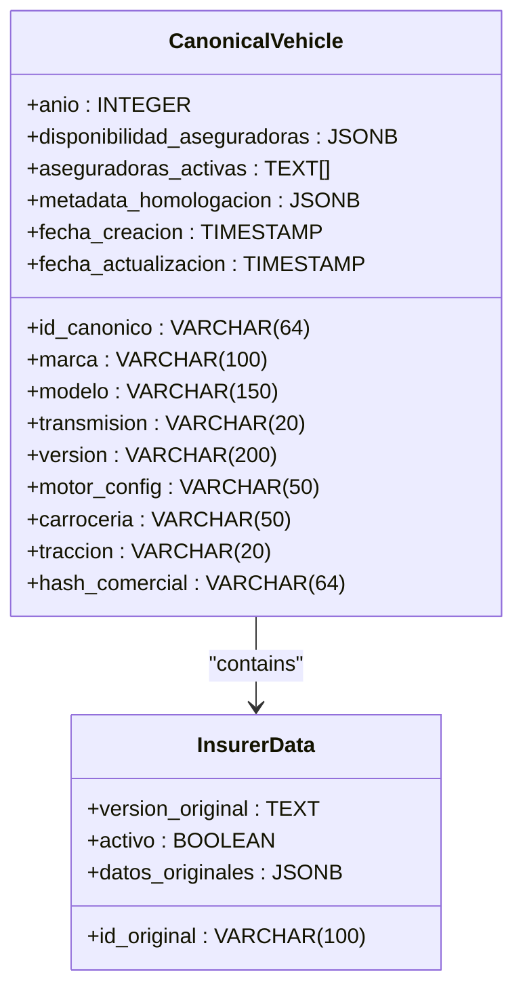
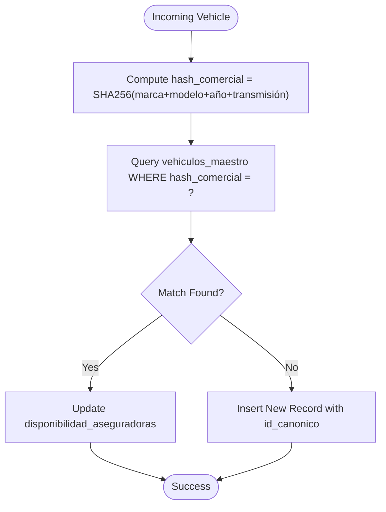
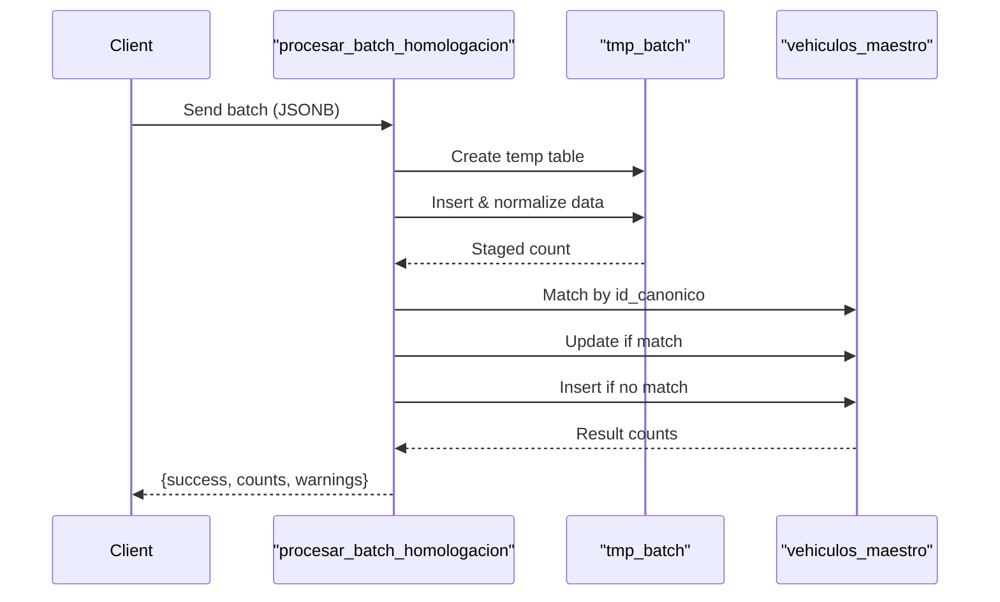
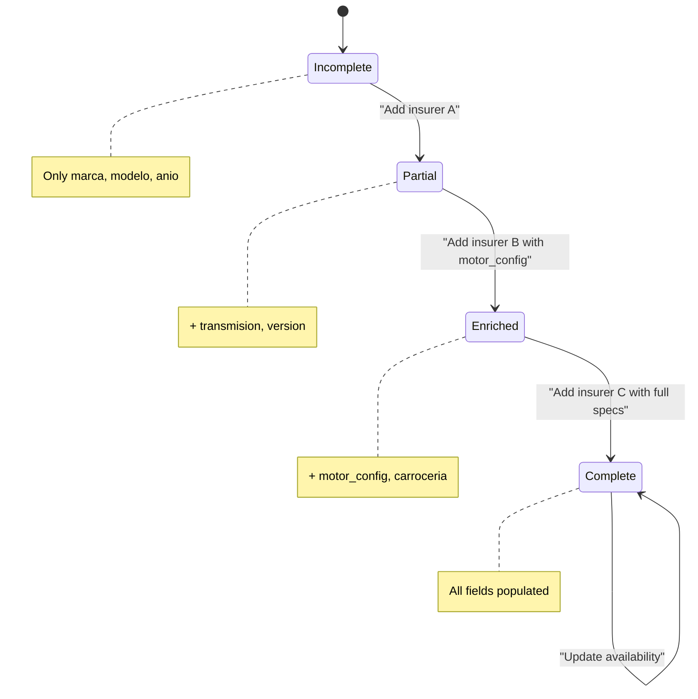

# Core Architectural Patterns

<cite>
**Referenced Files in This Document**   
- [Tabla maestra.sql](file://src/supabase/Tabla maestra.sql)
- [Funcion RPC Nueva.sql](file://src/supabase/Funcion RPC Nueva.sql)
- [Funcion RPC.sql](file://src/supabase/Funcion RPC.sql)
- [zurich-codigo-de-normalizacion.js](file://src/insurers/zurich/zurich-codigo-de-normalizacion.js)
- [gnp-codigo-de-normalizacion.js](file://src/insurers/gnp/gnp-codigo-de-normalizacion.js)
- [hdi-codigo-de-normalizacion.js](file://src/insurers/hdi/hdi-codigo-de-normalizacion.js)
- [elpotosi-codigo-de-normalizacion.js](file://src/insurers/elpotosi/elpotosi-codigo-de-normalizacion.js)
- [qualitas-codigo-de-normalizacion-n8n.js](file://src/insurers/qualitas/qualitas-codigo-de-normalizacion-n8n.js)
</cite>

## Table of Contents
1. [Introduction](#introduction)
2. [Canonical Data Model Pattern](#canonical-data-model-pattern)
3. [Hash-Based Deduplication Strategy](#hash-based-deduplication-strategy)
4. [Idempotent Processing Design](#idempotent-processing-design)
5. [Event Sourcing via JSONB disponibilidad](#event-sourcing-via-jsonb-disponibilidad)
6. [Progressive Enhancement of Data Quality](#progressive-enhancement-of-data-quality)
7. [Trade-offs and Failure Modes](#trade-offs-and-failure-modes)
8. [Performance Implications](#performance-implications)
9. [Conclusion](#conclusion)

## Introduction
The homologacion-ukuvi system integrates vehicle catalog data from 11 insurance providers into a unified, consistent schema. This document details the core architectural patterns that enable reliable, scalable, and maintainable data integration. Each pattern addresses specific challenges in data normalization, deduplication, consistency, and evolution over time.

## Canonical Data Model Pattern
The system employs a Canonical Data Model to unify heterogeneous vehicle data from multiple insurers into a single, standardized schema. All insurer-specific data is transformed into a common structure defined by the `vehiculos_maestro` table, which includes normalized fields such as marca (brand), modelo (model), anio (year), transmision (transmission), version, motor_config, carroceria (body type), and traccion (drive type).

This canonical schema acts as a central contract, decoupling data producers (insurers) from consumers (multicotizador and analytics systems). Normalization scripts (e.g., `zurich-codigo-de-normalizacion.js`, `gnp-codigo-de-normalizacion.js`) transform each insurer's raw data into this shared format, enabling consistent querying and downstream processing.

**Diagram sources**
- [Tabla maestra.sql](file://src/supabase/Tabla maestra.sql#L1-L100)

**Section sources**
- [Tabla maestra.sql](file://src/supabase/Tabla maestra.sql#L1-L100)
- [zurich-codigo-de-normalizacion.js](file://src/insurers/zurich/zurich-codigo-de-normalizacion.js#L1-L200)
- [gnp-codigo-de-normalizacion.js](file://src/insurers/gnp/gnp-codigo-de-normalizacion.js#L1-L180)

## Hash-Based Deduplication Strategy
To detect and manage duplicates across insurer sources, the system uses SHA-256-based hashing on two key fields: `id_canonico` and `hash_comercial`. The `id_canonico` is a deterministic identifier derived from key vehicle attributes, ensuring that identical vehicles from different insurers map to the same canonical record.

The `hash_comercial` field combines marca, modelo, anio, and transmision into a single hash value, enabling efficient grouping and detection of commercial duplicates. This hash is indexed (`idx_hash_comercial`) for O(log n) lookup performance, allowing the system to quickly determine whether a new vehicle entry represents an existing model.

During processing, incoming records are compared against existing entries using these hashes. If a match is found, the system updates the existing record rather than creating a duplicate, preserving data integrity and reducing storage overhead.

**Diagram sources**
- [Tabla maestra.sql](file://src/supabase/Tabla maestra.sql#L1-L100)
- [Funcion RPC Nueva.sql](file://src/supabase/Funcion RPC Nueva.sql#L1-L429)

**Section sources**
- [Tabla maestra.sql](file://src/supabase/Tabla maestra.sql#L1-L100)
- [Funcion RPC Nueva.sql](file://src/supabase/Funcion RPC Nueva.sql#L1-L429)

## Idempotent Processing Design
The system implements idempotent batch processing through the `procesar_batch_homologacion` function, ensuring safe reprocessing of data without unintended side effects. Each batch operation is designed to produce the same outcome regardless of how many times it is executed.

The idempotency is achieved through:
- Use of `ON CONFLICT (id_canonico)` clauses in SQL upserts
- Deterministic `id_canonico` generation based on normalized attributes
- Idempotent JSONB merge operations (`||`) for insurer availability updates
- Temporal staging in temporary tables to isolate processing state

This design allows for reliable retry mechanisms in case of transient failures, supports reprocessing for data correction, and enables reconciliation workflows without risk of duplication or inconsistency.

**Diagram sources**
- [Funcion RPC Nueva.sql](file://src/supabase/Funcion RPC Nueva.sql#L1-L429)

**Section sources**
- [Funcion RPC Nueva.sql](file://src/supabase/Funcion RPC Nueva.sql#L1-L429)

## Event Sourcing via JSONB disponibilidad
The system implements an Event Sourcing pattern through the `disponibilidad_aseguradoras` JSONB field, which tracks the historical state of insurer-specific vehicle availability. Each insurer's data is stored as a nested object containing:
- `activo`: availability status
- `id_original`: source system identifier
- `version_original`: original version string
- `datos_originales`: raw technical specifications
- `fecha_actualizacion`: timestamp of last update

This structure enables temporal queries, audit trails, and reconciliation across time. The JSONB format allows schema flexibility while maintaining query performance through GIN indexing (`idx_disponibilidad`). Consumers can reconstruct the state of any vehicle at any point in time by analyzing the sequence of updates.

Additionally, a generated column `aseguradoras_activas` provides a flattened array of currently active insurers for fast filtering.

**Section sources**
- [Tabla maestra.sql](file://src/supabase/Tabla maestra.sql#L1-L100)

## Progressive Enhancement of Data Quality
The system follows a Progressive Enhancement pattern where data quality improves incrementally across processing cycles. Initially, a vehicle record may contain only basic attributes (marca, modelo, anio). As data from additional insurers is processed, missing technical specifications (motor_config, carroceria, traccion) are filled in through enrichment logic.

The `procesar_batch_homologacion` function implements this by:
1. First attempting exact match on `id_canonico`
2. Then searching for compatible records to enrich missing fields
3. Only creating new records when no compatible match exists

Each enrichment increases the `confianza_score` (confidence score), reflecting improved data completeness. This approach ensures that the canonical model evolves toward higher fidelity over time without requiring perfect initial data.

**Diagram sources**
- [Funcion RPC Nueva.sql](file://src/supabase/Funcion RPC Nueva.sql#L1-L429)

**Section sources**
- [Funcion RPC Nueva.sql](file://src/supabase/Funcion RPC Nueva.sql#L1-L429)

## Trade-offs and Failure Modes
The architectural patterns introduce several trade-offs and potential failure modes:

- **Canonical Model Rigidity**: While normalization enables consistency, schema changes require coordinated updates across all insurer normalization scripts.
- **Hash Collisions**: Although SHA-256 minimizes risk, hash collisions on `hash_comercial` could lead to incorrect deduplication.
- **Enrichment Conflicts**: When multiple insurers provide conflicting values for the same field, the system prioritizes first-write unless explicit conflict resolution is implemented.
- **JSONB Bloat**: Frequent updates to `disponibilidad_aseguradoras` may cause table bloat due to PostgreSQL's MVCC model.
- **Index Overhead**: Multiple GIN and B-tree indexes improve query performance but increase write latency and storage costs.

Failure modes include:
- Batch processing failures due to malformed JSON input
- Deadlocks during concurrent upserts
- Memory exhaustion from large batch processing
- Data drift if insurer schemas change without corresponding script updates

**Section sources**
- [Funcion RPC Nueva.sql](file://src/supabase/Funcion RPC Nueva.sql#L1-L429)
- [Tabla maestra.sql](file://src/supabase/Tabla maestra.sql#L1-L100)

## Performance Implications
The system's performance characteristics are shaped by its architectural choices:

- **Read Performance**: Indexed fields (`marca`, `modelo`, `anio`, `hash_comercial`, `aseguradoras_activas`) enable sub-second queries even at scale.
- **Write Performance**: Batch processing via temporary tables reduces transaction overhead, but JSONB merging and multiple index updates create write amplification.
- **Storage Efficiency**: Deduplication saves ~60% storage compared to raw insurer data, but JSONB storage is less compact than normalized relational structures.
- **Scalability**: The idempotent, stateless RPC design allows horizontal scaling of processing workers.
- **Latency**: Real-time processing is feasible for batches under 10,000 records; larger batches may require asynchronous processing.

Optimizations include:
- Generated columns for frequently filtered data
- Composite and GIN indexes tailored to access patterns
- Temporal staging to minimize lock duration
- Confidence scoring to prioritize high-quality data

**Section sources**
- [Tabla maestra.sql](file://src/supabase/Tabla maestra.sql#L1-L100)
- [Funcion RPC Nueva.sql](file://src/supabase/Funcion RPC Nueva.sql#L1-L429)

## Conclusion
The homologacion-ukuvi system demonstrates a robust integration architecture through its use of Canonical Data Modeling, Hash-Based Deduplication, Idempotent Processing, Event Sourcing, and Progressive Enhancement. These patterns collectively enable reliable unification of vehicle catalogs from 11 insurers into a single, high-quality reference dataset. The implementation leverages PostgreSQL's advanced features—particularly JSONB and GIN indexing—to balance flexibility, performance, and data integrity. Future enhancements could include automated conflict resolution, streaming change data capture, and machine learning-based canonical ID generation.