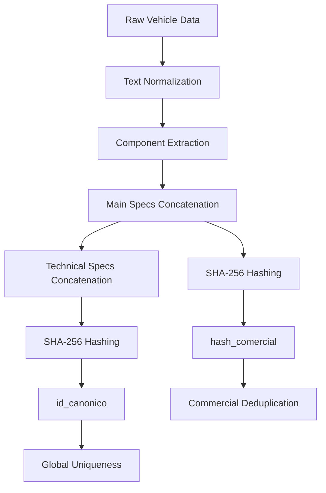
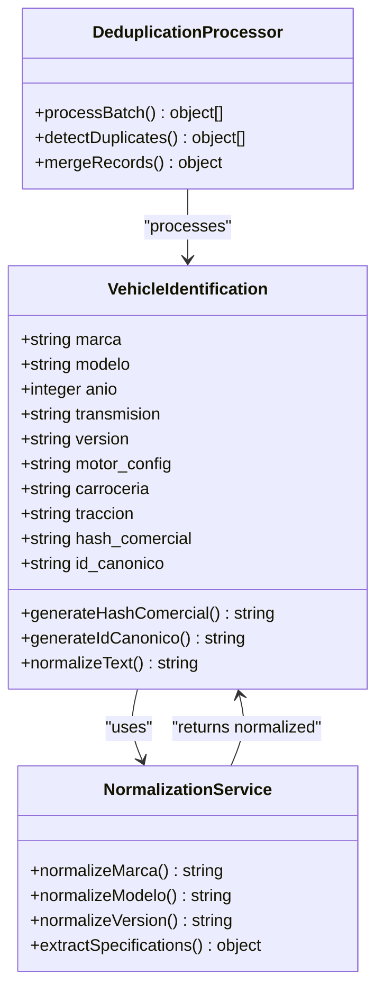
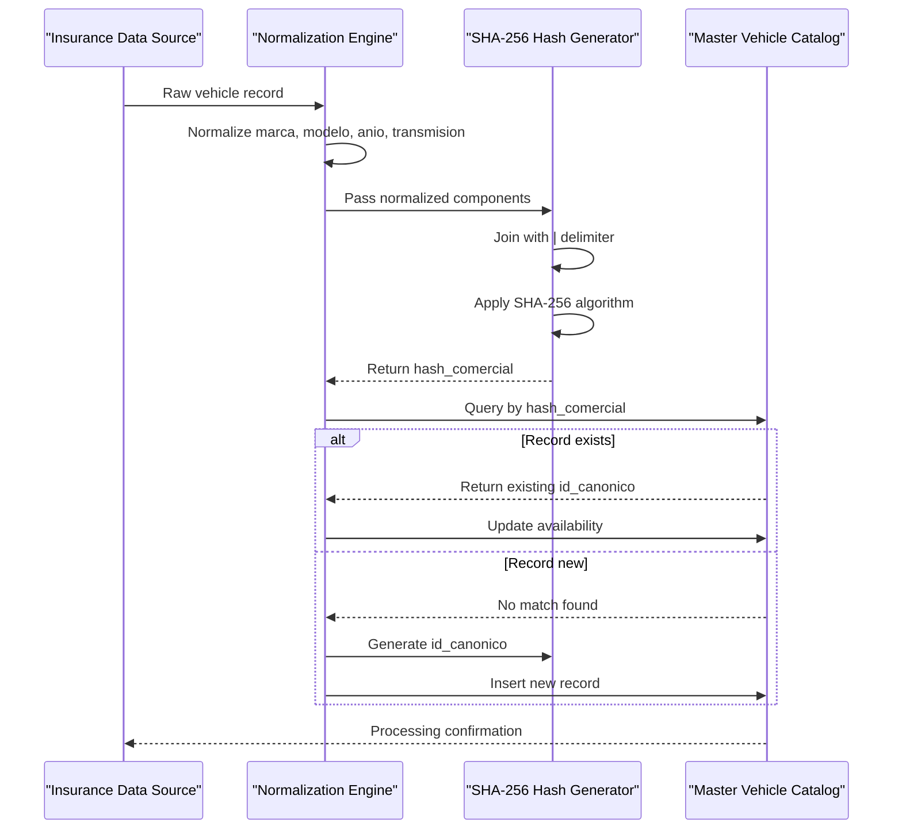
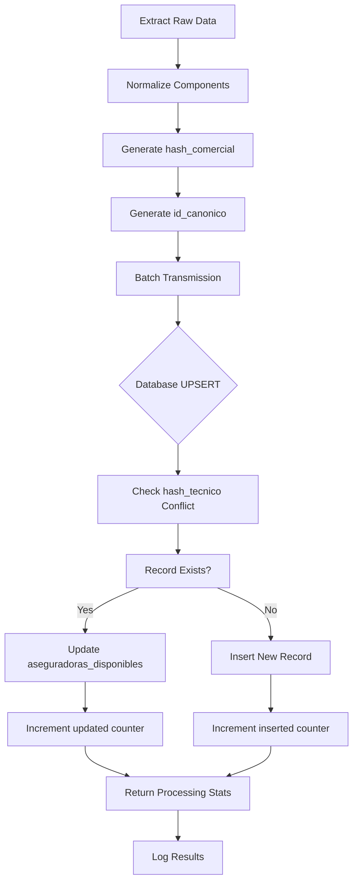

# Hash-Based Deduplication

<cite>
**Referenced Files in This Document**   
- [gnp-codigo-de-normalizacion.js](file://src/insurers/gnp/gnp-codigo-de-normalizacion.js)
- [hdi-codigo-de-normalizacion.js](file://src/insurers/hdi/hdi-codigo-de-normalizacion.js)
- [Funcion RPC.sql](file://src/supabase/Funcion RPC.sql)
- [Tabla maestra.sql](file://src/supabase/Tabla maestra.sql)
- [Replanteamiento homologacion.md](file://src/supabase/Replanteamiento homologacion.md)
- [instrucciones.md](file://instrucciones.md)
</cite>

## Table of Contents
1. [Introduction](#introduction)
2. [Core Hashing Strategy](#core-hashing-strategy)
3. [id_canonico Generation](#id_canonico-generation)
4. [hash_comercial Calculation](#hash_comercial-calculation)
5. [Batch Processing Workflow](#batch-processing-workflow)
6. [Normalization Implementation](#normalization-implementation)
7. [Collision Resistance and Performance](#collision-resistance-and-performance)
8. [Edge Case Handling](#edge-case-handling)
9. [Best Practices](#best-practices)
10. [Conclusion](#conclusion)

## Introduction

The homologacion-ukuvi system implements a sophisticated hash-based deduplication strategy to ensure data integrity and eliminate redundant vehicle records across multiple insurance providers. This documentation details the technical implementation of the hashing mechanism, focusing on the generation of globally unique identifiers and commercial duplicate detection. The system processes vehicle data from various insurers, normalizes the information, and applies SHA-256 hashing to create consistent identifiers that enable efficient deduplication during batch processing.

**Section sources**
- [instrucciones.md](file://instrucciones.md#L99-L106)
- [Replanteamiento homologacion.md](file://src/supabase/Replanteamiento homologacion.md#L99-L106)

## Core Hashing Strategy

The homologacion-ukuvi system employs a dual-hash strategy combining SHA-256 hashing with comprehensive text normalization to achieve robust deduplication. The approach uses two distinct hash types: `id_canonico` for global uniqueness and `hash_comercial` for commercial duplicate detection. Both hashes are generated using the same underlying `generarHash` function that applies SHA-256 to normalized component strings joined with pipe delimiters.

The hashing process begins with extensive text normalization, which standardizes input data by converting to uppercase, removing accents, eliminating special characters, and collapsing multiple spaces. This ensures consistent input for the hash function regardless of variations in source data formatting. The normalized components are then filtered to remove null or empty values before being joined and hashed.

**Diagram sources**
- [gnp-codigo-de-normalizacion.js](file://src/insurers/gnp/gnp-codigo-de-normalizacion.js#L33-L43)
- [hdi-codigo-de-normalizacion.js](file://src/insurers/hdi/hdi-codigo-de-normalizacion.js#L31-L41)
- [gnp-codigo-de-normalizacion.js](file://src/insurers/gnp/gnp-codigo-de-normalizacion.js#L48-L54)

**Section sources**
- [gnp-codigo-de-normalizacion.js](file://src/insurers/gnp/gnp-codigo-de-normalizacion.js#L33-L54)
- [hdi-codigo-de-normalizacion.js](file://src/insurers/hdi/hdi-codigo-de-normalizacion.js#L31-L70)

## id_canonico Generation

The `id_canonico` serves as a globally unique identifier for each vehicle configuration in the homologacion-ukuvi system. It is generated using SHA-256 hashing of a comprehensive set of normalized vehicle attributes that define a unique technical specification. The identifier ensures that identical vehicle configurations from different insurers are recognized as the same entity in the master catalog.

The generation process combines the commercial hash with detailed technical specifications including trim level, engine configuration, body type, and drivetrain. This multi-layered approach creates a highly specific fingerprint that minimizes collision risk while maintaining consistency across processing cycles. The `id_canonico` is implemented as the primary key in the master vehicle table, enforcing referential integrity and enabling efficient lookups.

**Diagram sources**
- [Tabla maestra.sql](file://src/supabase/Tabla maestra.sql#L1-L100)
- [gnp-codigo-de-normalizacion.js](file://src/insurers/gnp/gnp-codigo-de-normalizacion.js#L540-L570)
- [elpotosi-codigo-de-normalizacion.js](file://src/insurers/elpotosi/elpotosi-codigo-de-normalizacion.js#L536-L597)

**Section sources**
- [Tabla maestra.sql](file://src/supabase/Tabla maestra.sql#L1-L100)
- [instrucciones.md](file://instrucciones.md#L99-L106)
- [Replanteamiento homologacion.md](file://src/supabase/Replanteamiento homologacion.md#L99-L106)

## hash_comercial Calculation

The `hash_comercial` is designed to detect commercial duplicates within insurer contexts by focusing on the core commercial attributes of a vehicle. This hash is generated from four key normalized components: brand, model, year, and transmission. By excluding technical specifications like trim level and engine configuration, the `hash_comercial` identifies vehicles that are commercially equivalent even if they have minor technical variations.

The calculation follows a consistent pattern across all insurer implementations, using the same `generarHash` function with normalized inputs. The components are first normalized using standardized text processing that converts to uppercase, removes accents, and eliminates special characters. Null values are replaced with "null" string representations to ensure consistent hashing behavior. The resulting hash serves as a reliable indicator of commercial equivalence, enabling the system to group similar vehicles for pricing and availability analysis.

**Diagram sources**
- [gnp-codigo-de-normalizacion.js](file://src/insurers/gnp/gnp-codigo-de-normalizacion.js#L540-L570)
- [hdi-codigo-de-normalizacion.js](file://src/insurers/hdi/hdi-codigo-de-normalizacion.js#L657-L716)
- [Funcion RPC.sql](file://src/supabase/Funcion RPC.sql#L1-L96)

**Section sources**
- [gnp-codigo-de-normalizacion.js](file://src/insurers/gnp/gnp-codigo-de-normalizacion.js#L540-L570)
- [hdi-codigo-de-normalizacion.js](file://src/insurers/hdi/hdi-codigo-de-normalizacion.js#L657-L716)
- [instrucciones.md](file://instrucciones.md#L99-L106)

## Batch Processing Workflow

The batch processing workflow in the homologacion-ukuvi system leverages the hash-based deduplication strategy to efficiently process large volumes of vehicle data while eliminating redundant records. The process begins with data extraction from insurer sources, followed by normalization and hash generation for each record. The system then uses these hashes to identify duplicates before inserting or updating records in the master catalog.

The core of the batch processing is implemented in the PostgreSQL function `procesar_batch_completo`, which uses an UPSERT operation to handle both insertions and updates atomically. When processing a batch, the function checks for existing records using the `hash_tecnico` (equivalent to `id_canonico`) as the conflict key. If a record with the same hash exists, the system updates the availability information to include the new insurer rather than creating a duplicate entry.

**Diagram sources**
- [Funcion RPC.sql](file://src/supabase/Funcion RPC.sql#L1-L96)
- [gnp-codigo-de-normalizacion.js](file://src/insurers/gnp/gnp-codigo-de-normalizacion.js#L540-L717)
- [hdi-codigo-de-normalizacion.js](file://src/insurers/hdi/hdi-codigo-de-normalizacion.js#L657-L716)

**Section sources**
- [Funcion RPC.sql](file://src/supabase/Funcion RPC.sql#L1-L96)
- [gnp-codigo-de-normalizacion.js](file://src/insurers/gnp/gnp-codigo-de-normalizacion.js#L540-L717)

## Normalization Implementation

The normalization implementation across insurer-specific scripts follows a consistent pattern while accommodating the unique data quality challenges of each source. The JavaScript code examples from GNP and HDI normalization scripts demonstrate the shared core functions for text normalization and hash generation, while implementing insurer-specific logic for handling data contamination and extraction of technical specifications.

Both GNP and HDI scripts use identical `normalizarTexto` and `generarHash` functions, ensuring consistency in the fundamental processing steps. The text normalization process converts input to uppercase, removes accents using Unicode normalization, eliminates special characters, and collapses multiple spaces. The hash generation function filters out null components, joins the remaining values with pipe delimiters, and applies SHA-256 hashing to create a fixed-length hexadecimal string.

The insurer-specific implementations differ primarily in their approaches to extracting trim levels and technical specifications from the source data. GNP's implementation includes aggressive contamination detection to handle records where the version field contains brand names from other manufacturers. HDI's implementation features a multi-step cleaning process that systematically removes transmission types, body styles, and other non-essential information from the version field before extracting the trim level.

**Section sources**
- [gnp-codigo-de-normalizacion.js](file://src/insurers/gnp/gnp-codigo-de-normalizacion.js#L33-L717)
- [hdi-codigo-de-normalizacion.js](file://src/insurers/hdi/hdi-codigo-de-normalizacion.js#L31-L716)

## Collision Resistance and Performance

The hash-based deduplication strategy in the homologacion-ukuvi system achieves high collision resistance through the use of SHA-256, a cryptographic hash function with a 256-bit output space. With 2^256 possible hash values, the probability of accidental collisions is negligible for the scale of vehicle data processed by the system. The design further reduces collision risk by incorporating comprehensive normalization that standardizes input variations.

Performance considerations are addressed through several optimization strategies. The system processes data in batches rather than individual records, reducing database transaction overhead. Indexes on the `hash_comercial` and `hash_tecnico` fields enable O(log n) lookup times, making duplicate detection efficient even with large datasets. The use of UPSERT operations in the database layer minimizes the number of round trips required for insert/update operations.

For large-scale processing, the system can handle batches of up to 50,000 records, though performance monitoring suggests that reducing batch sizes to 10,000 records can prevent RPC timeouts in high-load scenarios. The computational cost of SHA-256 hashing is minimal compared to the overall processing time, with modern processors capable of computing millions of hashes per second. The primary performance bottleneck is typically database I/O rather than hash computation.

**Section sources**
- [WARP.md](file://WARP.md#L318-L374)
- [Funcion RPC.sql](file://src/supabase/Funcion RPC.sql#L1-L96)
- [Tabla maestra.sql](file://src/supabase/Tabla maestra.sql#L1-L100)

## Edge Case Handling

The homologacion-ukuvi system implements robust edge case handling to maintain data integrity in the presence of inconsistent or low-quality source data. Key challenges include handling typos, inconsistent trim naming conventions, missing values, and data contamination across insurer datasets. The system addresses these issues through a combination of normalization rules, validation checks, and fallback strategies.

For typos and spelling variations, the normalization process includes synonym dictionaries that map common misspellings and abbreviations to standardized values. For example, "MERCEDES-BENZ", "MERCEDES", and "MB" are all normalized to "MERCEDES BENZ". Inconsistent trim naming is handled through comprehensive lists of valid trim levels for each insurer, allowing the system to identify and standardize trim designations even when they appear in non-standard formats.

Data contamination, particularly in the GNP dataset where approximately 8% of records contain incorrect brand information in the version field, is addressed through targeted cleaning functions that detect and remove contaminating brand names. Missing values are handled by including "null" string representations in the hash components, ensuring consistent behavior when optional fields are absent. The system also includes extensive logging to track data quality issues and processing anomalies for ongoing improvement.

**Section sources**
- [gnp-codigo-de-normalizacion.js](file://src/insurers/gnp/gnp-codigo-de-normalizacion.js#L220-L310)
- [hdi-codigo-de-normalizacion.js](file://src/insurers/hdi/hdi-codigo-de-normalizacion.js#L300-L650)
- [WARP.md](file://WARP.md#L318-L374)

## Best Practices

Maintaining hash consistency across processing cycles in the homologacion-ukuvi system requires adherence to several best practices. First and foremost, the normalization logic must remain stable between processing cycles to ensure that identical input data produces identical hashes. Any changes to normalization rules should be implemented as new processing versions rather than modifications to existing logic, preserving the integrity of historical data.

Regular validation of hash consistency is essential. The system should periodically verify that `id_canonico` values match the expected SHA-256 hash of their component fields, using queries like those specified in the WARP.md documentation. This helps detect any issues with data corruption or processing errors. Additionally, monitoring for unexpected duplicate counts can reveal problems with the normalization or hashing logic.

When onboarding new insurers or updating existing integrations, thorough testing with representative data samples is critical. This includes verifying that the normalization process handles edge cases appropriately and that the resulting hashes produce the expected deduplication behavior. The system should also maintain comprehensive logging of processing statistics, including counts of inserted, updated, and omitted records, to facilitate ongoing monitoring and optimization.

**Section sources**
- [WARP.md](file://WARP.md#L318-L374)
- [instrucciones.md](file://instrucciones.md#L99-L106)
- [Replanteamiento homologacion.md](file://src/supabase/Replanteamiento homologacion.md#L99-L106)

## Conclusion

The hash-based deduplication strategy implemented in the homologacion-ukuvi system provides a robust solution for managing vehicle data across multiple insurance providers. By combining SHA-256 hashing with comprehensive text normalization, the system creates consistent identifiers that enable efficient duplicate detection and elimination. The dual-hash approach, with `id_canonico` for global uniqueness and `hash_comercial` for commercial equivalence, balances specificity with flexibility in data matching.

The implementation demonstrates careful consideration of real-world data quality challenges, with insurer-specific normalization logic that addresses contamination, inconsistent formatting, and missing values. The batch processing workflow efficiently handles large volumes of data while maintaining referential integrity through atomic UPSERT operations. Performance optimizations, including database indexing and batch processing, ensure scalability to the system's operational requirements.

Ongoing monitoring and adherence to best practices will be essential to maintain the effectiveness of the deduplication strategy as new insurers are onboarded and existing integrations evolve. The comprehensive logging and validation mechanisms provide a solid foundation for continuous improvement and troubleshooting of data quality issues.