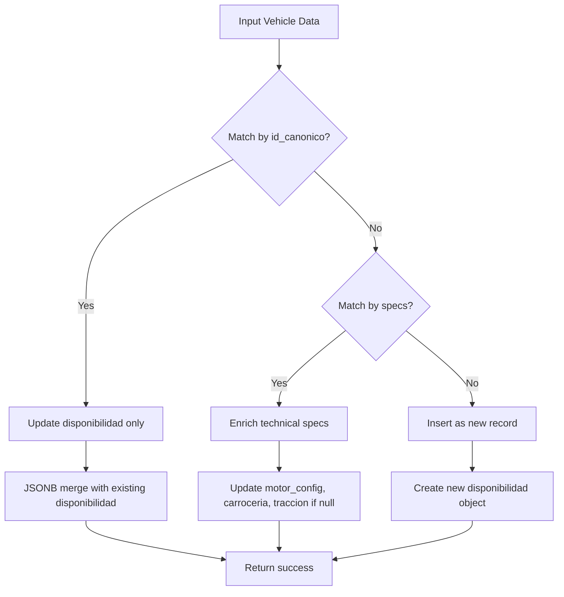

# Idempotent Processing

<cite>
**Referenced Files in This Document**   
- [Funcion RPC Nueva.sql](file://src/supabase/Funcion RPC Nueva.sql)
- [Replanteamiento homologacion.md](file://src/supabase/Replanteamiento homologacion.md)
- [qualitas-analisis.md](file://src/insurers/qualitas/qualitas-analisis.md)
- [hdi-analisis.md](file://src/insurers/hdi/hdi-analisis.md)
- [axa-analisis.md](file://src/insurers/axa/axa-analisis.md)
- [gnp-analisis.md](file://src/insurers/gnp/gnp-analisis.md)
- [zurich-analisis.md](file://src/insurers/zurich/zurich-analisis.md)
- [mapfre-analisis.md](file://src/insurers/mapfre/mapfre-analisis.md)
- [chubb-analisis.md](file://src/insurers/chubb/chubb-analisis.md)
</cite>

## Table of Contents
1. [Introduction](#introduction)
2. [Idempotent Processing Design](#idempotent-processing-design)
3. [Conflict Detection with hash_comercial and id_canonico](#conflict-detection-with-hash_comercial-and-id_canonico)
4. [Upsert Logic and JSONB Merging](#upsert-logic-and-jsonb-merging)
5. [Fault-Tolerant Workflows in n8n](#fault-tolerant-workflows-in-n8n)
6. [Edge Case Handling](#edge-case-handling)
7. [Debugging and Monitoring](#debugging-and-monitoring)
8. [Conclusion](#conclusion)

## Introduction

The homologacion-ukuvi system implements a robust idempotent processing design through its `procesar_batch_homologacion` RPC function. This design ensures safe reprocessing of data batches without creating duplicates or corrupting state, which is critical for maintaining data integrity across multiple insurance providers. The system processes vehicle catalog data from various insurers including Qualitas, HDI, AXA, GNP, Mapfre, Chubb, Zurich, Atlas, BX, El Potosí, and ANA, normalizing them into a canonical model. The idempotent nature of the processing allows for fault-tolerant workflows, particularly in n8n pipelines where partial failures can occur. This document details the mechanisms that enable this idempotency, focusing on conflict detection using `hash_comercial` and `id_canonico`, the upsert logic with JSONB merging for availability updates, and strategies for handling edge cases and monitoring production runs.

**Section sources**
- [Replanteamiento homologacion.md](file://src/supabase/Replanteamiento homologacion.md#L1-L20)

## Idempotent Processing Design

The `procesar_batch_homologacion` function is designed to be idempotent, meaning that re-executing the same batch will not create additional changes or duplicates. This is achieved through a multi-step process that begins with validation and extraction of input data. The function accepts a JSONB parameter containing vehicle data and first validates that it contains an array of vehicles. It then stages the data in a temporary table where it normalizes and processes the input. The core of the idempotent design lies in the matching strategy that determines how incoming vehicles relate to existing records in the `catalogo_homologado` table. The function uses two primary matching strategies: exact match by `id_canonico` and compatibility matching based on technical specifications. When a vehicle matches by `id_canonico`, it triggers an availability update. When a vehicle matches by technical specifications but lacks the `id_canonico`, it triggers an enrichment process. Vehicles that don't match any existing records are inserted as new entries. This design ensures that reprocessing the same batch will follow the same decision path, resulting in identical outcomes regardless of how many times it is executed. The function also includes comprehensive error handling and returns detailed metrics about the processing results, including counts of received, staged, processed, and conflicted vehicles.

**Section sources**
- [Funcion RPC Nueva.sql](file://src/supabase/Funcion RPC Nueva.sql#L1-L100)

## Conflict Detection with hash_comercial and id_canonico

The system employs a sophisticated conflict detection mechanism using both `hash_comercial` and `id_canonico` identifiers to ensure data consistency. The `hash_comercial` is calculated as a SHA-256 hash of normalized values including marca, modelo, anio, and transmision, serving as a commercial identifier for the vehicle. The `id_canonico` is a more comprehensive identifier calculated as a SHA-256 hash of `hash_comercial` combined with version, motor_config, carroceria, and traccion, providing a unique canonical identifier that accounts for technical specifications. During processing, the system first attempts to match vehicles by `id_canonico`, which indicates an exact match with an existing record. If no `id_canonico` match is found, the system performs a compatibility check based on technical specifications. This two-tiered approach allows the system to detect conflicts where incoming data differs from existing records in critical fields. The function specifically checks for conflicts in transmision, version, carroceria, motor_config, and traccion, generating warnings when such conflicts are detected. This prevents the system from silently overwriting conflicting data and alerts operators to potential data quality issues. The use of these hash-based identifiers ensures that the same vehicle from the same insurer will always generate the same identifiers, enabling reliable conflict detection across reprocessing events.

**Section sources**
- [Replanteamiento homologacion.md](file://src/supabase/Replanteamiento homologacion.md#L100-L150)
- [Funcion RPC Nueva.sql](file://src/supabase/Funcion RPC Nueva.sql#L150-L250)

## Upsert Logic and JSONB Merging

The upsert logic in the `procesar_batch_homologacion` function implements a sophisticated JSONB merging strategy for availability updates, ensuring that data from different insurers is preserved without overwriting. When a vehicle matches by `id_canonico`, the function updates only the `disponibilidad` field, merging the new insurer's data with existing availability information. This is accomplished using the JSONB concatenation operator (`||`), which combines the existing availability JSONB object with the new insurer's data. Each insurer's availability information is stored as a nested object within the `disponibilidad` field, containing the active status, original ID, original version, and update timestamp. This approach allows multiple insurers to report on the same vehicle without conflict, preserving the history and status from each source. For new vehicles, the function creates a fresh `disponibilidad` object containing only the current insurer's data. The merging logic also updates the `confianza_score` field, incrementing it slightly to reflect the additional data source. This upsert strategy ensures that reprocessing the same batch will result in identical availability data, as the JSONB merge operation is deterministic. The function also handles enrichment scenarios where a vehicle's technical specifications can be improved based on incoming data, updating fields like motor_config, carroceria, and traccion only when they are currently null.

**Diagram sources**
- [Funcion RPC Nueva.sql](file://src/supabase/Funcion RPC Nueva.sql#L300-L400)

## Fault-Tolerant Workflows in n8n

The idempotent design of the `procesar_batch_homologacion` function enables fault-tolerant workflows in n8n pipelines, allowing recovery from partial failures without data corruption. In the n8n workflow, data is extracted from each insurer's source, normalized into the canonical format, and processed in batches before being sent to the Supabase RPC function. If a batch fails during transmission or processing, the entire batch can be safely reprocessed without creating duplicates or inconsistent state. This is possible because the function's idempotent nature ensures that reprocessing will follow the same decision path as the original processing. The n8n workflow includes a deduplication step that removes duplicates by `id_canonico` before sending data to Supabase, further ensuring data consistency. The system also implements retry logic with exponential backoff for handling transient failures such as rate limiting (429) or server errors (5xx). Each batch request includes appropriate headers including the service role JWT for authentication and the `Prefer: return=minimal` header to optimize performance. The response from the RPC function includes detailed metrics about the processing results, which are logged by n8n for monitoring and auditing purposes. This fault-tolerant design allows the system to handle network interruptions, temporary database issues, or other transient problems without requiring manual intervention to clean up duplicate records or repair corrupted data.

**Section sources**
- [Replanteamiento homologacion.md](file://src/supabase/Replanteamiento homologacion.md#L200-L250)

## Edge Case Handling

The system includes comprehensive edge case handling to manage complex scenarios such as conflicting active/inactive statuses and multiple potential matches. When a vehicle has multiple potential matches in the catalog (multiple vehicles with compatible specifications), the function treats this as a special case and creates a new record rather than attempting to match with any of the existing records. This conservative approach prevents incorrect associations and maintains data integrity. The function also detects and reports conflicts where incoming data differs from existing records in critical fields such as transmision, version, carroceria, motor_config, or traccion. These conflicts are included in the response as warnings, allowing operators to investigate and resolve data quality issues. For vehicles with conflicting active/inactive statuses across different insurers, the system does not attempt to resolve the conflict automatically. Instead, it preserves the status from each insurer in the `disponibilidad` field, allowing downstream processes to implement their own conflict resolution logic based on business rules. The function also handles cases where technical specifications in the incoming data could overwrite existing data, only allowing enrichment (filling null values) rather than replacement. This prevents a less complete data source from degrading the quality of existing records. The system's conservative approach to edge cases prioritizes data preservation and integrity over automatic resolution, providing transparency into potential data quality issues.

**Section sources**
- [Funcion RPC Nueva.sql](file://src/supabase/Funcion RPC Nueva.sql#L250-L350)

## Debugging and Monitoring

Effective debugging and monitoring strategies are essential for verifying idempotency in production runs and maintaining system reliability. The `procesar_batch_homologacion` function includes comprehensive logging and metrics reporting to support these activities. The function returns detailed statistics about each batch processed, including counts of received, staged, new, enriched, updated, and conflicted vehicles. These metrics provide immediate feedback on the processing results and can be used to detect anomalies or unexpected behavior. The function also returns arrays of warnings and errors, with warnings including information about multiple potential matches and conflicts with existing records. These warnings help identify data quality issues that may require investigation or resolution. For debugging purposes, the temporary table structure and step-by-step processing logic make it possible to trace the decision path for each vehicle, understanding why it was classified as new, updated, or enriched. Monitoring production runs should focus on tracking the ratio of new vs. updated vs. enriched vehicles over time, as significant changes in these ratios may indicate data quality issues or changes in source systems. Additionally, monitoring the frequency and nature of warnings can help identify systemic data quality problems that need to be addressed. The system's idempotent design means that debugging can be performed by reprocessing batches in a controlled environment without risk of data corruption, facilitating root cause analysis and resolution of issues.

**Section sources**
- [Funcion RPC Nueva.sql](file://src/supabase/Funcion RPC Nueva.sql#L400-L428)

## Conclusion

The idempotent processing design in the homologacion-ukuvi system provides a robust foundation for maintaining data integrity across multiple insurance providers. Through the use of hash-based identifiers (`hash_comercial` and `id_canonico`), sophisticated conflict detection, and careful upsert logic with JSONB merging, the system ensures that reprocessing data batches will not create duplicates or corrupt state. This design enables fault-tolerant workflows in n8n pipelines, allowing recovery from partial failures without manual intervention. The system's conservative approach to edge cases, including multiple potential matches and conflicting statuses, prioritizes data preservation and integrity. Comprehensive debugging and monitoring capabilities provide visibility into processing results and help maintain system reliability. The combination of these features creates a resilient data integration pipeline that can handle the complexities of vehicle catalog data from diverse sources while maintaining high data quality and consistency. This idempotent design pattern serves as a model for similar data integration challenges where reliability and data integrity are paramount.