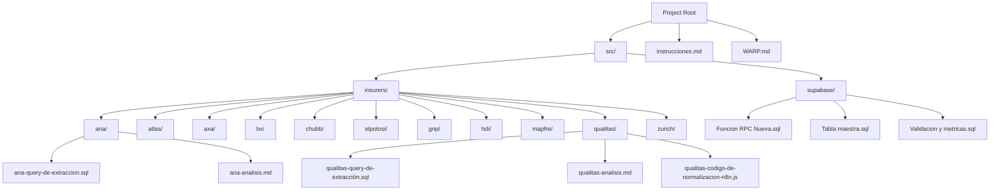
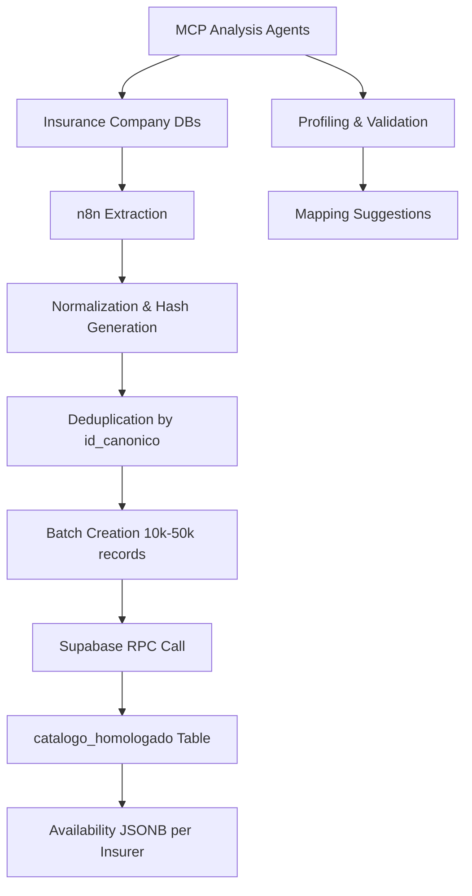
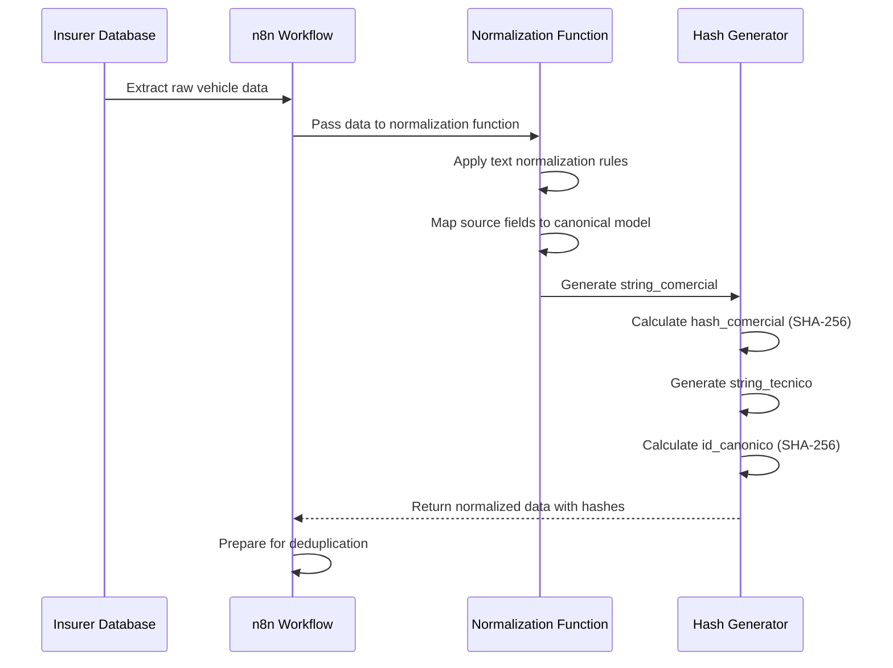
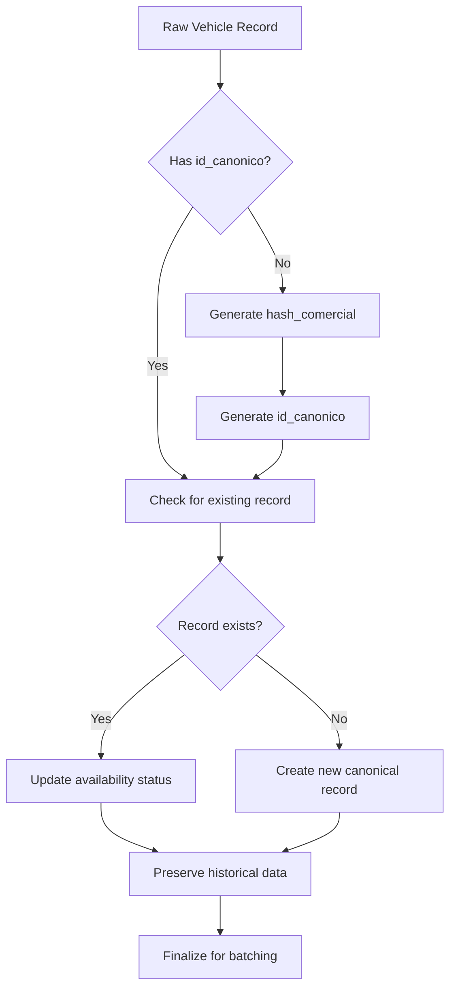
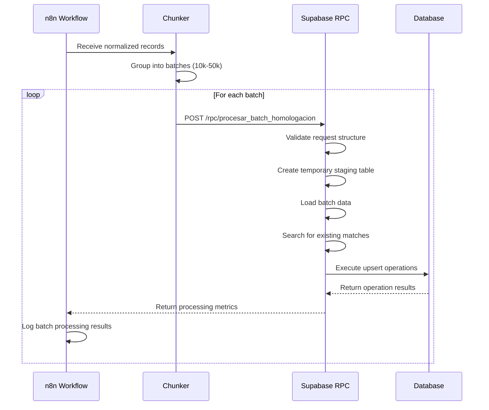
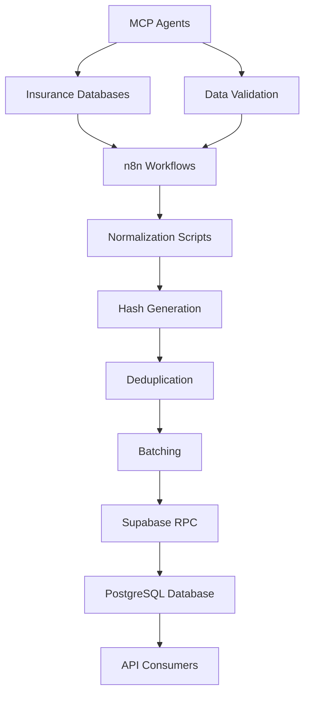

# Data Flow Topology

<cite>
**Referenced Files in This Document**   
- [instrucciones.md](file://instrucciones.md)
- [WARP.md](file://WARP.md)
- [src/supabase/Tabla maestra.sql](file://src/supabase/Tabla maestra.sql)
- [src/supabase/Funcion RPC Nueva.sql](file://src/supabase/Funcion RPC Nueva.sql)
- [src/insurers/qualitas/qualitas-codigo-de-normalizacion-n8n.js](file://src/insurers/qualitas/qualitas-codigo-de-normalizacion-n8n.js)
- [src/insurers/elpotosi/elpotosi-codigo-de-normalizacion.js](file://src/insurers/elpotosi/elpotosi-codigo-de-normalizacion.js)
- [src/insurers/gnp/gnp-codigo-de-normalizacion.js](file://src/insurers/gnp/gnp-codigo-de-normalizacion.js)
- [src/insurers/hdi/hdi-codigo-de-normalizacion.js](file://src/insurers/hdi/hdi-codigo-de-normalizacion.js)
- [src/insurers/zurich/zurich-codigo-de-normalizacion.js](file://src/insurers/zurich/zurich-codigo-de-normalizacion.js)
</cite>

## Table of Contents
1. [Introduction](#introduction)
2. [Project Structure](#project-structure)
3. [Core Components](#core-components)
4. [Architecture Overview](#architecture-overview)
5. [Detailed Component Analysis](#detailed-component-analysis)
6. [Dependency Analysis](#dependency-analysis)
7. [Performance Considerations](#performance-considerations)
8. [Troubleshooting Guide](#troubleshooting-guide)
9. [Conclusion](#conclusion)

## Introduction
This document provides comprehensive architectural documentation for the end-to-end data flow in the homologacion-ukuvi system. The system unifies vehicle catalogs from multiple Mexican insurance companies into a single canonical model with complete traceability, active/inactive status control, and reproducible ingestion and update flows. The documentation maps the complete pathway from source insurer databases through extraction, normalization, batching, and final persistence, detailing each phase of the data transformation process.

## Project Structure

The homologacion-ukuvi system follows a modular structure organized by functional components and insurer-specific implementations. The architecture separates concerns between data extraction, normalization logic, and persistence layers.



**Diagram sources**
- [instrucciones.md](file://instrucciones.md)
- [WARP.md](file://WARP.md)

**Section sources**
- [instrucciones.md](file://instrucciones.md)
- [WARP.md](file://WARP.md)

## Core Components

The homologacion-ukuvi system consists of four main components that work together to achieve vehicle catalog homologation: source databases, n8n for normalization and orchestration, Supabase for persistence and API, and MCP agents for analysis and validation. The system's objective is to create and maintain a unified vehicle catalog that consolidates data from 11 insurance providers into a canonical model with complete traceability.

The data flow begins with SQL-based extraction from insurer databases, followed by JavaScript-based normalization in n8n workflows where SHA-256 hashes are generated for both commercial and technical specifications. Deduplication occurs at the `id_canonico` level before data is batched and sent via Supabase RPC calls for upsert operations into the `catalogo_homologado` table. The system supports traceability through the `disponibilidad` JSONB field that maintains insurer-specific metadata, enables rollback through idempotent processing, and facilitates incremental updates by preserving historical status changes.

**Section sources**
- [instrucciones.md](file://instrucciones.md)
- [WARP.md](file://WARP.md)

## Architecture Overview

The homologacion-ukuvi system implements a robust data pipeline that transforms heterogeneous vehicle catalog data from multiple insurers into a unified canonical model. The architecture follows an extract-transform-load pattern with additional normalization, deduplication, and reconciliation capabilities.



**Diagram sources**
- [WARP.md](file://WARP.md)

## Detailed Component Analysis

### Data Extraction Phase
The data extraction phase involves retrieving vehicle catalog data from 11 different insurance company databases using insurer-specific SQL queries. Each insurer directory in the `src/insurers/` folder contains a SQL file named `*-query-de-extraccion.sql` that defines the extraction logic for that specific provider. The queries target various table structures across insurers, such as `ana.NMarca`, `atlas.Marca`, `axa.Linea`, `bx.Marca`, `chubb.NMarca`, `elpotosi.Marca`, `gnp.Armadora`, `hdi.Marca`, `mapfre.Marca`, `qualitas.Marca`, and `zurich.Marcas`. These extraction queries are designed to retrieve the fundamental vehicle attributes including brand, model, version, transmission, and other technical specifications required for homologation.

**Section sources**
- [instrucciones.md](file://instrucciones.md)

### Normalization and Transformation Phase
The normalization phase occurs within n8n workflows using JavaScript functions that transform raw insurer data into the canonical format. This phase is critical for ensuring consistency across disparate data sources and involves several key operations: text normalization, hash generation, and field mapping. The system employs insurer-specific normalization scripts such as `qualitas-codigo-de-normalizacion-n8n.js`, `elpotosi-codigo-de-normalizacion.js`, `gnp-codigo-de-normalizacion.js`, `hdi-codigo-de-normalizacion.js`, and `zurich-codigo-de-normalizacion.js` to handle the unique characteristics of each insurer's data format.



**Diagram sources**
- [src/insurers/qualitas/qualitas-codigo-de-normalizacion-n8n.js](file://src/insurers/qualitas/qualitas-codigo-de-normalizacion-n8n.js)
- [src/insurers/elpotosi/elpotosi-codigo-de-normalizacion.js](file://src/insurers/elpotosi/elpotosi-codigo-de-normalizacion.js)
- [src/insurers/gnp/gnp-codigo-de-normalizacion.js](file://src/insurers/gnp/gnp-codigo-de-normalizacion.js)
- [src/insurers/hdi/hdi-codigo-de-normalizacion.js](file://src/insurers/hdi/hdi-codigo-de-normalizacion.js)
- [src/insurers/zurich/zurich-codigo-de-normalizacion.js](file://src/insurers/zurich/zurich-codigo-de-normalizacion.js)

**Section sources**
- [src/insurers/qualitas/qualitas-codigo-de-normalizacion-n8n.js](file://src/insurers/qualitas/qualitas-codigo-de-normalizacion-n8n.js)
- [src/insurers/elpotosi/elpotosi-codigo-de-normalizacion.js](file://src/insurers/elpotosi/elpotosi-codigo-de-normalizacion.js)
- [src/insurers/gnp/gnp-codigo-de-normalizacion.js](file://src/insurers/gnp/gnp-codigo-de-normalizacion.js)
- [src/insurers/hdi/hdi-codigo-de-normalizacion.js](file://src/insurers/hdi/hdi-codigo-de-normalizacion.js)
- [src/insurers/zurich/zurich-codigo-de-normalizacion.js](file://src/insurers/zurich/zurich-codigo-de-normalizacion.js)

### Hash Generation and Deduplication
The system implements a sophisticated hashing strategy to ensure data integrity and enable efficient deduplication. Two primary hash values are generated for each vehicle record: `hash_comercial` and `id_canonico`. The `hash_comercial` is calculated as the SHA-256 hash of the normalized commercial string `(marca|modelo|anio|transmision)`, while the `id_canonico` is derived from the SHA-256 hash of `(hash_comercial|version|motor_config|carroceria|traccion)`. This hierarchical hashing approach allows the system to identify both commercial equivalents and technically identical vehicles across insurers.

Deduplication occurs in the n8n workflow before data is batched, using the `id_canonico` as the primary key for identifying duplicates. When duplicates are detected, the system retains the most recent version based on the source's `fecha_actualizacion` timestamp. This ensures that the canonical catalog always reflects the latest available information from each insurer while preserving historical data through the availability tracking mechanism.



**Diagram sources**
- [instrucciones.md](file://instrucciones.md)

### Batching and RPC Processing
The batching phase divides normalized vehicle records into manageable chunks of 10,000 to 50,000 records before transmission to Supabase via RPC calls. This batching strategy balances performance considerations with system reliability, preventing timeouts and memory issues during large data loads. The n8n workflow orchestrates this process, grouping records into batches and making sequential HTTP requests to the Supabase RPC endpoint.

The Supabase RPC function `procesar_batch_homologacion` handles the upsert operation with idempotent semantics, ensuring that reprocessing the same batch does not create unintended changes. The function implements a comprehensive processing pipeline that includes validation, staging, matching, and conflict resolution. It returns detailed metrics about the processing outcome, including counts of inserted, updated, and conflicted records, along with any warnings or errors encountered during execution.



**Diagram sources**
- [src/supabase/Funcion RPC Nueva.sql](file://src/supabase/Funcion RPC Nueva.sql)

### Persistence and Data Model
The persistence layer is implemented in Supabase using PostgreSQL as the underlying database engine. The core of the system is the `catalogo_homologado` table, which stores the canonical vehicle catalog with comprehensive traceability information. The table structure includes both normalized vehicle attributes and insurer-specific availability data in a JSONB column, enabling flexible querying and efficient storage.

The data model supports the system's key requirements for traceability, rollback, and incremental updates. Each record maintains an `id_canonico` that serves as the primary identifier, while the `disponibilidad` JSONB field tracks the status, original ID, version string, and last update timestamp for each insurer. This design allows the system to preserve historical information when vehicles are deactivated by insurers, supporting both audit requirements and potential reactivation scenarios.

```mermaid
erDiagram
catalogo_homologado {
BIGSERIAL id PK
VARCHAR(64) id_canonico UK
VARCHAR(64) hash_comercial
TEXT string_comercial
TEXT string_tecnico
VARCHAR(100) marca
VARCHAR(150) modelo
INTEGER anio
VARCHAR(20) transmision
VARCHAR(200) version
VARCHAR(50) motor_config
VARCHAR(50) carroceria
VARCHAR(20) traccion
JSONB disponibilidad
DECIMAL(3,2) confianza_score
TIMESTAMP fecha_creacion
TIMESTAMP fecha_actualizacion
}
```

**Diagram sources**
- [src/supabase/Tabla maestra.sql](file://src/supabase/Tabla maestra.sql)

## Dependency Analysis

The homologacion-ukuvi system exhibits a well-defined dependency structure that follows the principle of separation of concerns. The primary dependencies flow from data sources through processing components to the persistence layer, with analysis agents providing feedback to improve data quality.



**Diagram sources**
- [instrucciones.md](file://instrucciones.md)
- [WARP.md](file://WARP.md)

## Performance Considerations
The system incorporates several performance optimizations to handle large volumes of vehicle catalog data efficiently. The batching strategy of 10,000 to 50,000 records per RPC call balances network overhead with database transaction performance. The use of SHA-256 hashes as primary identifiers enables fast lookups and efficient deduplication. Database indexing strategies, including GIN indexes on JSONB columns and composite indexes on frequently queried attributes, support rapid data retrieval.

The idempotent design of the RPC function allows for safe retry mechanisms in case of transient failures, ensuring data integrity without requiring complex rollback procedures. The system's modular architecture enables horizontal scaling of the normalization and batching components in n8n, while Supabase provides vertical scaling capabilities for the database layer.

## Troubleshooting Guide
Common issues in the homologacion-ukuvi system typically fall into several categories: data quality problems, processing errors, and performance bottlenecks. Data quality issues may include hash collisions, inconsistent normalization, or missing technical specifications. Processing errors can manifest as RPC timeouts, validation failures, or deduplication problems. Performance bottlenecks often occur during large data loads or complex matching operations.

Monitoring checkpoints are implemented throughout the data flow to detect and address these issues. The system logs detailed metrics for each batch processing operation, including received, staged, processed, and error counts. These metrics enable operators to quickly identify anomalies and investigate root causes. The MCP analysis agents provide proactive validation by profiling source data and suggesting mapping improvements before they cause processing issues.

**Section sources**
- [instrucciones.md](file://instrucciones.md)
- [WARP.md](file://WARP.md)

## Conclusion
The homologacion-ukuvi system implements a robust and scalable architecture for unifying vehicle catalogs from multiple insurance providers. The end-to-end data flow from source databases through extraction, normalization, batching, and persistence is designed with key principles of traceability, rollback capability, and incremental updates. The system's use of cryptographic hashing for identification, JSONB for flexible data storage, and idempotent processing for reliability demonstrates a sophisticated approach to data integration challenges.

By leveraging n8n for orchestration and Supabase for persistence, the system achieves a balance between flexibility and performance. The comprehensive monitoring and error handling mechanisms ensure data integrity throughout the processing pipeline. The architecture supports the business objective of maintaining an accurate, up-to-date canonical vehicle catalog that reflects the current offerings of all partner insurers while preserving historical information for audit and analysis purposes.