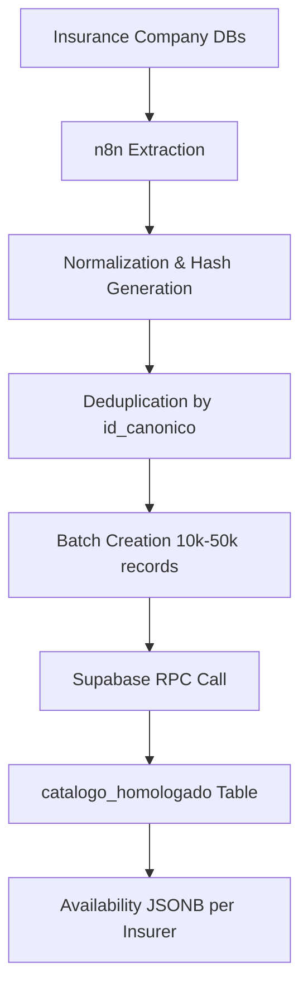
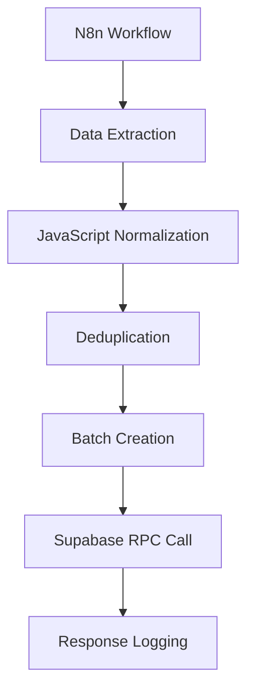

# Normalization Phase

<cite>
**Referenced Files in This Document**   
- [WARP.md](file://WARP.md)
- [gnp-codigo-de-normalizacion.js](file://src/insurers/gnp/gnp-codigo-de-normalizacion.js)
- [gnp-analisis.md](file://src/insurers/gnp/gnp-analisis.md)
- [hdi-codigo-de-normalizacion.js](file://src/insurers/hdi/hdi-codigo-de-normalizacion.js)
- [hdi-analisis.md](file://src/insurers/hdi/hdi-analisis.md)
- [qualitas-codigo-de-normalizacion-n8n.js](file://src/insurers/qualitas/qualitas-codigo-de-normalizacion-n8n.js)
- [qualitas-analisis.md](file://src/insurers/qualitas/qualitas-analisis.md)
</cite>

## Table of Contents
1. [Introduction](#introduction)
2. [Normalization Process Overview](#normalization-process-overview)
3. [Text Standardization](#text-standardization)
4. [Field Mapping and Transformation](#field-mapping-and-transformation)
5. [Trim and Version Extraction](#trim-and-version-extraction)
6. [Technical Specifications Parsing](#technical-specifications-parsing)
7. [Insurer-Specific Normalization Strategies](#insurer-specific-normalization-strategies)
8. [Integration with n8n Workflow](#integration-with-n8n-workflow)
9. [Error Handling and Logging](#error-handling-and-logging)
10. [Performance Considerations](#performance-considerations)
11. [Debugging Tips](#debugging-tips)
12. [Conclusion](#conclusion)

## Introduction

The normalization phase is a critical component in the vehicle catalog homologation system that unifies vehicle catalogs from multiple Mexican insurance companies into a single canonical model. This document details the JavaScript-based normalization scripts that transform heterogeneous insurer data into the canonical model, focusing on key aspects such as text standardization, field mapping, trim/version extraction, and parsing of technical specifications.

The system processes data from 11 insurance companies including Qualitas, HDI, AXA, GNP, Mapfre, Chubb, Zurich, Atlas, BX, El Potosí, and ANA. Each insurer's data undergoes a comprehensive normalization process within n8n workflows before being stored in a Supabase database with a canonical table structure. The normalization ensures complete traceability per insurer, active/inactive status control, and a reproducible ingestion and update flow.

This document will explore the normalization techniques used across different insurers, with particular focus on GNP, HDI, and Qualitas as representative examples. The analysis will cover the JavaScript functions used for text manipulation, regular expression patterns for data extraction, and conditional logic for handling edge cases. Additionally, the integration with n8n workflows, error routing, and performance considerations for large payloads will be discussed.

**Section sources**
- [WARP.md](file://WARP.md#L1-L50)

## Normalization Process Overview

The normalization process transforms heterogeneous insurer data into a canonical model through a series of systematic steps. The process begins with data extraction from each insurer's database, followed by comprehensive transformation and standardization before loading into the unified catalog. This multi-stage approach ensures data consistency, accuracy, and traceability across all insurance providers.

The core objective of normalization is to create a unified representation of vehicle specifications that can be consistently queried and analyzed. This involves several key operations: text standardization to ensure consistent formatting, field mapping to align disparate data structures, extraction of trim and version information from free-text fields, and parsing of technical specifications such as engine configuration and transmission type.

The process is implemented using JavaScript functions within n8n workflows, which provide a flexible and powerful environment for data transformation. Each insurer has specific normalization rules tailored to their unique data structure and quality characteristics. For example, GNP data requires aggressive cleaning due to high contamination rates, while HDI data benefits from a more structured format with comma-separated values.

The normalization workflow follows a consistent pattern across insurers:
1. Extract raw data from the insurer's database
2. Apply text standardization to ensure consistent formatting
3. Map source fields to canonical model fields
4. Extract and parse technical specifications from free-text fields
5. Generate unique identifiers using SHA-256 hashing
6. Validate and clean the transformed data
7. Prepare the data for batch processing and loading

This systematic approach ensures that despite the heterogeneity of source data, the output conforms to a consistent canonical model that supports reliable querying and analysis.



**Diagram sources**
- [WARP.md](file://WARP.md#L100-L120)

**Section sources**
- [WARP.md](file://WARP.md#L50-L100)

## Text Standardization

Text standardization is a fundamental step in the normalization process that ensures consistent formatting across all insurer data. This process addresses variations in capitalization, accent usage, and special characters that could otherwise lead to incorrect data matching and duplication. The standardization functions are implemented as reusable JavaScript utilities that can be applied consistently across different insurers.

The primary text normalization function, `normalizarTexto`, performs several critical operations to ensure data consistency. First, it converts all text to uppercase to eliminate case sensitivity issues. Then, it applies Unicode normalization using the NFD (Normalization Form Decomposition) method to separate base characters from their diacritical marks. This allows for the systematic removal of accents and other diacritical marks that may vary across different data sources.

Following accent removal, the function replaces any non-alphanumeric characters (except spaces, hyphens, and forward slashes) with spaces. This eliminates special characters and punctuation that could interfere with data matching. Finally, multiple consecutive spaces are collapsed into a single space, and leading and trailing whitespace is removed to ensure clean, consistent text formatting.

The implementation of this function is consistent across multiple insurers, with minor variations in the allowed character set. For example, the GNP normalization script allows only letters, numbers, spaces, and hyphens, while the Qualitas script additionally permits forward slashes. This consistency ensures that text from different sources can be reliably compared and matched, forming the foundation for accurate data deduplication and canonical model creation.

```javascript
function normalizarTexto(texto) {
  if (!texto) return "";
  return texto
    .toString()
    .toUpperCase()
    .normalize("NFD")
    .replace(/[\u0300-\u036f]/g, "")
    .replace(/[^A-Z0-9\s-]/g, " ")
    .replace(/\s+/g, " ")
    .trim();
}
```

**Section sources**
- [gnp-codigo-de-normalizacion.js](file://src/insurers/gnp/gnp-codigo-de-normalizacion.js#L50-L65)
- [hdi-codigo-de-normalizacion.js](file://src/insurers/hdi/hdi-codigo-de-normalizacion.js#L40-L55)
- [qualitas-codigo-de-normalizacion-n8n.js](file://src/insurers/qualitas/qualitas-codigo-de-normalizacion-n8n.js#L15-L25)

## Field Mapping and Transformation

Field mapping and transformation is the process of aligning disparate data structures from different insurers to the canonical model. This critical step ensures that data from various sources can be integrated into a unified catalog despite differences in naming conventions, data organization, and field availability. The transformation process involves both direct field mapping and complex conditional logic to handle edge cases and data quality issues.

The mapping process begins with identifying the source fields that correspond to each canonical model field. For example, the canonical `marca` field is mapped from different source fields depending on the insurer: `Armadora.Armadora` for GNP, `Marca.Descripcion` for HDI, and `Marca.Nombre` for Qualitas. These mappings are documented in analysis files for each insurer, which serve as the foundation for the normalization scripts.

Beyond simple field mapping, the transformation process includes several sophisticated operations:

1. **Brand consolidation**: Multiple variations of the same brand name are consolidated into a standard form. For example, "GENERAL MOTORS", "GENERAL MOTORS 2", and "GMC" are all mapped to "GMC" for GNP data.

2. **Model cleaning**: Redundant information is removed from model names, such as the brand name when it appears at the beginning of the model field.

3. **Transmission mapping**: Numeric or abbreviated transmission codes are converted to standard values ("MANUAL" or "AUTO").

4. **Data type conversion**: Fields are converted to appropriate data types, such as casting year values to integers.

The transformation logic is implemented using JavaScript functions that incorporate conditional statements and lookup tables. For instance, the `normalizarMarca` function uses a combination of direct mapping for known duplicates and a dictionary of synonyms to handle variations in brand names. This approach ensures that despite the heterogeneity of source data, the output conforms to a consistent canonical model.

**Section sources**
- [gnp-analisis.md](file://src/insurers/gnp/gnp-analisis.md#L100-L150)
- [hdi-analisis.md](file://src/insurers/hdi/hdi-analisis.md#L300-L350)
- [qualitas-analisis.md](file://src/insurers/qualitas/qualitas-analisis.md#L200-L250)

## Trim and Version Extraction

Trim and version extraction is one of the most challenging aspects of the normalization process, as this information is often embedded within free-text fields alongside technical specifications and equipment codes. The extraction process varies significantly between insurers due to differences in data structure and quality, requiring tailored approaches for each source.

For GNP data, the extraction process is particularly complex due to high data contamination rates (approximately 8%) and the absence of a dedicated trim field. The `extraerTrim` function implements a multi-step approach to isolate the trim information:

1. First, contamination from other brands is detected and removed using a list of known contaminating brands.
2. Technical specifications such as engine configuration, displacement, transmission, and traction are systematically removed.
3. Equipment codes and other non-trim information are eliminated.
4. The remaining text is compared against a comprehensive list of valid trims to identify the correct value.

HDI data presents a different challenge, with trim information typically appearing before the first comma in the `ClaveVersion` field. The extraction strategy for HDI is simpler but requires careful validation to ensure that technical specifications are not mistaken for trim values. The process involves splitting the field by commas and taking the first segment, followed by validation to confirm it doesn't contain technical specifications like engine configuration or displacement.

Qualitas data requires the most sophisticated extraction approach due to the highly contaminated nature of the `cVersion` field. The process involves:
1. Removing separators and standardizing the text format
2. Searching for trim values in a prioritized list of known trims
3. Validating that the identified trim is not actually equipment code or technical specification
4. Returning null when no valid trim can be identified, rather than guessing

The effectiveness of these extraction methods varies significantly between insurers. According to analysis files, only about 10% of GNP records have identifiable trims, compared to 58% for Qualitas and 45% for HDI. This highlights the importance of insurer-specific normalization strategies and the need for conservative approaches that prioritize accuracy over completeness.

**Section sources**
- [gnp-codigo-de-normalizacion.js](file://src/insurers/gnp/gnp-codigo-de-normalizacion.js#L400-L500)
- [hdi-analisis.md](file://src/insurers/hdi/hdi-analisis.md#L200-L250)
- [qualitas-analisis.md](file://src/insurers/qualitas/qualitas-analisis.md#L150-L200)

## Technical Specifications Parsing

Technical specifications parsing involves extracting detailed vehicle information from free-text fields and structuring it according to the canonical model. This process targets key technical attributes such as engine configuration, displacement, turbocharging, traction, body style, and number of doors. The parsing strategy varies between insurers based on the structure and quality of their source data.

For GNP data, the `extraerEspecificaciones` function uses regular expressions to identify technical specifications within the `VersionCorta` field. The function systematically searches for patterns corresponding to different technical attributes:

- **Engine configuration**: Matches patterns like "L4", "V6", "V8", or "H4" using the regex `\b([VLIH])(\d+)\b`
- **Displacement**: Identifies values like "1.5L" or "2.0T" using `\b(\d+\.?\d*)[LT]\b`
- **Turbocharging**: Detects terms like "TURBO", "BITURBO", or "TSI" in the text
- **Traction**: Searches for indicators like "4X4", "AWD", "FWD", or "RWD"
- **Body style**: Looks for terms like "SEDAN", "COUPE", "SUV", or "HATCHBACK"
- **Number of doors**: Identifies patterns like "2P", "4P", or "5 PUERTAS"

HDI data benefits from a more structured format with comma-separated values, allowing for a more systematic parsing approach. The `extraerEspecificacionesHDI` function splits the `ClaveVersion` field by commas and analyzes each segment for specific technical information. This structured approach enables more reliable extraction of specifications like engine configuration (typically in the second position), displacement, power (in "CP"), number of doors, and transmission type.

Qualitas data requires a hybrid approach due to the mixed nature of the `cVersion` field. The parsing process combines regex pattern matching with contextual analysis to distinguish between trim information and technical specifications. Special attention is given to identifying electrification types (HYBRID, PHEV, MHEV, BEV) and transmission types that may appear as acronyms (CVT, DSG, PDK, DCT).

The parsed specifications are then used to populate the corresponding fields in the canonical model, enabling detailed vehicle comparisons and analysis. When specifications cannot be reliably determined, the fields are left as null rather than guessing, maintaining data integrity at the cost of completeness.

**Section sources**
- [gnp-codigo-de-normalizacion.js](file://src/insurers/gnp/gnp-codigo-de-normalizacion.js#L300-L400)
- [hdi-analisis.md](file://src/insurers/hdi/hdi-analisis.md#L250-L300)
- [qualitas-analisis.md](file://src/insurers/qualitas/qualitas-analisis.md#L100-L150)

## Insurer-Specific Normalization Strategies

Each insurer requires a tailored normalization strategy due to unique data characteristics, quality issues, and structural differences. These insurer-specific approaches address the particular challenges presented by each data source, ensuring optimal transformation results while maintaining data integrity.

### GNP Normalization Strategy

GNP data presents significant challenges due to high data contamination rates (approximately 8%) and the absence of an active/vigent field. The normalization strategy for GNP is characterized by aggressive data cleaning and validation:

- **Contamination detection**: A comprehensive list of contaminating brands is used to detect and remove incorrect brand information from the `VersionCorta` field
- **Strict validation**: The process includes extensive validation to prevent incorrect data from entering the canonical model
- **Conservative approach**: When trim information cannot be reliably identified, the field is set to null rather than guessing
- **Complete processing**: Since there is no active/vigent field, all records are processed without filtering

The GNP normalization script implements a multi-step cleaning process that prioritizes data accuracy over completeness, recognizing that only about 10% of records have identifiable trims.

### HDI Normalization Strategy

HDI data benefits from a more structured format with comma-separated values in the `ClaveVersion` field. The normalization strategy leverages this structure for reliable data extraction:

- **Position-based extraction**: The trim is extracted from the first segment before the first comma
- **Systematic parsing**: Each comma-separated segment is analyzed for specific technical information
- **Active record filtering**: Only records with `Activo = 1` are processed, improving data relevance
- **Aggressive cleaning**: Problematic patterns like "CP PUERTAS" and "BASE" are systematically removed

The HDI strategy achieves higher trim identification rates (approximately 45%) due to the structured nature of the source data.

### Qualitas Normalization Strategy

Qualitas data requires a sophisticated normalization approach due to the highly contaminated nature of the `cVersion` field:

- **Comprehensive stopword lists**: Equipment codes like "BA", "AC", "ABS", "QC", and "VP" are systematically removed
- **Prioritized trim matching**: A comprehensive list of valid trims is used in order of priority to identify the correct value
- **Active record filtering**: Only records with `Activo = 1` are processed (approximately 15% of total records)
- **WAGON priority**: Special handling for "SPORTWAGEN" and similar terms to ensure correct body style identification

The Qualitas strategy achieves moderate trim identification rates (approximately 58%) but requires extensive cleaning to remove equipment codes and other contaminants from the version field.

**Section sources**
- [gnp-analisis.md](file://src/insurers/gnp/gnp-analisis.md#L150-L200)
- [hdi-analisis.md](file://src/insurers/hdi/hdi-analisis.md#L150-L200)
- [qualitas-analisis.md](file://src/insurers/qualitas/qualitas-analisis.md#L50-L100)

## Integration with n8n Workflow

The normalization process is tightly integrated with n8n workflows, which orchestrate the entire data transformation and loading pipeline. The n8n platform provides a visual interface for designing complex data processing workflows, enabling efficient execution of the normalization scripts and seamless integration with the Supabase database.

The n8n workflow follows a standardized blueprint for each insurer:

1. **Data extraction**: A query or HTTP node retrieves the raw data from the insurer's database
2. **Transformation**: A function node executes the JavaScript normalization script, applying text standardization, field mapping, trim extraction, and technical specifications parsing
3. **Deduplication**: A code node eliminates duplicates by `id_canonico`, ensuring data consistency
4. **Batching**: The data is divided into manageable chunks (typically 10,000-50,000 records) for efficient processing
5. **Loading**: An HTTP request node calls the Supabase RPC function to load the normalized data
6. **Logging**: Response data is captured for monitoring and troubleshooting

The integration with n8n provides several key advantages:

- **Idempotency**: The workflow is designed to be idempotent, meaning that re-running the same batch does not create additional changes
- **Error handling**: Failed batches can be retried with exponential backoff, ensuring reliable data loading
- **Monitoring**: Comprehensive logging provides visibility into the processing status and performance
- **Scalability**: The chunking mechanism allows for efficient processing of large datasets

The n8n workflow also handles the generation of unique identifiers required by the canonical model. The `hash_comercial` is generated from the normalized commercial specifications (brand, model, year, transmission), while the `id_canonico` is created by hashing the combination of `hash_comercial` and technical specifications (trim, engine configuration, body style, traction). These hashes enable reliable deduplication and serve as primary keys in the canonical database.



**Diagram sources**
- [WARP.md](file://WARP.md#L100-L120)

**Section sources**
- [WARP.md](file://WARP.md#L200-L250)

## Error Handling and Logging

Error handling and logging are critical components of the normalization process, ensuring data integrity and providing visibility into potential issues. The system implements comprehensive error handling mechanisms at multiple levels, from individual record processing to batch-level operations.

At the record level, the normalization scripts use try-catch blocks to handle exceptions during data processing. When an error occurs while processing a specific record, the script logs the error with relevant context (including the original record ID and input data) and continues processing subsequent records. This approach prevents a single problematic record from halting the entire normalization process.

The logging strategy includes several key components:

1. **Processing statistics**: Each normalization script logs summary statistics, such as the number of records processed, contaminated records detected, and records without identifiable trims
2. **Error details**: Specific errors are logged with sufficient context to enable troubleshooting, including the record ID, input data, and error message
3. **Batch metrics**: The n8n workflow captures and logs metrics for each batch, including the number of records inserted and updated, processing duration, and any errors encountered

For GNP data, the normalization script includes specific logging for contamination detection, reporting the number and percentage of contaminated records. Similarly, the HDI and Qualitas scripts log statistics on trim identification rates and other quality metrics.

The system also implements defensive programming practices to handle edge cases and data quality issues:

- **Null handling**: Functions include checks for null or undefined inputs to prevent runtime errors
- **Data validation**: Extracted values are validated against reasonable ranges (e.g., engine displacement between 0.5L and 8.0L)
- **Conservative defaults**: When data cannot be reliably determined, fields are set to null rather than using potentially incorrect default values

These error handling and logging mechanisms ensure that data quality issues are identified and documented, enabling continuous improvement of the normalization process while maintaining the integrity of the canonical model.

**Section sources**
- [gnp-codigo-de-normalizacion.js](file://src/insurers/gnp/gnp-codigo-de-normalizacion.js#L600-L650)
- [hdi-codigo-de-normalizacion.js](file://src/insurers/hdi/hdi-codigo-de-normalizacion.js#L600-L650)
- [qualitas-codigo-de-normalizacion-n8n.js](file://src/insurers/qualitas/qualitas-codigo-de-normalizacion-n8n.js#L700-L750)

## Performance Considerations

Performance considerations are critical when processing large volumes of insurer data, particularly for insurers like Qualitas with over 250,000 records. The normalization system incorporates several optimization strategies to ensure efficient processing while maintaining data quality and integrity.

One of the primary performance optimizations is the use of batch processing. Instead of processing records individually, the system groups them into batches of 10,000 to 50,000 records. This reduces the overhead of database connections and RPC calls, significantly improving overall throughput. The optimal batch size balances the benefits of reduced overhead against the risk of timeouts and memory constraints.

The JavaScript normalization functions are designed with performance in mind:

- **Regular expression optimization**: Patterns are carefully crafted to minimize backtracking and ensure efficient matching
- **Caching**: Frequently used lookup tables (such as brand synonyms) are created once and reused across records
- **Early termination**: Loops and searches terminate as soon as a match is found, avoiding unnecessary processing
- **Minimal object creation**: The scripts avoid creating unnecessary intermediate objects to reduce memory usage

For insurers with particularly large datasets, additional performance considerations include:

- **Parallel processing**: Multiple insurers can be processed simultaneously, taking advantage of multi-core systems
- **Memory management**: Large datasets are processed in chunks to prevent excessive memory consumption
- **Database indexing**: The Supabase database includes appropriate indexes to optimize the upsert operations performed by the RPC function

The system also includes monitoring and alerting to detect performance issues. Processing duration for each batch is logged, enabling identification of performance regressions or bottlenecks. If a batch exceeds expected processing time, alerts can be triggered to investigate potential issues.

These performance optimizations ensure that the normalization process can handle the large volumes of data from multiple insurers efficiently, supporting timely updates to the canonical catalog while maintaining high data quality standards.

**Section sources**
- [WARP.md](file://WARP.md#L300-L350)

## Debugging Tips

Effective debugging is essential for maintaining and improving the normalization process, particularly when dealing with complex data transformation logic and edge cases. The following tips provide guidance for troubleshooting common issues and optimizing the normalization scripts.

### General Debugging Approach

1. **Start with sample data**: Use small, representative datasets to test changes before processing entire catalogs
2. **Enable verbose logging**: Temporarily increase log verbosity to capture detailed information about the transformation process
3. **Validate intermediate results**: Check the output after each major transformation step to identify where issues occur
4. **Compare with source data**: Verify that transformed data accurately reflects the original information

### Insurer-Specific Debugging

For **GNP data**, focus on contamination detection and trim extraction:
- Verify that the contamination detection is correctly identifying and removing incorrect brand information
- Check that the trim extraction is not incorrectly removing valid trim information
- Validate that technical specifications are being properly separated from trim information

For **HDI data**, pay attention to the comma-separated structure:
- Ensure that the split by comma is correctly handling edge cases and unusual formatting
- Verify that the position-based extraction is accurately identifying the trim and other specifications
- Check that the aggressive cleaning is not removing valid information

For **Qualitas data**, focus on stopword removal and trim matching:
- Verify that equipment codes are being correctly identified and removed
- Check that the prioritized trim matching is selecting the most appropriate value
- Validate that the WAGON/SPORTWAGEN priority is correctly handling body style identification

### Common Issues and Solutions

1. **Hash collisions**: If different vehicles have the same `id_canonico`, review the normalization logic and consider adding distinguishing fields
2. **RPC timeouts**: If large batches are timing out, reduce the batch size from 50k to 10k records
3. **Encoding issues**: If special characters are causing problems, ensure proper UTF-8 normalization in the `normalizarTexto` function
4. **Missing source data**: If insurance company APIs change, update extraction queries and validate field mappings

### Testing Strategies

Create comprehensive test cases that cover:
- Normal scenarios with well-formatted data
- Edge cases with minimal or unusual data
- Known problematic records identified in previous processing
- Boundary conditions for numerical values

These debugging tips and strategies help ensure the reliability and accuracy of the normalization process, enabling continuous improvement and adaptation to changing data characteristics.

**Section sources**
- [WARP.md](file://WARP.md#L400-L450)

## Conclusion

The normalization phase is a sophisticated and critical component of the vehicle catalog homologation system, transforming heterogeneous insurer data into a unified canonical model. Through the use of JavaScript-based normalization scripts within n8n workflows, the system successfully addresses the challenges of data inconsistency, contamination, and structural differences across multiple insurance providers.

The normalization process employs a comprehensive set of techniques, including text standardization, field mapping, trim and version extraction, and technical specifications parsing. These techniques are tailored to the specific characteristics of each insurer's data, with GNP requiring aggressive cleaning due to high contamination rates, HDI benefiting from a structured comma-separated format, and Qualitas needing sophisticated stopword removal and prioritized trim matching.

The integration with n8n workflows provides a robust and scalable platform for executing the normalization process, with features like batch processing, deduplication, and error handling ensuring reliable data transformation. The system's design emphasizes data integrity, preferring null values over potentially incorrect defaults when information cannot be reliably determined.

Key success factors include the use of SHA-256 hashing for unique identification, comprehensive logging for monitoring and troubleshooting, and performance optimizations for handling large datasets. The system achieves its primary objectives of creating a unified vehicle catalog with complete traceability, active/inactive status control, and a reproducible ingestion process.

Future improvements could include machine learning-based anomaly detection, enhanced cross-insurer validation, and automated mapping suggestions based on data profiling. However, the current implementation provides a solid foundation for reliable vehicle catalog homologation, supporting accurate analysis and decision-making across the insurance ecosystem.

**Section sources**
- [WARP.md](file://WARP.md#L450-L500)