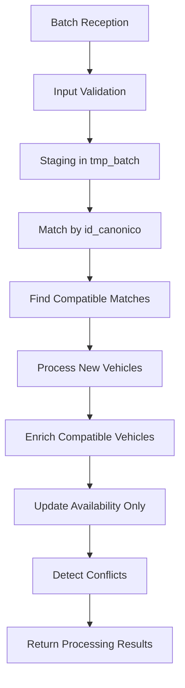
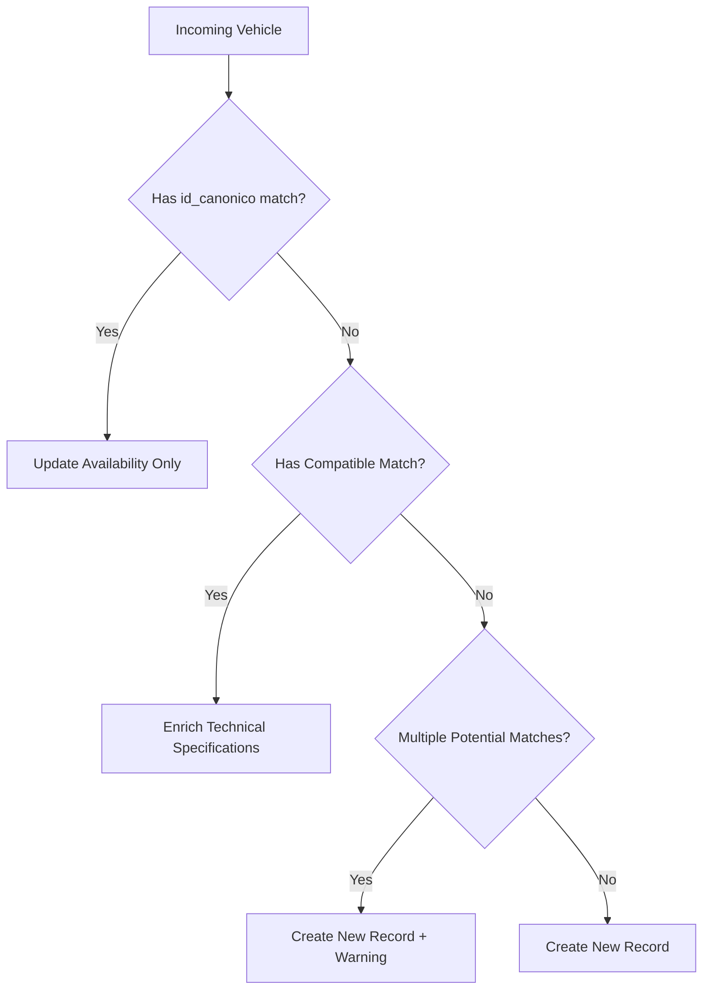
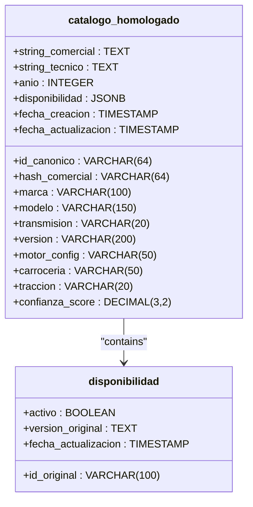
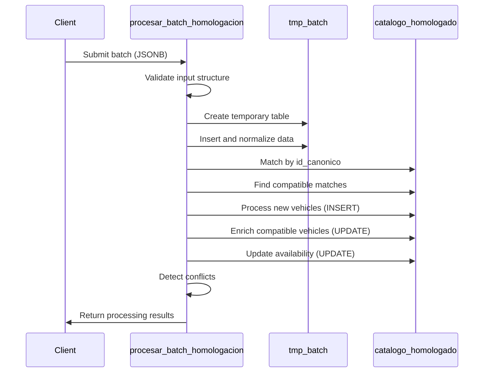
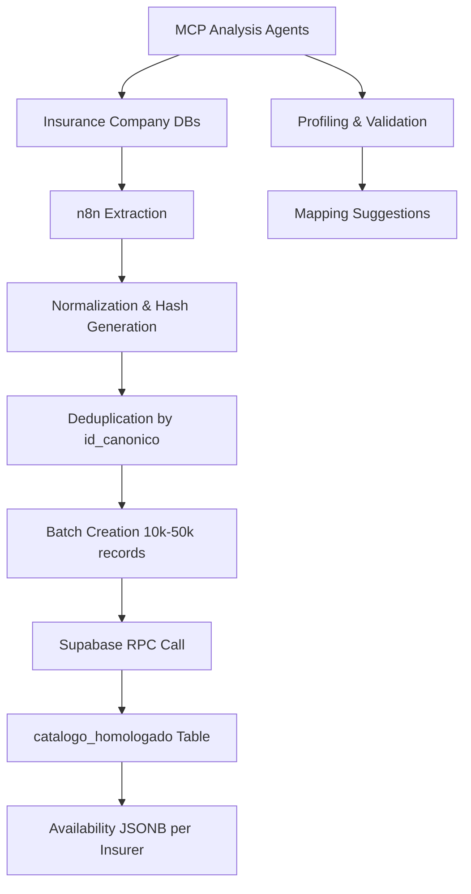

# Processing & Persistence Phase

<cite>
**Referenced Files in This Document**   
- [Funcion RPC Nueva.sql](file://src/supabase/Funcion RPC Nueva.sql)
- [casos de prueba función rpc.sql](file://src/supabase/casos de prueba función rpc.sql)
- [Tabla maestra.sql](file://src/supabase/Tabla maestra.sql)
- [WARP.md](file://WARP.md)
- [instrucciones.md](file://instrucciones.md)
</cite>

## Table of Contents
1. [Introduction](#introduction)
2. [End-to-End Processing Workflow](#end-to-end-processing-workflow)
3. [Data Normalization and Hash Generation](#data-normalization-and-hash-generation)
4. [Deduplication and Conflict Resolution](#deduplication-and-conflict-resolution)
5. [Upsert Logic and JSONB Merging](#upsert-logic-and-jsonb-merging)
6. [Transaction Safety and Error Handling](#transaction-safety-and-error-handling)
7. [Test Case Analysis](#test-case-analysis)
8. [WARP.md Data Flow Visualization](#warpmd-data-flow-visualization)
9. [Performance Optimization Recommendations](#performance-optimization-recommendations)
10. [Conclusion](#conclusion)

## Introduction
This document details the final processing and persistence phase of the vehicle catalog homologation system. It explains how normalized data batches are processed through the Supabase RPC function `procesar_batch_homologacion`, which serves as the central mechanism for maintaining a unified canonical vehicle catalog from multiple insurance providers. The system ensures data integrity, traceability, and status tracking while supporting idempotent operations and conflict resolution. This phase represents the convergence point where normalized data from various insurers is consolidated into a single source of truth.

## End-to-End Processing Workflow
The processing workflow begins with batch reception from the n8n orchestration layer and concludes with persistent storage in the `catalogo_homologado` table. The entire process is encapsulated within the `procesar_batch_homologacion` function, which handles validation, staging, matching, and persistence in a transactionally safe manner.

The workflow follows these sequential phases:
1. Input validation and extraction
2. Temporary staging of batch data
3. Compatibility matching using canonical identifiers
4. Processing of new, enriched, and updated records
5. Conflict detection and reporting
6. Response generation with processing metrics

Each phase builds upon the previous one, ensuring that vehicles are correctly classified as new entries, updates to existing records, or enrichment opportunities based on technical specifications.

**Diagram sources**
- [Funcion RPC Nueva.sql](file://src/supabase/Funcion RPC Nueva.sql#L1-L428)

**Section sources**
- [Funcion RPC Nueva.sql](file://src/supabase/Funcion RPC Nueva.sql#L1-L428)
- [WARP.md](file://WARP.md#L0-L413)

## Data Normalization and Hash Generation
The system relies on two critical hash values for data integrity and matching: `id_canonico` and `hash_comercial`. These SHA-256 hashes are generated during the normalization phase in n8n before being passed to the Supabase RPC function.

The `hash_comercial` is derived from the commercial attributes of a vehicle: brand, model, year, and transmission. This hash serves as a primary grouping mechanism for vehicles with identical commercial specifications. The `id_canonico` is a more comprehensive hash that includes the `hash_comercial` plus technical specifications such as version, motor configuration, body type, and traction system.

During processing, these hash values are used to determine the appropriate action for each vehicle in the batch. The function first attempts to match vehicles by `id_canonico`, which indicates an exact specification match. When no exact match is found, the system looks for compatible vehicles that can be enriched with additional technical details.

Normalization includes standardization procedures such as converting text to uppercase, trimming whitespace, eliminating duplicate spaces, and mapping transmission abbreviations (e.g., "AUT." to "AUTO"). This ensures consistent hashing across different data sources with varying formatting conventions.

**Section sources**
- [instrucciones.md](file://instrucciones.md#L47-L91)
- [WARP.md](file://WARP.md#L0-L413)

## Deduplication and Conflict Resolution
Deduplication is a critical aspect of the processing phase, ensuring that the canonical catalog maintains data integrity while accurately representing information from multiple insurers. The system employs a multi-tiered matching strategy that prioritizes exact matches while allowing for progressive enrichment of vehicle specifications.

The deduplication process follows this hierarchy:
1. **Exact Match**: Vehicles with matching `id_canonico` values are identified as updates to existing records, specifically for availability information.
2. **Compatible Match**: When no exact match exists, the system searches for vehicles with identical brand, model, year, transmission, and version, where missing technical specifications (motor configuration, body type, traction) in the canonical record can be filled from the incoming data.
3. **New Record**: Vehicles that don't match existing records by `id_canonico` and have no compatible enrichment opportunities are inserted as new entries.

Conflict resolution occurs when incoming data contradicts existing specifications in non-enrichable fields. The system detects conflicts in transmission, version, body type, motor configuration, or traction when these fields have different non-null values. Rather than overwriting existing data, the system creates a new record with a different `id_canonico`, preserving both specifications as distinct vehicle variants.

The function also handles cases with multiple potential matches by creating new records and generating warnings, preventing ambiguous matches that could compromise data quality.

**Diagram sources**
- [Funcion RPC Nueva.sql](file://src/supabase/Funcion RPC Nueva.sql#L1-L428)

**Section sources**
- [Funcion RPC Nueva.sql](file://src/supabase/Funcion RPC Nueva.sql#L1-L428)

## Upsert Logic and JSONB Merging
The upsert logic in the `procesar_batch_homologacion` function implements a sophisticated three-path approach for handling incoming vehicle data, effectively serving as an upsert operation with specialized behaviors based on matching criteria.

For vehicles with an exact `id_canonico` match, the function updates only the availability information in the `disponibilidad` JSONB field. This is accomplished through JSONB concatenation (`||`), which merges the new insurer's availability data with existing information without affecting other insurers' data. The `fecha_actualizacion` timestamp is updated, and the confidence score is slightly increased to reflect additional verification.

When a compatible match is found for enrichment, the function updates technical specifications (motor configuration, body type, traction) only if they are currently null in the canonical record. This prevents overwriting existing data while allowing progressive refinement of vehicle details. The `id_canonico` is recalculated if new technical specifications are added, and the `string_tecnico` is reconstructed to reflect the updated information.

For new vehicles, the function performs an INSERT operation with `ON CONFLICT (id_canonico) DO NOTHING` to prevent race conditions. The initial confidence score is set to 1.0 for exact matches and 0.8 for records created due to multiple potential matches, reflecting lower certainty.

The JSONB merging strategy preserves complete traceability by maintaining each insurer's original data, including `id_original`, `version_original`, and activation status. This allows for full auditability and supports the business rule that a vehicle is considered globally active if at least one insurer reports it as active.

**Diagram sources**
- [Tabla maestra.sql](file://src/supabase/Tabla maestra.sql#L0-L99)
- [Funcion RPC Nueva.sql](file://src/supabase/Funcion RPC Nueva.sql#L1-L428)

**Section sources**
- [Funcion RPC Nueva.sql](file://src/supabase/Funcion RPC Nueva.sql#L1-L428)
- [Tabla maestra.sql](file://src/supabase/Tabla maestra.sql#L0-L99)

## Transaction Safety and Error Handling
The `procesar_batch_homologacion` function ensures transactional safety through PostgreSQL's robust transaction management and exception handling capabilities. As a PL/pgSQL function with `SECURITY DEFINER` privileges, it executes within a single transaction context, guaranteeing atomicity for the entire batch processing operation.

The function begins by validating input data and immediately returns an error response if the input is not a valid JSONB array. This early validation prevents unnecessary processing and resource consumption. During execution, the function uses a temporary table (`tmp_batch`) with `ON COMMIT DROP` to stage incoming data, ensuring that staging data is automatically cleaned up regardless of transaction outcome.

Error handling is implemented through a comprehensive EXCEPTION block that catches specific error types and provides meaningful responses. The function distinguishes between `unique_violation` exceptions, which indicate primary key constraint violations, and all other exceptions. For unique violations, the response includes specific details about the constraint failure, while other exceptions return the SQL error message and state code for debugging purposes.

The function's design ensures idempotency, meaning that reprocessing the same batch will produce identical results without unintended side effects. This is critical for reliability in distributed systems where network issues might require retrying operations. The use of `DISTINCT ON` during data loading prevents duplicate processing of vehicles from the same insurer with the same original ID.

Metrics tracking throughout the process provides visibility into batch processing outcomes, including counts of received, staged, processed, and conflicted vehicles. This telemetry enables monitoring of data quality and system performance over time.

**Section sources**
- [Funcion RPC Nueva.sql](file://src/supabase/Funcion RPC Nueva.sql#L1-L428)

## Test Case Analysis
The test cases defined in `casos de prueba función rpc.sql` demonstrate the function's behavior under various scenarios, validating its correctness and robustness. These cases cover the primary processing paths and edge cases that the system must handle.

**Case 1: Initial Insertion** - A Toyota Yaris SEDAN from Qualitas is inserted as a new record, establishing the baseline canonical entry with its associated metadata and availability information.

**Case 2: Availability Update** - Zurich submits the same vehicle with identical specifications (matching `id_canonico`), resulting in an update to the availability JSONB field. The test verifies that only one record exists but now includes availability information from two insurers.

**Case 3: Conflict Resolution** - HDI submits a Yaris with HATCHBACK body type instead of SEDAN. Since body type is a conflicting specification, the system creates a new record rather than overwriting the existing one, preserving both variants in the catalog.

**Case 4: Technical Enrichment** - HDI submits a Yaris SEDAN with motor configuration (L4) that was previously null. The system identifies this as a compatible match and enriches the existing record with the new technical detail, updating the confidence score accordingly.

**Case 5: Version Conflict** - HDI submits a Yaris with "CORE" version instead of "PREMIUM". This difference in version creates a conflict, resulting in a new record rather than an update, as versions represent distinct vehicle trims.

**Case 6: Progressive Enrichment** - This multi-step case demonstrates how the system can progressively build a complete technical specification. First, Qualitas submits a VW Gol without version or body type information. Then, Zurich submits the same vehicle with HATCHBACK body type, allowing the system to enrich the existing record with this missing information.

These test cases validate that the function correctly implements the business rules for data persistence, ensuring that the canonical catalog accurately represents the nuanced differences between vehicle specifications across insurers while maintaining data integrity and traceability.

**Diagram sources**
- [casos de prueba función rpc.sql](file://src/supabase/casos de prueba función rpc.sql#L0-L255)
- [Funcion RPC Nueva.sql](file://src/supabase/Funcion RPC Nueva.sql#L1-L428)

**Section sources**
- [casos de prueba función rpc.sql](file://src/supabase/casos de prueba función rpc.sql#L0-L255)

## WARP.md Data Flow Visualization
The WARP.md document provides a comprehensive visualization of the data flow, positioning the processing and persistence phase as the convergence point of the entire homologation system. This phase represents the culmination of data extraction, normalization, and transformation from multiple insurance providers.

The data flow begins with source databases from eleven insurance companies, which are extracted through n8n workflows. During normalization, each insurer's data is transformed into the canonical format, with hash values generated and deduplication performed before batching. The batches are then sent to the Supabase RPC endpoint, where the `procesar_batch_homologacion` function processes them and persists the results in the `catalogo_homologado` table.

The WARP.md visualization emphasizes the bidirectional nature of data quality assurance, with MCP analysis agents providing feedback to the source systems and the normalization layer. This closed-loop system enables continuous improvement of data mapping and normalization rules based on actual processing outcomes and conflict patterns.

The processing phase serves as the central hub where data from disparate sources with varying structures and quality levels is unified into a consistent, queryable format. The resulting canonical catalog supports downstream applications, including multiquoting systems, analytics platforms, and insurer portals, by providing a single source of truth for vehicle availability and specifications.

**Diagram sources**
- [WARP.md](file://WARP.md#L0-L413)

**Section sources**
- [WARP.md](file://WARP.md#L0-L413)

## Performance Optimization Recommendations
To ensure optimal performance of the processing and persistence phase, several recommendations should be followed regarding batch sizing, indexing, and resource management.

**Batch Sizing**: While the system can handle large batches, optimal performance is achieved with batches of 10,000 to 50,000 records. Larger batches may exceed PostgreSQL's statement timeout or consume excessive memory, while smaller batches increase the overhead of function invocation and transaction management. The n8n orchestration layer should implement adaptive batching based on vehicle complexity and system load.

**Index Utilization**: The `catalogo_homologado` table has several critical indexes that should be maintained for optimal performance:
- `idx_id_canonico_hom` on `id_canonico` for exact match lookups
- `idx_hash_comercial_hom` on `hash_comercial` for commercial grouping
- `idx_marca_modelo_anio_hom` on `marca`, `modelo`, `anio` for common query patterns
- GIN index on `disponibilidad` for JSONB querying by insurer

These indexes should be monitored for bloat and rebuilt periodically, especially after large ingestion operations.

**Temporary Table Performance**: The use of a temporary table for staging allows for efficient processing but requires sufficient temporary space. The database configuration should ensure adequate `temp_buffers` and `temp_file_limit` settings to handle large batches without spilling to disk.

**Connection Management**: When calling the RPC function from external systems, connection pooling should be implemented to avoid the overhead of establishing new connections for each batch. The Supabase connection should use persistent connections with proper error handling for network interruptions.

**Monitoring and Alerting**: Key performance metrics should be monitored, including batch processing time, conflict rates, and warning counts. Alerts should be configured for异常 patterns, such as sudden increases in conflict rates that might indicate changes in source data formats.

**Section sources**
- [WARP.md](file://WARP.md#L0-L413)
- [Tabla maestra.sql](file://src/supabase/Tabla maestra.sql#L0-L99)

## Conclusion
The processing and persistence phase represents the cornerstone of the vehicle catalog homologation system, transforming normalized data from multiple insurers into a unified, reliable canonical catalog. The `procesar_batch_homologacion` function serves as a sophisticated data integration engine that balances the need for data consistency with the reality of conflicting specifications across different sources.

Through its multi-tiered matching strategy, the system successfully handles the three primary scenarios: updating availability for existing vehicles, enriching technical specifications of compatible vehicles, and creating new records for distinct vehicle variants. The use of JSONB for availability data enables flexible, extensible storage of insurer-specific information while maintaining a clean, normalized structure for the core vehicle specifications.

The comprehensive test suite validates the function's behavior across various scenarios, ensuring that the system correctly implements business rules for data persistence and conflict resolution. The integration with monitoring and analysis tools through WARP.md creates a feedback loop that enables continuous improvement of data quality and mapping accuracy.

By following the performance recommendations outlined in this document, the system can efficiently handle the large volumes of vehicle data required for a comprehensive insurance catalog while maintaining data integrity, traceability, and availability information for all participating insurers.