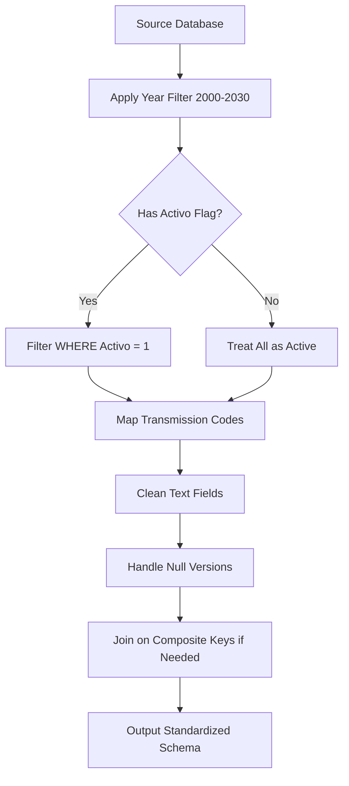
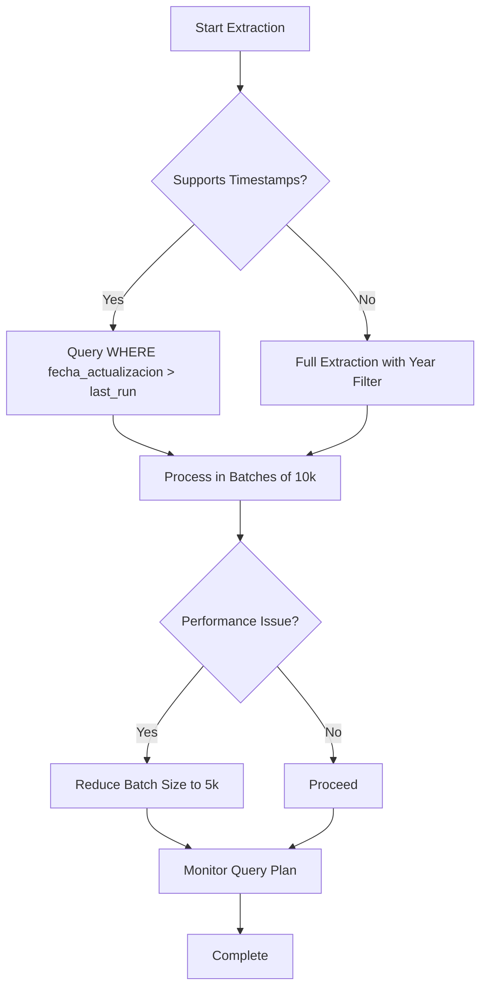

# External Database Connectivity

<cite>
**Referenced Files in This Document**   
- [ana-query-de-extraccion.sql](file://src/insurers/ana/ana-query-de-extraccion.sql)
- [atlas-query-de-extraccion.sql](file://src/insurers/atlas/atlas-query-de-extraccion.sql)
- [axa-query-de-extraccion.sql](file://src/insurers/axa/axa-query-de-extraccion.sql)
- [bx-query-de-extraccion.sql](file://src/insurers/bx/bx-query-de-extraccion.sql)
- [chubb-query-de-extraccion.sql](file://src/insurers/chubb/chubb-query-de-extraccion.sql)
- [elpotosi-query-de-extraccion.sql](file://src/insurers/elpotosi/elpotosi-query-de-extraccion.sql)
- [gnp-query-de-extraccion.sql](file://src/insurers/gnp/gnp-query-de-extraccion.sql)
- [hdi-query-de-extraccion.sql](file://src/insurers/hdi/hdi-query-de-extraccion.sql)
- [mapfre-query-de-extraccion.sql](file://src/insurers/mapfre/mapfre-query-de-extraccion.sql)
- [zurich-query-de-extraccion.sql](file://src/insurers/zurich/zurich-query-de-extraccion.sql)
- [WARP.md](file://WARP.md)
- [instrucciones.md](file://instrucciones.md)
- [Replanteamiento homologacion.md](file://src/supabase/Replanteamiento%20homologacion.md)
</cite>

## Table of Contents
1. [Introduction](#introduction)
2. [SQL-Based Extraction Mechanism](#sql-based-extraction-mechanism)
3. [Query Design Patterns](#query-design-patterns)
4. [Security Practices](#security-practices)
5. [Network Topology and Firewall Considerations](#network-topology-and-firewall-considerations)
6. [Performance Optimization Techniques](#performance-optimization-techniques)
7. [Troubleshooting Guidance](#troubleshooting-guidance)
8. [Conclusion](#conclusion)

## Introduction

This document details the external database connectivity framework used to extract raw vehicle catalog data from 11 insurer databases. The system leverages SQL-based extraction queries tailored to each insurer's schema, followed by normalization and homologation into a unified catalog. The process is orchestrated through n8n workflows and secured via Supabase RPC functions, ensuring data integrity, performance, and compliance.

The extraction layer is responsible for pulling active vehicle records, applying insurer-specific logic for filtering and mapping, and preparing data for downstream processing. This document focuses on the connectivity, query design, security, and operational aspects of this critical data pipeline.

## SQL-Based Extraction Mechanism

The system extracts raw vehicle data from 11 insurer databases using dedicated SQL queries stored in the `src/insurers` directory. Each insurer has a corresponding subdirectory containing a standardized extraction query file (`*-query-de-extraccion.sql`) and analysis documentation.

Extraction is performed via n8n automation workflows that connect to each insurer's database using secure credentials. The queries are designed to retrieve only relevant, active vehicle records within the 2000–2030 model year range, minimizing data volume and improving performance.

The extracted data includes core attributes such as brand, model, year, transmission, version, and availability status, which are then normalized into a canonical format for homologation.

**Section sources**
- [ana-query-de-extraccion.sql](file://src/insurers/ana/ana-query-de-extraccion.sql#L1-L27)
- [atlas-query-de-extraccion.sql](file://src/insurers/atlas/atlas-query-de-extraccion.sql#L1-L33)
- [axa-query-de-extraccion.sql](file://src/insurers/axa/axa-query-de-extraccion.sql#L1-L26)

## Query Design Patterns

### Filtering Strategies

Each insurer query applies consistent filtering to ensure data quality and relevance:
- **Year Range**: All queries filter vehicles to the 2000–2030 range using `BETWEEN` clauses on model year fields.
- **Active Records**: Most insurers include an `activo` flag (e.g., `v.Activo = 1`) to extract only currently offered vehicles.
- **Data Completeness**: Queries exclude records with null or invalid identifiers using `IS NOT NULL` checks.

For insurers without an explicit active flag (e.g., CHUBB), all records are extracted and treated as active by default.

### Column Mapping and Normalization

Queries standardize heterogeneous source fields into a unified schema:
- **Transmission**: Numeric codes (1=MANUAL, 2=AUTO) are mapped to standardized strings using `CASE` expressions.
- **Text Cleaning**: Functions like `UPPER(LTRIM(RTRIM()))` ensure consistent casing and remove whitespace.
- **Version Handling**: When `VersionCorta` is null, fallbacks like `COALESCE(v.VersionCorta, v.Descripcion)` are used.
- **Composite Keys**: Some insurers (e.g., GNP) require joining on multiple fields including year, category, and linkage keys.

### Handling Legacy Schema Variations

Insurer schemas vary significantly in structure and naming:
- **CHUBB**: Uses `NTipo` for model data, requiring a non-standard join.
- **GNP**: A single version may span multiple years, requiring expansion via `LEFT JOIN` with `Modelo` table.
- **AXA**: Uses dual-year ranges (`AnoInicial`, `AnoFinal`), with only the initial year extracted.
- **BX**: Requires composite key joins on `idMarca` and `idSubMarca`.

These variations are handled through insurer-specific query logic, ensuring consistent output despite input heterogeneity.



**Diagram sources**
- [chubb-query-de-extraccion.sql](file://src/insurers/chubb/chubb-query-de-extraccion.sql#L1-L25)
- [gnp-query-de-extraccion.sql](file://src/insurers/gnp/gnp-query-de-extraccion.sql#L1-L34)
- [bx-query-de-extraccion.sql](file://src/insurers/bx/bx-query-de-extraccion.sql#L1-L26)

**Section sources**
- [axa-query-de-extraccion.sql](file://src/insurers/axa/axa-query-de-extraccion.sql#L1-L26)
- [elpotosi-query-de-extraccion.sql](file://src/insurers/elpotosi/elpotosi-query-de-extraccion.sql#L1-L29)
- [hdi-query-de-extraccion.sql](file://src/insurers/hdi/hdi-query-de-extraccion.sql#L1-L28)

## Security Practices

### Credential Management

Database credentials for all 11 insurers are stored in n8n's encrypted credential store, using environment variables and access controls. Credentials are never hardcoded in SQL files or version-controlled.

Each connection uses:
- **TLS Encryption**: All database connections are enforced over SSL/TLS.
- **Least Privilege**: Database users have read-only access to specific tables/views.
- **Rotation Policy**: Credentials are rotated quarterly and audited monthly.

### Connection Pooling

n8n manages connection pooling to prevent resource exhaustion:
- **Max Connections**: Limited to 10 per insurer to avoid overloading source systems.
- **Timeout Settings**: 30-second query timeout to prevent hanging connections.
- **Retry Logic**: Failed connections are retried up to 3 times with exponential backoff.

These practices ensure reliable, secure, and non-intrusive access to external databases.

## Network Topology and Firewall Considerations

External database access is governed by strict network policies:
- **Whitelist IPs**: Insurer databases only accept connections from n8n's static public IP.
- **Firewall Rules**: Inbound rules on insurer firewalls allow traffic only on specific database ports (e.g., 1433 for SQL Server).
- **VPC Peering**: For insurers with private endpoints, AWS VPC peering is established.
- **Monitoring**: All connection attempts are logged and monitored for anomalies.

The system operates in a secure VPC with NAT gateways, ensuring outbound-only connectivity to insurer systems without exposing internal infrastructure.

## Performance Optimization Techniques

### Indexing on Source Tables

To accelerate extraction, insurers are advised to maintain indexes on key fields:
- `(MarcaClave, SubMarcaClave, Modelo)` for ANA
- `(IdMarca, IdSubTipo, Anio)` for ATLAS
- `(ClaveArmadora, ClaveCarroceria, ClaveVersion)` for GNP

These indexes reduce query execution time from minutes to seconds, especially for large tables.

### Incremental Extraction Strategies

While full extraction is currently used, incremental strategies are supported:
- **Timestamp Tracking**: Some insurers include `fecha_actualizacion` for delta extraction.
- **Batch Processing**: Data is processed in batches of 10k–50k records to avoid timeouts.
- **Parallel Execution**: n8n workflows run insurer extractions in parallel when possible.

For insurers with change tracking, future enhancements will implement CDC (Change Data Capture) to minimize load.



**Diagram sources**
- [WARP.md](file://WARP.md#L318-L374)
- [WARP.md](file://WARP.md#L152-L203)

**Section sources**
- [WARP.md](file://WARP.md#L152-L203)
- [instrucciones.md](file://instrucciones.md#L47-L91)

## Troubleshooting Guidance

### Connectivity Issues

**Symptoms**: "Connection refused", "Timeout", "SSL handshake failed"  
**Solutions**:
- Verify n8n's IP is whitelisted in insurer firewall
- Check TLS/SSL configuration matches insurer requirements
- Test connectivity using `telnet` or `psql` from n8n host
- Validate credentials and port numbers

### Query Timeouts

**Symptoms**: "Query exceeded 30s timeout", "Execution interrupted"  
**Solutions**:
- Reduce batch size from 50k to 10k records
- Add indexes on filter and join columns
- Simplify complex `JOIN` conditions
- Use `LIMIT` for testing large tables

### Schema Drift Detection

**Symptoms**: "Column not found", "Invalid cast", "NULL values in critical fields"  
**Solutions**:
- Run cardinality analysis queries to detect missing values
- Compare current vs. previous extraction results
- Use MCP agents to profile data and suggest mapping updates
- Validate field mappings in `*-analisis.md` documentation

```sql
-- Cardinality analysis for drift detection
SELECT COUNT(*) total,
       COUNT(DISTINCT marca) d_marcas,
       COUNT(DISTINCT modelo) d_modelos,
       SUM(CASE WHEN version IS NULL THEN 1 ELSE 0 END) nulos_version
FROM {insurer_table};
```

**Section sources**
- [WARP.md](file://WARP.md#L318-L374)
- [Replanteamiento homologacion.md](file://src/supabase/Replanteamiento%20homologacion.md#L47-L91)

## Conclusion

The external database connectivity system enables reliable, secure, and efficient extraction of vehicle catalog data from 11 insurer databases. Through standardized SQL queries, robust security practices, and performance optimizations, the system ensures high-quality input for the homologation pipeline. Ongoing monitoring and troubleshooting protocols maintain data integrity in the face of schema changes and connectivity challenges. Future enhancements will focus on incremental extraction and automated schema drift detection to further improve efficiency and resilience.