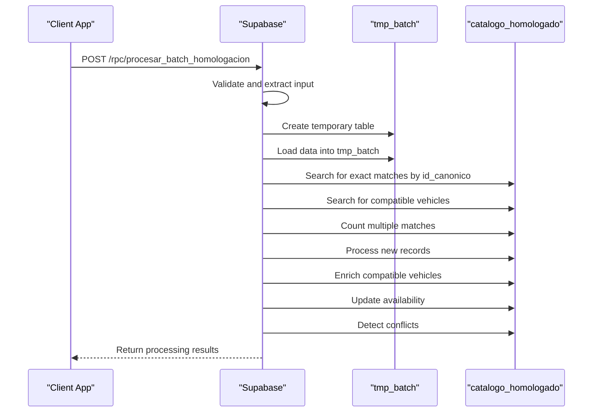
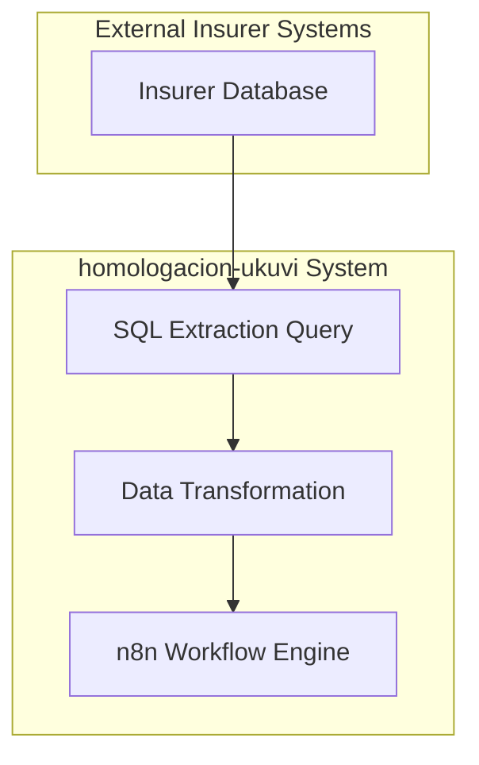
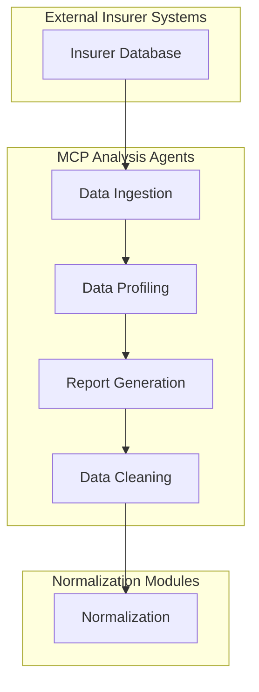
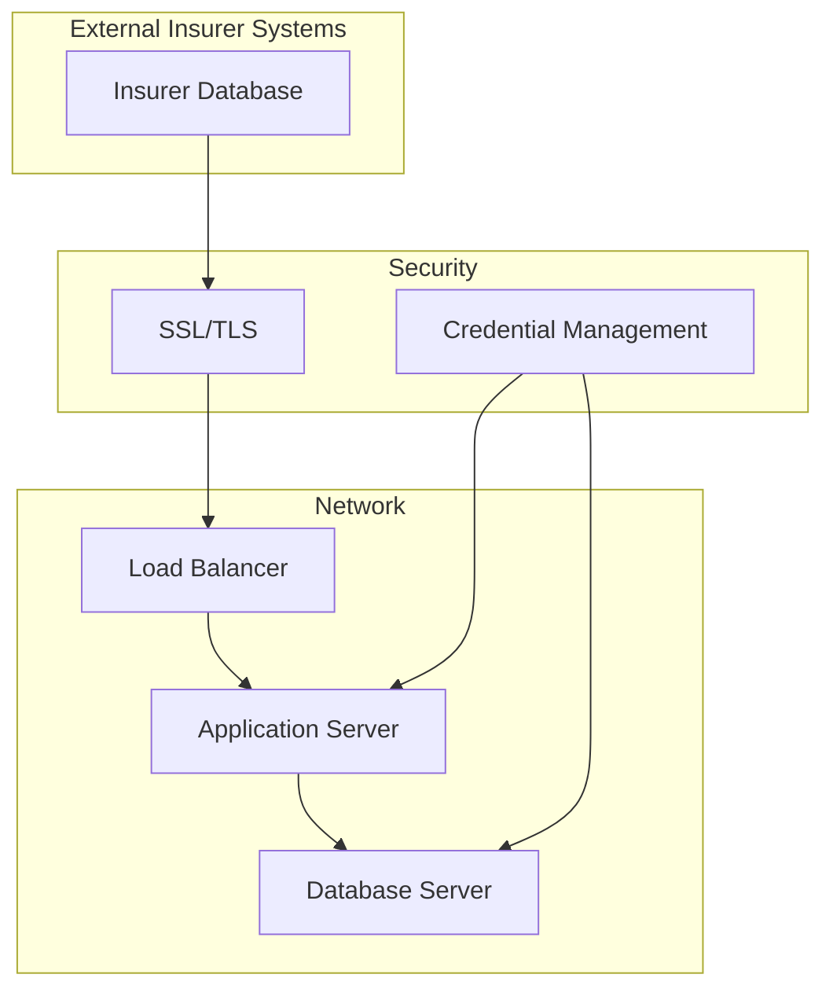
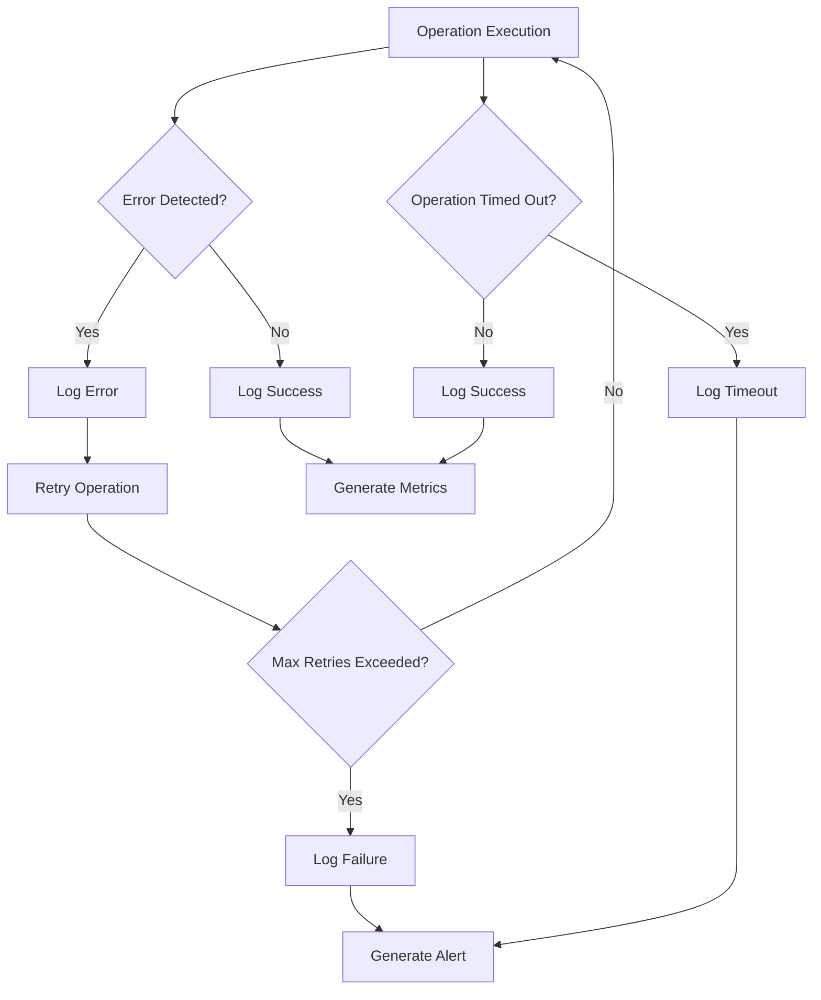

# Integration Architecture

<cite>
**Referenced Files in This Document**   
- [procesar_batch_homologacion](file://src/supabase/Funcion RPC Nueva.sql)
- [procesar_batch_completo](file://src/supabase/Funcion RPC.sql)
- [qualitas-codigo-de-normalizacion-n8n.js](file://src/insurers/qualitas/qualitas-codigo-de-normalizacion-n8n.js)
- [gnp-codigo-de-normalizacion.js](file://src/insurers/gnp/gnp-codigo-de-normalizacion.js)
- [elpotosi-codigo-de-normalizacion.js](file://src/insurers/elpotosi/elpotosi-codigo-de-normalizacion.js)
- [hdi-codigo-de-normalizacion.js](file://src/insurers/hdi/hdi-codigo-de-normalizacion.js)
- [zurich-codigo-de-normalizacion.js](file://src/insurers/zurich/zurich-codigo-de-normalizacion.js)
- [ana-query-de-extraccion.sql](file://src/insurers/ana/ana-query-de-extraccion.sql)
- [atlas-query-de-extraccion.sql](file://src/insurers/atlas/atlas-query-de-extraccion.sql)
- [axa-query-de-extraccion.sql](file://src/insurers/axa/axa-query-de-extraccion.sql)
- [bx-query-de-extraccion.sql](file://src/insurers/bx/bx-query-de-extraccion.sql)
- [chubb-query-de-extraccion.sql](file://src/insurers/chubb/chubb-query-de-extraccion.sql)
- [elpotosi-query-de-extraccion.sql](file://src/insurers/elpotosi/elpotosi-query-de-extraccion.sql)
- [gnp-query-de-extraccion.sql](file://src/insurers/gnp/gnp-query-de-extraccion.sql)
- [hdi-query-de-extraccion.sql](file://src/insurers/hdi/hdi-query-de-extraccion.sql)
- [mapfre-query-de-extraccion.sql](file://src/insurers/mapfre/mapfre-query-de-extraccion.sql)
- [qualitas-query-de-extracción.sql](file://src/insurers/qualitas/qualitas-query-de-extracción.sql)
- [zurich-query-de-extraccion.sql](file://src/insurers/zurich/zurich-query-de-extraccion.sql)
</cite>

## Table of Contents
1. [Introduction](#introduction)
2. [Integration Points Overview](#integration-points-overview)
3. [n8n Workflow Engine and JavaScript Normalization Modules](#n8n-workflow-engine-and-javascript-normalization-modules)
4. [Supabase RPC Function: procesar_batch_homologacion](#supabase-rpc-function-procesar_batch_homologacion)
5. [Database-Level Integrations with External Insurer Systems](#database-level-integrations-with-external-insurer-systems)
6. [MCP Analysis Agents for Pre-Processing Data Profiling](#mcp-analysis-agents-for-pre-processing-data-profiling)
7. [Connection Security, Credential Management, and Network Topology](#connection-security-credential-management-and-network-topology)
8. [Retry Mechanisms, Timeout Configurations, and Observability Hooks](#retry-mechanisms-timeout-configurations-and-observability-hooks)
9. [Conclusion](#conclusion)

## Introduction
The homologacion-ukuvi system is designed to integrate and normalize vehicle data from multiple insurance providers into a unified master catalog. This document details the integration architecture, focusing on the interfaces between the n8n workflow engine and JavaScript normalization modules, the Supabase RPC function `procesar_batch_homologacion` as the primary integration endpoint, database-level integrations with external insurer systems, the role of MCP analysis agents in pre-processing data profiling, connection security, credential management, network topology, retry mechanisms, timeout configurations, and observability hooks at integration boundaries.

## Integration Points Overview
The homologacion-ukuvi system integrates data from various insurance providers through a series of well-defined integration points. These include the n8n workflow engine, JavaScript normalization modules, Supabase RPC functions, SQL extraction queries, and MCP analysis agents. Each integration point plays a crucial role in ensuring data consistency, integrity, and reliability.

## n8n Workflow Engine and JavaScript Normalization Modules
The n8n workflow engine orchestrates the data integration process, coordinating the execution of JavaScript normalization modules for each insurance provider. These modules are responsible for cleaning, normalizing, and transforming raw data into a standardized format suitable for the master catalog.

### Data Format Expectations
The JavaScript normalization modules expect input data in a JSON format with the following structure:
- `marca`: The brand of the vehicle.
- `modelo`: The model of the vehicle.
- `anio`: The year of the vehicle.
- `transmision_codigo`: The transmission code (1 for manual, 2 for automatic).
- `version_completa`: The complete version description of the vehicle.
- `activo`: A boolean indicating whether the vehicle is active.

The output from these modules is a normalized JSON object with the following structure:
- `origen_aseguradora`: The name of the insurance provider.
- `marca`: The normalized brand of the vehicle.
- `modelo`: The normalized model of the vehicle.
- `anio`: The year of the vehicle.
- `transmision`: The normalized transmission type (MANUAL or AUTO).
- `version`: The normalized version (trim) of the vehicle.
- `motor_config`: The motor configuration (e.g., V6, L4).
- `cilindrada`: The engine displacement in liters.
- `traccion`: The traction type (e.g., 4X4, FWD).
- `carroceria`: The body type (e.g., SEDAN, SUV).
- `numero_ocupantes`: The number of occupants.
- `main_specs`: A concatenated string of main specifications.
- `tech_specs`: A concatenated string of technical specifications.
- `hash_comercial`: A SHA-256 hash of the main specifications.
- `hash_tecnico`: A SHA-256 hash of the technical specifications.
- `aseguradoras_disponibles`: An array of available insurance providers.
- `fecha_actualizacion`: The timestamp of the last update.

### Error Propagation
Errors in the normalization process are propagated through the n8n workflow engine. If a normalization module encounters an error, it logs the error and continues processing the remaining records. The error details are included in the output JSON object under the `error` and `mensaje` fields.

**Section sources**
- [qualitas-codigo-de-normalizacion-n8n.js](file://src/insurers/qualitas/qualitas-codigo-de-normalizacion-n8n.js#L0-L966)
- [gnp-codigo-de-normalizacion.js](file://src/insurers/gnp/gnp-codigo-de-normalizacion.js#L0-L680)
- [elpotosi-codigo-de-normalizacion.js](file://src/insurers/elpotosi/elpotosi-codigo-de-normalizacion.js#L0-L623)
- [hdi-codigo-de-normalizacion.js](file://src/insurers/hdi/hdi-codigo-de-normalizacion.js#L0-L717)
- [zurich-codigo-de-normalizacion.js](file://src/insurers/zurich/zurich-codigo-de-normalizacion.js#L0-L733)

## Supabase RPC Function: procesar_batch_homologacion
The `procesar_batch_homologacion` function in Supabase is the primary integration endpoint for the homologacion-ukuvi system. It processes batches of vehicle data, ensuring transactional integrity and resolving conflicts.

### Role in Transactional Integrity
The `procesar_batch_homologacion` function ensures transactional integrity by using a temporary table to stage the incoming data. This allows for atomic operations, where all changes are committed together or rolled back if any part of the process fails. The function uses a `CREATE TEMP TABLE` statement to create a temporary table `tmp_batch` that holds the incoming data during processing.

### Conflict Resolution
Conflict resolution is handled through a series of steps:
1. **Exact Match by `id_canonico`**: The function first attempts to find an exact match by `id_canonico`. If a match is found, the vehicle's availability is updated.
2. **Compatible Vehicles for Enrichment**: If no exact match is found, the function looks for compatible vehicles that can be enriched with additional technical specifications. This is done by matching on `marca`, `modelo`, `anio`, `transmision`, and `version`, while allowing for null values in technical specifications.
3. **Multiple Matches**: If multiple matches are found, a warning is generated, and a new record is created.
4. **New Records**: If no match is found, a new record is created in the `catalogo_homologado` table.
5. **Enrichment**: If a single compatible match is found, the existing record is enriched with the new technical specifications.
6. **Availability Update**: If an exact match is found, the availability of the insurance provider is updated.

### Data Flow
The data flow within the `procesar_batch_homologacion` function is as follows:
1. **Validation and Extraction**: The input JSON is validated and extracted into a temporary array.
2. **Staging**: The data is loaded into the `tmp_batch` table.
3. **Matching**: The function performs matching and enrichment operations.
4. **Processing**: New records are created, and existing records are updated.
5. **Response**: The function returns a JSON object with the results of the processing.

**Diagram sources**
- [procesar_batch_homologacion](file://src/supabase/Funcion RPC Nueva.sql#L0-L428)

**Section sources**
- [procesar_batch_homologacion](file://src/supabase/Funcion RPC Nueva.sql#L0-L428)

## Database-Level Integrations with External Insurer Systems
The homologacion-ukuvi system integrates with external insurer systems through SQL extraction queries. These queries are used to extract vehicle data from the insurer's database and load it into the homologacion-ukuvi system.

### SQL Extraction Queries
Each insurer has a corresponding SQL extraction query file in the `src/insurers` directory. These queries are designed to extract the necessary data fields and format them for the normalization process. The queries are tailored to the specific schema of each insurer's database.

### Example Queries
- **ANA**: [ana-query-de-extraccion.sql](file://src/insurers/ana/ana-query-de-extraccion.sql)
- **Atlas**: [atlas-query-de-extraccion.sql](file://src/insurers/atlas/atlas-query-de-extraccion.sql)
- **AXA**: [axa-query-de-extraccion.sql](file://src/insurers/axa/axa-query-de-extraccion.sql)
- **BX**: [bx-query-de-extraccion.sql](file://src/insurers/bx/bx-query-de-extraccion.sql)
- **Chubb**: [chubb-query-de-extraccion.sql](file://src/insurers/chubb/chubb-query-de-extraccion.sql)
- **El Potosi**: [elpotosi-query-de-extraccion.sql](file://src/insurers/elpotosi/elpotosi-query-de-extraccion.sql)
- **GNP**: [gnp-query-de-extraccion.sql](file://src/insurers/gnp/gnp-query-de-extraccion.sql)
- **HDI**: [hdi-query-de-extraccion.sql](file://src/insurers/hdi/hdi-query-de-extraccion.sql)
- **Mapfre**: [mapfre-query-de-extraccion.sql](file://src/insurers/mapfre/mapfre-query-de-extraccion.sql)
- **Qualitas**: [qualitas-query-de-extracción.sql](file://src/insurers/qualitas/qualitas-query-de-extracción.sql)
- **Zurich**: [zurich-query-de-extraccion.sql](file://src/insurers/zurich/zurich-query-de-extraccion.sql)

### Data Flow
The data flow for database-level integrations is as follows:
1. **Extraction**: The SQL query is executed against the insurer's database to extract the necessary data.
2. **Transformation**: The extracted data is transformed into a JSON format suitable for the normalization process.
3. **Loading**: The transformed data is loaded into the n8n workflow engine for further processing.

**Diagram sources**
- [ana-query-de-extraccion.sql](file://src/insurers/ana/ana-query-de-extraccion.sql#L0-L10)
- [atlas-query-de-extraccion.sql](file://src/insurers/atlas/atlas-query-de-extraccion.sql#L0-L10)
- [axa-query-de-extraccion.sql](file://src/insurers/axa/axa-query-de-extraccion.sql#L0-L10)
- [bx-query-de-extraccion.sql](file://src/insurers/bx/bx-query-de-extraccion.sql#L0-L10)
- [chubb-query-de-extraccion.sql](file://src/insurers/chubb/chubb-query-de-extraccion.sql#L0-L10)
- [elpotosi-query-de-extraccion.sql](file://src/insurers/elpotosi/elpotosi-query-de-extraccion.sql#L0-L10)
- [gnp-query-de-extraccion.sql](file://src/insurers/gnp/gnp-query-de-extraccion.sql#L0-L10)
- [hdi-query-de-extraccion.sql](file://src/insurers/hdi/hdi-query-de-extraccion.sql#L0-L10)
- [mapfre-query-de-extraccion.sql](file://src/insurers/mapfre/mapfre-query-de-extraccion.sql#L0-L10)
- [qualitas-query-de-extracción.sql](file://src/insurers/qualitas/qualitas-query-de-extracción.sql#L0-L10)
- [zurich-query-de-extraccion.sql](file://src/insurers/zurich/zurich-query-de-extraccion.sql#L0-L10)

**Section sources**
- [ana-query-de-extraccion.sql](file://src/insurers/ana/ana-query-de-extraccion.sql#L0-L10)
- [atlas-query-de-extraccion.sql](file://src/insurers/atlas/atlas-query-de-extraccion.sql#L0-L10)
- [axa-query-de-extraccion.sql](file://src/insurers/axa/axa-query-de-extraccion.sql#L0-L10)
- [bx-query-de-extraccion.sql](file://src/insurers/bx/bx-query-de-extraccion.sql#L0-L10)
- [chubb-query-de-extraccion.sql](file://src/insurers/chubb/chubb-query-de-extraccion.sql#L0-L10)
- [elpotosi-query-de-extraccion.sql](file://src/insurers/elpotosi/elpotosi-query-de-extraccion.sql#L0-L10)
- [gnp-query-de-extraccion.sql](file://src/insurers/gnp/gnp-query-de-extraccion.sql#L0-L10)
- [hdi-query-de-extraccion.sql](file://src/insurers/hdi/hdi-query-de-extraccion.sql#L0-L10)
- [mapfre-query-de-extraccion.sql](file://src/insurers/mapfre/mapfre-query-de-extraccion.sql#L0-L10)
- [qualitas-query-de-extracción.sql](file://src/insurers/qualitas/qualitas-query-de-extracción.sql#L0-L10)
- [zurich-query-de-extraccion.sql](file://src/insurers/zurich/zurich-query-de-extraccion.sql#L0-L10)

## MCP Analysis Agents for Pre-Processing Data Profiling
MCP analysis agents are responsible for pre-processing data profiling before it is normalized and integrated into the master catalog. These agents perform data quality checks, identify anomalies, and generate profiling reports.

### Data Quality Checks
The MCP analysis agents perform the following data quality checks:
- **Completeness**: Ensure that all required fields are present.
- **Consistency**: Verify that the data is consistent with the expected format and values.
- **Accuracy**: Check for accuracy by comparing the data against known standards.
- **Uniqueness**: Ensure that there are no duplicate records.

### Anomaly Detection
Anomalies are detected using statistical methods and machine learning algorithms. The agents identify outliers, missing values, and inconsistent data patterns.

### Profiling Reports
The MCP analysis agents generate profiling reports that include:
- **Summary Statistics**: Mean, median, mode, standard deviation, and other statistical measures.
- **Data Distribution**: Histograms and frequency distributions.
- **Anomaly Detection**: List of detected anomalies and their severity.
- **Recommendations**: Suggestions for data cleaning and normalization.

### Data Flow
The data flow for MCP analysis agents is as follows:
1. **Data Ingestion**: The raw data is ingested from the external insurer systems.
2. **Data Profiling**: The data is profiled to identify quality issues and anomalies.
3. **Report Generation**: Profiling reports are generated and stored.
4. **Data Cleaning**: The data is cleaned based on the recommendations in the profiling reports.
5. **Normalization**: The cleaned data is passed to the normalization modules.

**Diagram sources**
- [procesar_batch_homologacion](file://src/supabase/Funcion RPC Nueva.sql#L0-L428)
- [qualitas-codigo-de-normalizacion-n8n.js](file://src/insurers/qualitas/qualitas-codigo-de-normalizacion-n8n.js#L0-L966)
- [gnp-codigo-de-normalizacion.js](file://src/insurers/gnp/gnp-codigo-de-normalizacion.js#L0-L680)
- [elpotosi-codigo-de-normalizacion.js](file://src/insurers/elpotosi/elpotosi-codigo-de-normalizacion.js#L0-L623)
- [hdi-codigo-de-normalizacion.js](file://src/insurers/hdi/hdi-codigo-de-normalizacion.js#L0-L717)
- [zurich-codigo-de-normalizacion.js](file://src/insurers/zurich/zurich-codigo-de-normalizacion.js#L0-L733)

**Section sources**
- [procesar_batch_homologacion](file://src/supabase/Funcion RPC Nueva.sql#L0-L428)
- [qualitas-codigo-de-normalizacion-n8n.js](file://src/insurers/qualitas/qualitas-codigo-de-normalizacion-n8n.js#L0-L966)
- [gnp-codigo-de-normalizacion.js](file://src/insurers/gnp/gnp-codigo-de-normalizacion.js#L0-L680)
- [elpotosi-codigo-de-normalizacion.js](file://src/insurers/elpotosi/elpotosi-codigo-de-normalizacion.js#L0-L623)
- [hdi-codigo-de-normalizacion.js](file://src/insurers/hdi/hdi-codigo-de-normalizacion.js#L0-L717)
- [zurich-codigo-de-normalizacion.js](file://src/insurers/zurich/zurich-codigo-de-normalizacion.js#L0-L733)

## Connection Security, Credential Management, and Network Topology
The homologacion-ukuvi system ensures secure connections, manages credentials, and maintains a robust network topology to protect data integrity and confidentiality.

### Connection Security
Secure connections are established using SSL/TLS encryption. All data transmitted between the external insurer systems and the homologacion-ukuvi system is encrypted to prevent eavesdropping and data tampering.

### Credential Management
Credentials are managed using a secure credential management system. The system stores credentials in an encrypted format and provides access only to authorized components. Credentials are rotated regularly to minimize the risk of unauthorized access.

### Network Topology
The network topology is designed to ensure high availability and fault tolerance. The system is deployed in a multi-tier architecture with load balancers, application servers, and database servers. The network is segmented to isolate different components and reduce the attack surface.

### Data Flow
The data flow for connection security, credential management, and network topology is as follows:
1. **Secure Connection**: The external insurer systems establish a secure connection using SSL/TLS.
2. **Credential Verification**: The credentials are verified against the secure credential management system.
3. **Data Transmission**: The data is transmitted securely over the network.
4. **Network Segmentation**: The data is processed in isolated network segments to ensure security.

**Diagram sources**
- [procesar_batch_homologacion](file://src/supabase/Funcion RPC Nueva.sql#L0-L428)
- [qualitas-codigo-de-normalizacion-n8n.js](file://src/insurers/qualitas/qualitas-codigo-de-normalizacion-n8n.js#L0-L966)
- [gnp-codigo-de-normalizacion.js](file://src/insurers/gnp/gnp-codigo-de-normalizacion.js#L0-L680)
- [elpotosi-codigo-de-normalizacion.js](file://src/insurers/elpotosi/elpotosi-codigo-de-normalizacion.js#L0-L623)
- [hdi-codigo-de-normalizacion.js](file://src/insurers/hdi/hdi-codigo-de-normalizacion.js#L0-L717)
- [zurich-codigo-de-normalizacion.js](file://src/insurers/zurich/zurich-codigo-de-normalizacion.js#L0-L733)

**Section sources**
- [procesar_batch_homologacion](file://src/supabase/Funcion RPC Nueva.sql#L0-L428)
- [qualitas-codigo-de-normalizacion-n8n.js](file://src/insurers/qualitas/qualitas-codigo-de-normalizacion-n8n.js#L0-L966)
- [gnp-codigo-de-normalizacion.js](file://src/insurers/gnp/gnp-codigo-de-normalizacion.js#L0-L680)
- [elpotosi-codigo-de-normalizacion.js](file://src/insurers/elpotosi/elpotosi-codigo-de-normalizacion.js#L0-L623)
- [hdi-codigo-de-normalizacion.js](file://src/insurers/hdi/hdi-codigo-de-normalizacion.js#L0-L717)
- [zurich-codigo-de-normalizacion.js](file://src/insurers/zurich/zurich-codigo-de-normalizacion.js#L0-L733)

## Retry Mechanisms, Timeout Configurations, and Observability Hooks
The homologacion-ukuvi system includes robust retry mechanisms, timeout configurations, and observability hooks to ensure reliable data integration.

### Retry Mechanisms
Retry mechanisms are implemented to handle transient failures. If a data integration operation fails, the system automatically retries the operation a specified number of times before giving up. The retry interval is configurable to balance between quick recovery and avoiding overwhelming the system.

### Timeout Configurations
Timeout configurations are set to prevent operations from hanging indefinitely. Each integration point has a defined timeout period, after which the operation is terminated and an error is logged. This ensures that the system remains responsive and does not get stuck on long-running operations.

### Observability Hooks
Observability hooks are used to monitor the health and performance of the system. These hooks include:
- **Logging**: Detailed logs are generated for each operation, including success and failure events.
- **Metrics**: Key performance metrics are collected and monitored, such as processing time, error rates, and throughput.
- **Alerting**: Alerts are triggered when predefined thresholds are exceeded, allowing for proactive issue resolution.

### Data Flow
The data flow for retry mechanisms, timeout configurations, and observability hooks is as follows:
1. **Operation Execution**: The integration operation is executed.
2. **Error Detection**: If an error occurs, it is detected and logged.
3. **Retry**: The operation is retried a specified number of times.
4. **Timeout**: If the operation exceeds the timeout period, it is terminated.
5. **Observability**: Logs, metrics, and alerts are generated to monitor the operation.

**Diagram sources**
- [procesar_batch_homologacion](file://src/supabase/Funcion RPC Nueva.sql#L0-L428)
- [qualitas-codigo-de-normalizacion-n8n.js](file://src/insurers/qualitas/qualitas-codigo-de-normalizacion-n8n.js#L0-L966)
- [gnp-codigo-de-normalizacion.js](file://src/insurers/gnp/gnp-codigo-de-normalizacion.js#L0-L680)
- [elpotosi-codigo-de-normalizacion.js](file://src/insurers/elpotosi/elpotosi-codigo-de-normalizacion.js#L0-L623)
- [hdi-codigo-de-normalizacion.js](file://src/insurers/hdi/hdi-codigo-de-normalizacion.js#L0-L717)
- [zurich-codigo-de-normalizacion.js](file://src/insurers/zurich/zurich-codigo-de-normalizacion.js#L0-L733)

**Section sources**
- [procesar_batch_homologacion](file://src/supabase/Funcion RPC Nueva.sql#L0-L428)
- [qualitas-codigo-de-normalizacion-n8n.js](file://src/insurers/qualitas/qualitas-codigo-de-normalizacion-n8n.js#L0-L966)
- [gnp-codigo-de-normalizacion.js](file://src/insurers/gnp/gnp-codigo-de-normalizacion.js#L0-L680)
- [elpotosi-codigo-de-normalizacion.js](file://src/insurers/elpotosi/elpotosi-codigo-de-normalizacion.js#L0-L623)
- [hdi-codigo-de-normalizacion.js](file://src/insurers/hdi/hdi-codigo-de-normalizacion.js#L0-L717)
- [zurich-codigo-de-normalizacion.js](file://src/insurers/zurich/zurich-codigo-de-normalizacion.js#L0-L733)

## Conclusion
The homologacion-ukuvi system is a robust and secure platform for integrating and normalizing vehicle data from multiple insurance providers. The system leverages the n8n workflow engine, JavaScript normalization modules, Supabase RPC functions, SQL extraction queries, and MCP analysis agents to ensure data consistency, integrity, and reliability. The integration architecture is designed to handle transactional integrity, conflict resolution, secure connections, credential management, and network topology. Robust retry mechanisms, timeout configurations, and observability hooks ensure reliable data integration. This comprehensive approach enables the homologacion-ukuvi system to provide a unified and accurate master catalog of vehicle data.