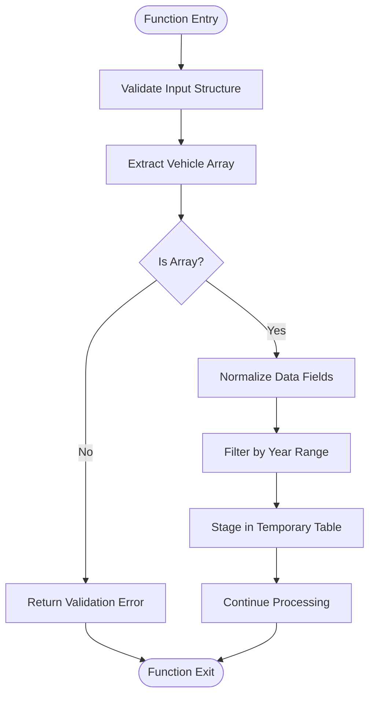
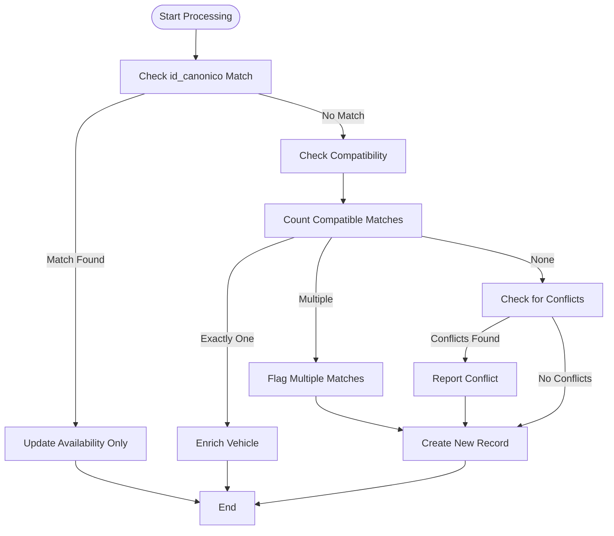
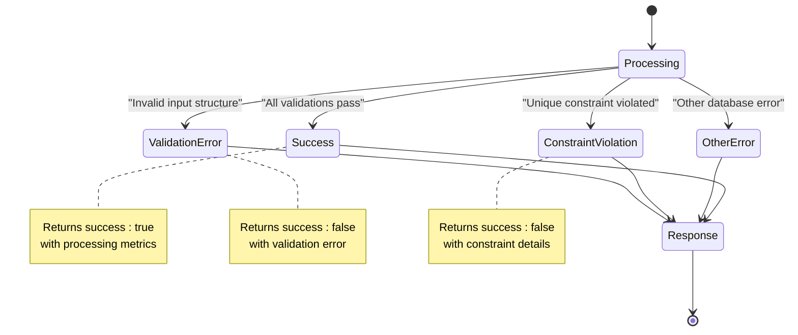

<cite>
**Referenced Files in This Document**  
- [Funcion RPC Nueva.sql](file://src/supabase/Funcion RPC Nueva.sql)
- [Replanteamiento homologacion.md](file://src/supabase/Replanteamiento homologacion.md)
- [Tabla maestra.sql](file://src/supabase/Tabla maestra.sql)
- [casos de prueba función rpc.sql](file://src/supabase/casos de prueba función rpc.sql)
- [Validacion y metricas.sql](file://src/supabase/Validacion y metricas.sql)
- [instrucciones.md](file://instrucciones.md)
</cite>

# Supabase RPC Interface

## Table of Contents
1. [Introduction](#introduction)
2. [Function Signature and Invocation](#function-signature-and-invocation)
3. [Parameter Validation and Input Processing](#parameter-validation-and-input-processing)
4. [Transactional Behavior and Data Integrity](#transactional-behavior-and-data-integrity)
5. [Upsert Logic and Conflict Resolution](#upsert-logic-and-conflict-resolution)
6. [JSONB Merging Strategy for Availability](#jsonb-merging-strategy-for-availability)
7. [Error Handling and Response Codes](#error-handling-and-response-codes)
8. [Performance Considerations](#performance-considerations)
9. [Usage Examples](#usage-examples)
10. [Security Aspects](#security-aspects)
11. [Idempotency and Concurrency](#idempotency-and-concurrency)

## Introduction

The `procesar_batch_homologacion` function serves as the primary data ingestion endpoint for the vehicle catalog homogenization system. This Supabase RPC function enables the integration of vehicle data from multiple insurance providers into a unified canonical model, maintaining traceability and availability information for each source. The function processes batches of vehicle records, applying sophisticated matching and enrichment logic to ensure data consistency across the homogenized catalog.

The system's objective is to create and maintain a **homogenized vehicle catalog** that unifies insurance provider catalogs (Qualitas, HDI, AXA, GNP, Mapfre, Chubb, Zurich, Atlas, BX, El Potosí, ANA) into a **single canonical model** with complete traceability by insurer, active/inactive control, and a reproducible ingestion and update flow (n8n ➜ Supabase RPC ➜ `catalogo_homologado`).

**Section sources**
- [Replanteamiento homologacion.md](file://src/supabase/Replanteamiento homologacion.md#L1-L20)

## Function Signature and Invocation

The `procesar_batch_homologacion` function is defined as a PostgreSQL stored procedure with the following signature:

```sql
CREATE OR REPLACE FUNCTION public.procesar_batch_homologacion(
    p_vehiculos_json JSONB
)
RETURNS JSONB
LANGUAGE plpgsql
SECURITY DEFINER
SET search_path = public
```

The function accepts a single JSONB parameter containing an array of vehicle records and returns a JSONB object with processing results and metrics. It is designed to be invoked via Supabase's PostgREST API at the endpoint `/rest/v1/rpc/procesar_batch_homologacion`.

Client applications must include appropriate headers when invoking the function:
- `apikey`: Supabase project API key
- `Authorization: Bearer <service_role_jwt>`: Service role JWT for authentication
- `Content-Type: application/json`
- Optional: `Prefer: return=minimal` to reduce response size

The function operates with `SECURITY DEFINER` privileges, allowing it to perform operations that the calling role might not have direct permissions for, while maintaining controlled access through the function interface.

**Section sources**
- [Funcion RPC Nueva.sql](file://src/supabase/Funcion RPC Nueva.sql#L1-L20)
- [Replanteamiento homologacion.md](file://src/supabase/Replanteamiento homologacion.md#L108-L115)

## Parameter Validation and Input Processing

The function implements comprehensive validation of input parameters to ensure data quality and consistency. The input validation process follows these steps:

1. **Input Structure Validation**: The function first checks whether the input JSONB contains a `vehiculos_json` key. If present, it extracts the array from this key; otherwise, it treats the entire input as the vehicle array.

2. **Array Type Validation**: The function verifies that the extracted vehicle data is a JSONB array. If the input is null or not an array, it returns an error response.

3. **Data Normalization**: During the staging phase, the function normalizes vehicle data by:
   - Trimming whitespace and converting text to uppercase
   - Applying NULLIF to empty strings for optional fields
   - Filtering vehicles by year (2000-2030 range)

4. **Field Validation**: The function ensures that critical fields are present and properly formatted, including `id_canonico`, `hash_comercial`, `marca`, `modelo`, `anio`, and `origen_aseguradora`.

The validation process is designed to be robust while allowing flexibility in input format, accepting either a direct array of vehicles or an object containing the array under the `vehiculos_json` key.



**Diagram sources**
- [Funcion RPC Nueva.sql](file://src/supabase/Funcion RPC Nueva.sql#L15-L60)

**Section sources**
- [Funcion RPC Nueva.sql](file://src/supabase/Funcion RPC Nueva.sql#L15-L60)

## Transactional Behavior and Data Integrity

The `procesar_batch_homologacion` function ensures data integrity through careful transaction management and atomic operations. The function operates within an implicit transaction scope provided by PostgreSQL, ensuring that all operations either complete successfully or are rolled back in case of errors.

Key aspects of the transactional behavior include:

1. **Temporary Table Usage**: The function creates a temporary table `tmp_batch` with `ON COMMIT DROP` semantics, ensuring that the staging data is automatically cleaned up at the end of the transaction regardless of success or failure.

2. **Atomic Processing**: All vehicle records in a batch are processed together, with the function returning comprehensive metrics about the processing outcome (received, staged, processed counts).

3. **Exception Handling**: The function includes comprehensive exception handling to capture and report errors while maintaining data consistency:
   - `unique_violation`: Handles cases where unique constraints are violated
   - `OTHERS`: Catches any other exceptions, returning detailed error information

4. **Data Consistency**: The function maintains referential integrity by ensuring that vehicle records are properly matched and updated according to the homogenization rules, preventing orphaned or inconsistent data.

The transactional design ensures that the homogenized catalog remains in a consistent state even when processing large batches of vehicle data from multiple sources.

**Section sources**
- [Funcion RPC Nueva.sql](file://src/supabase/Funcion RPC Nueva.sql#L62-L100)

## Upsert Logic and Conflict Resolution

The function implements a sophisticated upsert mechanism with multiple matching strategies to handle vehicle data from different insurance providers. The upsert logic follows a hierarchical approach to determine how incoming vehicle records should be integrated into the homogenized catalog.

### Matching Hierarchy

1. **Exact Match by Canonical ID**: The primary matching criterion is the `id_canonico` field. If a vehicle with the same canonical ID exists in the catalog, it is updated with new availability information.

2. **Compatibility-Based Matching**: For vehicles without an exact canonical ID match, the function searches for compatible vehicles based on:
   - Exact match on mandatory fields: marca, modelo, anio
   - Exact match or both NULL for transmision and version
   - Compatibility on technical specifications (motor_config, carroceria, traccion)

3. **Enrichment Criteria**: A match is considered valid for enrichment only if exactly one compatible vehicle is found and at least one technical specification can be enriched.

### Conflict Detection

The function detects and reports conflicts when incoming vehicle data contradicts existing catalog entries. Conflicts are identified when:
- Transmission values differ (e.g., AUTO vs MANUAL)
- Version values differ (e.g., PREMIUM vs CORE)
- Body type values differ (e.g., SEDAN vs HATCHBACK)
- Engine configuration values differ (e.g., L4 vs V6)
- Traction values differ (e.g., 4X4 vs 2WD)

When conflicts are detected, the function creates a new canonical record rather than updating the existing one, preserving data integrity and allowing for manual review of discrepancies.



**Diagram sources**
- [Funcion RPC Nueva.sql](file://src/supabase/Funcion RPC Nueva.sql#L101-L250)

**Section sources**
- [Funcion RPC Nueva.sql](file://src/supabase/Funcion RPC Nueva.sql#L101-L250)

## JSONB Merging Strategy for Availability

The function implements a sophisticated JSONB merging strategy to maintain availability information for each insurance provider while preserving historical data and ensuring data consistency.

### Availability Structure

The `disponibilidad` field in the `catalogo_homologado` table stores provider-specific information as a JSONB object with the following structure:

```json
{
  "PROVIDER_NAME": {
    "activo": boolean,
    "id_original": string,
    "version_original": string,
    "fecha_actualizacion": timestamp
  }
}
```

### Merging Logic

The function applies different merging strategies based on the processing context:

1. **Canonical ID Match (Update Availability)**:
   - When a vehicle matches by `id_canonico`, only the availability information for the source provider is updated
   - Other provider data remains unchanged
   - The `confianza_score` is slightly increased (by 0.01) to reflect additional confirmation

2. **Compatibility Match (Enrichment)**:
   - When enriching an existing vehicle with technical specifications from a compatible source
   - Technical fields (motor_config, carroceria, traccion) are updated using COALESCE logic
   - The `string_tecnico` is reconstructed with updated values
   - The `confianza_score` is increased by 0.05 to reflect improved data quality
   - Availability information for the source provider is added or updated

3. **New Record Creation**:
   - When no compatible match is found, a new canonical record is created
   - All vehicle data from the source is used to populate the new record
   - The initial `confianza_score` is set to 1.0 for exact matches or 0.8 for records created due to multiple potential matches

The merging strategy ensures that data from different providers is integrated in a way that preserves the integrity of the canonical model while maintaining complete traceability to the original sources.

**Section sources**
- [Funcion RPC Nueva.sql](file://src/supabase/Funcion RPC Nueva.sql#L251-L350)

## Error Handling and Response Codes

The function implements comprehensive error handling to provide meaningful feedback to client applications and ensure robust operation in production environments.

### Response Structure

The function returns a JSONB object with the following structure:

```json
{
  "success": boolean,
  "received": integer,
  "staged": integer,
  "procesados": {
    "nuevos": integer,
    "enriquecidos": integer,
    "actualizados": integer,
    "conflictos": integer,
    "multiples_matches": integer
  },
  "warnings": array,
  "errors": array
}
```

### Error Conditions

The function handles the following error conditions:

1. **Input Validation Errors**:
   - Invalid input structure (not an array)
   - Missing required fields
   - Invalid year values

2. **Database Constraint Violations**:
   - `unique_violation`: When a unique constraint is violated
   - Other PostgreSQL exceptions

3. **Processing Warnings**:
   - Multiple potential matches found for a vehicle
   - Conflicting specifications detected between source and existing data

### Specific Error Responses

- **Invalid Input**: Returns `success: false` with an error message indicating the input must contain an array of vehicles
- **Unique Violation**: Returns `success: false` with details of the constraint violation
- **Other Exceptions**: Returns `success: false` with the SQL error message and state code

The function also provides detailed metrics about the processing outcome, including counts of new records created, vehicles enriched, records updated for availability, and conflicts detected.



**Diagram sources**
- [Funcion RPC Nueva.sql](file://src/supabase/Funcion RPC Nueva.sql#L351-L428)

**Section sources**
- [Funcion RPC Nueva.sql](file://src/supabase/Funcion RPC Nueva.sql#L351-L428)

## Performance Considerations

The function is designed with performance optimization in mind, particularly for handling large batches of vehicle data from multiple insurance providers.

### Batch Processing

The function processes vehicles in batches, with recommended batch sizes between 10,000 and 50,000 records. This approach balances:
- Network overhead of multiple API calls
- Memory usage during processing
- Transaction duration and lock contention

### Index Usage

The underlying `catalogo_homologado` table has multiple indexes to support efficient querying and matching:

- `idx_marca_modelo_anio_hom`: Composite index on marca, modelo, anio for compatibility matching
- `idx_hash_comercial_hom`: Index on hash_comercial for commercial hash lookups
- `idx_disponibilidad_gin_hom`: GIN index on disponibilidad for JSONB queries
- `idx_id_canonico_hom`: Index on id_canonico for exact ID matching

These indexes enable efficient execution of the various matching strategies used by the function.

### Temporary Table Optimization

The function uses a temporary table (`tmp_batch`) to stage incoming data, which provides several performance benefits:
- Reduces repeated JSONB parsing operations
- Enables efficient batch operations (INSERT, UPDATE)
- Allows use of SQL operations for data normalization and filtering

### Processing Metrics

The function returns detailed metrics about the processing outcome, which can be used for performance monitoring and optimization:
- `received`: Total vehicles in the input batch
- `staged`: Vehicles successfully staged for processing
- Processing counts for different actions (nuevos, enriquecidos, actualizados)
- Counts of conflicts and multiple matches

These metrics help identify data quality issues and optimize the upstream normalization process.

**Section sources**
- [Replanteamiento homologacion.md](file://src/supabase/Replanteamiento homologacion.md#L200-L220)
- [Tabla maestra.sql](file://src/supabase/Tabla maestra.sql#L70-L73)

## Usage Examples

The following examples demonstrate how to invoke the `procesar_batch_homologacion` function from client applications.

### Basic Invocation

```json
{
  "vehiculos_json": [
    {
      "id_canonico": "a7a8fbec4e5bed8535f19ab418fe9bb83bda4eb4d26058eb0e2d2b9218069221",
      "hash_comercial": "98d9e4baceb9ed37cbe3e24512c24e62cb30b125a2d25cbb27348468340990b2",
      "string_comercial": "TOYOTA|YARIS|2014|AUTO",
      "string_tecnico": "TOYOTA|YARIS|2014|AUTO|PREMIUM|NULL|NULL|NULL|SEDAN|NULL",
      "marca": "TOYOTA",
      "modelo": "YARIS",
      "anio": 2014,
      "transmision": "AUTO",
      "version": "PREMIUM",
      "motor_config": null,
      "carroceria": "SEDAN",
      "traccion": null,
      "origen_aseguradora": "QUALITAS",
      "id_original": "Q-123456",
      "version_original": "PREMIUM SEDAN 1.5L AUTO",
      "activo": true
    }
  ]
}
```

### Response Example

```json
{
  "success": true,
  "received": 1,
  "staged": 1,
  "procesados": {
    "nuevos": 1,
    "enriquecidos": 0,
    "actualizados": 0,
    "conflictos": 0,
    "multiples_matches": 0
  },
  "warnings": [],
  "errors": []
}
```

### Multiple Vehicles

```json
{
  "vehiculos_json": [
    {
      "id_canonico": "a7a8fbec4e5bed8535f19ab418fe9bb83bda4eb4d26058eb0e2d2b9218069221",
      "hash_comercial": "98d9e4baceb9ed37cbe3e24512c24e62cb30b125a2d25cbb27348468340990b2",
      "origen_aseguradora": "ZURICH",
      "id_original": "Z-789",
      "version_original": "PREMIUM 1.5L SEDAN",
      "activo": true
    },
    {
      "id_canonico": "61c6b5ffc413ec48ed8cc01c49fa7ff9093f5793c078b1c882e271eb77e29ca1",
      "hash_comercial": "98d9e4baceb9ed37cbe3e24512c24e62cb30b125a2d25cbb27348468340990b2",
      "origen_aseguradora": "ZURICH",
      "id_original": "Z-HB-456",
      "version_original": "PREMIUM HATCHBACK 1.5L",
      "activo": true
    }
  ]
}
```

This example shows two vehicles with the same commercial hash but different canonical IDs (due to different body types), resulting in one update to an existing record and one new record creation.

**Section sources**
- [casos de prueba función rpc.sql](file://src/supabase/casos de prueba función rpc.sql#L1-L255)

## Security Aspects

The `procesar_batch_homologacion` function incorporates several security measures to protect data integrity and control access.

### Role-Based Access Control

The function is defined with `SECURITY DEFINER` privileges, which means it executes with the privileges of the user who defined the function rather than the caller. This allows for controlled access to the underlying data while restricting direct table modifications.

Access to the function is typically granted to a specific service role that is used by the data ingestion pipeline (n8n), ensuring that only authorized systems can invoke the function.

### Data Validation and Sanitization

The function implements thorough input validation to prevent injection attacks and ensure data quality:
- All string fields are normalized (trimmed and converted to uppercase)
- Numeric fields are properly cast and validated
- JSONB input is parsed and validated before processing

### Audit Logging

While the function itself does not implement explicit logging, the design supports audit capabilities through:
- The `fecha_actualizacion` field in the `catalogo_homologado` table, which is updated on every modification
- The comprehensive processing metrics returned by the function, which can be logged by the client application
- The traceability provided by the `disponibilidad` JSONB field, which maintains a record of updates from each provider

### Secure Data Handling

The function handles sensitive data securely by:
- Using parameterized operations to prevent SQL injection
- Operating within transaction boundaries to ensure data consistency
- Limiting the exposure of internal table structures through the RPC interface

These security aspects ensure that the data ingestion process is both robust and secure, protecting the integrity of the homogenized vehicle catalog.

**Section sources**
- [Funcion RPC Nueva.sql](file://src/supabase/Funcion RPC Nueva.sql#L4-L10)
- [Replanteamiento homologacion.md](file://src/supabase/Replanteamiento homologacion.md#L108-L115)

## Idempotency and Concurrency

The `procesar_batch_homologacion` function is designed to be idempotent, meaning that multiple identical invocations produce the same result as a single invocation. This property is critical for ensuring data consistency in distributed systems where network issues might require retrying operations.

### Idempotency Mechanisms

1. **Canonical ID Matching**: The primary mechanism for idempotency is the use of `id_canonico` as a unique identifier. When the same vehicle record is processed multiple times, it will be matched by its canonical ID and handled appropriately.

2. **Upsert Semantics**: The function's upsert logic ensures that repeated processing of the same data does not create duplicate records or alter existing data unnecessarily.

3. **Deterministic Processing**: The function's matching and enrichment logic is deterministic, producing the same results for the same input data.

### Concurrency Considerations

The function handles concurrent calls through PostgreSQL's built-in concurrency control mechanisms:

1. **Row-Level Locking**: When updating existing records, PostgreSQL automatically applies row-level locks to prevent race conditions.

2. **Transaction Isolation**: The function operates within PostgreSQL's default transaction isolation level, ensuring that concurrent transactions do not interfere with each other.

3. **Batch Processing**: By processing vehicles in batches, the function reduces the frequency of database operations and minimizes contention.

The combination of idempotency and proper concurrency control ensures that the function can be safely used in high-throughput environments with multiple concurrent data sources, maintaining data integrity and consistency across the homogenized catalog.

**Section sources**
- [Replanteamiento homologacion.md](file://src/supabase/Replanteamiento homologacion.md#L148-L155)