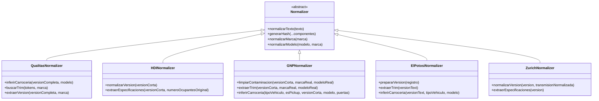

# n8n Workflow Integration

<cite>
**Referenced Files in This Document**   
- [qualitas-codigo-de-normalizacion-n8n.js](file://src/insurers/qualitas/qualitas-codigo-de-normalizacion-n8n.js)
- [hdi-codigo-de-normalizacion.js](file://src/insurers/hdi/hdi-codigo-de-normalizacion.js)
- [gnp-codigo-de-normalizacion.js](file://src/insurers/gnp/gnp-codigo-de-normalizacion.js)
- [elpotosi-codigo-de-normalizacion.js](file://src/insurers/elpotosi/elpotosi-codigo-de-normalizacion.js)
- [zurich-codigo-de-normalizacion.js](file://src/insurers/zurich/zurich-codigo-de-normalizacion.js)
- [instrucciones.md](file://instrucciones.md)
- [WARP.md](file://WARP.md)
</cite>

## Table of Contents
1. [Introduction](#introduction)
2. [Core Architecture and Execution Context](#core-architecture-and-execution-context)
3. [Data Transformation Pipeline](#data-transformation-pipeline)
4. [Insurer-Specific Normalization Logic](#insurer-specific-normalization-logic)
5. [Error Handling and Workflow Failure Detection](#error-handling-and-workflow-failure-detection)
6. [Retry Logic and Timeout Configurations](#retry-logic-and-timeout-configurations)
7. [Logging and Monitoring Mechanisms](#logging-and-monitoring-mechanisms)
8. [Adding New Insurer Workflows](#adding-new-insurer-workflows)
9. [Testing Normalization Logic in Isolation](#testing-normalization-logic-in-isolation)
10. [Appendices](#appendices)

## Introduction

The n8n workflow integration orchestrates the normalization of heterogeneous vehicle catalog data from multiple insurers into a unified canonical format. This document details how n8n processes raw extraction data through insurer-specific JavaScript modules to produce standardized records for ingestion into Supabase. The system ensures data consistency across sources while maintaining traceability to original entries. Each insurer's data undergoes transformation according to its unique schema and terminology, with results deduplicated and merged using cryptographic hashes. The workflow supports idempotent execution, enabling reliable reprocessing without duplication. Downstream systems consume the homogenized dataset for pricing, analytics, and reporting purposes.

## Core Architecture and Execution Context

The n8n workflow operates within a structured execution context that processes data in discrete stages: extraction, transformation, deduplication, batching, and persistence. Each insurer's data flows through a dedicated pipeline that begins with retrieving raw records from source databases via SQL queries defined in insurer-specific `.sql` files. The extracted data enters n8n as JSON objects containing fields such as marca (brand), modelo (model), año (year), and version_completa (full version description). Within n8n, these records are processed by JavaScript functions that implement normalization logic tailored to each insurer's data patterns.

The execution context maintains state through metadata fields including origen_aseguradora (source insurer), fecha_actualizacion (update timestamp), and aseguradoras_disponibles (available insurers array). Critical identifiers like hash_comercial and id_canonico are computed during processing to enable deduplication and cross-referencing. The workflow orchestrates parallel processing of insurer datasets before consolidating them into batches for efficient Supabase RPC calls. This architecture ensures that transformations occur in a controlled environment with consistent input/output contracts, regardless of source system variations.

**Diagram sources**
- [instrucciones.md](file://instrucciones.md#L100-L150)
- [qualitas-codigo-de-normalizacion-n8n.js](file://src/insurers/qualitas/qualitas-codigo-de-normalizacion-n8n.js#L1-L50)

**Section sources**
- [instrucciones.md](file://instrucciones.md#L0-L279)
- [WARP.md](file://WARP.md#L0-L32)

## Data Transformation Pipeline

The transformation pipeline converts raw insurer data into a canonical format through a series of well-defined steps. Initially, text fields undergo normalization using the `normalizarTexto` function, which converts characters to uppercase, removes accents, replaces special characters with spaces, and collapses multiple spaces. This produces clean, consistent text suitable for comparison and analysis. Brand names are standardized using comprehensive synonym dictionaries that map variations like "VW" and "VOLKS WAGEN" to "VOLKSWAGEN", while model names have redundant brand prefixes removed.

Version descriptions are decomposed into structured attributes including motor configuration, transmission type, body style, and trim level. The pipeline extracts technical specifications such as engine configuration (L4, V6), displacement in liters, drivetrain (4X4, AWD), number of doors, and passenger capacity. Trim levels are identified by searching for known valid trims in the version text while filtering out technical specifications and equipment codes. The process preserves the original version text in version_original while storing the normalized trim in the version field.

Critical identifiers are generated to support deduplication and matching. The `hash_comercial` combines normalized brand, model, year, and transmission into a SHA-256 hash, serving as a commercial-level identifier. The `id_canonico` incorporates additional technical specifications to create a unique vehicle fingerprint. These hashes enable efficient upsert operations in Supabase, ensuring that identical vehicles from different insurers are merged into single canonical records.

**Diagram sources**
- [qualitas-codigo-de-normalizacion-n8n.js](file://src/insurers/qualitas/qualitas-codigo-de-normalizacion-n8n.js#L100-L200)
- [hdi-codigo-de-normalizacion.js](file://src/insurers/hdi/hdi-codigo-de-normalizacion.js#L200-L300)

**Section sources**
- [qualitas-codigo-de-normalizacion-n8n.js](file://src/insurers/qualitas/qualitas-codigo-de-normalizacion-n8n.js#L0-L966)
- [WARP.md](file://WARP.md#L204-L255)

## Insurer-Specific Normalization Logic

Each insurer requires customized normalization logic due to differences in data structure, terminology, and quality. The Qualitas module implements sophisticated text parsing to extract trim levels while avoiding contamination from service or multimedia terms. It prioritizes WAGON/SPORTWAGEN body styles and uses multi-gram analysis to identify valid trims from version descriptions. The HDI processor aggressively removes problematic patterns like "CP PUERTAS" and transmission variants before extracting meaningful trim information. It maintains a comprehensive list of valid trims and applies strict validation to prevent invalid values.

GNP's normalization addresses significant data contamination issues, with approximately 8% of records containing incorrect brand information in version fields. The processor detects and removes these contaminants, particularly when brands like BMW or Mercedes appear in non-applicable contexts. It also handles GNP's unique transmission coding system where 1=Manual and 2=Automatic. The El Potosí implementation focuses on records with Activo=1, using fallback logic between version_corta and descripcion fields when necessary. It carefully preserves the original data while normalizing only essential components.

Zurich's processor eliminates extensive technical specifications from version texts, including transmission types, engine details, and equipment codes, to isolate the true trim level. It applies a hierarchical elimination process, removing transmission variants, motor specifications, drivetrain indicators, and equipment codes before identifying valid trims. The module maintains consistency with other insurers through synchronized brand synonym dictionaries while implementing Zurich-specific parsing rules for version texts that may contain initial codes like G5J/1.

**Diagram sources**
- [qualitas-codigo-de-normalizacion-n8n.js](file://src/insurers/qualitas/qualitas-codigo-de-normalizacion-n8n.js#L200-L500)
- [hdi-codigo-de-normalizacion.js](file://src/insurers/hdi/hdi-codigo-de-normalizacion.js#L500-L700)
- [gnp-codigo-de-normalizacion.js](file://src/insurers/gnp/gnp-codigo-de-normalizacion.js#L500-L700)
- [elpotosi-codigo-de-normalizacion.js](file://src/insurers/elpotosi/elpotosi-codigo-de-normalizacion.js#L500-L700)
- [zurich-codigo-de-normalizacion.js](file://src/insurers/zurich/zurich-codigo-de-normalizacion.js#L500-L700)

**Section sources**
- [qualitas-codigo-de-normalizacion-n8n.js](file://src/insurers/qualitas/qualitas-codigo-de-normalizacion-n8n.js#L0-L966)
- [hdi-codigo-de-normalizacion.js](file://src/insurers/hdi/hdi-codigo-de-normalizacion.js#L0-L718)
- [gnp-codigo-de-normalizacion.js](file://src/insurers/gnp/gnp-codigo-de-normalizacion.js#L0-L681)
- [elpotosi-codigo-de-normalizacion.js](file://src/insurers/elpotosi/elpotosi-codigo-de-normalizacion.js#L0-L624)
- [zurich-codigo-de-normalizacion.js](file://src/insurers/zurich/zurich-codigo-de-normalizacion.js#L0-L734)

## Error Handling and Workflow Failure Detection

The system implements comprehensive error handling to maintain data integrity and ensure reliable processing. Each insurer's normalization script includes try-catch blocks around record processing to prevent workflow termination due to individual record failures. When an error occurs during processing, the system logs the error with context including the insurer name, original record ID, and error message, then continues with subsequent records. This fault-tolerant approach ensures that isolated data quality issues do not disrupt the entire normalization process.

Workflow failures are detected through multiple mechanisms. The Supabase RPC function returns detailed metrics including inserted_count, updated_count, and any errors encountered during batch processing. n8n monitors HTTP response codes from the RPC endpoint, treating 429 (Too Many Requests) and 5xx (Server Errors) as retryable conditions. The system validates that each processed record contains mandatory fields including id_canonico, hash_comercial, string_comercial, and origen_aseguradora before inclusion in batches. Records missing these critical identifiers are flagged for investigation rather than being silently discarded.

Downstream systems receive notifications of workflow status through the RPC's return payload, which includes success/failure indicators and detailed error messages when applicable. The system maintains a record of processing statistics for each insurer, including total processed records, contaminated records detected, and records without identifiable trim levels. Significant deviations from expected metrics trigger alerts for manual review. The idempotent nature of the RPC calls allows for safe reprocessing of failed batches without risk of duplication.

**Diagram sources**
- [gnp-codigo-de-normalizacion.js](file://src/insurers/gnp/gnp-codigo-de-normalizacion.js#L600-L680)
- [instrucciones.md](file://instrucciones.md#L200-L250)

**Section sources**
- [gnp-codigo-de-normalizacion.js](file://src/insurers/gnp/gnp-codigo-de-normalizacion.js#L600-L680)
- [instrucciones.md](file://instrucciones.md#L200-L250)

## Retry Logic and Timeout Configurations

The workflow implements robust retry logic with exponential backoff to handle transient failures during Supabase RPC calls. When the system receives 429 (Too Many Requests) or 5xx (Server Error) responses, it automatically retries the batch with increasing delays between attempts. The retry strategy follows an exponential backoff pattern, starting with a short delay and doubling the wait time after each failed attempt up to a maximum threshold. This approach prevents overwhelming the target system during periods of high load or temporary unavailability.

Timeout configurations are set to balance reliability with resource utilization. HTTP requests to the Supabase RPC endpoint have a configurable timeout period that prevents indefinite waiting for responses. If a request exceeds this timeout, it is treated as a failure and subject to the retry logic. The system tracks retry attempts per batch and enforces a maximum retry limit to prevent infinite loops in cases of persistent failures. Successful retries update the batch processing metrics, while exhausted retries trigger alerts for manual intervention.

The idempotent design of the RPC function enables safe retries without data duplication. Each record's id_canonico serves as a unique identifier, ensuring that repeated processing of the same batch results in upsert operations rather than new insertions. The system maintains processing state through the fecha_actualizacion field, which is updated on each successful operation. This combination of idempotency and state tracking allows the workflow to recover from interruptions and resume processing from the last successful state.

**Section sources**
- [instrucciones.md](file://instrucciones.md#L250-L279)

## Logging and Monitoring Mechanisms

The system incorporates comprehensive logging and monitoring to ensure transparency and facilitate troubleshooting. Each insurer's normalization script includes console logging of processing statistics, including total records processed, contaminated records detected, and records without identifiable trim levels. These logs provide visibility into data quality issues and processing efficiency. The n8n workflow captures detailed metrics for each batch operation, including record counts, processing duration, and response codes from the Supabase RPC endpoint.

Monitoring occurs at multiple levels of the workflow. At the record level, individual processing errors are logged with sufficient context to identify problematic data patterns. At the batch level, success and failure rates are tracked, with alerts triggered for abnormal conditions. The Supabase RPC function returns detailed metrics in its response payload, including inserted_count, updated_count, and any errors encountered. These metrics enable verification of expected processing volumes and detection of anomalies.

The system maintains historical processing records through the fecha_actualizacion field in the catalogo_homologado table, allowing analysis of data evolution over time. The disponibilidad JSONB field preserves insurer-specific metadata, including original version texts and activation status, providing full traceability from canonical records back to source data. This comprehensive logging approach supports both operational monitoring and forensic analysis when issues arise.

**Section sources**
- [gnp-codigo-de-normalizacion.js](file://src/insurers/gnp/gnp-codigo-de-normalizacion.js#L650-L680)
- [instrucciones.md](file://instrucciones.md#L250-L279)

## Adding New Insurer Workflows

Adding support for new insurers follows a standardized procedure that ensures consistency across implementations. The process begins by creating a dedicated directory under src/insurers using the insurer's name in lowercase. Within this directory, three files are created: {insurer}-analisis.md for documenting data patterns, {insurer}-query-de-extraccion.sql for the data extraction query, and {insurer}-codigo-de-normalizacion.js for the normalization logic. This structure maintains organization and facilitates discovery of insurer-specific assets.

The analysis phase involves exporting sample data and documenting observed patterns in the markdown file. This includes identifying field mappings from source columns to canonical schema fields, noting data quality issues, and cataloging common values for key attributes. The SQL query is crafted to retrieve all necessary fields using consistent naming conventions that align with the normalization script's expectations. Special attention is paid to handling active/inactive status according to the insurer's business rules.

The normalization script implements the core transformation logic using the established pattern of utility functions, brand/model normalization, version parsing, and specification extraction. It leverages shared utilities like normalizarTexto and generarHash while implementing insurer-specific rules for trim identification and contamination handling. The script outputs data in the canonical format with proper hashing and metadata, ensuring seamless integration with the existing workflow. After implementation, the new insurer is added to the n8n workflow blueprint and tested through the validation process.

**Section sources**
- [WARP.md](file://WARP.md#L204-L255)
- [instrucciones.md](file://instrucciones.md#L0-L279)

## Testing Normalization Logic in Isolation

Testing normalization logic in isolation ensures reliability before integration into the main workflow. Each insurer's normalization script can be tested independently using sample data that represents various edge cases and common patterns. The testing process involves creating a test harness that simulates the n8n execution context by providing input data in the expected format and capturing the output for validation. This allows developers to verify that the normalization logic produces correct results without dependencies on external systems.

The validation process examines multiple aspects of the output, including proper text normalization, accurate brand standardization, correct trim identification, and appropriate handling of edge cases like contaminated data or missing fields. Test cases cover both typical scenarios and exceptional conditions to ensure robustness. The system's use of deterministic functions like SHA-256 hashing enables consistent output verification across test runs.

Integration testing follows unit testing, where the normalized output is passed through the Supabase RPC function in a staging environment. This validates that the data conforms to the expected schema and that upsert operations function correctly. The testing framework includes metrics validation to confirm that inserted_count and updated_count values match expectations based on the test data. Successful isolated testing provides confidence that the new insurer integration will function correctly within the production workflow.

**Section sources**
- [WARP.md](file://WARP.md#L204-L255)
- [instrucciones.md](file://instrucciones.md#L250-L279)