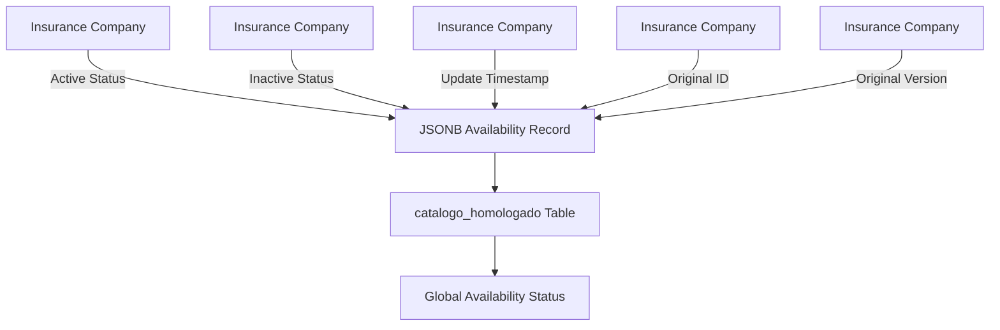
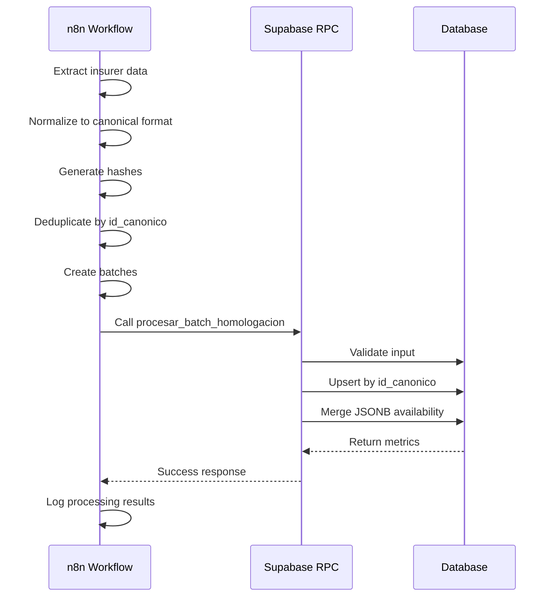
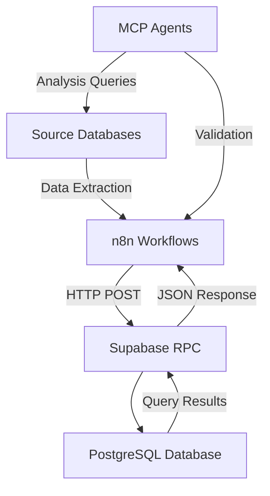

# Technical Architecture

<cite>
**Referenced Files in This Document**   
- [WARP.md](file://WARP.md)
- [instrucciones.md](file://instrucciones.md)
- [src/supabase/Tabla maestra.sql](file://src/supabase/Tabla maestra.sql)
- [src/supabase/Funcion RPC Nueva.sql](file://src/supabase/Funcion RPC Nueva.sql)
- [src/insurers/qualitas/qualitas-codigo-de-normalizacion-n8n.js](file://src/insurers/qualitas/qualitas-codigo-de-normalizacion-n8n.js)
- [src/insurers/elpotosi/elpotosi-codigo-de-normalizacion.js](file://src/insurers/elpotosi/elpotosi-codigo-de-normalizacion.js)
- [src/insurers/gnp/gnp-codigo-de-normalizacion.js](file://src/insurers/gnp/gnp-codigo-de-normalizacion.js)
</cite>

## Table of Contents
1. [Introduction](#introduction)
2. [Canonical Data Model](#canonical-data-model)
3. [Event Sourcing via JSONB Availability Tracking](#event-sourcing-via-jsonb-availability-tracking)
4. [Idempotent Processing Pipeline](#idempotent-processing-pipeline)
5. [Architectural Patterns](#architectural-patterns)
6. [Component Interactions](#component-interactions)
7. [Technology Stack Decisions](#technology-stack-decisions)
8. [Scalability Considerations](#scalability-considerations)
9. [Performance Implications](#performance-implications)
10. [Trade-offs Analysis](#trade-offs-analysis)

## Introduction

The homologacion-ukuvi system is a vehicle catalog homologation platform that unifies vehicle catalogs from 11 Mexican insurance companies into a single canonical model. The system provides complete traceability per insurer, active/inactive status control, and a reproducible ingestion and update flow. This document details the technical architecture of the system, focusing on its core components, data model, processing pipeline, and architectural patterns.

The system integrates multiple technologies including Supabase (PostgreSQL), n8n for workflow orchestration, and JavaScript for data normalization. It employs event sourcing principles through JSONB availability tracking and implements an idempotent processing pipeline to ensure data consistency. The architecture is designed with scalability in mind, allowing for the addition of new insurers while maintaining performance and data integrity.

**Section sources**
- [WARP.md](file://WARP.md#L1-L50)
- [instrucciones.md](file://instrucciones.md#L1-L20)

## Canonical Data Model

The system centers around a unified vehicle catalog table with a comprehensive canonical data model. The model is designed to capture all essential vehicle specifications while maintaining traceability to source systems. The core table, `catalogo_homologado`, serves as the master reference for all vehicle data across insurers.

The canonical model includes several key identifiers that enable efficient data matching and deduplication:

- **`id_canonico`**: SHA-256 hash of complete vehicle specification, serving as the primary unique identifier
- **`hash_comercial`**: SHA-256 hash of commercial data (brand|model|year|transmission), used for grouping similar vehicles
- **`string_comercial`**: Human-readable commercial string for debugging and analysis
- **`string_tecnico`**: Complete technical specification string for comprehensive vehicle identification

The data model captures both commercial and technical attributes of vehicles, including brand, model, year, transmission, version, motor configuration, body type, and traction. These attributes are normalized across insurers to ensure consistency in the canonical representation.

```mermaid
erDiagram
catalogo_homologado {
BIGSERIAL id PK
VARCHAR(64) id_canonico UK
VARCHAR(64) hash_comercial
TEXT string_comercial
TEXT string_tecnico
VARCHAR(100) marca
VARCHAR(150) modelo
INTEGER anio
VARCHAR(20) transmision
VARCHAR(200) version
VARCHAR(50) motor_config
VARCHAR(50) carroceria
VARCHAR(20) traccion
JSONB disponibilidad
DECIMAL(3,2) confianza_score
TIMESTAMP fecha_creacion
TIMESTAMP fecha_actualizacion
}
```

**Diagram sources**
- [src/supabase/Tabla maestra.sql](file://src/supabase/Tabla maestra.sql#L1-L100)
- [instrucciones.md](file://instrucciones.md#L50-L150)

## Event Sourcing via JSONB Availability Tracking

The system implements event sourcing principles through JSONB availability tracking, which provides a complete history of vehicle availability across insurers. The `disponibilidad` field in the canonical table stores insurer-specific data as JSONB, enabling flexible schema evolution and rich metadata storage.

The JSONB structure captures comprehensive information for each insurer:
- **Active status**: Boolean flag indicating if the vehicle is currently offered
- **Original ID**: Reference to the source system identifier
- **Original version**: Unmodified version string from the source
- **Update timestamp**: When the information was last updated

This approach enables several critical capabilities:
1. **Complete traceability**: Each canonical record links back to original insurer data
2. **Temporal analysis**: Historical availability patterns can be analyzed
3. **Conflict detection**: Discrepancies between insurers can be identified
4. **Data provenance**: Source of each data point is preserved

The system maintains active status at both the insurer level and globally. A vehicle is considered active at the insurer level when that insurer reports it as currently available. Globally, a vehicle is valid if at least one insurer reports it as active. This dual-level status system allows for nuanced availability reporting while preserving historical data.



**Diagram sources**
- [WARP.md](file://WARP.md#L200-L250)
- [instrucciones.md](file://instrucciones.md#L150-L200)

## Idempotent Processing Pipeline

The system implements an idempotent processing pipeline to ensure data consistency and reliability during ingestion and updates. The pipeline is designed to produce the same results regardless of how many times it is executed, preventing unintended changes when reprocessing data.

The processing flow consists of several key stages:
1. **Data extraction**: n8n workflows retrieve data from each insurer's source
2. **Normalization**: JavaScript functions transform data to the canonical format
3. **Hash generation**: SHA-256 hashes are calculated for deduplication
4. **Deduplication**: Records are deduplicated by `id_canonico` and `hash_comercial`
5. **Batching**: Data is grouped into batches of 10k-50k records
6. **RPC processing**: Supabase function processes the batch
7. **Result logging**: Processing metrics are recorded

The idempotency is achieved through several mechanisms:
- **Upsert operations**: The RPC function performs upserts by `id_canonico`
- **Conditional updates**: Canonical fields are only updated if they have changed
- **JSONB merge**: Availability data is merged without overwriting other insurers' data
- **Timestamp updates**: Only the update timestamp is modified on subsequent runs

This design ensures that re-running the same batch produces no additional changes, meeting the success criterion of idempotent processing.



**Diagram sources**
- [WARP.md](file://WARP.md#L250-L300)
- [instrucciones.md](file://instrucciones.md#L200-L250)

## Architectural Patterns

The system employs several key architectural patterns to achieve its goals of data consistency, scalability, and maintainability.

### Hash-Based Deduplication

The system uses hash-based deduplication to identify and eliminate duplicate vehicle records. Two levels of hashing are implemented:
- **Commercial hash**: Based on brand, model, year, and transmission
- **Canonical hash**: Based on all technical specifications

This two-tier approach allows for efficient grouping of similar vehicles while maintaining precise identification of unique configurations. The hashes are calculated using SHA-256, providing a high degree of collision resistance.

### Progressive Enhancement

The system follows a progressive enhancement pattern where vehicle records can be enriched over time as more complete data becomes available. When a vehicle is first encountered, it may have incomplete technical specifications. Subsequent updates from other insurers can fill in missing details like motor configuration, body type, or traction.

This pattern is implemented in the RPC function through conditional updates:
- Existing null values are replaced with non-null values from new data
- Non-null values are preserved unless they conflict with new data
- Confidence scores are adjusted based on data completeness

### Separation of Concerns by Insurer

The architecture maintains clear separation of concerns by insurer through several mechanisms:
- **Per-insurer normalization code**: Each insurer has dedicated JavaScript files for data transformation
- **Insurer-specific extraction queries**: SQL queries are tailored to each insurer's data model
- **Isolated availability tracking**: JSONB structure keeps insurer data separate within the canonical record
- **Independent processing**: n8n workflows can be run per insurer without affecting others

This separation enables independent development, testing, and deployment for each insurer integration.

**Section sources**
- [WARP.md](file://WARP.md#L300-L350)
- [instrucciones.md](file://instrucciones.md#L250-L300)

## Component Interactions

The system orchestrates interactions between n8n workflows, Supabase RPC functions, and source databases through a well-defined integration pattern.

### n8n Workflows

n8n serves as the orchestration layer, coordinating data flow from source systems to the canonical model. Each insurer has a dedicated workflow that:
1. Connects to the source database or API
2. Extracts the vehicle catalog
3. Applies normalization rules
4. Calculates hashes for deduplication
5. Groups records into batches
6. Calls the Supabase RPC function

The workflows are designed to be idempotent and fault-tolerant, with retry mechanisms for transient failures.

### Supabase RPC Functions

Supabase hosts the core business logic in PostgreSQL functions. The primary function, `procesar_batch_homologacion`, handles batch processing with the following responsibilities:
- Input validation
- Conflict detection
- Upsert operations
- JSONB merging
- Transaction management
- Error handling
- Metrics reporting

The function is exposed through PostgREST, allowing HTTP access from n8n workflows.

### Source Databases

The system integrates with 11 insurance company databases, each with its own schema and data model. The integration approach varies by insurer:
- **Direct database connections**: For insurers with accessible databases
- **API integrations**: For insurers providing web services
- **File-based imports**: For insurers exporting data files

The system abstracts these differences through insurer-specific normalization code.



**Diagram sources**
- [WARP.md](file://WARP.md#L350-L400)
- [instrucciones.md](file://instrucciones.md#L300-L350)

## Technology Stack Decisions

The system's technology stack was selected based on specific requirements for data integration, processing, and scalability.

### Supabase (PostgreSQL)

Supabase was chosen as the persistence layer for several reasons:
- **JSONB support**: Enables flexible availability tracking with rich metadata
- **PostgREST**: Provides automatic REST API for database functions
- **Scalability**: Handles large volumes of vehicle data efficiently
- **Security**: Robust role-based access control
- **Cost-effectiveness**: Competitive pricing for the required features

PostgreSQL's advanced features like GIN indexes for JSONB fields and robust transaction support make it well-suited for this use case.

### JavaScript for Normalization

JavaScript was selected for data normalization due to:
- **n8n compatibility**: n8n workflows support JavaScript natively
- **String manipulation**: Powerful regex and string processing capabilities
- **Cryptography**: Built-in support for SHA-256 hashing
- **Developer familiarity**: Widely known language with extensive libraries
- **Flexibility**: Can handle complex parsing and transformation logic

The normalization code is organized by insurer, with shared utility functions for common operations.

### SQL for Extraction and RPC Logic

SQL is used for both data extraction and RPC logic because:
- **Efficiency**: Direct database queries are faster than API calls
- **Expressiveness**: SQL is well-suited for data transformation and aggregation
- **Transaction safety**: Database functions ensure data consistency
- **Performance**: Executing logic close to the data reduces latency
- **Maintainability**: SQL functions are easier to test and debug

The RPC function in particular benefits from being in SQL, as it can leverage PostgreSQL's advanced features for conflict detection and JSON manipulation.

**Section sources**
- [WARP.md](file://WARP.md#L400-L450)
- [instrucciones.md](file://instrucciones.md#L350-L400)

## Scalability Considerations

The architecture is designed with scalability in mind, particularly for adding new insurers and handling increasing data volumes.

### Adding New Insurers

The system supports adding new insurers through a standardized process:
1. Create a new directory under `src/insurers`
2. Add analysis documentation
3. Develop extraction SQL queries
4. Implement normalization JavaScript
5. Test with sample data
6. Integrate into n8n workflows

This modular approach ensures that new insurer integrations do not affect existing ones. The separation of concerns by insurer allows for independent development and deployment.

### Batch Processing Optimization

Batch processing is optimized for performance and reliability:
- **Batch size**: 10k-50k records per batch balances memory usage and transaction overhead
- **Parallel processing**: Multiple insurers can be processed simultaneously
- **Error handling**: Failed batches can be retried without affecting others
- **Monitoring**: Processing metrics are logged for performance analysis

The system includes safeguards against common issues like RPC timeouts by allowing batch size adjustment.

### Indexing Strategy

The database employs a comprehensive indexing strategy to support query performance:
- **Primary key**: `id_canonico` for unique record lookup
- **Commercial hash**: `hash_comercial` for grouping similar vehicles
- **GIN index**: On `disponibilidad` for efficient JSONB queries
- **Composite index**: On `marca`, `modelo`, `anio` for common search patterns

These indexes ensure that queries for active vehicles, availability by insurer, and other common patterns perform efficiently even as data volumes grow.

**Section sources**
- [WARP.md](file://WARP.md#L450-L500)
- [instrucciones.md](file://instrucciones.md#L400-L450)

## Performance Implications

The system's design has several performance implications that were carefully considered during architecture development.

### Batch Processing Performance

Batch processing performance is influenced by several factors:
- **Batch size**: Larger batches reduce HTTP overhead but increase memory usage and transaction time
- **Network latency**: Distance between n8n and Supabase affects processing speed
- **Database load**: Concurrent operations can impact RPC function performance
- **Data complexity**: Records with many technical specifications require more processing

The current batch size of 10k-50k records represents a balance between these factors, minimizing HTTP overhead while avoiding timeouts.

### JSONB Query Performance

JSONB fields have specific performance characteristics:
- **Storage**: More efficient than separate tables for sparse data
- **Indexing**: GIN indexes enable fast JSONB queries
- **Query complexity**: Complex JSON queries can be slower than relational queries
- **Memory usage**: JSONB parsing requires additional memory

The system mitigates potential performance issues by:
- Using GIN indexes on the `disponibilidad` field
- Denormalizing frequently queried data (e.g., `aseguradoras_activas`)
- Limiting JSONB query complexity
- Caching frequently accessed data

### Hash Calculation Overhead

Hash calculation adds computational overhead but provides significant benefits:
- **CPU usage**: SHA-256 calculation consumes CPU resources
- **Memory**: Hash values require additional storage
- **Network**: Hash values increase payload size

The benefits of hash-based deduplication and conflict detection outweigh these costs, particularly given the system's requirement for data consistency.

**Section sources**
- [WARP.md](file://WARP.md#L500-L550)
- [instrucciones.md](file://instrucciones.md#L450-L500)

## Trade-offs Analysis

The system's architecture involves several important trade-offs that were carefully evaluated.

### JSONB for Availability History

Using JSONB for availability history provides flexibility but has trade-offs:
- **Pros**:
  - Schema flexibility: Easy to add new insurer-specific fields
  - Performance: Single query retrieves all insurer data
  - Simplicity: No need for complex joins
  - Atomicity: All insurer data updated in a single transaction
- **Cons**:
  - Query complexity: JSONB queries are more complex than relational queries
  - Indexing limitations: Less efficient than relational indexes
  - Data integrity: Harder to enforce constraints
  - Analytics: More difficult to analyze across insurers

The decision to use JSONB was driven by the need for flexibility in handling diverse insurer data models and the performance benefits of avoiding joins.

### Hash-Based Conflict Detection

Hash-based conflict detection provides reliable deduplication but has limitations:
- **Pros**:
  - Deterministic: Same input always produces same hash
  - Efficient: Fast comparison of complex data
  - Scalable: Works well with large datasets
  - Simple: Easy to implement and understand
- **Cons**:
  - Collision risk: Theoretical possibility of different vehicles having same hash
  - Rigidity: Small changes in input produce completely different hashes
  - Debugging: Hard to reverse-engineer hash values
  - Storage: Hash values require additional storage space

The system mitigates collision risk through comprehensive normalization and by using SHA-256, which has an extremely low collision probability.

### Centralized vs. Decentralized Processing

The choice of centralized processing in the Supabase RPC function has implications:
- **Pros**:
  - Consistency: Single source of truth for business logic
  - Security: Logic executed in secure database environment
  - Performance: Close to data reduces latency
  - Maintainability: Logic changes in one place
- **Cons**:
  - Vendor lock-in: Tied to PostgreSQL and Supabase
  - Debugging: Harder to debug database functions
  - Scalability: Database can become bottleneck
  - Technology constraints: Limited by SQL capabilities

The centralized approach was chosen to ensure data consistency and leverage PostgreSQL's transaction capabilities.

**Section sources**
- [WARP.md](file://WARP.md#L550-L600)
- [instrucciones.md](file://instrucciones.md#L500-L550)